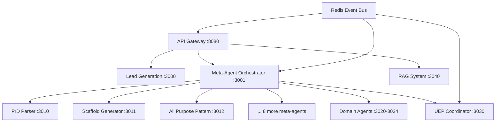

# **Product Requirements Document: Server-Based Meta-Agent Factory**

**Project:** All-Purpose Meta-Agent Factory Migration  
**Status:** Implementation Ready  
**Priority:** Critical  
**Owner:** Stuart  
**Created:** January 2025

---

## **Executive Summary**

Transform the current locally-run meta-agent factory into a server-based microservices architecture while maintaining monorepo development experience. Primary goal: **Ensure the UEP factory takes a PRD and produces working software reliably**.

### **Success Criteria** 
✅ **ONLY SUCCESS METRIC:** Factory receives PRD → Generates working software  
✅ All 11 meta-agents + 5 domain agents work together seamlessly  
✅ Lead generation system integration maintained  
✅ Development experience improved (no more multi-terminal chaos)  
✅ Production deployment simplified and scalable  

---

## **Current State Analysis**

### **What Works**
- Lead generation Next.js app (`apps/lead-generation/`) 
- Individual meta-agents function when tested directly
- RAG system provides documentation memory
- TaskMaster parsing works perfectly
- Scaffold generator produces projects when given correct format

### **Critical Problems**
- **Coordination Hell:** Services can't communicate properly locally
- **Process Management:** 15+ terminals to run everything  
- **Integration Failures:** Parameter mapping, data format mismatches
- **Debugging Nightmare:** No centralized logging or monitoring
- **Scaling Issues:** Can't scale individual components

### **System Inventory**
- **11 Meta-Agents:** prd-parser, scaffold-generator, all-purpose-pattern, template-engine-factory, parameter-flow, vercel-native-architecture, infra-orchestrator, account-creation-system, five-document-framework, post-creation-investigator, thirty-minute-rule
- **5 Domain Agents:** backend, frontend, devops, documentation, qa
- **Core Systems:** Lead generation, UEP coordinator, RAG system
- **Integration Layer:** Agent adapters, parameter mapping

---

## **Target Architecture**

### **Monorepo + Microservices Hybrid**
```
allpurp/
├── apps/
│   └── lead-generation/              # Service 1: Next.js App
├── services/
│   ├── api-gateway/                  # Service 2: Central Orchestrator  
│   ├── meta-agent-orchestrator/      # Service 3: Factory Controller
│   ├── meta-agents/
│   │   ├── prd-parser/              # Service 4
│   │   ├── scaffold-generator/       # Service 5
│   │   ├── all-purpose-pattern/      # Service 6
│   │   └── ... (8 more services)    # Services 7-14
│   ├── domain-agents/               # Services 15-19
│   ├── uep-coordinator/             # Service 20
│   └── rag-system/                  # Service 21
├── shared/
│   ├── lib/                         # Common utilities
│   ├── types/                       # Shared TypeScript definitions
│   └── events/                      # Event schemas
├── infrastructure/
│   ├── docker/                      # Dockerfiles for each service
│   ├── compose/                     # Docker Compose configurations
│   └── monitoring/                  # Prometheus, Grafana configs
└── docs/                           # Centralized documentation
```

### **Service Communication Architecture**


---

## **Implementation Plan**

### **Phase 1: Containerization (Week 1)**

#### **1.1 Create Service Dockerfiles**
```dockerfile
# Template for each service
FROM node:18-alpine
WORKDIR /app
COPY package*.json ./
RUN npm ci --only=production
COPY . .
EXPOSE 3000
HEALTHCHECK --interval=30s --timeout=10s --start-period=5s --retries=3 \
  CMD curl -f http://localhost:3000/health || exit 1
CMD ["npm", "start"]
```

#### **1.2 Shared Dependencies**
```javascript
// shared/lib/event-bus.js
const Redis = require('ioredis');
const redis = new Redis(process.env.REDIS_URL);

module.exports = {
  publish: (channel, data) => redis.publish(channel, JSON.stringify(data)),
  subscribe: (channel, callback) => {
    redis.subscribe(channel);
    redis.on('message', (ch, message) => {
      if (ch === channel) callback(JSON.parse(message));
    });
  }
};
```

#### **1.3 Service Structure Template**
```javascript
// services/[service-name]/server.js
const express = require('express');
const { publish, subscribe } = require('../../shared/lib/event-bus');
const app = express();

// Health check endpoint
app.get('/health', (req, res) => res.json({ status: 'healthy' }));

// Service-specific endpoints
app.post('/api/process', async (req, res) => {
  const result = await processRequest(req.body);
  publish('service_completed', { service: 'service-name', result });
  res.json(result);
});

app.listen(process.env.PORT || 3000);
```

### **Phase 2: API Gateway & Orchestration (Week 2)**

#### **2.1 Central API Gateway**
```javascript
// services/api-gateway/server.js
const express = require('express');
const httpProxy = require('http-proxy-middleware');
const app = express();

// Route to appropriate services
app.use('/api/lead-generation', httpProxy({ 
  target: 'http://lead-generation:3000',
  changeOrigin: true 
}));

app.use('/api/meta-agents', httpProxy({ 
  target: 'http://meta-agent-orchestrator:3001',
  changeOrigin: true 
}));

// Main workflow endpoint
app.post('/api/generate-project', async (req, res) => {
  const workflow = new ProjectWorkflow(req.body);
  const result = await workflow.execute();
  res.json(result);
});
```

#### **2.2 Meta-Agent Orchestrator**
```javascript
// services/meta-agent-orchestrator/orchestrator.js
class MetaAgentOrchestrator {
  async processProject(prdData) {
    // 1. Parse PRD
    const tasks = await this.callService('prd-parser', prdData);
    
    // 2. Generate scaffold
    const scaffold = await this.callService('scaffold-generator', {
      tasks: tasks.master.tasks,
      metadata: { projectName: prdData.projectName }
    });
    
    // 3. Apply patterns
    const patterns = await this.callService('all-purpose-pattern', scaffold);
    
    // 4. Assign domain agents
    const specialists = await this.assignDomainAgents(patterns);
    
    return { tasks, scaffold, patterns, specialists };
  }
  
  async callService(serviceName, data) {
    const response = await fetch(`http://${serviceName}:3000/api/process`, {
      method: 'POST',
      headers: { 'Content-Type': 'application/json' },
      body: JSON.stringify(data)
    });
    return response.json();
  }
}
```

### **Phase 3: Event-Driven Coordination (Week 3)**

#### **3.1 Event Schema Definition**
```typescript
// shared/types/events.ts
export interface ProjectEvent {
  id: string;
  type: 'prd_received' | 'parsing_complete' | 'scaffold_generated' | 'project_complete';
  projectId: string;
  agentId: string;
  data: any;
  timestamp: Date;
}

export interface WorkflowStep {
  service: string;
  input: any;
  output?: any;
  status: 'pending' | 'processing' | 'complete' | 'failed';
}
```

#### **3.2 Workflow Engine**
```javascript
// services/meta-agent-orchestrator/workflow-engine.js
class WorkflowEngine {
  constructor() {
    this.eventBus = require('../../shared/lib/event-bus');
    this.setupEventHandlers();
  }
  
  async executeWorkflow(workflow) {
    for (const step of workflow.steps) {
      await this.executeStep(step);
      this.eventBus.publish('step_completed', step);
    }
  }
  
  setupEventHandlers() {
    this.eventBus.subscribe('prd_received', this.handlePrdReceived.bind(this));
    this.eventBus.subscribe('parsing_complete', this.handleParsingComplete.bind(this));
    // ... other handlers
  }
}
```

### **Phase 4: Service Migration (Week 4)**

#### **4.1 Meta-Agent Service Template**
```javascript
// services/meta-agents/[agent-name]/service.js
const MetaAgentService = require('../../../shared/lib/meta-agent-service');

class PrdParserService extends MetaAgentService {
  async process(data) {
    // Original agent logic here
    const result = await this.parseProductRequirements(data);
    
    // Emit completion event
    this.emit('parsing_complete', {
      projectId: data.projectId,
      result: result
    });
    
    return result;
  }
}

module.exports = new PrdParserService('prd-parser');
```

#### **4.2 Domain Agent Integration**
```javascript
// services/domain-agents/backend-agent/service.js
class BackendAgentService {
  async assignToProject(projectData) {
    const backendTasks = this.extractBackendTasks(projectData.tasks);
    const implementation = await this.generateBackendCode(backendTasks);
    
    return {
      agentType: 'backend',
      tasks: backendTasks,
      implementation: implementation,
      status: 'assigned'
    };
  }
}
```

### **Phase 5: Monitoring & Observability (Week 5)**

#### **5.1 Health Check System**
```javascript
// shared/lib/health-checker.js
class HealthChecker {
  async checkAllServices() {
    const services = [
      'lead-generation:3000',
      'meta-agent-orchestrator:3001',
      'prd-parser:3010',
      // ... all 21 services
    ];
    
    const healthChecks = await Promise.allSettled(
      services.map(service => this.checkService(service))
    );
    
    return this.aggregateHealth(healthChecks);
  }
}
```

#### **5.2 Metrics Collection**
```javascript
// infrastructure/monitoring/metrics.js
const prometheus = require('prom-client');

const metrics = {
  projectsGenerated: new prometheus.Counter({
    name: 'projects_generated_total',
    help: 'Total number of projects generated'
  }),
  
  agentResponseTime: new prometheus.Histogram({
    name: 'agent_response_time_seconds',
    help: 'Response time for meta-agent calls',
    labelNames: ['agent_name']
  })
};
```

---

## **Docker Compose Configuration**

```yaml
# docker-compose.yml
version: '3.8'

services:
  # Infrastructure
  redis:
    image: redis:alpine
    ports: ["6379:6379"]
    
  prometheus:
    image: prom/prometheus
    ports: ["9090:9090"]
    volumes: ["./infrastructure/monitoring/prometheus.yml:/etc/prometheus/prometheus.yml"]
    
  grafana:
    image: grafana/grafana
    ports: ["3000:3000"]
    volumes: ["./infrastructure/monitoring/grafana:/var/lib/grafana"]

  # Core Services
  api-gateway:
    build: ./services/api-gateway
    ports: ["8080:8080"]
    environment:
      - REDIS_URL=redis://redis:6379
    depends_on: [redis]
    
  lead-generation:
    build: ./apps/lead-generation
    ports: ["3000:3000"]
    environment:
      - REDIS_URL=redis://redis:6379
    
  meta-agent-orchestrator:
    build: ./services/meta-agent-orchestrator
    ports: ["3001:3001"]
    environment:
      - REDIS_URL=redis://redis:6379

  # Meta-Agents
  prd-parser:
    build: ./services/meta-agents/prd-parser
    ports: ["3010:3000"]
    environment:
      - REDIS_URL=redis://redis:6379
    
  scaffold-generator:
    build: ./services/meta-agents/scaffold-generator
    ports: ["3011:3000"]
    environment:
      - REDIS_URL=redis://redis:6379
      
  # ... (9 more meta-agents: 3012-3020)
  
  # Domain Agents  
  backend-agent:
    build: ./services/domain-agents/backend-agent
    ports: ["3021:3000"]
    
  frontend-agent:
    build: ./services/domain-agents/frontend-agent
    ports: ["3022:3000"]
    
  # ... (3 more domain agents: 3023-3025)
  
  # Support Services
  uep-coordinator:
    build: ./services/uep-coordinator
    ports: ["3030:3000"]
    
  rag-system:
    build: ./services/rag-system
    ports: ["3040:3000"]
```

---

## **Development Workflow**

### **Local Development**
```bash
# Start everything
docker-compose up -d

# Watch logs
docker-compose logs -f meta-agent-orchestrator

# Test end-to-end
curl -X POST http://localhost:8080/api/generate-project \
  -H "Content-Type: application/json" \
  -d '{"prd": "monitoring-dashboard-prd.md"}'

# Individual service development
cd services/meta-agents/prd-parser
npm run dev  # Runs locally, connects to shared Redis
```

### **Testing Strategy**
```javascript
// tests/integration/test-full-workflow.js
describe('Full Project Generation Workflow', () => {
  it('should generate project from PRD', async () => {
    const response = await request(app)
      .post('/api/generate-project')
      .send({ prd: 'test-prd.md' })
      .expect(200);
      
    expect(response.body).toHaveProperty('project');
    expect(response.body.project.files).toBeGreaterThan(0);
  });
});
```

---

## **Success Metrics & Validation**

### **Primary Success Criteria**
1. **End-to-End Test:** `curl POST /api/generate-project` → Returns working project
2. **All Services Health:** All 21 services report healthy status
3. **Event Flow:** Events flow correctly through Redis bus
4. **Lead Integration:** Lead generation triggers project creation
5. **Domain Assignment:** Specialists assigned based on project type

### **Performance Targets**
- **Project Generation:** < 2 minutes for typical PRD
- **Service Response:** < 5 seconds per meta-agent call
- **System Uptime:** 99.9% availability
- **Error Rate:** < 1% failed project generations

### **Validation Tests**
```bash
# Health check all services
curl http://localhost:8080/health

# Test lead generation integration
curl -X POST http://localhost:8080/api/lead-to-project \
  -d '{"leadId": "test-lead-123"}'

# Test meta-agent workflow
curl -X POST http://localhost:8080/api/generate-project \
  -d '{"prd": "monitoring-dashboard-prd.md"}'

# Verify outputs
ls -la generated-outputs/monitoring-dashboard/
```

---

## **Risk Mitigation**

### **High Risk: Service Dependencies**
- **Mitigation:** Circuit breakers, retry logic, fallback mechanisms
- **Validation:** Chaos engineering - randomly kill services during tests

### **Medium Risk: Data Format Compatibility**
- **Mitigation:** Strict TypeScript interfaces, schema validation
- **Validation:** Contract testing between services

### **Medium Risk: Event Bus Failures**
- **Mitigation:** Redis clustering, event persistence, replay capability
- **Validation:** Redis failover testing

### **Low Risk: Performance Degradation**
- **Mitigation:** Load testing, horizontal scaling, caching
- **Validation:** Performance regression testing

---

## **Implementation Timeline**

### **Week 1: Foundation**
- Day 1-2: Create Dockerfiles for all services
- Day 3-4: Setup shared libraries and Redis event bus
- Day 5-7: Containerize and test individual services

### **Week 2: Orchestration**
- Day 1-3: Build API Gateway
- Day 4-5: Create Meta-Agent Orchestrator
- Day 6-7: Test service-to-service communication

### **Week 3: Integration**
- Day 1-3: Implement event-driven workflow
- Day 4-5: Integrate all 11 meta-agents
- Day 6-7: Connect domain agents

### **Week 4: End-to-End**
- Day 1-3: Complete workflow testing
- Day 4-5: Lead generation integration
- Day 6-7: Performance optimization

### **Week 5: Production Ready**
- Day 1-3: Monitoring and observability
- Day 4-5: Load testing and scaling
- Day 6-7: Documentation and deployment

---

## **Acceptance Criteria**

### **Must Have**
✅ All 21 services start successfully with `docker-compose up`  
✅ API Gateway routes requests to appropriate services  
✅ Meta-Agent Orchestrator processes PRD → generates project  
✅ All 11 meta-agents respond to service calls  
✅ Domain agents assign specialists based on project requirements  
✅ Events flow correctly through Redis message bus  
✅ Health checks report system status accurately  
✅ Lead generation system triggers project creation  

### **Should Have**
✅ Monitoring dashboard shows service metrics  
✅ Logs centralized and searchable  
✅ Performance meets target thresholds  
✅ Error handling and retry mechanisms work  

### **Could Have**
✅ Auto-scaling based on load  
✅ Blue-green deployment capability  
✅ Advanced debugging and tracing  

---

**This PRD ensures we build a robust, scalable system that solves the coordination problems while maintaining the core functionality: PRD in → Working software out.**