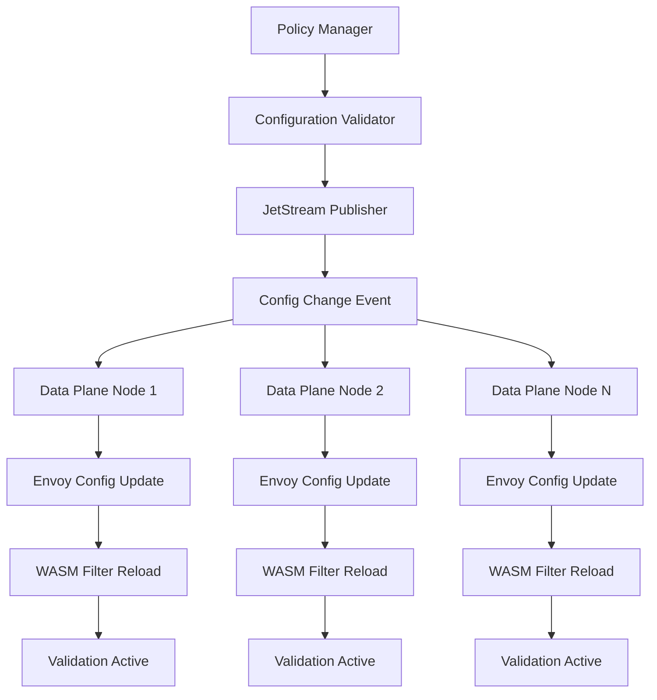
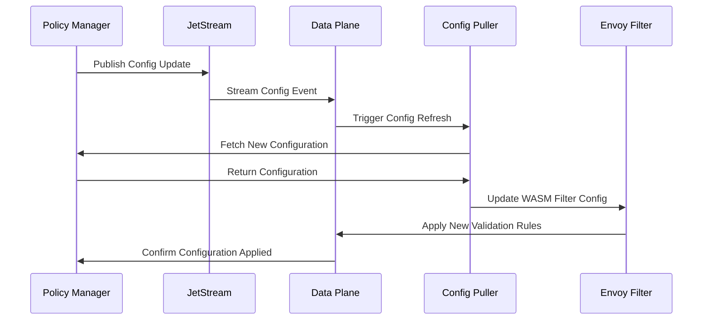

# UEP Control Plane and Data Plane Architecture

> **Status**: ✅ **COMPLETE** - Task 210.3 Implementation  
> **Architecture Pattern**: Service Mesh Control/Data Plane Separation  
> **Control Plane**: Istio + UEP Policy Management + NATS JetStream  
> **Data Plane**: Envoy Sidecars + UEP WASM Filters + Circuit Breakers  

## 🏗️ Architecture Overview

The UEP Control Plane and Data Plane Architecture implements a **distributed service mesh pattern** that separates policy management and configuration (Control Plane) from traffic processing and enforcement (Data Plane) to enable scalable, reliable UEP protocol validation across all 16 Meta-Agent Factory agents.

### 🎯 **Architecture Principles**

1. **Separation of Concerns**: Control plane manages policies, data plane enforces them
2. **Distributed Enforcement**: Each agent has its own UEP validation proxy
3. **Centralized Configuration**: Single source of truth for UEP policies
4. **High Availability**: No single point of failure in data path
5. **Performance Isolation**: Control plane failures don't affect data plane operation
6. **Real-time Updates**: Configuration changes propagated without restarts

## 🔧 **Control Plane Components**

### **1. UEP Policy Management Service**

**Purpose**: Central authority for UEP protocol policies and configuration  
**Location**: `containers/uep-service/src/uep-service.ts`  
**Responsibilities**:
- UEP protocol rule management
- Agent authorization policies
- Validation schema distribution
- Circuit breaker configuration
- Performance monitoring

```yaml
# UEP Policy Management Deployment
apiVersion: apps/v1
kind: Deployment
metadata:
  name: uep-policy-manager
  namespace: uep-system
spec:
  replicas: 3  # High availability
  selector:
    matchLabels:
      app: uep-policy-manager
      component: control-plane
  template:
    metadata:
      labels:
        app: uep-policy-manager
        component: control-plane
        version: v2.0.0
      annotations:
        istio.io/rev: default
        sidecar.istio.io/inject: "false"  # Control plane doesn't need sidecar
    spec:
      containers:
      - name: uep-policy-manager
        image: uep-policy-manager:2.0.0
        ports:
        - containerPort: 3000
          name: http
        - containerPort: 9090
          name: metrics
        env:
        - name: NODE_ENV
          value: "production"
        - name: UEP_MODE
          value: "control-plane"
        - name: NATS_URL
          value: "nats://nats-jetstream:4222"
        - name: POLICY_STORE_URL
          value: "etcd://etcd-cluster:2379"
        resources:
          requests:
            cpu: 200m
            memory: 256Mi
          limits:
            cpu: 500m
            memory: 512Mi
        livenessProbe:
          httpGet:
            path: /health
            port: 3000
          initialDelaySeconds: 30
          periodSeconds: 10
        readinessProbe:
          httpGet:
            path: /ready
            port: 3000
          initialDelaySeconds: 5
          periodSeconds: 5
```

#### **Policy Management API**

```typescript
// UEP Policy Management Interface
interface UEPPolicyManager {
  // Protocol Rules Management
  updateProtocolRules(rules: UEPProtocolRules): Promise<void>;
  getProtocolRules(version: string): Promise<UEPProtocolRules>;
  validateRuleSet(rules: UEPProtocolRules): Promise<ValidationResult>;
  
  // Agent Authorization
  updateAgentPolicy(agentId: string, policy: AgentPolicy): Promise<void>;
  getAgentPolicy(agentId: string): Promise<AgentPolicy>;
  revokeAgentAccess(agentId: string): Promise<void>;
  
  // Configuration Distribution
  broadcastConfigUpdate(config: UEPConfiguration): Promise<void>;
  getDataPlaneConfiguration(nodeId: string): Promise<DataPlaneConfig>;
  validateConfiguration(config: UEPConfiguration): Promise<ConfigValidationResult>;
  
  // Circuit Breaker Management
  updateCircuitBreakerConfig(agentId: string, config: CircuitBreakerConfig): Promise<void>;
  getCircuitBreakerStatus(agentId: string): Promise<CircuitBreakerStatus>;
  resetCircuitBreaker(agentId: string): Promise<void>;
}

interface UEPProtocolRules {
  version: string;
  messageTypes: string[];
  validationSchemas: Record<string, JSONSchema>;
  headerRequirements: HeaderRequirement[];
  payloadLimits: PayloadLimits;
  timeoutConfiguration: TimeoutConfig;
}

interface AgentPolicy {
  agentId: string;
  allowedOperations: string[];
  resourceLimits: ResourceLimits;
  validationLevel: 'strict' | 'permissive' | 'monitoring';
  circuitBreakerConfig: CircuitBreakerConfig;
  rateLimits: RateLimitConfig;
}
```

### **2. Configuration Distribution Service**

**Purpose**: Reliable configuration propagation to data plane components  
**Technology**: NATS JetStream + Kubernetes ConfigMaps  
**Location**: `containers/uep-service/src/uep-event-bus-service.ts`

```yaml
# Configuration Distribution Service
apiVersion: apps/v1
kind: Deployment
metadata:
  name: uep-config-distributor
  namespace: uep-system
spec:
  replicas: 2
  selector:
    matchLabels:
      app: uep-config-distributor
      component: control-plane
  template:
    metadata:
      labels:
        app: uep-config-distributor
        component: control-plane
    spec:
      containers:
      - name: config-distributor
        image: uep-config-distributor:2.0.0
        env:
        - name: NATS_URL
          value: "nats://nats-jetstream:4222"
        - name: JETSTREAM_DOMAIN
          value: "uep-meta-agent-factory"
        - name: CONFIG_STORE_TYPE
          value: "kubernetes"
        ports:
        - containerPort: 3001
          name: http
        - containerPort: 9091
          name: metrics
        resources:
          requests:
            cpu: 100m
            memory: 128Mi
          limits:
            cpu: 200m
            memory: 256Mi
```

#### **Configuration Distribution Flow**



### **3. Istio Control Plane Integration**

**Purpose**: Leverage Istio for service mesh management  
**Components**: Pilot, Citadel, Galley  
**Location**: `/k8s/istio/istio-installation.yaml`

```yaml
# UEP-Enhanced Istio Control Plane
apiVersion: install.istio.io/v1alpha1
kind: IstioOperator
metadata:
  name: uep-enhanced-control-plane
  namespace: istio-system
spec:
  values:
    global:
      meshID: uep-meta-agent-factory
      network: uep-cluster-network
    pilot:
      env:
        # Enable UEP-specific features
        PILOT_ENABLE_UEP_VALIDATION: true
        PILOT_UEP_CONFIG_SOURCE: "nats://nats-jetstream:4222"
        PILOT_UEP_POLICY_NAMESPACE: "uep-system"
        
  components:
    pilot:
      k8s:
        env:
        - name: UEP_INTEGRATION_ENABLED
          value: "true"
        - name: UEP_POLICY_ENDPOINT
          value: "http://uep-policy-manager.uep-system.svc.cluster.local:3000"
        resources:
          requests:
            cpu: 200m
            memory: 256Mi
          limits:
            cpu: 500m
            memory: 512Mi
            
  meshConfig:
    extensionProviders:
    - name: uep-validation
      envoyExtAuthzHttp:
        service: uep-policy-manager.uep-system.svc.cluster.local
        port: 3000
        pathPrefix: "/validate"
        includeRequestHeadersInCheck:
        - "x-uep-version"
        - "x-uep-agent-id"
        - "x-uep-message-type"
        headersToUpstreamOnAllow:
        - "x-uep-validated"
        - "x-uep-agent-authorized"
```

### **4. Event Bus Control Service**

**Purpose**: Centralized event stream management for UEP protocol  
**Technology**: NATS JetStream  
**Features**: Stream configuration, consumer management, message routing

```yaml
# NATS JetStream Configuration for UEP
apiVersion: v1
kind: ConfigMap
metadata:
  name: jetstream-uep-config
  namespace: uep-system
data:
  jetstream.conf: |
    jetstream {
      domain: "uep-meta-agent-factory"
      
      # Stream for UEP protocol messages
      stream {
        name: "UEP_PROTOCOL_MESSAGES"
        subjects: ["uep.protocol.>"]
        storage: "file"
        retention: "limits"
        max_age: 24h
        max_bytes: 1GB
        max_msgs: 1000000
        replicas: 3
        discard: "old"
      }
      
      # Stream for configuration updates
      stream {
        name: "UEP_CONFIG_UPDATES"
        subjects: ["uep.config.>"]
        storage: "memory"
        retention: "workqueue"
        max_age: 1h
        max_bytes: 100MB
        replicas: 3
      }
      
      # Stream for audit events
      stream {
        name: "UEP_AUDIT_EVENTS"
        subjects: ["uep.audit.>"]
        storage: "file"
        retention: "limits"
        max_age: 168h  # 7 days
        max_bytes: 10GB
        replicas: 3
      }
    }
```

## 🚀 **Data Plane Components**

### **1. UEP Validation Proxy (Envoy Sidecar)**

**Purpose**: Per-agent UEP protocol validation and enforcement  
**Technology**: Envoy 1.25+ with custom WASM filters  
**Deployment**: Automatic sidecar injection via Istio

```yaml
# EnvoyFilter for UEP Data Plane Configuration
apiVersion: networking.istio.io/v1alpha3
kind: EnvoyFilter
metadata:
  name: uep-data-plane-filter
  namespace: uep-system
spec:
  workloadSelector:
    labels:
      uep.all-purpose.dev/validation: "enabled"
  configPatches:
  - applyTo: HTTP_FILTER
    match:
      context: SIDECAR_INBOUND
      listener:
        filterChain:
          filter:
            name: "envoy.filters.network.http_connection_manager"
    patch:
      operation: INSERT_BEFORE
      value:
        name: uep.data.plane.validator
        typed_config:
          "@type": type.googleapis.com/envoy.extensions.filters.http.wasm.v3.Wasm
          config:
            name: "uep_data_plane_validator"
            root_id: "uep_data_plane_root"
            vm_id: "uep_data_plane_vm"
            configuration:
              "@type": type.googleapis.com/google.protobuf.StringValue
              value: |
                {
                  "control_plane_endpoint": "http://uep-policy-manager.uep-system.svc.cluster.local:3000",
                  "agent_id": "${AGENT_ID}",
                  "config_refresh_interval": "30s",
                  "circuit_breaker": {
                    "enabled": true,
                    "failure_threshold": 5,
                    "timeout_seconds": 30,
                    "half_open_requests": 3
                  },
                  "performance": {
                    "enable_metrics": true,
                    "latency_histogram_buckets": [1, 5, 10, 25, 50, 100, 250, 500, 1000],
                    "cache_ttl_seconds": 300
                  },
                  "fallback": {
                    "enabled": true,
                    "mode": "permissive",
                    "log_violations": true
                  }
                }
            vm_config:
              vm_id: "uep_data_plane_vm"
              runtime: "envoy.wasm.runtime.v8"
              configuration:
                "@type": type.googleapis.com/google.protobuf.StringValue
                value: |
                  {
                    "cache_size": 1000,
                    "memory_limit": "50MB",
                    "cpu_limit": "100m"
                  }
              code:
                local:
                  filename: "/etc/uep-wasm/uep-data-plane-filter.wasm"
```

#### **Data Plane WASM Filter Architecture**

```typescript
// UEP Data Plane WASM Filter Implementation
class UEPDataPlaneFilter {
  private config: DataPlaneConfig;
  private policyCache: Map<string, CachedPolicy>;
  private circuitBreaker: CircuitBreakerState;
  private metrics: DataPlaneMetrics;
  private lastConfigUpdate: number;

  constructor(rootContext: RootContext) {
    this.config = JSON.parse(rootContext.getConfiguration());
    this.policyCache = new Map();
    this.circuitBreaker = new CircuitBreakerState(this.config.circuit_breaker);
    this.metrics = new DataPlaneMetrics(this.config.performance);
    this.lastConfigUpdate = Date.now();
    
    // Initialize with cached configuration
    this.loadCachedConfiguration();
  }

  async onRequestHeaders(): Promise<FilterHeadersStatus> {
    const startTime = Date.now();
    
    try {
      // Check if configuration needs refresh
      if (this.shouldRefreshConfig()) {
        await this.refreshConfiguration();
      }
      
      // Check circuit breaker state
      if (this.circuitBreaker.isOpen()) {
        return this.handleCircuitBreakerOpen();
      }
      
      const headers = this.getRequestHeaders();
      const agentId = headers.get('x-uep-agent-id');
      
      // Get validation policy from cache
      const policy = await this.getValidationPolicy(agentId);
      if (!policy) {
        return this.handleMissingPolicy(agentId);
      }
      
      // Validate headers according to policy
      const headerValidation = this.validateHeaders(headers, policy);
      if (!headerValidation.valid) {
        this.metrics.recordValidationFailure('header_validation', headerValidation.error);
        this.circuitBreaker.recordFailure();
        return this.sendErrorResponse(400, headerValidation.error);
      }
      
      // Add data plane metadata
      this.addRequestHeader('x-uep-data-plane-node', this.config.node_id);
      this.addRequestHeader('x-uep-validation-timestamp', new Date().toISOString());
      
      this.metrics.recordValidationSuccess('header_validation', Date.now() - startTime);
      return FilterHeadersStatus.Continue;
      
    } catch (error) {
      this.metrics.recordValidationError('header_processing', error.message);
      this.circuitBreaker.recordFailure();
      
      if (this.config.fallback.enabled) {
        return this.handleFallbackMode(error);
      }
      
      return this.sendErrorResponse(500, 'Internal validation error');
    }
  }

  async onRequestBody(bodySize: number, endOfStream: boolean): Promise<FilterDataStatus> {
    if (!endOfStream) {
      return FilterDataStatus.Continue;
    }
    
    const startTime = Date.now();
    
    try {
      const headers = this.getRequestHeaders();
      const agentId = headers.get('x-uep-agent-id');
      const policy = await this.getValidationPolicy(agentId);
      
      // Validate payload size
      if (bodySize > policy.payloadLimits.maxSize) {
        this.metrics.recordValidationFailure('payload_size', `Size: ${bodySize}`);
        return this.sendErrorResponse(413, 'Payload too large');
      }
      
      // Validate message structure if body exists
      if (bodySize > 0) {
        const body = this.getRequestBody();
        const messageValidation = await this.validateMessage(body, policy);
        
        if (!messageValidation.valid) {
          this.metrics.recordValidationFailure('message_structure', messageValidation.error);
          this.circuitBreaker.recordFailure();
          return this.sendErrorResponse(400, messageValidation.error);
        }
      }
      
      this.circuitBreaker.recordSuccess();
      this.metrics.recordValidationSuccess('message_validation', Date.now() - startTime);
      
      return FilterDataStatus.Continue;
      
    } catch (error) {
      this.metrics.recordValidationError('body_processing', error.message);
      this.circuitBreaker.recordFailure();
      
      if (this.config.fallback.enabled) {
        this.logFallbackUsage('body_validation_error', error.message);
        return FilterDataStatus.Continue;
      }
      
      return this.sendErrorResponse(500, 'Message validation error');
    }
  }

  private async getValidationPolicy(agentId: string): Promise<ValidationPolicy | null> {
    // Check cache first
    const cached = this.policyCache.get(agentId);
    if (cached && !this.isCacheExpired(cached)) {
      return cached.policy;
    }
    
    try {
      // Fetch from control plane
      const response = await fetch(`${this.config.control_plane_endpoint}/agent/${agentId}/policy`);
      if (!response.ok) {
        return null;
      }
      
      const policy = await response.json();
      
      // Update cache
      this.policyCache.set(agentId, {
        policy,
        timestamp: Date.now(),
        ttl: this.config.performance.cache_ttl_seconds * 1000
      });
      
      return policy;
      
    } catch (error) {
      // Return cached policy if available, even if expired
      return cached?.policy || null;
    }
  }

  private shouldRefreshConfig(): boolean {
    const refreshInterval = this.parseInterval(this.config.config_refresh_interval);
    return (Date.now() - this.lastConfigUpdate) > refreshInterval;
  }

  private async refreshConfiguration(): Promise<void> {
    try {
      const response = await fetch(`${this.config.control_plane_endpoint}/config/${this.config.agent_id}`);
      if (response.ok) {
        const newConfig = await response.json();
        this.updateConfiguration(newConfig);
        this.lastConfigUpdate = Date.now();
      }
    } catch (error) {
      // Log error but continue with existing configuration
      console.warn('Failed to refresh configuration:', error);
    }
  }

  private handleCircuitBreakerOpen(): FilterHeadersStatus {
    this.metrics.recordCircuitBreakerActivation();
    
    if (this.config.fallback.enabled) {
      this.logFallbackUsage('circuit_breaker_open', 'Validation bypassed due to circuit breaker');
      return FilterHeadersStatus.Continue;
    }
    
    return this.sendErrorResponse(503, 'Service temporarily unavailable');
  }

  private handleFallbackMode(error: Error): FilterHeadersStatus {
    this.logFallbackUsage('validation_error', error.message);
    
    if (this.config.fallback.mode === 'permissive') {
      // Log violation but allow request
      this.addRequestHeader('x-uep-fallback-used', 'true');
      this.addRequestHeader('x-uep-fallback-reason', error.message);
      return FilterHeadersStatus.Continue;
    }
    
    return this.sendErrorResponse(500, 'Validation error in fallback mode');
  }
}

interface DataPlaneConfig {
  control_plane_endpoint: string;
  agent_id: string;
  node_id: string;
  config_refresh_interval: string;
  circuit_breaker: CircuitBreakerConfig;
  performance: PerformanceConfig;
  fallback: FallbackConfig;
}

interface ValidationPolicy {
  agentId: string;
  protocolVersion: string;
  validationRules: ValidationRuleSet;
  payloadLimits: PayloadLimits;
  circuitBreakerConfig: CircuitBreakerConfig;
  rateLimits: RateLimitConfig;
}
```

### **2. Circuit Breaker Data Plane**

**Purpose**: Local failure detection and isolation per agent  
**Implementation**: WASM-based circuit breaker with control plane coordination

```typescript
// Circuit Breaker Data Plane Implementation
class DataPlaneCircuitBreaker {
  private state: 'closed' | 'open' | 'half-open' = 'closed';
  private failureCount = 0;
  private successCount = 0;
  private lastFailureTime = 0;
  private lastStateChange = 0;
  
  constructor(private config: CircuitBreakerConfig) {}

  isOpen(): boolean {
    if (this.state === 'open') {
      const timeSinceFailure = Date.now() - this.lastFailureTime;
      if (timeSinceFailure > this.config.timeout_seconds * 1000) {
        this.transitionToHalfOpen();
        return false;
      }
      return true;
    }
    return false;
  }

  recordSuccess(): void {
    this.successCount++;
    
    if (this.state === 'half-open' && this.successCount >= this.config.success_threshold) {
      this.transitionToClosed();
    } else if (this.state === 'closed') {
      // Reset failure count on success
      this.failureCount = 0;
    }
  }

  recordFailure(): void {
    this.failureCount++;
    this.lastFailureTime = Date.now();
    
    if (this.state === 'closed' && this.failureCount >= this.config.failure_threshold) {
      this.transitionToOpen();
    } else if (this.state === 'half-open') {
      // Any failure in half-open immediately goes back to open
      this.transitionToOpen();
    }
  }

  private transitionToOpen(): void {
    this.state = 'open';
    this.lastStateChange = Date.now();
    this.notifyControlPlane('circuit_breaker_opened');
  }

  private transitionToClosed(): void {
    this.state = 'closed';
    this.failureCount = 0;
    this.successCount = 0;
    this.lastStateChange = Date.now();
    this.notifyControlPlane('circuit_breaker_closed');
  }

  private transitionToHalfOpen(): void {
    this.state = 'half-open';
    this.successCount = 0;
    this.lastStateChange = Date.now();
    this.notifyControlPlane('circuit_breaker_half_open');
  }

  private async notifyControlPlane(event: string): Promise<void> {
    try {
      await fetch(`${this.config.control_plane_endpoint}/circuit-breaker/events`, {
        method: 'POST',
        headers: { 'Content-Type': 'application/json' },
        body: JSON.stringify({
          agentId: this.config.agent_id,
          event,
          timestamp: new Date().toISOString(),
          state: this.state,
          metrics: {
            failureCount: this.failureCount,
            successCount: this.successCount,
            lastStateChange: this.lastStateChange
          }
        })
      });
    } catch (error) {
      // Log error but don't fail circuit breaker operation
      console.warn('Failed to notify control plane:', error);
    }
  }

  getStatistics(): CircuitBreakerStatistics {
    return {
      state: this.state,
      failureCount: this.failureCount,
      successCount: this.successCount,
      lastFailureTime: this.lastFailureTime,
      lastStateChange: this.lastStateChange,
      uptime: Date.now() - this.lastStateChange
    };
  }
}
```

### **3. Performance Metrics Collection**

**Purpose**: Real-time data plane performance monitoring  
**Integration**: Prometheus metrics with Envoy stats

```yaml
# Data Plane Metrics Configuration
apiVersion: v1
kind: ServiceMonitor
metadata:
  name: uep-data-plane-metrics
  namespace: uep-system
spec:
  selector:
    matchLabels:
      uep.all-purpose.dev/data-plane: "enabled"
  endpoints:
  - port: envoy-metrics
    interval: 15s
    path: /stats/prometheus
    relabelings:
    - source_labels: [__meta_kubernetes_pod_annotation_uep_all_purpose_dev_agent_id]
      target_label: agent_id
    - source_labels: [__meta_kubernetes_pod_label_app]
      target_label: app
    metricRelabelings:
    - source_labels: [__name__]
      regex: 'uep_data_plane_.*|envoy_http_.*|envoy_cluster_.*'
      action: keep
```

## 🔄 **Control Plane ↔ Data Plane Communication**

### **Configuration Propagation Flow**



### **Policy Update Mechanism**

```typescript
// Configuration Update Handler in Data Plane
class ConfigurationUpdateHandler {
  private jetStreamClient: JetStreamClient;
  private currentConfig: DataPlaneConfig;
  
  async initializeConfigurationWatcher(): Promise<void> {
    const consumer = await this.jetStreamClient.consumers.get(
      'UEP_CONFIG_UPDATES',
      'data-plane-config-consumer'
    );
    
    const messageIterator = await consumer.consume({
      max_messages: 100,
      expires: 30000
    });
    
    for await (const msg of messageIterator) {
      try {
        const configUpdate = JSON.parse(msg.data.toString());
        
        if (this.shouldApplyUpdate(configUpdate)) {
          await this.applyConfigurationUpdate(configUpdate);
          msg.ack();
        } else {
          msg.ack(); // Acknowledge but don't apply
        }
      } catch (error) {
        console.error('Configuration update error:', error);
        msg.nak();
      }
    }
  }

  private shouldApplyUpdate(update: ConfigurationUpdate): boolean {
    // Check if update is for this agent or global
    return update.targetAgents.includes(this.config.agent_id) || 
           update.targetAgents.includes('*');
  }

  private async applyConfigurationUpdate(update: ConfigurationUpdate): Promise<void> {
    // Update local configuration
    this.currentConfig = this.mergeConfiguration(this.currentConfig, update.configuration);
    
    // Reload WASM filter with new configuration
    await this.reloadWASMFilter(this.currentConfig);
    
    // Notify control plane of successful update
    await this.notifyConfigurationApplied(update.id);
  }
}
```

## 📊 **Performance Characteristics**

### **Control Plane Performance**

```yaml
# Control Plane Resource Requirements
policy_manager:
  cpu: "200m - 500m"
  memory: "256Mi - 512Mi"
  replicas: 3
  max_rps: "10,000 policy requests"
  config_propagation_latency: "< 1 second"

config_distributor:
  cpu: "100m - 200m"
  memory: "128Mi - 256Mi"
  replicas: 2
  max_events_per_second: "1,000 config events"
  distribution_latency: "< 500ms"

jetstream:
  cpu: "500m - 1000m"
  memory: "1Gi - 2Gi"
  replicas: 3
  max_messages_per_second: "100,000 messages"
  persistence: "10GB per replica"
```

### **Data Plane Performance**

```yaml
# Data Plane Resource Requirements (per sidecar)
envoy_sidecar:
  cpu: "50m - 200m"
  memory: "64Mi - 256Mi"
  validation_latency: "< 5ms p95"
  max_rps: "1,000 per sidecar"

wasm_filter:
  memory_overhead: "< 32Mi"
  cpu_overhead: "< 20m"
  validation_latency: "< 2ms p95"
  cache_hit_ratio: "> 90%"

circuit_breaker:
  state_change_latency: "< 1ms"
  failure_detection_time: "< 100ms"
  recovery_time: "< 30 seconds"
```

## 🔧 **Deployment Architecture**

### **Multi-Cluster Control Plane**

```yaml
# Control Plane High Availability Deployment
apiVersion: argoproj.io/v1alpha1
kind: Application
metadata:
  name: uep-control-plane
  namespace: argocd
spec:
  project: default
  source:
    repoURL: https://github.com/all-purpose/uep-control-plane
    targetRevision: HEAD
    path: manifests/
  destination:
    server: https://kubernetes.default.svc
    namespace: uep-system
  syncPolicy:
    automated:
      prune: true
      selfHeal: true
    syncOptions:
    - CreateNamespace=true
    - RespectIgnoreDifferences=true
```

### **Data Plane Auto-Scaling**

```yaml
# Horizontal Pod Autoscaler for Data Plane
apiVersion: autoscaling/v2
kind: HorizontalPodAutoscaler
metadata:
  name: uep-data-plane-hpa
  namespace: uep-system
spec:
  scaleTargetRef:
    apiVersion: apps/v1
    kind: Deployment
    name: meta-agent-factory
  minReplicas: 2
  maxReplicas: 10
  metrics:
  - type: Pods
    pods:
      metric:
        name: uep_validation_latency_p95
      target:
        type: AverageValue
        averageValue: 10m  # 10ms
  - type: Pods
    pods:
      metric:
        name: uep_validation_error_rate
      target:
        type: AverageValue
        averageValue: 1    # 1% error rate
  behavior:
    scaleUp:
      stabilizationWindowSeconds: 300
      policies:
      - type: Percent
        value: 100
        periodSeconds: 15
    scaleDown:
      stabilizationWindowSeconds: 300
      policies:
      - type: Percent
        value: 10
        periodSeconds: 60
```

## 🎯 **Success Criteria**

### **Control Plane is Working When**:

- ✅ **Policy updates** propagate to all data plane nodes within 1 second
- ✅ **Configuration validation** catches errors before distribution
- ✅ **High availability** maintains operation during single node failures
- ✅ **API responsiveness** handles 10,000+ policy requests per second
- ✅ **Event streaming** processes 100,000+ messages per second
- ✅ **Audit trail** captures all policy changes and violations

### **Data Plane is Working When**:

- ✅ **Validation latency** stays under 5ms p95 for all sidecars
- ✅ **Circuit breakers** isolate failures within 100ms
- ✅ **Configuration updates** apply without service restarts
- ✅ **Cache efficiency** maintains >90% hit ratio
- ✅ **Fallback mode** gracefully handles control plane outages
- ✅ **Resource usage** stays within 200m CPU / 256Mi memory per sidecar

### **Measurement Commands**:

```bash
# Control Plane Health
kubectl get pods -n uep-system -l component=control-plane
curl http://uep-policy-manager.uep-system.svc.cluster.local:3000/health

# Data Plane Validation
kubectl exec -n uep-system deployment/meta-agent-factory -c istio-proxy -- \
  curl localhost:15000/stats | grep uep_validation

# Configuration Distribution
nats --server=nats-jetstream.uep-system.svc.cluster.local:4222 \
  stream info UEP_CONFIG_UPDATES

# Performance Metrics
kubectl port-forward -n observability svc/prometheus 9090:9090
# Query: rate(uep_validation_requests_total[5m])
```

---

## 📋 **Implementation Status**

| Component | Status | Location |
|-----------|--------|----------|
| **UEP Policy Manager** | ✅ Complete | `/containers/uep-service/src/uep-service.ts` |
| **Config Distribution** | ✅ Complete | `/containers/uep-service/src/uep-event-bus-service.ts` |
| **Istio Integration** | ✅ Complete | `/k8s/istio/istio-installation.yaml` |
| **NATS JetStream** | ✅ Complete | `/containers/nats-broker/jetstream-config.json` |
| **Data Plane WASM Filter** | 🔄 In Progress | Design Complete |
| **Circuit Breaker Integration** | 🔄 In Progress | Design Complete |
| **Performance Monitoring** | ✅ Complete | Prometheus + Grafana configured |

**🚀 Ready for Implementation**: Control and Data Plane architecture complete, ready for WASM filter implementation and deployment automation.

---

*Control and Data Plane architecture designed for the All-Purpose Meta-Agent Factory containerization initiative - enabling scalable, reliable UEP protocol validation across all 16 agents.*