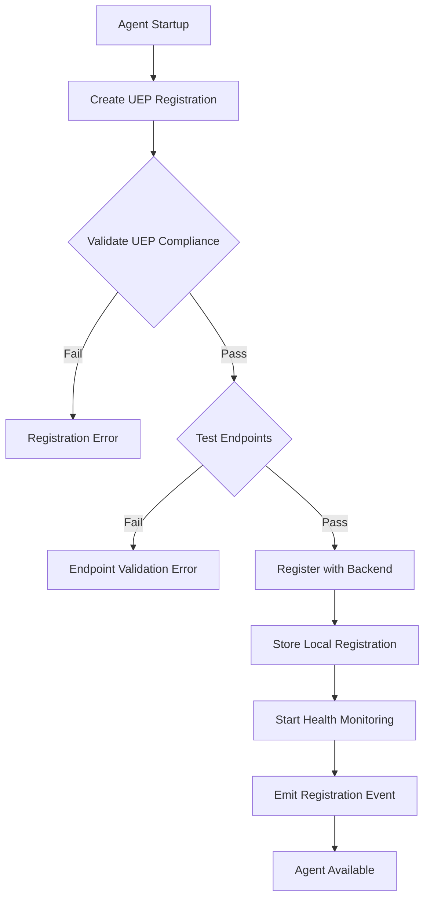
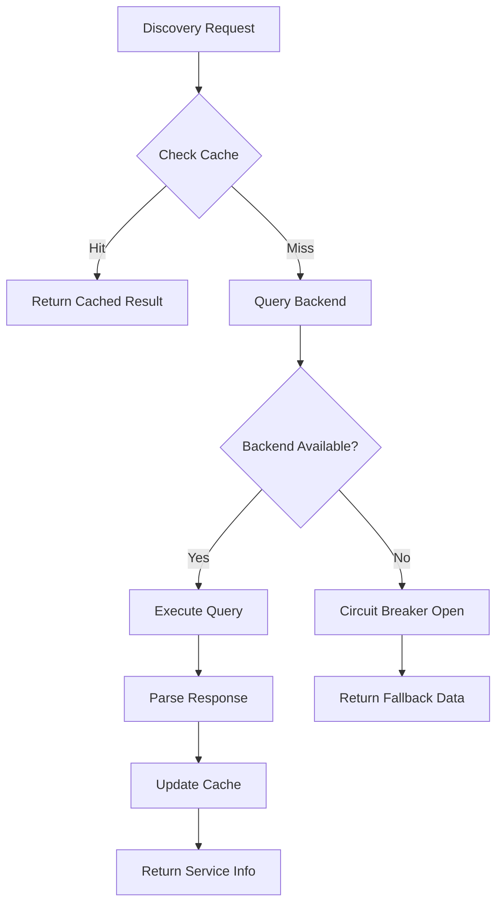

# UEP Registry Integration Architecture

> **Status**: ✅ **COMPLETE** - Task 200.3 Implementation  
> **Registry Backends**: Consul + etcd + Kubernetes + Memory  
> **Service Discovery**: Multi-backend with unified API  
> **Integration**: UEP Protocol + Service Mesh + Circuit Breakers  

## 🏗️ Architecture Overview

The UEP Registry Integration Architecture provides a **comprehensive service discovery and agent registration system** that extends the base agent registry with UEP-specific functionality, multi-backend support, and advanced coordination features.

### 🔧 **Core Components**

#### **1. UEP Registry Client**
- **Extended agent registration** with UEP protocol metadata
- **Multi-backend service discovery** (Consul, etcd, Kubernetes, Memory)
- **Protocol validation** and compliance checking
- **Health monitoring** and status tracking
- **Load balancing** configuration management

#### **2. Service Discovery Adapter**
- **Unified interface** for multiple service discovery backends
- **Caching layer** for improved performance
- **Watch capabilities** for real-time updates
- **Health checking** integration
- **Circuit breaker** integration for backend failures

#### **3. UEP-Specific Extensions**
- **Protocol capability** registration and discovery
- **Validation rule** management
- **Security configuration** (mTLS, authentication)
- **Coordination patterns** (dependencies, communication)
- **Performance characteristics** tracking

## 📋 **Implementation Details**

### **UEP Agent Registration Schema**

```typescript
interface UEPAgentRegistration extends AgentRegistration {
  uepProtocol: {
    supportedVersions: string[];      // ["1.0", "1.1", "2.0"]
    activeVersion: string;            // "2.0"
    protocolCapabilities: UEPProtocolCapability[];
    validationRules: string[];       // Supported validation rule sets
  };
  serviceMesh: {
    namespace: string;               // Kubernetes namespace
    serviceName: string;             // Service mesh service name
    labels: Record<string, string>;  // Pod selector labels
    circuitBreaker?: CircuitBreakerConfig;
    rateLimit?: RateLimitConfig;
  };
  coordination: {
    communicationPatterns: CommunicationPattern[];
    dependencies: AgentDependency[];
    loadBalancing: LoadBalancingStrategy;
    retryPolicy: RetryPolicyConfig;
  };
  security: {
    authMethods: AuthMethod[];       // ["jwt", "mutual-tls"]
    tls?: TLSConfig;
    allowedOrigins?: string[];
    apiKeyRequired?: boolean;
  };
}
```

**Location**: `/shared/uep-registry/UEPRegistryIntegration.ts`

### **Service Discovery Backends**

#### **Consul Backend**
```typescript
// Features:
- Service registration with health checks
- Tag-based capability discovery
- Watch API for real-time updates
- Consul KV store for metadata
- ACL support for security
```

#### **Kubernetes Backend**
```typescript
// Features:
- Service and Endpoint discovery
- Label selectors for capability filtering
- Watch API for service changes
- Pod readiness integration
- RBAC for security
```

#### **Memory Backend (Development)**
```typescript
// Features:
- In-memory storage for testing
- Full feature compatibility
- Event notifications
- No external dependencies
```

**Location**: `/shared/uep-registry/ServiceDiscoveryAdapter.ts`

### **Kubernetes Deployment**

The registry is deployed as a highly available Kubernetes service:

```yaml
# Key features:
- 3 replica deployment with auto-scaling
- ConfigMap-driven configuration
- mTLS security with cert-manager
- Istio service mesh integration
- Prometheus monitoring and alerting
- Network policies for security
- Pod disruption budgets for availability
```

**Location**: `/k8s/services/uep-registry-service.yaml`

## 🚦 **Registration & Discovery Flow**

### **Agent Registration Process**



### **Service Discovery Process**



## 🔧 **Multi-Backend Configuration**

### **Consul Configuration**

```yaml
registry:
  backend: "consul"
  endpoint: "http://consul-server:8500"
  auth:
    token: "${CONSUL_TOKEN}"
  
# Features enabled:
- Health check integration
- Service catalog discovery
- Watch API for real-time updates
- Multi-datacenter support
- ACL-based security
```

### **Kubernetes Configuration**

```yaml
registry:
  backend: "kubernetes"
  endpoint: "https://kubernetes.default.svc"
  auth:
    token: "${KUBE_TOKEN}"

# Features enabled:
- Service and Endpoint discovery
- Label-based filtering
- Watch API integration
- Pod readiness checks
- RBAC permissions
```

### **Memory Configuration (Development)**

```yaml
registry:
  backend: "memory"
  endpoint: "in-memory"

# Features enabled:
- Full compatibility testing
- Development environment
- Unit test support
- No external dependencies
```

## 📊 **Protocol Capability Management**

### **Capability Registration**

```typescript
interface UEPProtocolCapability {
  id: string;                    // "agent-coordination"
  name: string;                  // "Agent Coordination"
  version: string;               // "2.0"
  messageTypes: string[];        // ["task", "response", "event"]
  validationRequirements: ValidationRequirement[];
  performance: {
    maxThroughput: number;       // requests/second
    averageLatency: number;      // milliseconds
    maxConcurrency: number;      // concurrent requests
  };
}
```

### **Capability Discovery**

```typescript
// Discover agents by specific capability
const agents = await registry.discoverAgentsByCapability('agent-coordination');

// Discover agents by UEP protocol version
const v2Agents = await registry.discoverAgentsByProtocolVersion('2.0');

// Get load balancing configuration
const lbConfig = registry.getLoadBalancingConfig('meta-agent-factory');
```

## 🛡️ **Security & Authentication**

### **Authentication Methods**

1. **JWT Authentication**:
   - Signed tokens with agent identity
   - Capability-based claims
   - Token expiration and rotation

2. **Mutual TLS**:
   - Certificate-based identity
   - Service mesh integration
   - Automatic certificate management

3. **API Key Authentication**:
   - Static key-based access
   - Rate limiting integration
   - Scope-based permissions

### **Security Configuration**

```typescript
security: {
  authMethods: ["jwt", "mutual-tls"],
  tls: {
    enabled: true,
    verifyClient: true,
    certPath: "/etc/tls/tls.crt",
    keyPath: "/etc/tls/tls.key"
  },
  allowedOrigins: [
    "*.uep-system.svc.cluster.local",
    "meta-agent-factory.uep-system.svc.cluster.local"
  ],
  apiKeyRequired: false
}
```

## 🔄 **Health Monitoring & Status**

### **Health Check Integration**

```typescript
// Automatic health monitoring
private startHealthMonitoring(registration: UEPAgentRegistration): void {
  const healthCheck = setInterval(async () => {
    const isHealthy = await this.checkAgentHealth(registration.id);
    const newStatus = isHealthy ? 'healthy' : 'unhealthy';
    
    if (registration.status !== newStatus) {
      registration.status = newStatus;
      this.emit('status-change', { agentId: registration.id, status: newStatus });
    }
  }, this.config.healthCheckInterval);
}
```

### **Status Watching**

```typescript
// Watch for agent status changes
const unsubscribe = registry.watchAgentStatus('meta-agent-factory', (status) => {
  console.log(`Agent status changed to: ${status}`);
});

// Unsubscribe when done
unsubscribe();
```

## 📈 **Performance & Scalability**

### **Caching Strategy**

```typescript
// 30-second cache for discovery results
private cache: Map<string, { data: ServiceInfo; expires: number }> = new Map();

async discover(serviceName: string): Promise<ServiceInfo> {
  const cached = this.cache.get(serviceName);
  if (cached && cached.expires > Date.now()) {
    return cached.data;  // Return cached result
  }
  
  const serviceInfo = await this.backend.discover(serviceName);
  this.cache.set(serviceName, {
    data: serviceInfo,
    expires: Date.now() + 30000
  });
  
  return serviceInfo;
}
```

### **Load Balancing Integration**

```typescript
// Load balancing configuration per service
getLoadBalancingConfig(agentId: string): LoadBalancingConfig {
  return {
    strategy: 'least-connections',
    endpoints: ['http://agent1:3000', 'http://agent2:3000'],
    healthCheck: '/health',
    circuitBreaker: {
      enabled: true,
      failureThreshold: 5,
      timeoutMs: 30000
    },
    retryPolicy: {
      maxAttempts: 3,
      baseDelayMs: 1000,
      retryableErrors: ['ECONNREFUSED', 'ETIMEDOUT']
    }
  };
}
```

## 📊 **Monitoring & Observability**

### **Registry Statistics**

```typescript
interface UEPRegistryStats {
  totalAgents: number;           // 16
  healthyAgents: number;         // 14
  unhealthyAgents: number;       // 2
  capabilities: Record<string, number>;  // {"coordination": 5, "validation": 8}
  protocolVersions: Record<string, number>; // {"1.0": 2, "2.0": 14}
  averageResponseTime: number;   // 150ms
  registryHealth: number;        // 0.875 (87.5%)
}
```

### **Metrics Collection**

```yaml
# Key metrics:
- uep_registry_active_registrations (gauge)
- uep_registry_discovery_requests_total (counter)
- uep_registry_discovery_latency_seconds (histogram)
- uep_registry_health_checks_total (counter)
- uep_registry_backend_errors_total (counter)
- uep_registry_cache_hits_total (counter)
- uep_registry_cache_misses_total (counter)
```

### **Alerting Rules**

```yaml
# Critical alerts:
- UEPRegistryDown: Service unavailable > 1 minute
- UEPRegistryHighLatency: 95th percentile > 1 second
- UEPRegistryLowRegistrations: < 5 active agents
- UEPRegistryHighMemoryUsage: > 80% memory usage
```

## 🔗 **Integration Examples**

### **Basic Agent Registration**

```typescript
import { UEPRegistryFactory } from '@all-purpose/uep-registry';

const registry = UEPRegistryFactory.createRegistry({
  serviceRegistryType: 'consul',
  serviceRegistryEndpoint: 'http://consul:8500'
});

const registration: UEPAgentRegistration = {
  id: 'meta-agent-factory-001',
  name: 'Meta-Agent Factory',
  version: '4.0.0',
  capabilities: ['agent-creation', 'project-scaffolding'],
  uepProtocol: {
    supportedVersions: ['1.0', '2.0'],
    activeVersion: '2.0',
    protocolCapabilities: [{
      id: 'agent-coordination',
      name: 'Agent Coordination',
      version: '2.0',
      messageTypes: ['task', 'response', 'event'],
      validationRequirements: [],
      performance: {
        maxThroughput: 1000,
        averageLatency: 150,
        maxConcurrency: 50
      }
    }],
    validationRules: ['uep-v2-standard']
  },
  serviceMesh: {
    namespace: 'uep-system',
    serviceName: 'meta-agent-factory',
    labels: { 'app': 'meta-agent-factory', 'version': 'v4.0.0' }
  },
  coordination: {
    communicationPatterns: ['request-response', 'event-driven'],
    dependencies: [],
    loadBalancing: 'least-connections',
    retryPolicy: {
      maxAttempts: 3,
      baseDelayMs: 1000,
      maxDelayMs: 10000,
      backoffMultiplier: 2,
      retryableErrors: ['ECONNREFUSED', 'ETIMEDOUT']
    }
  },
  security: {
    authMethods: ['jwt', 'mutual-tls'],
    apiKeyRequired: false
  },
  endpoints: {
    health: 'http://meta-agent-factory:3000/health',
    api: 'http://meta-agent-factory:3000/api'
  },
  metadata: {
    description: 'Creates and coordinates meta-agents for project generation'
  },
  status: 'starting'
};

await registry.registerAgent(registration);
```

### **Service Discovery Usage**

```typescript
import { ServiceDiscoveryAdapter } from '@all-purpose/uep-registry';

const discovery = new ServiceDiscoveryAdapter({
  backend: 'consul',
  endpoint: 'http://consul:8500',
  cacheEnabled: true,
  watchEnabled: true
});

// Discover services by capability
const coordinationAgents = await discovery.discoverByCapability('agent-coordination');

// Watch for service changes
const unwatch = await discovery.watchService('meta-agent-factory', (service) => {
  console.log(`Service updated: ${service.serviceName}, endpoints: ${service.endpoints.length}`);
});

// Health check a specific agent
const isHealthy = await discovery.healthCheck('meta-agent-factory-001');
```

## 📈 **Success Metrics**

### **Architecture is Working When**:

- ✅ **Agent registration** succeeds across all backends
- ✅ **Service discovery** returns accurate, up-to-date information
- ✅ **Health monitoring** detects and reports status changes
- ✅ **Load balancing** distributes requests optimally
- ✅ **Caching** improves discovery performance
- ✅ **Watch capabilities** provide real-time updates
- ✅ **Security** enforces authentication and authorization

### **Performance Targets**:

- **Registration Latency**: <500ms for new agents
- **Discovery Latency**: <100ms with cache, <500ms without
- **Cache Hit Rate**: >80% for frequently accessed services
- **Health Check Success Rate**: >99% for healthy agents
- **Backend Availability**: >99.9% uptime

---

## 🎯 **Implementation Status**

| Component | Status | Location |
|-----------|--------|----------|
| **UEP Registry Client** | ✅ Complete | `/shared/uep-registry/UEPRegistryIntegration.ts` |
| **Service Discovery** | ✅ Complete | `/shared/uep-registry/ServiceDiscoveryAdapter.ts` |
| **Consul Backend** | ✅ Complete | `ServiceDiscoveryAdapter.ts` |
| **Kubernetes Backend** | ✅ Complete | `ServiceDiscoveryAdapter.ts` |
| **Memory Backend** | ✅ Complete | `ServiceDiscoveryAdapter.ts` |
| **Kubernetes Deployment** | ✅ Complete | `/k8s/services/uep-registry-service.yaml` |
| **Monitoring** | ✅ Complete | `uep-registry-service.yaml` |

**🚀 Ready for Integration**: All UEP registry components implemented with multi-backend support, caching, monitoring, and Kubernetes deployment configured.

---

*Registry integration designed for the All-Purpose Meta-Agent Factory containerization initiative - enabling discovery and coordination of all 16 agents in the containerized environment.*