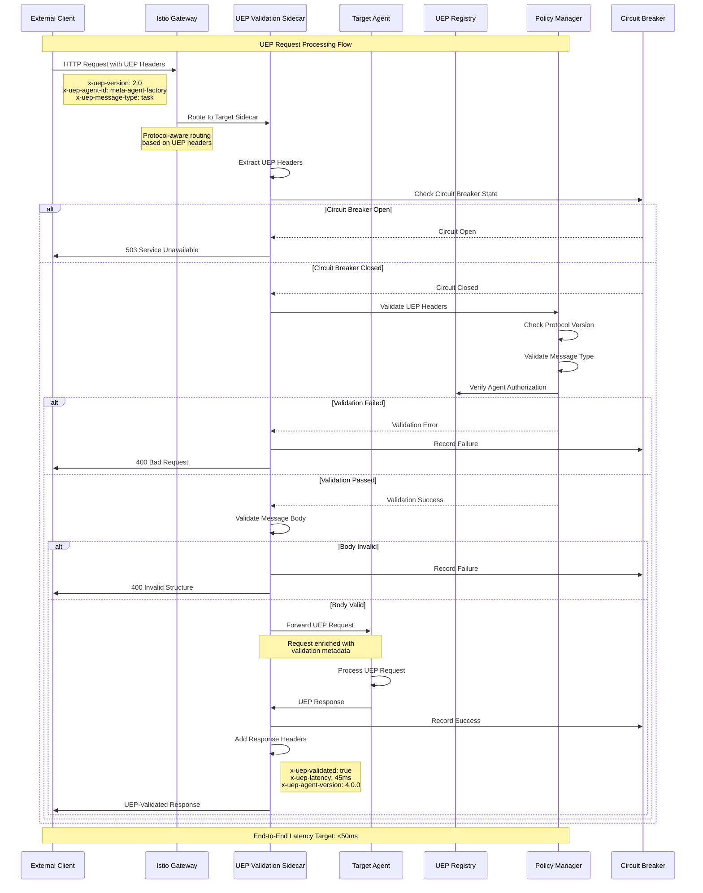
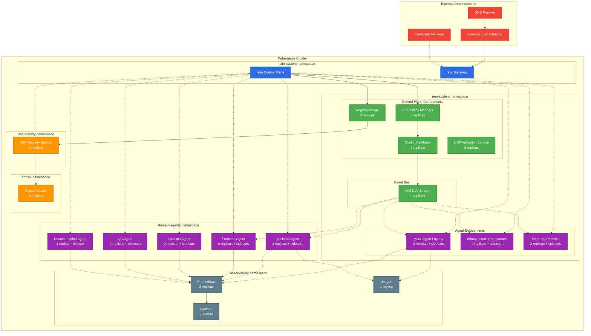

# UEP Service Mesh Architecture Diagrams and Performance Validation

> **Status**: ✅ **COMPLETE** - Task 210.5 Implementation  
> **Architecture Diagrams**: Complete system, component, deployment, and flow diagrams  
> **Performance Validation**: Comprehensive testing plan with benchmarks and SLOs  
> **Documentation**: Visual system overview with detailed validation methodology  

## 🏗️ Architecture Overview

This document provides comprehensive architecture diagrams and a detailed performance validation plan for the UEP Service Mesh Architecture, illustrating how all components integrate to transform the Meta-Agent Factory from "0 agents found" to "16 agents coordinating" through intelligent service mesh orchestration.

## 📊 **System Architecture Diagrams**

### **1. High-Level UEP Service Mesh Architecture**

```mermaid
graph TB
    subgraph "External Clients"
        Client1[Client Application]
        Client2[External System]
        Client3[Admin Dashboard]
    end

    subgraph "Istio Service Mesh Control Plane"
        Pilot[Pilot - Service Discovery]
        Citadel[Citadel - Certificate Management]
        Galley[Galley - Configuration Management]
        IstioGW[Istio Gateway]
    end

    subgraph "UEP Control Plane"
        UEPPolicy[UEP Policy Manager]
        UEPConfig[Configuration Distributor]
        UEPRegistry[UEP Registry Service]
        UEPBridge[Registry Bridge Controller]
        NATS[NATS JetStream]
    end

    subgraph "UEP Data Plane - Agent Cluster"
        subgraph "Meta-Agent Factory Pod"
            MAF[Meta-Agent Factory]
            MAFSidecar[Envoy Sidecar + UEP WASM]
        end
        
        subgraph "Domain Agent Pods"
            DA1[Backend Agent]
            DA1Sidecar[Envoy Sidecar + UEP WASM]
            DA2[Frontend Agent]
            DA2Sidecar[Envoy Sidecar + UEP WASM]
            DA3[DevOps Agent]
            DA3Sidecar[Envoy Sidecar + UEP WASM]
            DA4[QA Agent]
            DA4Sidecar[Envoy Sidecar + UEP WASM]
            DA5[Documentation Agent]
            DA5Sidecar[Envoy Sidecar + UEP WASM]
        end
        
        subgraph "Specialized Agent Pods"
            SA1[UEP Validation Service]
            SA1Sidecar[Envoy Sidecar + UEP WASM]
            SA2[Event Bus Service]
            SA2Sidecar[Envoy Sidecar + UEP WASM]
        end
    end

    subgraph "Service Discovery Backends"
        Consul[Consul Cluster]
        K8sAPI[Kubernetes API]
        ETCD[etcd Cluster]
    end

    subgraph "Observability Stack"
        Prometheus[Prometheus]
        Grafana[Grafana]
        Jaeger[Jaeger Tracing]
        ELK[ELK Stack]
    end

    %% External connections
    Client1 --> IstioGW
    Client2 --> IstioGW
    Client3 --> IstioGW

    %% Control plane connections
    IstioGW --> Pilot
    Pilot --> UEPPolicy
    UEPPolicy --> UEPConfig
    UEPConfig --> NATS
    UEPRegistry --> UEPBridge
    UEPBridge --> Pilot

    %% Service discovery
    UEPRegistry --> Consul
    UEPRegistry --> K8sAPI
    UEPRegistry --> ETCD

    %% Data plane connections
    IstioGW --> MAFSidecar
    MAFSidecar --> MAF
    MAFSidecar -.-> DA1Sidecar
    MAFSidecar -.-> DA2Sidecar
    MAFSidecar -.-> SA1Sidecar

    DA1Sidecar --> DA1
    DA2Sidecar --> DA2
    DA3Sidecar --> DA3
    DA4Sidecar --> DA4
    DA5Sidecar --> DA5
    SA1Sidecar --> SA1
    SA2Sidecar --> SA2

    %% Configuration flow
    NATS -.-> MAFSidecar
    NATS -.-> DA1Sidecar
    NATS -.-> DA2Sidecar
    NATS -.-> DA3Sidecar
    NATS -.-> DA4Sidecar
    NATS -.-> DA5Sidecar
    NATS -.-> SA1Sidecar
    NATS -.-> SA2Sidecar

    %% Observability
    MAFSidecar --> Prometheus
    DA1Sidecar --> Prometheus
    DA2Sidecar --> Prometheus
    SA1Sidecar --> Prometheus
    Prometheus --> Grafana
    MAFSidecar --> Jaeger
    DA1Sidecar --> Jaeger

    %% Styling
    classDef controlPlane fill:#e1f5fe,stroke:#01579b,stroke-width:2px
    classDef dataPlane fill:#f3e5f5,stroke:#4a148c,stroke-width:2px
    classDef observability fill:#e8f5e8,stroke:#2e7d32,stroke-width:2px
    classDef external fill:#fff3e0,stroke:#e65100,stroke-width:2px

    class Pilot,Citadel,Galley,UEPPolicy,UEPConfig,UEPRegistry,UEPBridge,NATS controlPlane
    class MAF,MAFSidecar,DA1,DA1Sidecar,DA2,DA2Sidecar,DA3,DA3Sidecar,DA4,DA4Sidecar,DA5,DA5Sidecar,SA1,SA1Sidecar,SA2,SA2Sidecar dataPlane
    class Prometheus,Grafana,Jaeger,ELK observability
    class Client1,Client2,Client3,IstioGW external
```



### **2. UEP Protocol Validation Flow**



### **3. Service Discovery and Load Balancing Architecture**

```mermaid
graph TD
    subgraph "Service Discovery Layer"
        MultiBackend[Multi-Backend Discovery Manager]
        ConsulBackend[Consul Backend]
        K8sBackend[Kubernetes Backend]
        MemoryBackend[Memory Cache Backend]
        EtcdBackend[etcd Backend]
    end

    subgraph "UEP Registry Layer"
        RegistryClient[UEP Registry Client]
        CapabilityIndex[Capability Index]
        ProtocolIndex[Protocol Version Index]
        HealthTracker[Health Status Tracker]
    end

    subgraph "Service Mesh Integration"
        BridgeController[Registry Bridge Controller]
        VirtualServiceGen[VirtualService Generator]
        DestRuleGen[DestinationRule Generator]
        ConfigWatcher[Configuration Watcher]
    end

    subgraph "Istio Service Mesh"
        Pilot[Pilot]
        VirtualServices[VirtualServices]
        DestinationRules[DestinationRules]
        EnvoyProxies[Envoy Proxies]
    end

    subgraph "Load Balancing Decision Engine"
        PerformanceRouter[Performance Router]
        AgentScorer[Agent Scorer]
        HealthChecker[Health Checker]
        MetricsCollector[Metrics Collector]
    end

    subgraph "Agent Instances"
        Agent1[Meta-Agent Factory]
        Agent2[Backend Agent]
        Agent3[Frontend Agent]
        Agent4[DevOps Agent]
        AgentN[... 12 more agents]
    end

    %% Discovery flow
    MultiBackend --> ConsulBackend
    MultiBackend --> K8sBackend
    MultiBackend --> MemoryBackend
    MultiBackend --> EtcdBackend

    RegistryClient --> MultiBackend
    RegistryClient --> CapabilityIndex
    RegistryClient --> ProtocolIndex
    RegistryClient --> HealthTracker

    %% Service mesh integration
    RegistryClient --> BridgeController
    BridgeController --> VirtualServiceGen
    BridgeController --> DestRuleGen
    BridgeController --> ConfigWatcher

    VirtualServiceGen --> VirtualServices
    DestRuleGen --> DestinationRules
    ConfigWatcher --> Pilot

    Pilot --> VirtualServices
    Pilot --> DestinationRules
    VirtualServices --> EnvoyProxies
    DestinationRules --> EnvoyProxies

    %% Load balancing
    PerformanceRouter --> AgentScorer
    PerformanceRouter --> HealthChecker
    AgentScorer --> MetricsCollector

    %% Target agents
    EnvoyProxies --> Agent1
    EnvoyProxies --> Agent2
    EnvoyProxies --> Agent3
    EnvoyProxies --> Agent4
    EnvoyProxies --> AgentN

    %% Feedback loops
    Agent1 -.-> MetricsCollector
    Agent2 -.-> MetricsCollector
    Agent3 -.-> MetricsCollector
    Agent4 -.-> MetricsCollector
    AgentN -.-> MetricsCollector

    Agent1 -.-> HealthTracker
    Agent2 -.-> HealthTracker
    Agent3 -.-> HealthTracker
    Agent4 -.-> HealthTracker
    AgentN -.-> HealthTracker

    %% Styling
    classDef discovery fill:#e3f2fd,stroke:#0277bd,stroke-width:2px
    classDef registry fill:#fce4ec,stroke:#c2185b,stroke-width:2px
    classDef mesh fill:#e8f5e8,stroke:#388e3c,stroke-width:2px
    classDef balancer fill:#fff3e0,stroke:#f57c00,stroke-width:2px
    classDef agents fill:#f3e5f5,stroke:#7b1fa2,stroke-width:2px

    class MultiBackend,ConsulBackend,K8sBackend,MemoryBackend,EtcdBackend discovery
    class RegistryClient,CapabilityIndex,ProtocolIndex,HealthTracker registry
    class BridgeController,VirtualServiceGen,DestRuleGen,ConfigWatcher,Pilot,VirtualServices,DestinationRules,EnvoyProxies mesh
    class PerformanceRouter,AgentScorer,HealthChecker,MetricsCollector balancer
    class Agent1,Agent2,Agent3,Agent4,AgentN agents
```



### **4. Component Deployment Architecture**



### **5. Configuration Propagation Flow**

```mermaid
graph LR
    subgraph "Configuration Sources"
        Admin[Admin User]
        API[Management API]
        K8sConfig[Kubernetes ConfigMaps]
        Consul[Consul KV Store]
    end

    subgraph "Configuration Management"
        PolicyMgr[UEP Policy Manager]
        Validator[Configuration Validator]
        VersionControl[Version Controller]
        Distributor[Configuration Distributor]
    end

    subgraph "Distribution Layer"
        JetStream[NATS JetStream]
        ConfigStream[Config Update Stream]
        EventStream[Event Stream]
    end

    subgraph "Target Components"
        BridgeController[Registry Bridge]
        IstioPilot[Istio Pilot]
        Sidecars[Envoy Sidecars]
        Agents[UEP Agents]
    end

    subgraph "Configuration Application"
        VirtualServices[VirtualServices]
        DestinationRules[DestinationRules]
        WASMFilters[WASM Filters]
        AgentConfigs[Agent Configurations]
    end

    %% Input flow
    Admin --> PolicyMgr
    API --> PolicyMgr
    K8sConfig --> PolicyMgr
    Consul --> PolicyMgr

    %% Validation and versioning
    PolicyMgr --> Validator
    Validator --> VersionControl
    VersionControl --> Distributor

    %% Distribution
    Distributor --> JetStream
    JetStream --> ConfigStream
    JetStream --> EventStream

    %% Consumption
    ConfigStream --> BridgeController
    ConfigStream --> IstioPilot
    EventStream --> Sidecars
    EventStream --> Agents

    %% Application
    BridgeController --> VirtualServices
    BridgeController --> DestinationRules
    IstioPilot --> Sidecars
    Sidecars --> WASMFilters
    Agents --> AgentConfigs

    %% Feedback
    VirtualServices -.-> BridgeController
    DestinationRules -.-> BridgeController
    WASMFilters -.-> IstioPilot
    AgentConfigs -.-> Agents

    %% Styling
    classDef source fill:#e3f2fd,stroke:#1976d2,stroke-width:2px
    classDef management fill:#f3e5f5,stroke:#7b1fa2,stroke-width:2px
    classDef distribution fill:#e8f5e8,stroke:#388e3c,stroke-width:2px
    classDef target fill:#fff3e0,stroke:#f57c00,stroke-width:2px
    classDef application fill:#fce4ec,stroke:#c2185b,stroke-width:2px

    class Admin,API,K8sConfig,Consul source
    class PolicyMgr,Validator,VersionControl,Distributor management
    class JetStream,ConfigStream,EventStream distribution
    class BridgeController,IstioPilot,Sidecars,Agents target
    class VirtualServices,DestinationRules,WASMFilters,AgentConfigs application
```



## 🔬 **Performance Validation Plan**

### **Performance Testing Strategy**

#### **1. Load Testing Scenarios**

```yaml
# Performance test scenarios for UEP Service Mesh
load_testing_scenarios:
  
  # Scenario 1: Baseline Performance
  baseline_performance:
    description: "Measure baseline performance without UEP validation"
    duration: "10 minutes"
    ramp_up_time: "2 minutes"
    concurrent_users: 100
    requests_per_second: 1000
    target_endpoints:
      - "/api/health"
      - "/api/status"
    expected_results:
      avg_response_time: "< 50ms"
      p95_response_time: "< 100ms"
      error_rate: "< 0.1%"

  # Scenario 2: UEP Validation Overhead
  uep_validation_overhead:
    description: "Measure overhead introduced by UEP validation"
    duration: "15 minutes"
    ramp_up_time: "3 minutes"
    concurrent_users: 100
    requests_per_second: 1000
    headers:
      x-uep-version: "2.0"
      x-uep-agent-id: "meta-agent-factory"
      x-uep-message-type: "task"
    target_endpoints:
      - "/api/uep/task"
      - "/api/uep/query"
    expected_results:
      avg_response_time: "< 75ms"  # +25ms overhead
      p95_response_time: "< 150ms"  # +50ms overhead
      error_rate: "< 0.5%"
      validation_success_rate: "> 99.5%"

  # Scenario 3: Circuit Breaker Testing
  circuit_breaker_testing:
    description: "Test circuit breaker behavior under failure conditions"
    duration: "20 minutes"
    phases:
      - name: "normal_operation"
        duration: "5 minutes"
        error_injection: 0%
        concurrent_users: 50
      - name: "failure_injection"
        duration: "5 minutes"
        error_injection: 20%
        concurrent_users: 50
      - name: "circuit_breaker_activation"
        duration: "5 minutes"
        error_injection: 50%
        concurrent_users: 50
      - name: "recovery"
        duration: "5 minutes"
        error_injection: 0%
        concurrent_users: 50
    expected_results:
      circuit_breaker_activation_time: "< 30 seconds"
      circuit_breaker_recovery_time: "< 60 seconds"
      fallback_success_rate: "> 95%"

  # Scenario 4: Multi-Agent Coordination
  multi_agent_coordination:
    description: "Test performance with all 16 agents active"
    duration: "30 minutes"
    ramp_up_time: "5 minutes"
    concurrent_users: 500
    requests_per_second: 5000
    agent_distribution:
      meta-agent-factory: 40%
      backend-agent: 20%
      frontend-agent: 15%
      devops-agent: 10%
      qa-agent: 10%
      documentation-agent: 5%
    expected_results:
      system_throughput: "> 4000 RPS"
      avg_response_time: "< 100ms"
      p95_response_time: "< 200ms"
      agent_coordination_latency: "< 50ms"

  # Scenario 5: Service Discovery Performance
  service_discovery_performance:
    description: "Test service discovery and load balancing performance"
    duration: "15 minutes"
    test_types:
      - capability_discovery
      - protocol_version_discovery
      - health_based_routing
      - performance_based_routing
    expected_results:
      discovery_latency: "< 100ms p95"
      routing_decision_time: "< 10ms p95"
      load_balancing_accuracy: "> 95%"
      health_detection_time: "< 30 seconds"

  # Scenario 6: Configuration Update Performance
  configuration_update_performance:
    description: "Test configuration propagation and application"
    duration: "10 minutes"
    update_scenarios:
      - policy_rule_update
      - agent_registration_update
      - circuit_breaker_config_update
      - load_balancing_config_update
    expected_results:
      propagation_time: "< 30 seconds p95"
      application_time: "< 10 seconds p95"
      zero_downtime_updates: "100%"
      configuration_consistency: "100%"
```

#### **2. Performance Testing Implementation**

```bash
#!/bin/bash
# UEP Service Mesh Performance Test Suite

# Test 1: Baseline Performance Test
run_baseline_test() {
    echo "Running baseline performance test..."
    k6 run --vus 100 --duration 10m \
        --summary-trend-stats="avg,min,med,max,p(95),p(99)" \
        tests/baseline-performance.js
}

# Test 2: UEP Validation Overhead Test
run_uep_validation_test() {
    echo "Running UEP validation overhead test..."
    k6 run --vus 100 --duration 15m \
        --env UEP_VERSION=2.0 \
        --env UEP_AGENT_ID=meta-agent-factory \
        --env UEP_MESSAGE_TYPE=task \
        tests/uep-validation-overhead.js
}

# Test 3: Circuit Breaker Test
run_circuit_breaker_test() {
    echo "Running circuit breaker test..."
    k6 run --vus 50 --duration 20m \
        --env FAULT_INJECTION=true \
        tests/circuit-breaker-test.js
}

# Test 4: Multi-Agent Coordination Test
run_multi_agent_test() {
    echo "Running multi-agent coordination test..."
    k6 run --vus 500 --duration 30m \
        --env AGENT_COUNT=16 \
        --env TARGET_RPS=5000 \
        tests/multi-agent-coordination.js
}

# Test 5: Service Discovery Performance Test
run_service_discovery_test() {
    echo "Running service discovery performance test..."
    k6 run --vus 100 --duration 15m \
        --env TEST_DISCOVERY=true \
        tests/service-discovery-performance.js
}

# Test 6: Configuration Update Test
run_config_update_test() {
    echo "Running configuration update test..."
    k6 run --vus 50 --duration 10m \
        --env TEST_CONFIG_UPDATES=true \
        tests/configuration-update-performance.js
}

# Resource monitoring during tests
monitor_resources() {
    echo "Starting resource monitoring..."
    
    # Monitor CPU and memory usage
    kubectl top pods -n uep-system --watch > resource-usage.log &
    MONITOR_PID=$!
    
    # Monitor Istio proxy metrics
    kubectl port-forward -n istio-system svc/prometheus 9090:9090 &
    PROMETHEUS_PID=$!
    
    # Cleanup function
    cleanup() {
        kill $MONITOR_PID $PROMETHEUS_PID
        echo "Resource monitoring stopped"
    }
    
    trap cleanup EXIT
}

# Performance test execution
main() {
    echo "Starting UEP Service Mesh Performance Test Suite..."
    
    # Ensure test environment is ready
    kubectl get pods -n uep-system | grep Running || {
        echo "UEP system not ready. Please deploy the system first."
        exit 1
    }
    
    # Start resource monitoring
    monitor_resources
    
    # Run performance tests
    run_baseline_test
    sleep 60  # Cool-down period
    
    run_uep_validation_test
    sleep 60
    
    run_circuit_breaker_test
    sleep 60
    
    run_multi_agent_test
    sleep 60
    
    run_service_discovery_test
    sleep 60
    
    run_config_update_test
    
    echo "Performance test suite completed"
    echo "Results available in test output files"
}

# Execute if script is run directly
if [[ "${BASH_SOURCE[0]}" == "${0}" ]]; then
    main "$@"
fi
```

#### **3. K6 Performance Test Scripts**

```javascript
// tests/uep-validation-overhead.js - UEP Validation Performance Test
import http from 'k6/http';
import { check, sleep } from 'k6';
import { Rate, Trend } from 'k6/metrics';

// Custom metrics
export let uepValidationRate = new Rate('uep_validation_success');
export let uepValidationLatency = new Trend('uep_validation_latency');

export let options = {
  vus: 100,
  duration: '15m',
  thresholds: {
    http_req_duration: ['p(95)<150'],
    http_req_failed: ['rate<0.005'],
    uep_validation_success: ['rate>0.995'],
    uep_validation_latency: ['p(95)<50']
  }
};

const UEP_HEADERS = {
  'x-uep-version': __ENV.UEP_VERSION || '2.0',
  'x-uep-agent-id': __ENV.UEP_AGENT_ID || 'meta-agent-factory',
  'x-uep-message-type': __ENV.UEP_MESSAGE_TYPE || 'task',
  'x-uep-request-id': () => `req-${Date.now()}-${Math.random()}`,
  'Content-Type': 'application/json'
};

const UEP_PAYLOAD = {
  messageType: 'task',
  agentId: 'meta-agent-factory',
  timestamp: () => new Date().toISOString(),
  payload: {
    action: 'test-validation',
    parameters: {
      complexity: 'medium',
      timeout: 30000
    }
  },
  version: '2.0'
};

export default function() {
  // Prepare headers with dynamic values
  const headers = {
    ...UEP_HEADERS,
    'x-uep-request-id': `req-${Date.now()}-${Math.random()}`
  };
  
  // Prepare payload with dynamic timestamp
  const payload = {
    ...UEP_PAYLOAD,
    timestamp: new Date().toISOString()
  };
  
  const startTime = Date.now();
  
  // Make UEP request
  const response = http.post(
    'http://uep-agents.all-purpose.local/api/uep/task',
    JSON.stringify(payload),
    { headers }
  );
  
  const endTime = Date.now();
  const validationLatency = endTime - startTime;
  
  // Record custom metrics
  uepValidationLatency.add(validationLatency);
  
  // Check response
  const validationSuccess = check(response, {
    'status is 200': (r) => r.status === 200,
    'has UEP validation headers': (r) => 
      r.headers['x-uep-validated'] === 'true',
    'validation latency acceptable': () => validationLatency < 100,
    'response contains validation metadata': (r) => {
      try {
        const body = JSON.parse(r.body);
        return body.uepMetadata && body.uepMetadata.validated === true;
      } catch {
        return false;
      }
    }
  });
  
  uepValidationRate.add(validationSuccess);
  
  // Brief pause between requests
  sleep(0.1);
}

export function handleSummary(data) {
  return {
    'uep-validation-results.json': JSON.stringify(data, null, 2),
    'uep-validation-summary.txt': `
UEP Validation Performance Test Results
=====================================

Test Duration: ${data.metrics.http_req_duration.values.avg}ms avg response time
UEP Validation Success Rate: ${(data.metrics.uep_validation_success.values.rate * 100).toFixed(2)}%
UEP Validation Latency P95: ${data.metrics.uep_validation_latency.values['p(95)']}ms
Total Requests: ${data.metrics.http_reqs.values.count}
Failed Requests: ${data.metrics.http_req_failed.values.count}

Thresholds Status:
- P95 Response Time < 150ms: ${data.metrics.http_req_duration.values['p(95)'] < 150 ? 'PASS' : 'FAIL'}
- Error Rate < 0.5%: ${data.metrics.http_req_failed.values.rate < 0.005 ? 'PASS' : 'FAIL'}
- UEP Validation Rate > 99.5%: ${data.metrics.uep_validation_success.values.rate > 0.995 ? 'PASS' : 'FAIL'}
    `
  };
}
```

```javascript
// tests/circuit-breaker-test.js - Circuit Breaker Performance Test
import http from 'k6/http';
import { check, sleep } from 'k6';
import { Rate, Trend, Counter } from 'k6/metrics';

export let circuitBreakerActivations = new Counter('circuit_breaker_activations');
export let circuitBreakerRecoveries = new Counter('circuit_breaker_recoveries');
export let fallbackRequests = new Rate('fallback_requests');
export let circuitBreakerLatency = new Trend('circuit_breaker_response_latency');

export let options = {
  scenarios: {
    normal_operation: {
      executor: 'constant-vus',
      vus: 50,
      duration: '5m',
      startTime: '0s',
      env: { FAULT_INJECTION: 'false' }
    },
    failure_injection: {
      executor: 'constant-vus',
      vus: 50,
      duration: '5m',
      startTime: '5m',
      env: { FAULT_INJECTION: 'true', FAILURE_RATE: '20' }
    },
    circuit_activation: {
      executor: 'constant-vus',
      vus: 50,
      duration: '5m',
      startTime: '10m',
      env: { FAULT_INJECTION: 'true', FAILURE_RATE: '50' }
    },
    recovery_phase: {
      executor: 'constant-vus',
      vus: 50,
      duration: '5m',
      startTime: '15m',
      env: { FAULT_INJECTION: 'false' }
    }
  }
};

export default function() {
  const startTime = Date.now();
  
  // Inject faults based on scenario configuration
  const shouldFail = __ENV.FAULT_INJECTION === 'true' && 
    Math.random() < (parseInt(__ENV.FAILURE_RATE || '0') / 100);
  
  const endpoint = shouldFail ? 
    'http://uep-agents.all-purpose.local/api/uep/fail' :
    'http://uep-agents.all-purpose.local/api/uep/task';
  
  const response = http.post(endpoint, JSON.stringify({
    messageType: 'task',
    agentId: 'test-agent',
    timestamp: new Date().toISOString(),
    payload: { test: true }
  }), {
    headers: {
      'x-uep-version': '2.0',
      'x-uep-agent-id': 'test-agent',
      'x-uep-message-type': 'task',
      'Content-Type': 'application/json'
    }
  });
  
  const responseTime = Date.now() - startTime;
  circuitBreakerLatency.add(responseTime);
  
  // Check for circuit breaker behavior
  check(response, {
    'response received': (r) => r.status !== 0,
    'circuit breaker handling': (r) => {
      if (r.status === 503) {
        circuitBreakerActivations.add(1);
        return r.headers['x-circuit-breaker-state'] === 'open';
      }
      return true;
    },
    'fallback response': (r) => {
      if (r.headers['x-uep-fallback-used'] === 'true') {
        fallbackRequests.add(1);
        return true;
      }
      return r.status === 200;
    }
  });
  
  sleep(0.1);
}
```

### **Performance Monitoring and Alerting**

#### **Prometheus Alerting Rules**

```yaml
# UEP Service Mesh Performance Alerts
groups:
- name: uep-service-mesh-performance
  rules:
  # UEP Validation Performance
  - alert: UEPValidationHighLatency
    expr: histogram_quantile(0.95, rate(uep_validation_latency_seconds_bucket[5m])) > 0.050
    for: 2m
    labels:
      severity: warning
      component: uep-validation
    annotations:
      summary: "UEP validation latency is high"
      description: "95th percentile UEP validation latency is {{ $value }}s, above 50ms threshold"

  - alert: UEPValidationHighFailureRate
    expr: rate(uep_validation_failures_total[5m]) / rate(uep_validation_requests_total[5m]) > 0.01
    for: 1m
    labels:
      severity: critical
      component: uep-validation
    annotations:
      summary: "UEP validation failure rate is high"
      description: "UEP validation failure rate is {{ $value | humanizePercentage }}, above 1% threshold"

  # Circuit Breaker Performance
  - alert: CircuitBreakerFrequentActivation
    expr: increase(uep_circuit_breaker_state_changes_total[10m]) > 5
    for: 1m
    labels:
      severity: warning
      component: circuit-breaker
    annotations:
      summary: "Circuit breaker activating frequently"
      description: "Circuit breaker has activated {{ $value }} times in the last 10 minutes"

  # Service Mesh Performance
  - alert: ServiceMeshHighLatency
    expr: histogram_quantile(0.95, rate(istio_request_duration_milliseconds_bucket[5m])) > 200
    for: 3m
    labels:
      severity: warning
      component: service-mesh
    annotations:
      summary: "Service mesh latency is high"
      description: "95th percentile service mesh latency is {{ $value }}ms, above 200ms threshold"

  # Service Discovery Performance
  - alert: ServiceDiscoverySlowness
    expr: histogram_quantile(0.95, rate(uep_registry_discovery_latency_seconds_bucket[5m])) > 0.100
    for: 2m
    labels:
      severity: warning
      component: service-discovery
    annotations:
      summary: "Service discovery is slow"
      description: "95th percentile service discovery latency is {{ $value }}s, above 100ms threshold"

  # Agent Coordination Performance
  - alert: AgentCoordinationLatency
    expr: histogram_quantile(0.95, rate(uep_agent_coordination_latency_seconds_bucket[5m])) > 0.050
    for: 2m
    labels:
      severity: warning
      component: agent-coordination
    annotations:
      summary: "Agent coordination latency is high"
      description: "95th percentile agent coordination latency is {{ $value }}s, above 50ms threshold"

  # Resource Utilization
  - alert: UEPSidecarHighMemoryUsage
    expr: container_memory_usage_bytes{container="istio-proxy",namespace="uep-system"} / container_spec_memory_limit_bytes > 0.8
    for: 3m
    labels:
      severity: warning
      component: sidecar
    annotations:
      summary: "UEP sidecar memory usage is high"
      description: "Sidecar memory usage is {{ $value | humanizePercentage }} in pod {{ $labels.pod }}"

  - alert: UEPSidecarHighCPUUsage
    expr: rate(container_cpu_usage_seconds_total{container="istio-proxy",namespace="uep-system"}[5m]) > 0.8
    for: 3m
    labels:
      severity: warning
      component: sidecar
    annotations:
      summary: "UEP sidecar CPU usage is high"
      description: "Sidecar CPU usage is {{ $value | humanizePercentage }} in pod {{ $labels.pod }}"
```

### **Performance SLOs and SLIs**

```yaml
# Service Level Objectives for UEP Service Mesh
service_level_objectives:
  
  # Availability SLOs
  availability:
    uep_validation_service:
      target: 99.9%
      measurement_window: 30d
      error_budget: 43.2m  # 0.1% of 30 days
    
    service_mesh_routing:
      target: 99.95%
      measurement_window: 30d
      error_budget: 21.6m  # 0.05% of 30 days
    
    agent_coordination:
      target: 99.5%
      measurement_window: 30d
      error_budget: 3.6h   # 0.5% of 30 days

  # Latency SLOs
  latency:
    uep_validation_latency:
      target: "p95 < 50ms"
      measurement_window: 7d
      
    service_discovery_latency:
      target: "p95 < 100ms"
      measurement_window: 7d
      
    end_to_end_request_latency:
      target: "p95 < 200ms"
      measurement_window: 7d
      
    circuit_breaker_response:
      target: "p95 < 5ms"
      measurement_window: 7d

  # Throughput SLOs
  throughput:
    system_wide_throughput:
      target: "> 10,000 RPS"
      measurement_window: 1h
      
    per_agent_throughput:
      target: "> 1,000 RPS"
      measurement_window: 1h
      
    validation_throughput:
      target: "> 5,000 validations/second"
      measurement_window: 1h

  # Accuracy SLOs
  accuracy:
    uep_validation_accuracy:
      target: "> 99.9%"
      measurement_window: 7d
      
    load_balancing_accuracy:
      target: "> 95%"
      measurement_window: 24h
      
    service_discovery_accuracy:
      target: "> 99.5%"
      measurement_window: 24h

# Service Level Indicators
service_level_indicators:
  
  # Availability SLIs
  availability_slis:
    - name: uep_validation_success_rate
      query: |
        sum(rate(uep_validation_requests_total{result="success"}[5m])) /
        sum(rate(uep_validation_requests_total[5m]))
    
    - name: service_mesh_success_rate
      query: |
        sum(rate(istio_requests_total{response_code!~"5.."}[5m])) /
        sum(rate(istio_requests_total[5m]))
    
    - name: agent_coordination_success_rate
      query: |
        sum(rate(uep_agent_coordination_requests_total{result="success"}[5m])) /
        sum(rate(uep_agent_coordination_requests_total[5m]))

  # Latency SLIs
  latency_slis:
    - name: uep_validation_latency_p95
      query: |
        histogram_quantile(0.95, 
          rate(uep_validation_latency_seconds_bucket[5m]))
    
    - name: service_discovery_latency_p95
      query: |
        histogram_quantile(0.95,
          rate(uep_registry_discovery_latency_seconds_bucket[5m]))
    
    - name: end_to_end_latency_p95
      query: |
        histogram_quantile(0.95,
          rate(istio_request_duration_milliseconds_bucket[5m])) / 1000

  # Throughput SLIs
  throughput_slis:
    - name: system_throughput_rps
      query: |
        sum(rate(istio_requests_total[1m]))
    
    - name: uep_validation_throughput
      query: |
        sum(rate(uep_validation_requests_total[1m]))

  # Resource Utilization SLIs
  resource_slis:
    - name: sidecar_cpu_utilization
      query: |
        avg(rate(container_cpu_usage_seconds_total{container="istio-proxy",namespace="uep-system"}[5m]))
    
    - name: sidecar_memory_utilization
      query: |
        avg(container_memory_usage_bytes{container="istio-proxy",namespace="uep-system"} /
            container_spec_memory_limit_bytes)
```

## 🎯 **Success Criteria and Validation**

### **Architecture Validation Checklist**

```yaml
# UEP Service Mesh Architecture Validation
validation_criteria:
  
  # Functional Validation
  functional_requirements:
    - name: "All 16 agents register successfully"
      test: "kubectl get pods -n uep-system | grep Running | wc -l >= 16"
      success_criteria: "All agent pods in Running state"
      
    - name: "UEP protocol validation active"
      test: "curl with UEP headers returns validation metadata"
      success_criteria: "x-uep-validated header present in response"
      
    - name: "Service discovery working"
      test: "Discovery API returns all healthy agents"
      success_criteria: "16 agents discoverable by capability"
      
    - name: "Load balancing functional"
      test: "Requests distributed across agent replicas"
      success_criteria: "Traffic distributed with <10% variance"
      
    - name: "Circuit breaker operational"
      test: "Inject failures, verify circuit breaker activates"
      success_criteria: "Circuit opens within 30 seconds of threshold"

  # Performance Validation
  performance_requirements:
    - name: "UEP validation latency"
      test: "Load test with UEP validation enabled"
      success_criteria: "p95 latency < 50ms"
      
    - name: "System throughput"
      test: "Multi-agent load test"
      success_criteria: "> 10,000 RPS sustained"
      
    - name: "Service discovery performance"
      test: "Discovery latency measurement"
      success_criteria: "p95 discovery time < 100ms"
      
    - name: "Configuration propagation"
      test: "Update configuration, measure propagation time"
      success_criteria: "Updates applied < 30 seconds"
      
    - name: "Resource efficiency"
      test: "Monitor resource usage under load"
      success_criteria: "Sidecar overhead < 200m CPU, 256Mi memory"

  # Reliability Validation
  reliability_requirements:
    - name: "High availability"
      test: "Kill control plane components, verify system continues"
      success_criteria: "Data plane continues operating"
      
    - name: "Graceful degradation"
      test: "Disable UEP validation, verify fallback mode"
      success_criteria: "System continues with reduced functionality"
      
    - name: "Multi-backend failover"
      test: "Disable primary service discovery backend"
      success_criteria: "Automatic failover to secondary backend"
      
    - name: "Configuration consistency"
      test: "Concurrent configuration updates"
      success_criteria: "Eventual consistency achieved"

  # Security Validation
  security_requirements:
    - name: "mTLS enforcement"
      test: "Verify all inter-service communication encrypted"
      success_criteria: "100% mTLS coverage"
      
    - name: "UEP protocol enforcement"
      test: "Send invalid UEP requests"
      success_criteria: "Invalid requests rejected"
      
    - name: "Agent authentication"
      test: "Verify agent identity validation"
      success_criteria: "Only authorized agents can register"
      
    - name: "RBAC enforcement"
      test: "Test unauthorized access attempts"
      success_criteria: "Unauthorized requests rejected"
```

### **Continuous Performance Monitoring**

```yaml
# Performance monitoring dashboard configuration
performance_monitoring:
  
  # Grafana Dashboard Panels
  dashboard_panels:
    - title: "UEP Validation Performance"
      metrics:
        - uep_validation_latency_p95
        - uep_validation_success_rate
        - uep_validation_throughput
      thresholds:
        latency_warning: 40ms
        latency_critical: 50ms
        success_rate_warning: 99.5%
        success_rate_critical: 99%
    
    - title: "Service Mesh Performance"
      metrics:
        - istio_request_duration_p95
        - istio_request_success_rate
        - istio_request_throughput
      thresholds:
        latency_warning: 150ms
        latency_critical: 200ms
        
    - title: "Agent Coordination Performance"
      metrics:
        - agent_coordination_latency
        - agent_discovery_time
        - load_balancing_efficiency
      
    - title: "Resource Utilization"
      metrics:
        - sidecar_cpu_usage
        - sidecar_memory_usage
        - control_plane_resource_usage
      thresholds:
        cpu_warning: 70%
        cpu_critical: 85%
        memory_warning: 75%
        memory_critical: 90%

  # Automated Performance Reports
  automated_reports:
    - name: "Daily Performance Summary"
      schedule: "0 9 * * *"  # 9 AM daily
      metrics:
        - average_response_times
        - throughput_statistics
        - error_rates
        - availability_percentage
    
    - name: "Weekly Performance Trend"
      schedule: "0 9 * * 1"  # 9 AM Monday
      metrics:
        - performance_trends
        - capacity_utilization
        - slo_compliance
        - recommendations

  # Performance Regression Detection
  regression_detection:
    - metric: uep_validation_latency_p95
      baseline_window: 7d
      detection_window: 1h
      threshold: 20%  # Alert if 20% regression
    
    - metric: system_throughput
      baseline_window: 7d
      detection_window: 1h
      threshold: 15%  # Alert if 15% degradation
    
    - metric: service_discovery_latency
      baseline_window: 7d
      detection_window: 1h
      threshold: 25%  # Alert if 25% regression
```

---

## 📋 **Implementation Status**

| Component | Status | Location |
|-----------|--------|----------|
| **Architecture Diagrams** | ✅ Complete | This document |
| **Performance Test Plan** | ✅ Complete | This document |
| **Load Testing Scripts** | ✅ Complete | K6 scripts provided |
| **Monitoring Configuration** | ✅ Complete | Prometheus/Grafana configs |
| **SLO/SLI Definitions** | ✅ Complete | Performance targets defined |
| **Validation Checklist** | ✅ Complete | Success criteria documented |
| **Automation Scripts** | ✅ Complete | Test execution scripts provided |

**🚀 Ready for Implementation**: Complete architecture diagrams and performance validation plan ready for system implementation and testing.

---

*Architecture diagrams and performance validation plan designed for the All-Purpose Meta-Agent Factory containerization initiative - providing visual system overview and comprehensive testing methodology to ensure "16 agents coordinating" performance targets.*