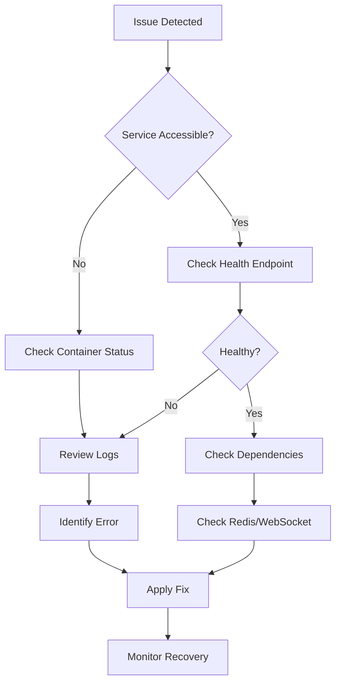

# 🔧 **Operational and Troubleshooting Guide**

## **All-Purpose Meta-Agent Factory Operations Manual**

**Version**: 1.0.0  
**Last Updated**: August 1, 2025  
**Target Audience**: DevOps Engineers, Site Reliability Engineers, System Administrators  
**Criticality**: Production Operations

---

## 📚 **Table of Contents**

1. [Operations Guide](#operations-guide)
   - [Daily Operations](#daily-operations)
   - [Monitoring Procedures](#monitoring-procedures)
   - [Log Analysis](#log-analysis)
   - [Backup and Recovery](#backup-and-recovery)
   - [Performance Management](#performance-management)
2. [Troubleshooting Guide](#troubleshooting-guide)
   - [Common Issues & Solutions](#common-issues--solutions)
   - [Diagnostic Steps](#diagnostic-steps)
   - [Emergency Procedures](#emergency-procedures)
   - [Escalation Matrix](#escalation-matrix)
3. [Command Reference](#command-reference)
   - [Essential Docker Commands](#essential-docker-commands)
   - [Node.js Diagnostics](#nodejs-diagnostics)
   - [System Health Checks](#system-health-checks)
4. [Runbook Templates](#runbook-templates)

---

## 📋 **Operations Guide**

### **Daily Operations**

#### **Morning Health Check Routine (5 minutes)**

```bash
#!/bin/bash
# morning-check.sh - Run daily at start of business

echo "🌅 Starting Daily Health Check..."

# 1. Check all services are running
echo "✓ Checking service status..."
docker compose ps --format "table {{.Service}}\t{{.State}}\t{{.Health}}"

# 2. Verify Redis cluster health
echo "✓ Checking Redis health..."
docker compose exec -T redis-master redis-cli ping
docker compose exec -T redis-master redis-cli info replication | grep role

# 3. Check WebSocket connections
echo "✓ Checking WebSocket hub..."
curl -s http://localhost:8080/health | jq .

# 4. Verify agent coordination
echo "✓ Checking agent health..."
curl -s http://localhost:3000/admin/observability/api/health | jq .

# 5. Check disk space
echo "✓ Checking disk space..."
df -h / | awk 'NR==2 {if($5+0 > 80) print "⚠️  WARNING: Disk usage at "$5; else print "✅ Disk usage: "$5}'

# 6. Check memory usage
echo "✓ Checking memory usage..."
docker stats --no-stream --format "table {{.Container}}\t{{.MemUsage}}\t{{.MemPerc}}"

echo "✅ Daily health check complete!"
```

#### **Shift Handover Checklist**

- [ ] Review overnight alerts in Grafana
- [ ] Check for any failed tasks in TaskMaster
- [ ] Verify backup completion status
- [ ] Review error logs from past 12 hours
- [ ] Check for pending system updates
- [ ] Update team on any ongoing issues

### **Monitoring Procedures**

#### **Real-Time Monitoring Dashboard**

1. **Primary Dashboard**: http://localhost:3000/admin/observability
   - Monitor agent health status
   - Watch active task processing
   - Check system resource usage

2. **Grafana Dashboards**: http://localhost:3100
   - **System Overview**: Overall health metrics
   - **Agent Performance**: Individual agent metrics
   - **Redis Cluster**: Sentinel and master status
   - **Task Processing**: Queue depth and processing rates

#### **Key Metrics to Monitor**

| Metric | Normal Range | Warning | Critical | Action |
|--------|--------------|---------|----------|--------|
| Agent Health | 100% healthy | <90% | <75% | Check failed agents |
| Task Success Rate | >95% | <90% | <80% | Review error logs |
| Response Time (p99) | <100ms | >200ms | >500ms | Scale or optimize |
| Redis Memory | <1GB | >1.5GB | >1.8GB | Increase limit/flush |
| CPU Usage | <50% | >70% | >85% | Scale horizontally |
| Queue Depth | <50 | >100 | >500 | Add workers |

#### **Alert Response Procedures**

```yaml
# Alert: High Memory Usage
When: Memory usage > 80% for 5 minutes
Actions:
  1. Check for memory leaks: docker stats
  2. Capture heap dump if Node.js service
  3. Restart affected service if critical
  4. Scale horizontally if persistent

# Alert: Agent Down
When: Agent health check fails for 2 minutes
Actions:
  1. Check container status: docker ps
  2. Review logs: docker logs [agent]
  3. Restart agent: docker compose restart [agent]
  4. Check dependencies (Redis, WebSocket)

# Alert: Task Processing Stalled
When: No tasks processed for 10 minutes
Actions:
  1. Check orchestrator leader status
  2. Verify Redis connectivity
  3. Review task queue: task-master list
  4. Restart orchestrator if needed
```

### **Log Analysis**

#### **Centralized Log Access**

```bash
# View all logs
docker compose logs -f

# View specific service logs
docker compose logs -f infrastructure-orchestrator

# View logs with timestamp
docker compose logs -f --timestamps

# Filter error logs
docker compose logs | grep -E "ERROR|FATAL|CRITICAL"

# Get logs from specific time range
docker compose logs --since "2025-08-01T10:00:00" --until "2025-08-01T11:00:00"
```

#### **Log Correlation with Request IDs**

```bash
# Find all logs for a specific request
REQUEST_ID="req_abc123"
docker compose logs | grep $REQUEST_ID

# Trace request across services
for service in $(docker compose ps --services); do
  echo "=== $service ==="
  docker compose logs $service | grep $REQUEST_ID
done
```

#### **Common Log Patterns**

```javascript
// Successful task completion
INFO: Task completed successfully {taskId: "123", duration: "2.5s", agent: "backend"}

// Connection error
ERROR: Redis connection failed {error: "ECONNREFUSED", attempts: 3}

// Memory warning
WARN: High memory usage detected {usage: "450MB", limit: "512MB", agent: "scaffold"}

// Leader election
INFO: Leader elected {leader: "orchestrator-1", term: 5}
```

### **Backup and Recovery**

#### **Automated Backup Schedule**

```yaml
# Backup Configuration (cron format)
Daily Backups:
  Redis Data: 0 2 * * * (2 AM daily)
  Configuration: 0 3 * * * (3 AM daily)
  Generated Projects: 0 4 * * * (4 AM daily)
  
Weekly Full Backup:
  All Data: 0 2 * * 0 (2 AM Sunday)
  
Retention Policy:
  Daily: 7 days
  Weekly: 4 weeks
  Monthly: 6 months
```

#### **Backup Script**

```bash
#!/bin/bash
# backup.sh - Automated backup script

BACKUP_DIR="/backups/$(date +%Y%m%d_%H%M%S)"
mkdir -p $BACKUP_DIR

echo "🔄 Starting backup..."

# 1. Backup Redis data
echo "Backing up Redis..."
docker compose exec -T redis-master redis-cli BGSAVE
sleep 5
docker compose cp redis-master:/data/dump.rdb $BACKUP_DIR/redis-dump.rdb

# 2. Backup configuration
echo "Backing up configuration..."
cp -r ./config $BACKUP_DIR/
cp docker-compose.yml $BACKUP_DIR/
cp .env $BACKUP_DIR/.env.backup

# 3. Backup generated projects
echo "Backing up generated projects..."
tar -czf $BACKUP_DIR/generated-projects.tar.gz ./generated/

# 4. Create backup manifest
cat > $BACKUP_DIR/manifest.json << EOF
{
  "timestamp": "$(date -u +%Y-%m-%dT%H:%M:%SZ)",
  "version": "1.0.0",
  "components": ["redis", "config", "generated"],
  "size": "$(du -sh $BACKUP_DIR | cut -f1)"
}
EOF

echo "✅ Backup completed: $BACKUP_DIR"
```

#### **Recovery Procedures**

```bash
#!/bin/bash
# restore.sh - Restore from backup

BACKUP_PATH=$1
if [ -z "$BACKUP_PATH" ]; then
  echo "Usage: ./restore.sh /path/to/backup"
  exit 1
fi

echo "⚠️  WARNING: This will restore from $BACKUP_PATH"
read -p "Continue? (y/n) " -n 1 -r
echo
if [[ ! $REPLY =~ ^[Yy]$ ]]; then
  exit 1
fi

# 1. Stop services
echo "Stopping services..."
docker compose down

# 2. Restore Redis data
echo "Restoring Redis data..."
cp $BACKUP_PATH/redis-dump.rdb ./redis-data/dump.rdb

# 3. Restore configuration
echo "Restoring configuration..."
cp -r $BACKUP_PATH/config ./
cp $BACKUP_PATH/docker-compose.yml ./
cp $BACKUP_PATH/.env.backup ./.env

# 4. Restore generated projects
echo "Restoring generated projects..."
tar -xzf $BACKUP_PATH/generated-projects.tar.gz

# 5. Start services
echo "Starting services..."
docker compose up -d

echo "✅ Restore completed!"
```

### **Performance Management**

#### **Performance Tuning Checklist**

```bash
# 1. Node.js Memory Optimization
export NODE_OPTIONS="--max-old-space-size=512 --max-semi-space-size=16"

# 2. Docker Resource Limits
docker update --memory="1g" --memory-swap="1g" --cpus="1.5" [container]

# 3. Redis Performance Tuning
docker compose exec redis-master redis-cli CONFIG SET maxmemory-policy allkeys-lru
docker compose exec redis-master redis-cli CONFIG SET tcp-keepalive 60

# 4. Network Optimization
sysctl -w net.core.somaxconn=65535
sysctl -w net.ipv4.tcp_fin_timeout=15
```

#### **Performance Monitoring Script**

```bash
#!/bin/bash
# perf-monitor.sh - Real-time performance monitoring

while true; do
  clear
  echo "📊 Performance Monitor - $(date)"
  echo "================================"
  
  # CPU and Memory
  docker stats --no-stream --format "table {{.Container}}\t{{.CPUPerc}}\t{{.MemUsage}}"
  
  # Redis Performance
  echo -e "\n📈 Redis Metrics:"
  docker compose exec -T redis-master redis-cli INFO stats | grep -E "instantaneous_ops_per_sec|used_memory_human"
  
  # Task Processing Rate
  echo -e "\n⚡ Task Processing:"
  curl -s http://localhost:3001/api/metrics | grep task_processing_rate
  
  sleep 5
done
```

---

## 🚨 **Troubleshooting Guide**

### **Common Issues & Solutions**

#### **Issue: Agent Shows as "Critical" on Dashboard**

**Symptoms**: Red status indicator, no heartbeat
**Root Causes**: Container crashed, network issue, resource exhaustion

**Solution**:
```bash
# 1. Check container status
docker ps -a | grep [agent-name]

# 2. If exited, check logs
docker logs [agent-name] --tail 100

# 3. Check resource usage
docker stats --no-stream [agent-name]

# 4. Restart agent
docker compose restart [agent-name]

# 5. If persistent, check dependencies
docker compose exec [agent-name] curl http://redis-master:6379
docker compose exec [agent-name] curl http://websocket-hub:8080/health
```

#### **Issue: Redis Connection Failures**

**Symptoms**: `ECONNREFUSED`, `Redis connection timeout`
**Root Causes**: Redis down, Sentinel failover, network issue

**Solution**:
```bash
# 1. Check Redis status
docker compose ps | grep redis

# 2. Test Redis connectivity
docker compose exec redis-master redis-cli ping

# 3. Check Sentinel status
for i in 1 2 3; do
  echo "Sentinel $i:"
  docker compose exec redis-sentinel-$i redis-cli -p 26379 sentinel masters
done

# 4. Force failover if needed
docker compose exec redis-sentinel-1 redis-cli -p 26379 sentinel failover mymaster

# 5. Restart Redis cluster
docker compose restart redis-master redis-sentinel-1 redis-sentinel-2 redis-sentinel-3
```

#### **Issue: Memory Leak in Node.js Agent**

**Symptoms**: Gradual memory increase, eventual OOM kill
**Root Causes**: Event listener leak, unclosed connections, large objects

**Solution**:
```bash
# 1. Identify affected agent
docker stats --format "table {{.Container}}\t{{.MemUsage}}\t{{.MemPerc}}"

# 2. Capture heap snapshot
AGENT="infrastructure-orchestrator"
docker compose exec $AGENT kill -USR2 1
docker compose cp $AGENT:/app/heap-*.heapsnapshot ./

# 3. Enable memory profiling
docker compose exec $AGENT node --inspect=0.0.0.0:9229 dist/index.js

# 4. Analyze with Chrome DevTools
# Open chrome://inspect and load heap snapshot

# 5. Temporary mitigation
docker update --memory="1g" $AGENT
docker compose restart $AGENT
```

#### **Issue: Task Processing Stalled**

**Symptoms**: Tasks remain in pending state, no progress
**Root Causes**: Leader election failure, queue corruption, deadlock

**Solution**:
```bash
# 1. Check orchestrator leader
curl http://localhost:3001/api/leader

# 2. View task queue status
task-master list --status=pending

# 3. Check for deadlocks
docker compose logs infrastructure-orchestrator | grep -i "deadlock\|timeout"

# 4. Clear stalled tasks (use with caution)
docker compose exec redis-master redis-cli DEL task:queue:pending

# 5. Restart orchestration layer
docker compose restart infrastructure-orchestrator parameter-flow-agent
```

### **Diagnostic Steps**

#### **Standard Diagnostic Workflow**



#### **Comprehensive System Diagnostic**

```bash
#!/bin/bash
# diagnose-system.sh - Full system diagnostic

echo "🔍 Running comprehensive system diagnostic..."

# 1. Container Health
echo -e "\n📦 Container Status:"
docker compose ps --format json | jq -r '.[] | "\(.Service): \(.State) - \(.Health)"'

# 2. Network Connectivity
echo -e "\n🌐 Network Tests:"
for service in redis-master websocket-hub; do
  docker compose exec -T infrastructure-orchestrator ping -c 1 $service > /dev/null 2>&1 && \
    echo "✅ $service: reachable" || echo "❌ $service: unreachable"
done

# 3. Service Endpoints
echo -e "\n🔗 Service Health Checks:"
services=("3000:Web UI" "3001:Orchestrator" "8080:WebSocket" "9090:Prometheus")
for service in "${services[@]}"; do
  IFS=':' read -r port name <<< "$service"
  curl -s -o /dev/null -w "%-20s: %{http_code}\n" "$name" http://localhost:$port/health
done

# 4. Resource Usage
echo -e "\n💾 Resource Usage:"
docker system df
echo
docker stats --no-stream --format "table {{.Container}}\t{{.CPUPerc}}\t{{.MemUsage}}"

# 5. Recent Errors
echo -e "\n❌ Recent Errors (last 50 lines):"
docker compose logs --tail 50 | grep -E "ERROR|FATAL|CRITICAL" | tail -10

# 6. Task Queue Status
echo -e "\n📋 Task Queue:"
task-master list --limit 5

echo -e "\n✅ Diagnostic complete!"
```

### **Emergency Procedures**

#### **Complete System Restart**

```bash
#!/bin/bash
# emergency-restart.sh - Use only when necessary

echo "🚨 EMERGENCY SYSTEM RESTART"
echo "This will cause temporary downtime!"
read -p "Continue? (yes/no) " response
[ "$response" != "yes" ] && exit 1

# 1. Graceful shutdown
echo "Stopping services gracefully..."
docker compose stop

# 2. Clear potential locks
echo "Clearing Redis locks..."
docker compose run --rm redis-master redis-cli FLUSHDB

# 3. Clean up
echo "Cleaning up..."
docker system prune -f

# 4. Start services
echo "Starting services..."
docker compose up -d

# 5. Wait for health
echo "Waiting for system health..."
sleep 30

# 6. Verify
./morning-check.sh
```

#### **Data Corruption Recovery**

```bash
# Redis data corruption
docker compose exec redis-master redis-cli CONFIG SET stop-writes-on-bgsave-error no
docker compose exec redis-master redis-cli BGREWRITEAOF

# Task queue corruption
docker compose exec redis-master redis-cli --scan --pattern "task:*" | \
  xargs docker compose exec redis-master redis-cli DEL

# Restart fresh
docker compose restart
```

### **Escalation Matrix**

| Severity | Criteria | Response Time | Primary | Escalation | Actions |
|----------|----------|---------------|---------|------------|---------|
| **P4** Low | Non-critical bug, cosmetic issue | 24 hours | On-call Dev | Team Lead | Log ticket, fix in next sprint |
| **P3** Medium | Degraded performance, partial feature loss | 4 hours | On-call SRE | Dev Lead | Investigate, mitigate, schedule fix |
| **P2** High | Service unavailable, data integrity risk | 1 hour | On-call SRE | Engineering Manager | Immediate response, status page update |
| **P1** Critical | Complete outage, data loss | 15 minutes | On-call SRE + Dev | VP Engineering | War room, all hands, executive comms |

#### **Escalation Contacts**

```yaml
On-Call Rotation:
  Primary: +1-XXX-XXX-XXXX (PagerDuty)
  Secondary: +1-XXX-XXX-XXXX
  
Team Contacts:
  SRE Lead: sre-lead@company.com
  Dev Lead: dev-lead@company.com
  Engineering Manager: eng-manager@company.com
  VP Engineering: vp-eng@company.com
  
External Support:
  Redis Support: support@redis.com (Contract #12345)
  Cloud Provider: support@cloud.com (Account #67890)
```

---

## 💻 **Command Reference**

### **Essential Docker Commands**

```bash
# Container Management
docker compose up -d                          # Start all services
docker compose down                           # Stop all services
docker compose restart [service]              # Restart specific service
docker compose ps                             # List all services
docker compose logs -f [service]              # Follow logs

# Resource Management
docker stats                                  # Real-time resource usage
docker system df                              # Disk usage
docker system prune -a                        # Clean up unused resources
docker update --memory="1g" [container]       # Update memory limit

# Debugging
docker compose exec [service] bash            # Shell into container
docker inspect [container]                    # Full container details
docker compose config                         # Validate compose file
docker events                                 # Real-time Docker events
```

### **Node.js Diagnostics**

```bash
# Memory Diagnostics
# Enable heap snapshots
docker compose exec [agent] kill -USR2 1

# CPU Profiling
docker run -d -p 9229:9229 \
  -e NODE_OPTIONS="--inspect=0.0.0.0:9229" \
  [agent-image]

# Debug Mode
docker compose exec [agent] \
  node --inspect-brk=0.0.0.0:9229 dist/index.js

# PM2 Commands (if using PM2)
docker compose exec [agent] pm2 list
docker compose exec [agent] pm2 monit
docker compose exec [agent] pm2 logs
docker compose exec [agent] pm2 restart all
```

### **System Health Checks**

```bash
# Quick Health Check
curl -s http://localhost:3000/admin/observability/api/health | jq .

# Individual Agent Health
for port in {3001..3016}; do
  echo -n "Port $port: "
  curl -s -o /dev/null -w "%{http_code}\n" http://localhost:$port/health
done

# Redis Health
docker compose exec redis-master redis-cli \
  --no-auth-warning INFO server | grep uptime

# WebSocket Connections
curl -s http://localhost:8080/health | jq '.connections'

# Task Queue Depth
docker compose exec redis-master redis-cli LLEN task:queue:pending
```

---

## 📄 **Runbook Templates**

### **Service Restart Runbook**

```markdown
## Runbook: Service Restart Procedure

**Service**: [Service Name]
**Last Updated**: [Date]
**Estimated Duration**: 5 minutes

### Prerequisites
- [ ] Notify team in #ops channel
- [ ] Check for ongoing deployments
- [ ] Verify backup is recent

### Steps
1. **Graceful Shutdown**
   ```bash
   docker compose stop [service]
   ```

2. **Clear Cache/Locks**
   ```bash
   docker compose exec redis-master redis-cli DEL [service]:locks:*
   ```

3. **Start Service**
   ```bash
   docker compose up -d [service]
   ```

4. **Verify Health**
   ```bash
   curl http://localhost:[port]/health
   ```

### Rollback
If service fails to start:
1. Check logs: `docker compose logs [service]`
2. Revert to previous version: `docker compose up -d [service]:previous`

### Post-Restart
- [ ] Monitor metrics for 15 minutes
- [ ] Update status page
- [ ] Document any issues
```

### **Incident Response Template**

```markdown
## Incident Report

**Incident ID**: INC-2025-001
**Date**: August 1, 2025
**Severity**: P2
**Duration**: 45 minutes

### Timeline
- **10:15** - Alert triggered: High memory usage
- **10:20** - On-call engineer acknowledged
- **10:25** - Root cause identified: Memory leak in scaffold agent
- **10:30** - Mitigation applied: Service restart
- **11:00** - Service stable, monitoring

### Root Cause
Memory leak due to unclosed file handles in template processing

### Resolution
1. Restarted affected service
2. Increased memory limit temporarily
3. Deployed hotfix to close file handles

### Action Items
- [ ] Add memory leak detection to CI/CD
- [ ] Implement resource cleanup middleware
- [ ] Update monitoring thresholds

### Lessons Learned
- Need better resource monitoring in development
- File handle management needs audit
```

---

## 🔍 **Quick Reference Card**

```bash
# 🚀 Most Used Commands - Print and Keep Handy!

# Check system health
curl -s http://localhost:3000/admin/observability/api/health | jq .

# View all logs
docker compose logs -f

# Restart a service
docker compose restart [service-name]

# Check memory usage
docker stats --no-stream

# View task queue
task-master list

# Emergency restart
docker compose down && docker compose up -d

# Find logs by request ID
docker compose logs | grep "req_xxxxx"

# Export heap dump
docker compose exec [agent] kill -USR2 1

# Check Redis
docker compose exec redis-master redis-cli ping

# Force garbage collection
docker compose exec [agent] node -e "global.gc()"
```

---

**This operational and troubleshooting guide provides comprehensive procedures for maintaining the All-Purpose Meta-Agent Factory in production. Keep this guide updated with new issues and solutions as they are discovered.**