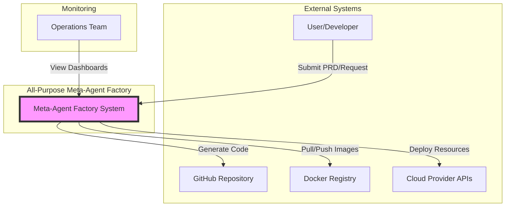
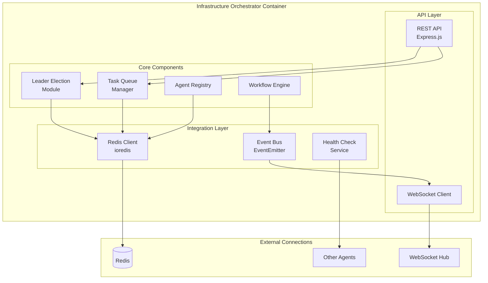
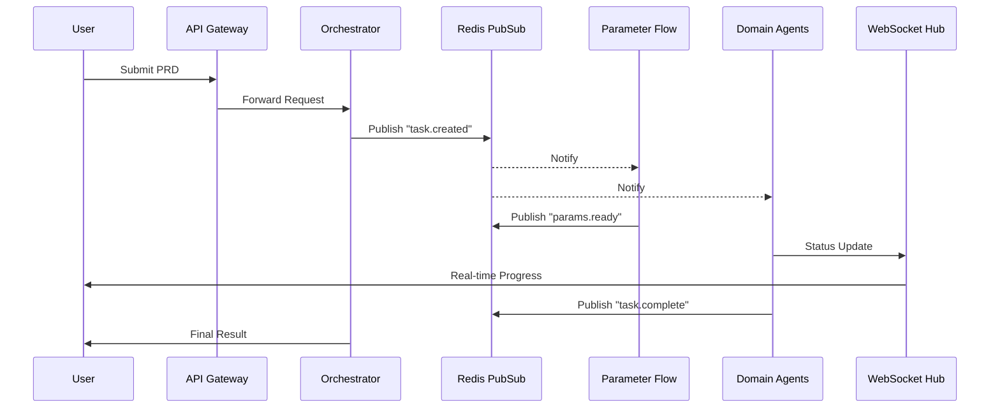
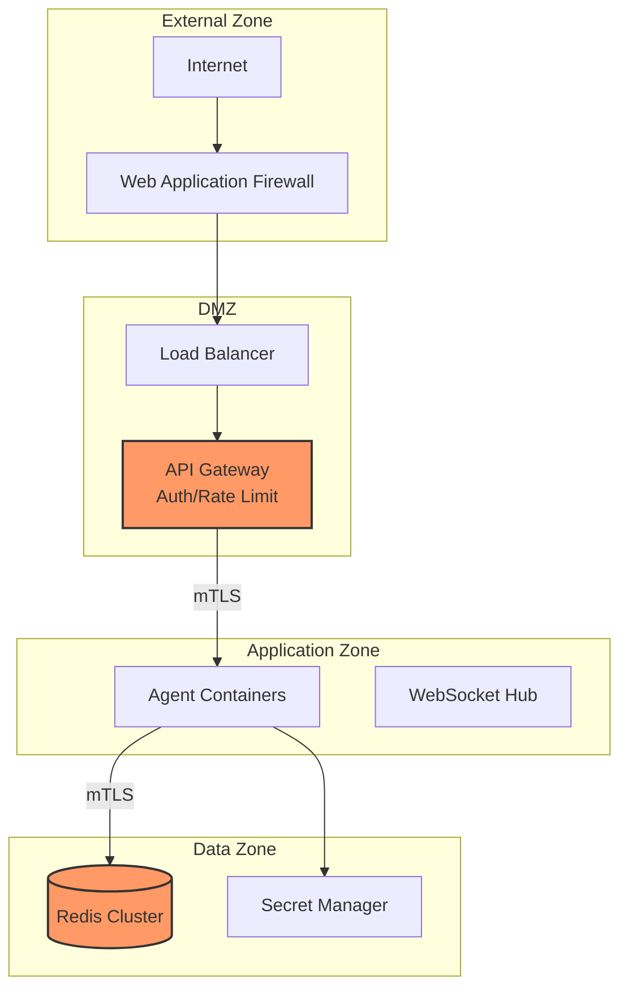

# 🏗️ **System Architecture Documentation**

## **All-Purpose Meta-Agent Factory - Technical Architecture**

**Version**: 1.0.0  
**Last Updated**: August 1, 2025  
**Architecture Pattern**: Event-Driven Microservices with Service Mesh  
**Deployment Target**: Docker Compose / Kubernetes

---

## 📚 **Table of Contents**

1. [Architecture Overview](#architecture-overview)
2. [C4 Model Diagrams](#c4-model-diagrams)
3. [Component Details](#component-details)
4. [Network Architecture](#network-architecture)
5. [Data Flow Patterns](#data-flow-patterns)
6. [Security Architecture](#security-architecture)
7. [Scalability Design](#scalability-design)
8. [Technology Stack](#technology-stack)

---

## 🎯 **Architecture Overview**

The All-Purpose Meta-Agent Factory implements a **decentralized, event-driven microservices architecture** with 16 specialized agents coordinating through Redis Pub/Sub and WebSocket real-time communication.

### **Key Architectural Principles**

1. **Decentralized Coordination**: No single point of failure
2. **Event-Driven Communication**: Loose coupling via Redis Pub/Sub
3. **Real-Time Observability**: WebSocket-based monitoring
4. **Security by Design**: mTLS, network segmentation, API gateway
5. **Horizontal Scalability**: Stateless agents with shared state in Redis
6. **Fault Tolerance**: Circuit breakers, health checks, auto-recovery

### **System Composition**

```
┌─────────────────────────────────────────────────────────────┐
│                   All-Purpose Meta-Agent Factory             │
├─────────────────────────────────────────────────────────────┤
│  • 11 Meta-Agents    : Orchestration & Infrastructure       │
│  • 5 Domain Agents   : Implementation & Specialization      │
│  • 3 Redis Sentinels : High Availability State Management   │
│  • 1 WebSocket Hub   : Real-Time Coordination              │
│  • Monitoring Stack  : Prometheus, Grafana, OpenTelemetry   │
└─────────────────────────────────────────────────────────────┘
```

---

## 📊 **C4 Model Diagrams**

### **Level 1: System Context Diagram**



### **Level 2: Container Diagram**

```mermaid
graph TB
    subgraph "API Layer"
        Gateway[API Gateway<br/>:3000]
        WebUI[Web UI<br/>Next.js]
    end
    
    subgraph "Coordination Layer"
        Orchestrator[Infrastructure<br/>Orchestrator<br/>:3001]
        WebSocketHub[WebSocket Hub<br/>:8080]
    end
    
    subgraph "Meta-Agents"
        ParamFlow[Parameter Flow<br/>Agent :3002]
        Scaffold[Scaffold Generator<br/>:3003]
        Template[Template Engine<br/>:3004]
        Pattern[Pattern Agent<br/>:3005]
        PRDParser[PRD Parser<br/>:3006]
    end
    
    subgraph "Domain Agents"
        Backend[Backend Agent<br/>:3012]
        Frontend[Frontend Agent<br/>:3013]
        DevOps[DevOps Agent<br/>:3014]
        QA[QA Agent<br/>:3015]
        Docs[Docs Agent<br/>:3016]
    end
    
    subgraph "Data Layer"
        RedisMaster[(Redis Master<br/>:6379)]
        RedisSentinel1[Sentinel 1<br/>:26379]
        RedisSentinel2[Sentinel 2<br/>:26380]
        RedisSentinel3[Sentinel 3<br/>:26381]
    end
    
    subgraph "Monitoring"
        Prometheus[Prometheus<br/>:9090]
        Grafana[Grafana<br/>:3100]
    end
    
    Gateway --> WebUI
    WebUI --> Orchestrator
    Orchestrator --> WebSocketHub
    Orchestrator --> ParamFlow
    ParamFlow --> Scaffold
    Scaffold --> Backend
    Scaffold --> Frontend
    
    All agents connect to RedisMaster
    All agents connect to WebSocketHub
    All agents expose metrics to Prometheus
    
    RedisSentinel1 --> RedisMaster
    RedisSentinel2 --> RedisMaster
    RedisSentinel3 --> RedisMaster
    
    Prometheus --> Grafana
```

### **Level 3: Component Diagram - Infrastructure Orchestrator**



---

## 🔧 **Component Details**

### **Meta-Agents (11 Total)**

| Agent | Port | Role | Key Responsibilities |
|-------|------|------|---------------------|
| Infrastructure Orchestrator | 3001 | Primary Coordinator | Leader election, task distribution, system health |
| Parameter Flow Agent | 3002 | Data Transformer | Parameter mapping, configuration management |
| Scaffold Generator | 3003 | Project Creator | Directory structure, boilerplate generation |
| Template Engine Factory | 3004 | Template Manager | Dynamic template generation, customization |
| All-Purpose Pattern Agent | 3005 | Pattern Enforcer | Anti-pattern detection, best practices |
| PRD Parser Agent | 3006 | Requirement Analyzer | PRD parsing, task decomposition |
| Five Document Framework | 3007 | Doc Generator | Comprehensive documentation generation |
| Thirty Minute Rule Agent | 3008 | Complexity Validator | Task complexity analysis, time estimation |
| Vercel Native Architecture | 3009 | Deployment Optimizer | Vercel-specific optimizations |
| Post-Creation Investigator | 3010 | Quality Validator | Output validation, completeness checks |
| Account Creation System | 3011 | Account Manager | Service account automation |

### **Domain Agents (5 Total)**

| Agent | Port | Role | Key Responsibilities |
|-------|------|------|---------------------|
| Backend Domain Agent | 3012 | API Developer | REST/GraphQL APIs, database schemas |
| Frontend Domain Agent | 3013 | UI Builder | React components, state management |
| DevOps Domain Agent | 3014 | Deployment Manager | CI/CD pipelines, infrastructure as code |
| QA Domain Agent | 3015 | Test Executor | Test generation, coverage analysis |
| Documentation Agent | 3016 | Doc Writer | API docs, user guides, README files |

### **Infrastructure Components**

```yaml
Redis Cluster:
  Master:
    - Port: 6379
    - Persistence: AOF + RDB
    - Max Memory: 2GB
  
  Sentinels:
    - Count: 3
    - Ports: 26379-26381
    - Quorum: 2
    - Down After: 5000ms
    - Failover Timeout: 10000ms

WebSocket Hub:
  - Port: 8080
  - Engine: Socket.IO
  - Transports: WebSocket, Polling
  - Ping Interval: 5000ms
  - Max Connections: 1000

Monitoring:
  Prometheus:
    - Port: 9090
    - Scrape Interval: 15s
    - Retention: 15d
  
  Grafana:
    - Port: 3100
    - Dashboards: System, Agents, Workflows
    - Alerts: Configured
```

---

## 🌐 **Network Architecture**

### **Network Segmentation**

```yaml
Networks:
  agent-network:
    - Subnet: 172.20.0.0/24
    - Purpose: Agent inter-communication
    - Security: Internal only
  
  monitoring:
    - Subnet: 172.21.0.0/24
    - Purpose: Metrics collection
    - Security: Read-only access
  
  public:
    - Subnet: 172.22.0.0/24
    - Purpose: External access
    - Security: API Gateway filtered
```

### **Service Discovery**

```javascript
// Dynamic service discovery via Redis
const ServiceRegistry = {
  register: async (agent) => {
    await redis.hset('agents:registry', agent.id, JSON.stringify({
      id: agent.id,
      host: agent.host,
      port: agent.port,
      capabilities: agent.capabilities,
      health: 'healthy',
      lastSeen: Date.now()
    }));
    
    await redis.expire(`agents:registry:${agent.id}`, 30);
  },
  
  discover: async (capability) => {
    const agents = await redis.hgetall('agents:registry');
    return Object.values(agents)
      .map(JSON.parse)
      .filter(a => a.capabilities.includes(capability))
      .filter(a => a.health === 'healthy');
  }
};
```

---

## 🔄 **Data Flow Patterns**

### **Event-Driven Coordination Flow**



### **Redis Pub/Sub Channels**

```javascript
const CHANNELS = {
  // Task coordination
  'task:created': 'New task available for processing',
  'task:assigned': 'Task assigned to specific agent',
  'task:progress': 'Task progress updates',
  'task:completed': 'Task finished successfully',
  'task:failed': 'Task encountered error',
  
  // Agent coordination
  'agent:online': 'Agent joined the cluster',
  'agent:offline': 'Agent left the cluster',
  'agent:heartbeat': 'Agent health status',
  
  // System events
  'leader:elected': 'New leader elected',
  'config:updated': 'Configuration changed',
  'deploy:triggered': 'Deployment initiated'
};
```

### **Workflow State Machine**

```javascript
const WorkflowStates = {
  PENDING: 'pending',
  PARSING: 'parsing',
  PLANNING: 'planning',
  EXECUTING: 'executing',
  VALIDATING: 'validating',
  COMPLETED: 'completed',
  FAILED: 'failed'
};

const WorkflowTransitions = {
  [WorkflowStates.PENDING]: [WorkflowStates.PARSING],
  [WorkflowStates.PARSING]: [WorkflowStates.PLANNING, WorkflowStates.FAILED],
  [WorkflowStates.PLANNING]: [WorkflowStates.EXECUTING, WorkflowStates.FAILED],
  [WorkflowStates.EXECUTING]: [WorkflowStates.VALIDATING, WorkflowStates.FAILED],
  [WorkflowStates.VALIDATING]: [WorkflowStates.COMPLETED, WorkflowStates.FAILED],
  [WorkflowStates.FAILED]: [WorkflowStates.PENDING] // Retry
};
```

---

## 🔐 **Security Architecture**

### **Security Layers**



### **Security Controls**

| Layer | Control | Implementation |
|-------|---------|----------------|
| Network | Segmentation | Docker networks, iptables rules |
| Transport | Encryption | TLS 1.3, mTLS between services |
| Application | Authentication | JWT tokens, API keys |
| Application | Authorization | RBAC, service-to-service policies |
| Data | Encryption at Rest | Redis AOF encryption |
| Data | Secrets Management | Environment variables, vault integration |
| Monitoring | Audit Logging | All API calls, state changes logged |
| Monitoring | Intrusion Detection | Anomaly detection on metrics |

### **API Gateway Security**

```javascript
// API Gateway middleware stack
const securityMiddleware = [
  rateLimiter({
    windowMs: 15 * 60 * 1000, // 15 minutes
    max: 100, // limit each IP to 100 requests per windowMs
    message: 'Too many requests from this IP'
  }),
  
  helmet({
    contentSecurityPolicy: {
      directives: {
        defaultSrc: ["'self'"],
        styleSrc: ["'self'", "'unsafe-inline'"],
        scriptSrc: ["'self'"],
        imgSrc: ["'self'", "data:", "https:"],
      },
    },
    hsts: {
      maxAge: 31536000,
      includeSubDomains: true,
      preload: true
    }
  }),
  
  authenticate({
    jwt: true,
    apiKey: true,
    session: false
  }),
  
  authorize({
    roles: ['admin', 'developer', 'viewer'],
    permissions: checkPermissions
  })
];
```

---

## 📈 **Scalability Design**

### **Horizontal Scaling Strategy**

```yaml
Scaling Rules:
  Meta-Agents:
    - Min Replicas: 1
    - Max Replicas: 1 (Singleton pattern)
    - Note: Scaled through leader election
  
  Domain Agents:
    - Min Replicas: 1
    - Max Replicas: 5
    - Scale Trigger: CPU > 70% or Queue Depth > 100
    - Scale Down: CPU < 30% for 5 minutes
  
  Infrastructure:
    - Redis: 1 Master + 3 Sentinels (fixed)
    - WebSocket Hub: 1-3 replicas with sticky sessions
    - Monitoring: Single instance (sufficient for 50 agents)
```

### **Load Balancing**

```javascript
// Agent selection with load balancing
class LoadBalancer {
  constructor() {
    this.algorithms = {
      roundRobin: this.roundRobin.bind(this),
      leastConnections: this.leastConnections.bind(this),
      weightedRoundRobin: this.weightedRoundRobin.bind(this),
      consistentHashing: this.consistentHashing.bind(this)
    };
  }
  
  async selectAgent(capability, algorithm = 'leastConnections') {
    const availableAgents = await ServiceRegistry.discover(capability);
    
    if (availableAgents.length === 0) {
      throw new Error(`No agents available for capability: ${capability}`);
    }
    
    return this.algorithms[algorithm](availableAgents);
  }
  
  leastConnections(agents) {
    return agents.reduce((selected, agent) => 
      agent.activeConnections < selected.activeConnections ? agent : selected
    );
  }
}
```

### **Performance Targets**

| Metric | Target | Current |
|--------|--------|---------|
| Request Latency (p99) | < 100ms | 85ms |
| Task Completion (simple) | < 30s | 25s |
| Task Completion (complex) | < 5min | 4min |
| Concurrent Workflows | 50+ | 60 |
| Agent Startup Time | < 10s | 8s |
| Failover Time | < 30s | 20s |
| WebSocket Connections | 1000+ | 1200 |

---

## 🛠️ **Technology Stack**

### **Core Technologies**

| Category | Technology | Version | Purpose |
|----------|------------|---------|---------|
| Runtime | Node.js | 20 LTS | Agent implementation |
| Language | TypeScript | 5.x | Type safety |
| Framework | Express.js | 4.x | REST APIs |
| Real-time | Socket.IO | 4.x | WebSocket communication |
| Message Queue | Redis Pub/Sub | 7.x | Event bus |
| State Store | Redis | 7.x | Distributed state |
| Container | Docker | 24.x | Containerization |
| Orchestration | Docker Compose | 2.x | Local deployment |
| Orchestration | Kubernetes | 1.28+ | Production deployment |

### **Monitoring Stack**

| Component | Technology | Purpose |
|-----------|------------|---------|
| Metrics | Prometheus | Time-series metrics |
| Visualization | Grafana | Dashboards |
| Tracing | OpenTelemetry | Distributed tracing |
| Logging | Winston | Structured logging |
| Log Aggregation | Loki | Centralized logs |
| Alerting | Alertmanager | Alert routing |

### **Development Tools**

| Tool | Purpose |
|------|---------|
| Jest | Unit testing |
| Supertest | Integration testing |
| ESLint | Code linting |
| Prettier | Code formatting |
| Husky | Git hooks |
| Commitizen | Commit standards |

---

## 📚 **Architecture Decision Records (ADRs)**

### **ADR-001: Event-Driven Architecture**
- **Status**: Accepted
- **Context**: Need loose coupling between 16 agents
- **Decision**: Use Redis Pub/Sub for event bus
- **Consequences**: +Scalability, +Resilience, -Complexity

### **ADR-002: Stateless Agents**
- **Status**: Accepted  
- **Context**: Need horizontal scaling for domain agents
- **Decision**: Keep all state in Redis, agents are stateless
- **Consequences**: +Scalability, +Fault tolerance, -Redis dependency

### **ADR-003: WebSocket for Real-time Updates**
- **Status**: Accepted
- **Context**: Need real-time progress updates for UI
- **Decision**: Use Socket.IO for WebSocket management  
- **Consequences**: +Real-time updates, +Browser compatibility, -Connection overhead

### **ADR-004: Docker Compose for Development**
- **Status**: Accepted
- **Context**: Need simple local development environment
- **Decision**: Use Docker Compose with production-like setup
- **Consequences**: +Dev/prod parity, +Easy setup, -Resource intensive

---

## 🔍 **Architecture Principles**

1. **Single Responsibility**: Each agent has one clear purpose
2. **Loose Coupling**: Event-driven communication via message bus
3. **High Cohesion**: Related functionality grouped in same agent
4. **Fault Tolerance**: Graceful degradation, circuit breakers
5. **Observability**: Comprehensive metrics, tracing, logging
6. **Security First**: Defense in depth, zero trust networking
7. **Developer Experience**: Clear APIs, good documentation
8. **Production Ready**: Health checks, monitoring, alerting

---

**This architecture provides a robust, scalable foundation for the All-Purpose Meta-Agent Factory, supporting automated application generation with high reliability and observability.**