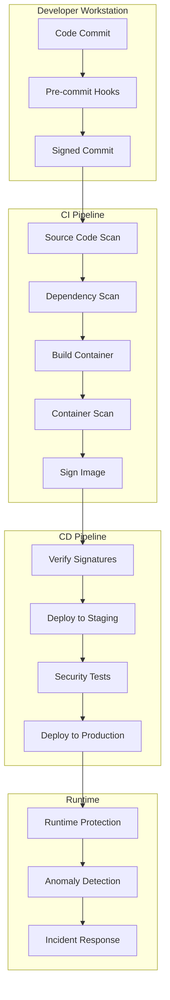

# 🔐 **Automated Deployment Validation and Security Integration**

## **Best Practices for CI/CD Pipeline Security 2024-2025**

**Version**: 1.0.0  
**Last Updated**: August 1, 2025  
**Focus**: Node.js/TypeScript Microservices Security Automation  
**Scope**: Deployment Validation, Container Security, Supply Chain Protection

---

## 📋 **Table of Contents**

1. [Executive Summary](#executive-summary)
2. [Automated Deployment Validation](#automated-deployment-validation)
3. [Security Integration Architecture](#security-integration-architecture)
4. [Container Image Security](#container-image-security)
5. [Supply Chain Security](#supply-chain-security)
6. [Implementation Examples](#implementation-examples)
7. [Tool Configuration Reference](#tool-configuration-reference)
8. [Security Automation Playbooks](#security-automation-playbooks)

---

## 🎯 **Executive Summary**

Modern deployment validation requires comprehensive security integration at every pipeline stage. Based on 2024-2025 best practices:

**Key Requirements**:
- **100% Automated Security Scanning**: No manual security checks
- **Shift-Left Security**: Catch vulnerabilities before deployment
- **Supply Chain Protection**: SLSA Level 3+ compliance
- **Zero Trust Deployment**: Verify everything, trust nothing

**Critical Success Factors**:
- Automated smoke/sanity tests post-deployment
- Container scanning with automatic remediation
- Cryptographic signing of all artifacts
- Real-time anomaly detection

---

## ✅ **Automated Deployment Validation**

### **1. Smoke Testing Framework**

**Definition**: Lightweight tests verifying critical service functionality immediately after deployment.

#### **Implementation Strategy**

```yaml
# smoke-test-config.yaml
smoke_tests:
  critical:
    - name: "Service Health"
      endpoint: "/health"
      expected_status: 200
      timeout: 5s
      retries: 3
    
    - name: "Database Connectivity"
      endpoint: "/api/v1/status/db"
      expected_status: 200
      timeout: 10s
      
    - name: "Authentication Service"
      endpoint: "/auth/ping"
      expected_status: 200
      headers:
        X-API-Key: "${SMOKE_TEST_API_KEY}"
  
  performance:
    - name: "Response Time Check"
      endpoint: "/api/v1/test"
      max_latency: 100ms
      percentile: p99
```

#### **Automated Smoke Test Script**

```bash
#!/bin/bash
# smoke-tests.sh - Run immediately after deployment

set -euo pipefail

# Configuration
SERVICE_URL="${SERVICE_URL:-http://localhost:3000}"
TIMEOUT="${SMOKE_TEST_TIMEOUT:-30}"
RETRY_COUNT="${SMOKE_TEST_RETRIES:-3}"

# Color codes for output
GREEN='\033[0;32m'
RED='\033[0;31m'
YELLOW='\033[1;33m'
NC='\033[0m'

# Test results tracking
TESTS_PASSED=0
TESTS_FAILED=0

# Function to run a single test with retries
run_test() {
    local test_name="$1"
    local endpoint="$2"
    local expected_status="$3"
    local retry_count="${4:-3}"
    
    echo -n "Testing ${test_name}... "
    
    for i in $(seq 1 $retry_count); do
        response=$(curl -s -o /dev/null -w "%{http_code}" \
                   --connect-timeout 5 \
                   --max-time 10 \
                   "${SERVICE_URL}${endpoint}" || echo "000")
        
        if [ "$response" = "$expected_status" ]; then
            echo -e "${GREEN}✓ PASSED${NC} (${response})"
            ((TESTS_PASSED++))
            return 0
        fi
        
        if [ $i -lt $retry_count ]; then
            sleep 2
        fi
    done
    
    echo -e "${RED}✗ FAILED${NC} (Expected: ${expected_status}, Got: ${response})"
    ((TESTS_FAILED++))
    return 1
}

# Critical smoke tests
echo "=== Running Smoke Tests ==="
echo "Target: ${SERVICE_URL}"
echo ""

# Health check
run_test "Health Check" "/health" "200"

# API endpoints
run_test "API Status" "/api/v1/status" "200"
run_test "Auth Service" "/auth/ping" "200"

# Database connectivity
run_test "Database Connection" "/api/v1/status/db" "200"

# Cache connectivity
run_test "Redis Connection" "/api/v1/status/cache" "200"

# Summary
echo ""
echo "=== Test Summary ==="
echo -e "Passed: ${GREEN}${TESTS_PASSED}${NC}"
echo -e "Failed: ${RED}${TESTS_FAILED}${NC}"

# Exit with appropriate code
if [ $TESTS_FAILED -gt 0 ]; then
    echo -e "${RED}Smoke tests failed! Deployment may be unhealthy.${NC}"
    exit 1
else
    echo -e "${GREEN}All smoke tests passed! Deployment is healthy.${NC}"
    exit 0
fi
```

### **2. Sanity Testing Framework**

**Definition**: More comprehensive tests validating business logic and integration points.

#### **Sanity Test Implementation**

```typescript
// sanity-tests.ts - Comprehensive post-deployment validation
import axios from 'axios';
import { expect } from 'chai';

interface SanityTestConfig {
  baseUrl: string;
  apiKey: string;
  timeout: number;
}

class SanityTestRunner {
  constructor(private config: SanityTestConfig) {}

  async runAllTests(): Promise<TestResults> {
    const results = new TestResults();
    
    // Test categories
    await this.testCoreAPIs(results);
    await this.testAuthentication(results);
    await this.testDataIntegrity(results);
    await this.testBusinessLogic(results);
    await this.testIntegrations(results);
    
    return results;
  }

  private async testCoreAPIs(results: TestResults) {
    const tests = [
      { name: 'User CRUD', fn: () => this.testUserCRUD() },
      { name: 'Product API', fn: () => this.testProductAPI() },
      { name: 'Order Processing', fn: () => this.testOrderFlow() },
    ];

    for (const test of tests) {
      try {
        await test.fn();
        results.addPass(test.name);
      } catch (error) {
        results.addFail(test.name, error.message);
      }
    }
  }

  private async testUserCRUD() {
    // Create user
    const createResponse = await axios.post(
      `${this.config.baseUrl}/api/v1/users`,
      { email: 'test@sanity.com', name: 'Sanity Test' },
      { headers: { 'X-API-Key': this.config.apiKey } }
    );
    expect(createResponse.status).to.equal(201);
    
    const userId = createResponse.data.id;
    
    // Read user
    const readResponse = await axios.get(
      `${this.config.baseUrl}/api/v1/users/${userId}`,
      { headers: { 'X-API-Key': this.config.apiKey } }
    );
    expect(readResponse.data.email).to.equal('test@sanity.com');
    
    // Update user
    const updateResponse = await axios.patch(
      `${this.config.baseUrl}/api/v1/users/${userId}`,
      { name: 'Updated Name' },
      { headers: { 'X-API-Key': this.config.apiKey } }
    );
    expect(updateResponse.status).to.equal(200);
    
    // Delete user
    const deleteResponse = await axios.delete(
      `${this.config.baseUrl}/api/v1/users/${userId}`,
      { headers: { 'X-API-Key': this.config.apiKey } }
    );
    expect(deleteResponse.status).to.equal(204);
  }
}
```

### **3. Deployment Validation Gates**

#### **Validation Gate Configuration**

```yaml
# deployment-gates.yaml
validation_gates:
  pre_production:
    - name: "Security Scan Gate"
      type: blocking
      checks:
        - vulnerability_scan:
            critical: 0
            high: 0
            medium: 5
        - dependency_check:
            outdated_days: 30
        - license_compliance:
            allowed: ["MIT", "Apache-2.0", "BSD"]
    
    - name: "Performance Gate"
      type: blocking
      checks:
        - load_test:
            p95_latency: 200ms
            error_rate: 0.1%
            requests_per_second: 1000
    
    - name: "Integration Gate"
      type: warning
      checks:
        - external_api_health:
            required_services: ["payment", "notification", "analytics"]
  
  post_deployment:
    - name: "Health Verification"
      type: blocking
      timeout: 300s
      checks:
        - all_pods_ready: true
        - health_endpoints: 200
        - database_migrations: completed
    
    - name: "Smoke Test Gate"
      type: blocking
      script: ./scripts/smoke-tests.sh
      
    - name: "Monitoring Verification"
      type: warning
      checks:
        - metrics_flowing: true
        - logs_indexed: true
        - alerts_configured: true
```

---

## 🏗️ **Security Integration Architecture**

### **1. Pipeline Security Layers**



### **2. Security Integration Points**

#### **Pre-Commit Security**

```yaml
# .pre-commit-config.yaml
repos:
  - repo: https://github.com/pre-commit/pre-commit-hooks
    rev: v4.5.0
    hooks:
      - id: check-yaml
      - id: check-json
      - id: detect-private-key
      - id: detect-aws-credentials
      
  - repo: https://github.com/zricethezav/gitleaks
    rev: v8.18.0
    hooks:
      - id: gitleaks
        
  - repo: https://github.com/thoughtworks/talisman
    rev: v1.31.0
    hooks:
      - id: talisman-commit
```

#### **Build-Time Security**

```dockerfile
# Secure Dockerfile practices
FROM node:20-alpine AS builder

# Security: Run as non-root during build
RUN addgroup -g 1001 -S nodejs && \
    adduser -S nodejs -u 1001

# Security: Copy only necessary files
COPY --chown=nodejs:nodejs package*.json ./
RUN npm ci --only=production

# Security: Multi-stage build to minimize attack surface
FROM node:20-alpine

# Security: Install security updates
RUN apk update && \
    apk upgrade && \
    apk add --no-cache dumb-init

# Security: Non-root user
RUN addgroup -g 1001 -S nodejs && \
    adduser -S nodejs -u 1001

WORKDIR /app

# Security: Copy only production dependencies
COPY --from=builder --chown=nodejs:nodejs /app/node_modules ./node_modules
COPY --chown=nodejs:nodejs . .

# Security: Drop all capabilities
USER nodejs

# Security: Use dumb-init to handle signals properly
ENTRYPOINT ["dumb-init", "--"]
CMD ["node", "dist/index.js"]
```

---

## 🐳 **Container Image Security**

### **1. Image Scanning Pipeline**

```yaml
# container-security-pipeline.yaml
name: Container Security Pipeline

on:
  push:
    branches: [main, develop]
  pull_request:
    branches: [main]

jobs:
  build-and-scan:
    runs-on: ubuntu-latest
    steps:
      - uses: actions/checkout@v4
      
      - name: Build Container Image
        run: |
          docker build -t ${{ github.repository }}:${{ github.sha }} .
      
      - name: Run Trivy Scanner
        uses: aquasecurity/trivy-action@master
        with:
          image-ref: ${{ github.repository }}:${{ github.sha }}
          format: 'sarif'
          output: 'trivy-results.sarif'
          severity: 'CRITICAL,HIGH'
          exit-code: '1'
      
      - name: Run Snyk Scanner
        env:
          SNYK_TOKEN: ${{ secrets.SNYK_TOKEN }}
        run: |
          snyk container test ${{ github.repository }}:${{ github.sha }} \
            --severity-threshold=high \
            --json-file-output=snyk-results.json
      
      - name: Generate SBOM
        uses: anchore/sbom-action@v0
        with:
          image: ${{ github.repository }}:${{ github.sha }}
          format: spdx-json
          output-file: sbom.spdx.json
      
      - name: Sign Container Image
        env:
          COSIGN_PRIVATE_KEY: ${{ secrets.COSIGN_PRIVATE_KEY }}
          COSIGN_PASSWORD: ${{ secrets.COSIGN_PASSWORD }}
        run: |
          cosign sign --key env://COSIGN_PRIVATE_KEY \
            ${{ github.repository }}:${{ github.sha }}
      
      - name: Verify Image Signature
        env:
          COSIGN_PUBLIC_KEY: ${{ secrets.COSIGN_PUBLIC_KEY }}
        run: |
          cosign verify --key env://COSIGN_PUBLIC_KEY \
            ${{ github.repository }}:${{ github.sha }}
```

### **2. Runtime Security Configuration**

```yaml
# runtime-security.yaml
apiVersion: v1
kind: ConfigMap
metadata:
  name: falco-config
data:
  falco.yaml: |
    rules_file:
      - /etc/falco/falco_rules.yaml
      - /etc/falco/custom_rules.yaml
    
    # Custom rules for Node.js applications
    custom_rules.yaml: |
      - rule: Unexpected Network Connection
        desc: Detect unexpected network connections from Node.js
        condition: >
          evt.type in (connect, accept) and 
          proc.name = "node" and
          not fd.ip in (allowed_ips)
        output: >
          Unexpected network connection 
          (command=%proc.cmdline connection=%fd.name)
        priority: WARNING
      
      - rule: Suspicious File Access
        desc: Detect access to sensitive files
        condition: >
          open_read and 
          proc.name = "node" and
          fd.name in (sensitive_files)
        output: >
          Sensitive file accessed 
          (file=%fd.name command=%proc.cmdline)
        priority: WARNING
```

---

## 🔗 **Supply Chain Security**

### **1. SLSA Compliance Implementation**

```yaml
# slsa-compliance.yaml
slsa_requirements:
  level_3:
    source:
      - version_controlled: true
      - verified_history: true
      - retained: "indefinitely"
      - two_person_reviewed: true
    
    build:
      - scripted_build: true
      - build_service: "GitHub Actions"
      - build_as_code: true
      - ephemeral_environment: true
      - isolated: true
      - parameterless: false
      - hermetic: true
      - reproducible: true
    
    provenance:
      - available: true
      - authenticated: true
      - service_generated: true
      - non_falsifiable: true
      - dependencies_complete: true
```

### **2. Dependency Verification**

```javascript
// dependency-check.js
const { execSync } = require('child_process');
const fs = require('fs');

class DependencyVerifier {
  constructor(config) {
    this.config = config;
    this.vulnerabilityThreshold = config.vulnerabilityThreshold || {
      critical: 0,
      high: 0,
      medium: 5,
      low: 10
    };
  }

  async verifyDependencies() {
    const results = {
      passed: true,
      checks: []
    };

    // Check for known vulnerabilities
    await this.checkVulnerabilities(results);
    
    // Verify dependency signatures
    await this.verifySignatures(results);
    
    // Check license compliance
    await this.checkLicenses(results);
    
    // Verify no typosquatting
    await this.checkTyposquatting(results);
    
    return results;
  }

  async checkVulnerabilities(results) {
    try {
      const output = execSync('npm audit --json', { encoding: 'utf8' });
      const audit = JSON.parse(output);
      
      const summary = {
        critical: audit.metadata.vulnerabilities.critical || 0,
        high: audit.metadata.vulnerabilities.high || 0,
        medium: audit.metadata.vulnerabilities.medium || 0,
        low: audit.metadata.vulnerabilities.low || 0
      };

      const failed = 
        summary.critical > this.vulnerabilityThreshold.critical ||
        summary.high > this.vulnerabilityThreshold.high ||
        summary.medium > this.vulnerabilityThreshold.medium ||
        summary.low > this.vulnerabilityThreshold.low;

      results.checks.push({
        name: 'Vulnerability Scan',
        passed: !failed,
        details: summary
      });

      if (failed) {
        results.passed = false;
      }
    } catch (error) {
      results.checks.push({
        name: 'Vulnerability Scan',
        passed: false,
        error: error.message
      });
      results.passed = false;
    }
  }

  async verifySignatures(results) {
    // Implementation for signature verification
    // Using sigstore/npm signatures
    try {
      const packages = JSON.parse(
        fs.readFileSync('package-lock.json', 'utf8')
      ).packages;

      let unsigned = 0;
      for (const [name, pkg] of Object.entries(packages)) {
        if (pkg.integrity && !pkg.signatures) {
          unsigned++;
        }
      }

      results.checks.push({
        name: 'Package Signatures',
        passed: unsigned === 0,
        details: { unsigned_packages: unsigned }
      });
    } catch (error) {
      results.checks.push({
        name: 'Package Signatures',
        passed: false,
        error: error.message
      });
    }
  }
}
```

### **3. SBOM Generation and Validation**

```bash
#!/bin/bash
# generate-validate-sbom.sh

set -euo pipefail

# Generate SBOM using multiple tools for completeness
echo "Generating SBOM..."

# Syft for container SBOM
syft packages $IMAGE_NAME -o spdx-json > sbom-syft.json

# CycloneDX for Node.js dependencies
npx @cyclonedx/cyclonedx-npm --output-format json --output-file sbom-cyclonedx.json

# Merge SBOMs
jq -s '.[0] * .[1]' sbom-syft.json sbom-cyclonedx.json > sbom-complete.json

# Validate SBOM
echo "Validating SBOM..."
npx @cyclonedx/cyclonedx-cli validate --input-file sbom-complete.json

# Sign SBOM
echo "Signing SBOM..."
cosign sign-blob --key $COSIGN_KEY sbom-complete.json > sbom-complete.json.sig

# Upload SBOM to artifact store
echo "Uploading SBOM..."
aws s3 cp sbom-complete.json s3://$SBOM_BUCKET/$IMAGE_NAME/sbom.json
aws s3 cp sbom-complete.json.sig s3://$SBOM_BUCKET/$IMAGE_NAME/sbom.json.sig

echo "SBOM generation and validation complete"
```

---

## 💻 **Implementation Examples**

### **1. GitHub Actions Security Pipeline**

```yaml
# .github/workflows/secure-deployment.yml
name: Secure Deployment Pipeline

on:
  push:
    branches: [main]
  pull_request:
    branches: [main]

env:
  REGISTRY: ghcr.io
  IMAGE_NAME: ${{ github.repository }}

jobs:
  security-scan:
    runs-on: ubuntu-latest
    permissions:
      contents: read
      security-events: write
      packages: write
    
    steps:
      - name: Checkout code
        uses: actions/checkout@v4
        with:
          fetch-depth: 0  # Full history for better scanning
      
      - name: Setup Node.js
        uses: actions/setup-node@v4
        with:
          node-version: '20'
          cache: 'npm'
      
      - name: Install dependencies
        run: npm ci
      
      - name: Run SAST (Static Application Security Testing)
        uses: github/super-linter@v5
        env:
          DEFAULT_BRANCH: main
          GITHUB_TOKEN: ${{ secrets.GITHUB_TOKEN }}
          VALIDATE_JAVASCRIPT_ES: true
          VALIDATE_TYPESCRIPT_ES: true
      
      - name: Run Dependency Check
        run: |
          npm audit --audit-level=high
          npx snyk test --severity-threshold=high
      
      - name: Build application
        run: npm run build
      
      - name: Build container image
        run: |
          docker build -t $IMAGE_NAME:${{ github.sha }} .
          docker tag $IMAGE_NAME:${{ github.sha }} $IMAGE_NAME:latest
      
      - name: Scan container with Trivy
        uses: aquasecurity/trivy-action@master
        with:
          image-ref: $IMAGE_NAME:${{ github.sha }}
          format: 'sarif'
          output: 'trivy-results.sarif'
          severity: 'CRITICAL,HIGH'
      
      - name: Upload Trivy results to GitHub Security
        uses: github/codeql-action/upload-sarif@v2
        with:
          sarif_file: 'trivy-results.sarif'
      
      - name: Generate SBOM
        uses: anchore/sbom-action@v0
        with:
          image: $IMAGE_NAME:${{ github.sha }}
          format: spdx-json
          output-file: sbom.json
      
      - name: Install Cosign
        uses: sigstore/cosign-installer@v3
      
      - name: Sign container image
        run: |
          echo "${{ secrets.COSIGN_PRIVATE_KEY }}" > cosign.key
          cosign sign --key cosign.key $REGISTRY/$IMAGE_NAME:${{ github.sha }}
          rm cosign.key
      
      - name: Push to registry
        run: |
          echo "${{ secrets.GITHUB_TOKEN }}" | docker login $REGISTRY -u ${{ github.actor }} --password-stdin
          docker push $REGISTRY/$IMAGE_NAME:${{ github.sha }}
          docker push $REGISTRY/$IMAGE_NAME:latest

  deploy:
    needs: security-scan
    runs-on: ubuntu-latest
    if: github.ref == 'refs/heads/main'
    
    steps:
      - name: Checkout code
        uses: actions/checkout@v4
      
      - name: Verify image signature
        run: |
          cosign verify --key ${{ secrets.COSIGN_PUBLIC_KEY }} \
            $REGISTRY/$IMAGE_NAME:${{ github.sha }}
      
      - name: Deploy to staging
        run: |
          # Your deployment commands here
          kubectl set image deployment/app app=$REGISTRY/$IMAGE_NAME:${{ github.sha }}
      
      - name: Run smoke tests
        run: |
          ./scripts/smoke-tests.sh
      
      - name: Run sanity tests
        run: |
          npm run test:sanity
      
      - name: Security validation
        run: |
          # Check for security headers
          ./scripts/security-validation.sh
          
          # Verify TLS configuration
          ./scripts/tls-validation.sh
          
          # Check for exposed secrets
          ./scripts/secret-scanner.sh
```

### **2. ArgoCD with Security Policies**

```yaml
# argocd-application.yaml
apiVersion: argoproj.io/v1alpha1
kind: Application
metadata:
  name: secure-app
  namespace: argocd
spec:
  project: production
  source:
    repoURL: https://github.com/org/repo
    targetRevision: main
    path: k8s
  destination:
    server: https://kubernetes.default.svc
    namespace: production
  syncPolicy:
    automated:
      prune: true
      selfHeal: true
    syncOptions:
    - Validate=true
    - CreateNamespace=false
    retry:
      limit: 5
      backoff:
        duration: 5s
        factor: 2
        maxDuration: 3m
  # Security policies
  ignoreDifferences:
  - group: apps
    kind: Deployment
    jsonPointers:
    - /spec/template/metadata/annotations
---
# argocd-project.yaml
apiVersion: argoproj.io/v1alpha1
kind: AppProject
metadata:
  name: production
  namespace: argocd
spec:
  description: Production applications
  sourceRepos:
  - 'https://github.com/org/*'
  destinations:
  - namespace: 'production'
    server: https://kubernetes.default.svc
  clusterResourceWhitelist:
  - group: ''
    kind: Namespace
  namespaceResourceWhitelist:
  - group: 'apps'
    kind: Deployment
  - group: 'apps'
    kind: StatefulSet
  - group: ''
    kind: Service
  roles:
  - name: admin
    policies:
    - p, proj:production:admin, applications, *, production/*, allow
    groups:
    - org:admin-team
  - name: readonly
    policies:
    - p, proj:production:readonly, applications, get, production/*, allow
    groups:
    - org:dev-team
  # Signature verification
  signatureKeys:
  - keyID: $COSIGN_PUBLIC_KEY
```

### **3. Jenkins Security Pipeline**

```groovy
// Jenkinsfile
pipeline {
    agent {
        kubernetes {
            yaml '''
apiVersion: v1
kind: Pod
spec:
  containers:
  - name: node
    image: node:20-alpine
    command: ['cat']
    tty: true
  - name: docker
    image: docker:dind
    securityContext:
      privileged: true
  - name: trivy
    image: aquasec/trivy:latest
    command: ['cat']
    tty: true
  - name: cosign
    image: gcr.io/projectsigstore/cosign:latest
    command: ['cat']
    tty: true
'''
        }
    }
    
    environment {
        DOCKER_REGISTRY = 'registry.company.com'
        IMAGE_NAME = "${DOCKER_REGISTRY}/${env.JOB_NAME}"
        COSIGN_KEY = credentials('cosign-private-key')
        SNYK_TOKEN = credentials('snyk-token')
    }
    
    stages {
        stage('Checkout') {
            steps {
                checkout scm
                script {
                    env.GIT_COMMIT = sh(
                        script: 'git rev-parse HEAD',
                        returnStdout: true
                    ).trim()
                }
            }
        }
        
        stage('Security Scan - Code') {
            parallel {
                stage('SAST') {
                    steps {
                        container('node') {
                            sh 'npm audit --audit-level=high'
                            sh 'npx eslint . --ext .ts,.js'
                        }
                    }
                }
                
                stage('Dependency Check') {
                    steps {
                        container('node') {
                            sh 'npx snyk test --severity-threshold=high'
                        }
                    }
                }
                
                stage('Secret Scanning') {
                    steps {
                        sh 'trufflehog filesystem . --json'
                    }
                }
            }
        }
        
        stage('Build') {
            steps {
                container('node') {
                    sh 'npm ci'
                    sh 'npm run build'
                    sh 'npm test'
                }
            }
        }
        
        stage('Container Build & Scan') {
            steps {
                container('docker') {
                    sh "docker build -t ${IMAGE_NAME}:${GIT_COMMIT} ."
                    
                    container('trivy') {
                        sh """
                            trivy image \
                                --exit-code 1 \
                                --severity HIGH,CRITICAL \
                                ${IMAGE_NAME}:${GIT_COMMIT}
                        """
                    }
                }
            }
        }
        
        stage('Sign & Push') {
            steps {
                container('docker') {
                    sh "docker push ${IMAGE_NAME}:${GIT_COMMIT}"
                }
                
                container('cosign') {
                    sh """
                        cosign sign --key ${COSIGN_KEY} \
                            ${IMAGE_NAME}:${GIT_COMMIT}
                    """
                }
            }
        }
        
        stage('Deploy to Staging') {
            steps {
                script {
                    // Deploy to staging
                    sh """
                        kubectl set image deployment/app \
                            app=${IMAGE_NAME}:${GIT_COMMIT} \
                            -n staging
                    """
                }
            }
        }
        
        stage('Post-Deployment Validation') {
            parallel {
                stage('Smoke Tests') {
                    steps {
                        sh './scripts/smoke-tests.sh staging'
                    }
                }
                
                stage('Security Tests') {
                    steps {
                        sh './scripts/security-tests.sh staging'
                    }
                }
                
                stage('Performance Tests') {
                    steps {
                        sh './scripts/performance-tests.sh staging'
                    }
                }
            }
        }
        
        stage('Deploy to Production') {
            when {
                branch 'main'
            }
            input {
                message "Deploy to production?"
                ok "Deploy"
            }
            steps {
                script {
                    // Verify signature before production deployment
                    container('cosign') {
                        sh """
                            cosign verify --key ${COSIGN_PUBLIC_KEY} \
                                ${IMAGE_NAME}:${GIT_COMMIT}
                        """
                    }
                    
                    // Deploy to production
                    sh """
                        kubectl set image deployment/app \
                            app=${IMAGE_NAME}:${GIT_COMMIT} \
                            -n production
                    """
                }
            }
        }
    }
    
    post {
        always {
            // Clean up
            cleanWs()
        }
        failure {
            // Send notifications
            slackSend(
                color: 'danger',
                message: "Build failed: ${env.JOB_NAME} ${env.BUILD_NUMBER}"
            )
        }
        success {
            // Send success notification
            slackSend(
                color: 'good',
                message: "Build succeeded: ${env.JOB_NAME} ${env.BUILD_NUMBER}"
            )
        }
    }
}
```

---

## 🔧 **Tool Configuration Reference**

### **1. Trivy Configuration**

```yaml
# .trivyignore
# Ignore specific CVEs that are not applicable
CVE-2023-12345

# Ignore vulnerabilities in test files
**/*test*
**/*spec*

# trivy-config.yaml
scan:
  security-checks:
    - vuln
    - config
    - secret
  severity:
    - CRITICAL
    - HIGH
    - MEDIUM
  ignore-unfixed: true
  
db:
  no-progress: true
  auto-refresh: true
  
cache:
  backend: fs
  cache-dir: /tmp/trivy-cache
  
report:
  format: json
  output: trivy-report.json
  
timeout: 10m
```

### **2. Snyk Configuration**

```json
// .snyk
{
  "version": "v1.0.0",
  "patches": {},
  "ignore": {
    "SNYK-JS-LODASH-567746": {
      "reason": "No fix available",
      "expires": "2025-12-31T23:59:59.999Z"
    }
  },
  "language-settings": {
    "node": {
      "enableLicensesScan": true,
      "enableVulnerabilitiesScan": true
    }
  }
}
```

### **3. Cosign Configuration**

```bash
#!/bin/bash
# cosign-setup.sh

# Generate key pair
cosign generate-key-pair

# Create Kubernetes secret for private key
kubectl create secret generic cosign-private-key \
  --from-file=cosign.key=cosign.key \
  -n ci-cd

# Create ConfigMap for public key
kubectl create configmap cosign-public-key \
  --from-file=cosign.pub=cosign.pub \
  -n production

# Configure admission webhook
cat <<EOF | kubectl apply -f -
apiVersion: admissionregistration.k8s.io/v1
kind: ValidatingWebhookConfiguration
metadata:
  name: cosign-signature-verification
webhooks:
  - name: signature-verification.cosign.sigstore.dev
    clientConfig:
      service:
        name: cosign-webhook
        namespace: cosign-system
        path: "/validations/image"
    rules:
      - operations: ["CREATE", "UPDATE"]
        apiGroups: ["apps"]
        apiVersions: ["v1"]
        resources: ["deployments", "replicasets", "statefulsets"]
    admissionReviewVersions: ["v1", "v1beta1"]
    sideEffects: None
    failurePolicy: Fail
EOF
```

---

## 📘 **Security Automation Playbooks**

### **1. Incident Response Automation**

```typescript
// incident-response.ts
interface SecurityIncident {
  type: 'vulnerability' | 'breach' | 'misconfiguration';
  severity: 'critical' | 'high' | 'medium' | 'low';
  service: string;
  details: any;
}

class IncidentResponseAutomation {
  async handleIncident(incident: SecurityIncident) {
    console.log(`🚨 Security incident detected: ${incident.type}`);
    
    // 1. Immediate containment
    if (incident.severity === 'critical') {
      await this.isolateService(incident.service);
    }
    
    // 2. Gather evidence
    const evidence = await this.collectEvidence(incident);
    
    // 3. Notify stakeholders
    await this.notifyStakeholders(incident, evidence);
    
    // 4. Initiate remediation
    await this.initiateRemediation(incident);
    
    // 5. Document incident
    await this.documentIncident(incident, evidence);
  }
  
  private async isolateService(service: string) {
    // Remove from load balancer
    await kubectl.patch(`service/${service}`, {
      spec: { selector: { isolated: 'true' } }
    });
    
    // Add network policy to block traffic
    await kubectl.apply({
      apiVersion: 'networking.k8s.io/v1',
      kind: 'NetworkPolicy',
      metadata: { name: `isolate-${service}` },
      spec: {
        podSelector: { matchLabels: { app: service } },
        policyTypes: ['Ingress', 'Egress']
      }
    });
  }
  
  private async collectEvidence(incident: SecurityIncident) {
    const evidence = {
      timestamp: new Date().toISOString(),
      logs: await this.collectLogs(incident.service),
      metrics: await this.collectMetrics(incident.service),
      config: await this.collectConfiguration(incident.service),
      networkTraffic: await this.captureNetworkTraffic(incident.service)
    };
    
    // Store evidence securely
    await this.storeEvidence(evidence);
    
    return evidence;
  }
}
```

### **2. Automated Remediation**

```yaml
# remediation-playbook.yaml
remediations:
  high_vulnerability:
    triggers:
      - vulnerability_score: ">= 7.0"
      - exploit_available: true
    actions:
      - name: "Patch vulnerability"
        steps:
          - update_dependency:
              package: "${affected_package}"
              version: "${fixed_version}"
          - run_tests:
              suite: "security"
          - rebuild_container:
              cache: false
          - deploy_canary:
              percentage: 5
              duration: 15m
          - monitor_metrics:
              error_rate_threshold: 0.1
          - full_rollout:
              if_healthy: true
  
  exposed_secret:
    triggers:
      - secret_exposed: true
    actions:
      - name: "Rotate secret"
        steps:
          - revoke_secret:
              immediate: true
          - generate_new_secret:
              type: "${secret_type}"
          - update_secret_store:
              service: "vault"
          - restart_affected_services:
              graceful: true
          - verify_functionality:
              timeout: 5m
          - audit_log:
              event: "secret_rotation"
```

### **3. Continuous Security Monitoring**

```javascript
// security-monitor.js
class ContinuousSecurityMonitor {
  constructor(config) {
    this.config = config;
    this.anomalyDetector = new AnomalyDetector();
    this.alertManager = new AlertManager();
  }

  async startMonitoring() {
    // Monitor various security aspects
    setInterval(() => this.checkVulnerabilities(), 3600000); // 1 hour
    setInterval(() => this.checkConfigurations(), 1800000); // 30 min
    setInterval(() => this.checkAnomalies(), 60000); // 1 min
    setInterval(() => this.checkCompliance(), 86400000); // 24 hours
  }

  async checkAnomalies() {
    const metrics = await this.collectMetrics();
    
    // Check for unusual patterns
    const anomalies = this.anomalyDetector.detect(metrics);
    
    for (const anomaly of anomalies) {
      if (anomaly.score > this.config.anomalyThreshold) {
        await this.alertManager.sendAlert({
          type: 'security_anomaly',
          severity: this.calculateSeverity(anomaly.score),
          details: anomaly,
          suggestedActions: this.getSuggestedActions(anomaly)
        });
      }
    }
  }

  async checkVulnerabilities() {
    const scanResults = await this.runVulnerabilityScans();
    
    for (const result of scanResults) {
      if (result.criticalCount > 0 || result.highCount > 0) {
        await this.triggerRemediation(result);
      }
    }
  }

  private async runVulnerabilityScans() {
    const results = [];
    
    // Scan all running containers
    const containers = await this.getRunningContainers();
    
    for (const container of containers) {
      const scanResult = await this.scanContainer(container);
      results.push(scanResult);
    }
    
    return results;
  }
}
```

---

## 🎯 **Key Takeaways**

1. **Automation is mandatory**: Manual security checks don't scale
2. **Shift security left**: Catch issues before production
3. **Defense in depth**: Multiple security layers at every stage
4. **Continuous validation**: Security is not a one-time check
5. **Supply chain protection**: Verify everything, trust nothing

**Implementation Priority**:
1. Container scanning (Trivy/Snyk)
2. Image signing (Cosign/Sigstore)
3. SBOM generation
4. Automated smoke/sanity tests
5. Runtime security monitoring

---

**This comprehensive guide provides actionable security integration patterns for modern CI/CD pipelines, ensuring robust protection throughout the deployment lifecycle.**