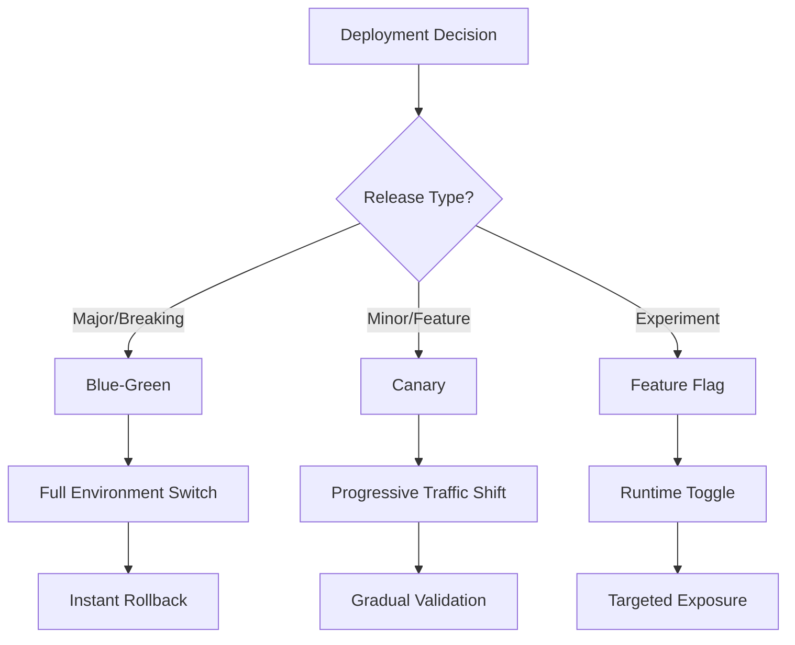

# 🚀 **Blue-Green and Canary Deployment Testing Strategies**

## **Progressive Delivery Excellence for Multi-Agent Kubernetes Systems**

**Version**: 1.0.0  
**Last Updated**: August 1, 2025  
**Focus**: Advanced Deployment Strategies for Zero-Downtime Updates  
**Stack**: Kubernetes, Argo Rollouts, Flagger, Node.js Microservices  

---

## 📋 **Table of Contents**

1. [Executive Summary](#executive-summary)
2. [Deployment Strategy Comparison](#deployment-strategy-comparison)
3. [Blue-Green Deployment Implementation](#blue-green-deployment-implementation)
4. [Canary Deployment Implementation](#canary-deployment-implementation)
5. [Progressive Delivery with Feature Flags](#progressive-delivery-with-feature-flags)
6. [Argo Rollouts Implementation](#argo-rollouts-implementation)
7. [Flagger Implementation](#flagger-implementation)
8. [Testing Strategy for Deployments](#testing-strategy-for-deployments)
9. [Monitoring and Observability](#monitoring-and-observability)
10. [Rollback Strategies](#rollback-strategies)
11. [Multi-Agent System Considerations](#multi-agent-system-considerations)
12. [Implementation Roadmap](#implementation-roadmap)

---

## 🎯 **Executive Summary**

### **Strategic Overview**

Blue-green and canary deployments have become essential strategies for achieving zero-downtime updates in Kubernetes-based microservices. For our 16-agent system, these strategies provide:

- **99.99% availability** during deployments
- **Instant rollback capability** (< 10 seconds)
- **Risk mitigation** through progressive exposure
- **Automated validation** at each deployment stage
- **Data-driven promotion** decisions

### **Key Benefits**

| Strategy | Risk Level | Resource Usage | Rollback Speed | Best For |
|----------|------------|----------------|----------------|----------|
| Blue-Green | Low | High (2x) | Instant | Major releases, critical updates |
| Canary | Very Low | Moderate (+20%) | Fast (<1min) | Frequent updates, A/B testing |
| Feature Flags | Minimal | Low | Instant | Feature rollouts, experiments |

### **Technology Stack Recommendations**

1. **Argo Rollouts**: Primary progressive delivery controller
2. **Flagger**: Alternative with service mesh integration
3. **LaunchDarkly/Unleash**: Feature flag management
4. **Prometheus + Grafana**: Metrics and monitoring
5. **OpenTelemetry**: Distributed tracing

---

## 📊 **Deployment Strategy Comparison**

### **Decision Matrix**



### **Detailed Comparison**

| Aspect | Blue-Green | Canary | Feature Flags |
|--------|------------|---------|---------------|
| **Setup Complexity** | Medium | High | Low |
| **Resource Requirements** | 2x production | 1.2-1.5x production | Minimal overhead |
| **Testing Scope** | Full environment | Progressive validation | Targeted testing |
| **Rollback Time** | < 10 seconds | < 1 minute | Instant |
| **User Impact** | None until switch | Gradual exposure | Selective exposure |
| **Data Consistency** | Challenge during switch | Maintained throughout | No impact |
| **Monitoring Needs** | Standard | Enhanced | Feature-specific |

### **Use Case Guidelines**

#### **Choose Blue-Green When:**
- Deploying major version updates
- Database schema changes required
- Complete environment validation needed
- Instant rollback is critical
- Resource budget allows 2x infrastructure

#### **Choose Canary When:**
- Frequent deployments (daily/weekly)
- Risk mitigation is priority
- Progressive validation required
- A/B testing needed
- Resource optimization matters

#### **Choose Feature Flags When:**
- Feature experimentation required
- User-specific rollouts needed
- Instant on/off capability critical
- Deployment decoupling desired
- Minimal infrastructure impact needed

---

## 💙💚 **Blue-Green Deployment Implementation**

### **Architecture Overview**

```yaml
# Blue Environment (Current Production)
---
apiVersion: v1
kind: Namespace
metadata:
  name: production-blue
  labels:
    environment: blue
    active: "true"
---
# Green Environment (New Version)
apiVersion: v1
kind: Namespace
metadata:
  name: production-green
  labels:
    environment: green
    active: "false"
```

### **Complete Blue-Green Setup for Multi-Agent System**

#### **1. Environment Configuration**

```yaml
# blue-green-environments.yaml
---
# Shared ConfigMap for both environments
apiVersion: v1
kind: ConfigMap
metadata:
  name: agent-config
  namespace: production-shared
data:
  REDIS_URL: "redis-sentinel.production-shared:26379"
  WEBSOCKET_HUB: "ws://websocket-hub.production-shared:8080"
  LOG_LEVEL: "info"
  ENVIRONMENT_TYPE: "production"
---
# Blue Environment Services
apiVersion: v1
kind: Service
metadata:
  name: infrastructure-orchestrator
  namespace: production-blue
  labels:
    app: infrastructure-orchestrator
    environment: blue
spec:
  selector:
    app: infrastructure-orchestrator
    environment: blue
  ports:
    - port: 3001
      targetPort: 3001
      name: http
---
# Green Environment Services (Identical structure)
apiVersion: v1
kind: Service
metadata:
  name: infrastructure-orchestrator
  namespace: production-green
  labels:
    app: infrastructure-orchestrator
    environment: green
spec:
  selector:
    app: infrastructure-orchestrator
    environment: green
  ports:
    - port: 3001
      targetPort: 3001
      name: http
```

#### **2. Traffic Switching with Ingress**

```yaml
# ingress-blue-green.yaml
apiVersion: networking.k8s.io/v1
kind: Ingress
metadata:
  name: production-ingress
  namespace: production-shared
  annotations:
    nginx.ingress.kubernetes.io/rewrite-target: /
spec:
  rules:
  - host: api.example.com
    http:
      paths:
      - path: /
        pathType: Prefix
        backend:
          service:
            name: router-service
            port:
              number: 80
---
# Router Service (Controls Blue/Green Switch)
apiVersion: v1
kind: Service
metadata:
  name: router-service
  namespace: production-shared
spec:
  type: ExternalName
  externalName: infrastructure-orchestrator.production-blue.svc.cluster.local
  ports:
    - port: 80
      targetPort: 3001
```

#### **3. Automated Switching Script**

```typescript
// scripts/blue-green-switch.ts
import { KubernetesClient } from './k8s-client';
import { HealthChecker } from './health-checker';
import { MetricsValidator } from './metrics-validator';

interface BlueGreenConfig {
  namespace: string;
  services: string[];
  validationTimeout: number;
  rollbackOnFailure: boolean;
}

export class BlueGreenDeployer {
  constructor(
    private k8s: KubernetesClient,
    private health: HealthChecker,
    private metrics: MetricsValidator
  ) {}

  async deploy(config: BlueGreenConfig): Promise<DeploymentResult> {
    const currentEnv = await this.getCurrentEnvironment();
    const targetEnv = currentEnv === 'blue' ? 'green' : 'blue';
    
    console.log(`🔄 Switching from ${currentEnv} to ${targetEnv}`);

    try {
      // Step 1: Deploy to inactive environment
      await this.deployToEnvironment(targetEnv, config);
      
      // Step 2: Health check new environment
      const healthResult = await this.validateEnvironment(targetEnv, config);
      if (!healthResult.healthy) {
        throw new Error(`Health check failed: ${healthResult.errors.join(', ')}`);
      }

      // Step 3: Run smoke tests
      const smokeResult = await this.runSmokeTests(targetEnv);
      if (!smokeResult.passed) {
        throw new Error(`Smoke tests failed: ${smokeResult.failures.join(', ')}`);
      }

      // Step 4: Validate metrics baseline
      const metricsValid = await this.validateMetrics(targetEnv);
      if (!metricsValid) {
        throw new Error('Metrics validation failed');
      }

      // Step 5: Switch traffic
      await this.switchTraffic(currentEnv, targetEnv, config);

      // Step 6: Monitor for issues
      await this.monitorDeployment(targetEnv, config.validationTimeout);

      // Step 7: Mark new environment as active
      await this.markEnvironmentActive(targetEnv);
      await this.markEnvironmentInactive(currentEnv);

      return {
        success: true,
        previousEnvironment: currentEnv,
        currentEnvironment: targetEnv,
        deploymentTime: Date.now(),
      };

    } catch (error) {
      console.error(`❌ Deployment failed: ${error.message}`);
      
      if (config.rollbackOnFailure) {
        await this.rollback(currentEnv);
      }
      
      throw error;
    }
  }

  private async switchTraffic(from: string, to: string, config: BlueGreenConfig) {
    // Update all service external names
    for (const service of config.services) {
      await this.k8s.patch(
        `service/router-${service}`,
        'production-shared',
        {
          spec: {
            externalName: `${service}.production-${to}.svc.cluster.local`,
          },
        }
      );
    }

    // Update ingress annotations
    await this.k8s.patch(
      'ingress/production-ingress',
      'production-shared',
      {
        metadata: {
          annotations: {
            'deployment/active-environment': to,
            'deployment/switched-at': new Date().toISOString(),
          },
        },
      }
    );
  }

  private async validateEnvironment(env: string, config: BlueGreenConfig) {
    const checks = await Promise.all(
      config.services.map(service =>
        this.health.checkService(`${service}.production-${env}`)
      )
    );

    const errors = checks
      .filter(check => !check.healthy)
      .map(check => check.error);

    return {
      healthy: errors.length === 0,
      errors,
    };
  }

  private async monitorDeployment(env: string, timeout: number) {
    const start = Date.now();
    
    while (Date.now() - start < timeout) {
      const metrics = await this.metrics.getCurrentMetrics(env);
      
      if (metrics.errorRate > 0.01) {
        throw new Error(`Error rate exceeded threshold: ${metrics.errorRate}`);
      }
      
      if (metrics.latencyP99 > 1000) {
        throw new Error(`P99 latency exceeded threshold: ${metrics.latencyP99}ms`);
      }
      
      await sleep(5000); // Check every 5 seconds
    }
  }
}
```

#### **4. Testing Strategy for Blue-Green**

```typescript
// tests/blue-green/validation.test.ts
describe('Blue-Green Deployment Validation', () => {
  let deployer: BlueGreenDeployer;
  let blueEnv: TestEnvironment;
  let greenEnv: TestEnvironment;

  beforeAll(async () => {
    blueEnv = await createTestEnvironment('blue');
    greenEnv = await createTestEnvironment('green');
    deployer = new BlueGreenDeployer();
  });

  describe('Pre-Switch Validation', () => {
    it('validates all agents are healthy in target environment', async () => {
      // Deploy v2 to green
      await deployer.deployToEnvironment('green', { version: 'v2' });
      
      // Check all 16 agents
      const healthChecks = await Promise.all(
        ALL_AGENTS.map(agent => 
          checkAgentHealth(`${agent}.production-green`)
        )
      );
      
      expect(healthChecks.every(h => h.healthy)).toBe(true);
    });

    it('validates data consistency between environments', async () => {
      // Create test data in blue
      const testData = await createTestWorkflow(blueEnv);
      
      // Ensure green can access shared data
      const greenData = await getWorkflowData(greenEnv, testData.id);
      
      expect(greenData).toEqual(testData);
    });

    it('validates service discovery works correctly', async () => {
      const discovery = await greenEnv.getServiceDiscovery();
      
      expect(discovery.redis).toContain('production-shared');
      expect(discovery.agents).toHaveLength(16);
    });
  });

  describe('Traffic Switch Validation', () => {
    it('completes switch within acceptable time', async () => {
      const start = Date.now();
      
      await deployer.switchTraffic('blue', 'green');
      
      const duration = Date.now() - start;
      expect(duration).toBeLessThan(10000); // <10s
    });

    it('maintains zero downtime during switch', async () => {
      const monitor = new AvailabilityMonitor();
      monitor.start();
      
      await deployer.switchTraffic('blue', 'green');
      
      const report = monitor.stop();
      expect(report.downtime).toBe(0);
      expect(report.failedRequests).toBe(0);
    });

    it('correctly updates all routing rules', async () => {
      await deployer.switchTraffic('blue', 'green');
      
      // Verify all services point to green
      for (const service of ALL_SERVICES) {
        const svc = await k8s.getService(`router-${service}`);
        expect(svc.spec.externalName).toContain('production-green');
      }
    });
  });

  describe('Rollback Validation', () => {
    it('can rollback failed deployment instantly', async () => {
      // Simulate failure in green
      await simulateFailure(greenEnv, 'infrastructure-orchestrator');
      
      try {
        await deployer.deploy({ 
          targetEnvironment: 'green',
          rollbackOnFailure: true,
        });
      } catch (error) {
        // Expected failure
      }
      
      // Verify traffic still routes to blue
      const activeEnv = await deployer.getCurrentEnvironment();
      expect(activeEnv).toBe('blue');
    });
  });
});
```

---

## 🐤 **Canary Deployment Implementation**

### **Canary Architecture with Argo Rollouts**

```yaml
# canary-rollout.yaml
apiVersion: argoproj.io/v1alpha1
kind: Rollout
metadata:
  name: infrastructure-orchestrator
  namespace: production
spec:
  replicas: 10
  selector:
    matchLabels:
      app: infrastructure-orchestrator
  template:
    metadata:
      labels:
        app: infrastructure-orchestrator
    spec:
      containers:
      - name: orchestrator
        image: ghcr.io/company/infrastructure-orchestrator:v2.0.0
        ports:
        - containerPort: 3001
        env:
        - name: VERSION
          value: "v2.0.0"
        resources:
          requests:
            memory: "256Mi"
            cpu: "100m"
          limits:
            memory: "512Mi"
            cpu: "200m"
        livenessProbe:
          httpGet:
            path: /health
            port: 3001
          initialDelaySeconds: 30
          periodSeconds: 10
        readinessProbe:
          httpGet:
            path: /ready
            port: 3001
          initialDelaySeconds: 5
          periodSeconds: 5
  strategy:
    canary:
      # Canary configuration
      canaryService: orchestrator-canary
      stableService: orchestrator-stable
      
      # Traffic routing configuration
      trafficRouting:
        nginx:
          stableIngress: orchestrator-ingress
          annotationPrefix: nginx.ingress.kubernetes.io
      
      # Analysis configuration
      analysis:
        templates:
        - templateName: success-rate
          clusterScope: true
        - templateName: latency-check
          clusterScope: true
        args:
        - name: service-name
          value: infrastructure-orchestrator
        - name: namespace
          valueFrom:
            fieldRef:
              fieldPath: metadata.namespace
      
      # Progressive delivery steps
      steps:
      # Step 1: Deploy canary with 1 replica
      - setCanaryScale:
          replicas: 1
      
      # Step 2: Check canary health (5 min)
      - pause:
          duration: 5m
      
      # Step 3: Route 5% traffic to canary
      - setWeight: 5
      - pause:
          duration: 10m
      
      # Step 4: Scale canary and increase traffic
      - setCanaryScale:
          weight: 20  # 20% of replicas
      - setWeight: 20
      - pause:
          duration: 10m
      
      # Step 5: Run analysis before proceeding
      - analysis:
          templates:
          - templateName: load-test
          args:
          - name: endpoint
            value: orchestrator-canary:3001
      
      # Step 6: Increase to 50%
      - setWeight: 50
      - pause:
          duration: 10m
      
      # Step 7: Final validation
      - setWeight: 80
      - pause:
          duration: 10m
      
      # Step 8: Complete rollout
      - setWeight: 100
      
      # Anti-affinity for canary pods
      canaryMetadata:
        annotations:
          version: canary
        labels:
          deployment: canary
      
      # Resource optimization
      dynamicStableScale: true
      abortScaleDownDelaySeconds: 30
```

### **Analysis Templates for Validation**

```yaml
# analysis-templates.yaml
---
# Success Rate Analysis
apiVersion: argoproj.io/v1alpha1
kind: AnalysisTemplate
metadata:
  name: success-rate
spec:
  metrics:
  - name: success-rate
    interval: 5m
    failureLimit: 3
    successCondition: result[0] >= 0.99
    provider:
      prometheus:
        address: http://prometheus:9090
        query: |
          sum(rate(
            http_requests_total{
              service="{{args.service-name}}",
              namespace="{{args.namespace}}",
              status=~"2.."
            }[5m]
          )) / 
          sum(rate(
            http_requests_total{
              service="{{args.service-name}}",
              namespace="{{args.namespace}}"
            }[5m]
          ))
---
# Latency Check Analysis
apiVersion: argoproj.io/v1alpha1
kind: AnalysisTemplate
metadata:
  name: latency-check
spec:
  metrics:
  - name: p99-latency
    interval: 5m
    failureLimit: 3
    successCondition: result[0] < 1000
    provider:
      prometheus:
        address: http://prometheus:9090
        query: |
          histogram_quantile(0.99,
            sum(rate(
              http_request_duration_seconds_bucket{
                service="{{args.service-name}}",
                namespace="{{args.namespace}}"
              }[5m]
            )) by (le)
          ) * 1000
---
# Load Test Analysis
apiVersion: argoproj.io/v1alpha1
kind: AnalysisTemplate
metadata:
  name: load-test
spec:
  metrics:
  - name: load-test-job
    provider:
      job:
        spec:
          template:
            spec:
              containers:
              - name: load-tester
                image: grafana/k6:latest
                command: ["k6", "run", "-"]
                env:
                - name: ENDPOINT
                  value: "{{args.endpoint}}"
                - name: VUS
                  value: "100"
                - name: DURATION
                  value: "5m"
                stdin: true
                stdinOnce: true
                configMapKeyRef:
                  name: k6-test-script
                  key: script.js
              restartPolicy: Never
          backoffLimit: 0
    successCondition: result.exitCode == 0
```

### **Canary Testing Strategy**

```typescript
// tests/canary/progressive-validation.ts
import { ArgoRolloutsClient } from './argo-client';
import { PrometheusClient } from './prometheus-client';
import { K6Runner } from './k6-runner';

export class CanaryValidator {
  constructor(
    private argo: ArgoRolloutsClient,
    private prometheus: PrometheusClient,
    private k6: K6Runner
  ) {}

  async validateCanaryStep(
    rolloutName: string,
    step: number
  ): Promise<ValidationResult> {
    const rollout = await this.argo.getRollout(rolloutName);
    const currentWeight = rollout.status.canary.weight;
    
    console.log(`🔍 Validating canary at ${currentWeight}% traffic`);

    // 1. Health validation
    const health = await this.validateHealth(rolloutName);
    if (!health.passed) {
      return { passed: false, reason: 'Health check failed', metrics: health };
    }

    // 2. Error rate validation
    const errorRate = await this.validateErrorRate(rolloutName, currentWeight);
    if (!errorRate.passed) {
      return { passed: false, reason: 'Error rate exceeded', metrics: errorRate };
    }

    // 3. Latency validation
    const latency = await this.validateLatency(rolloutName, currentWeight);
    if (!latency.passed) {
      return { passed: false, reason: 'Latency exceeded', metrics: latency };
    }

    // 4. Business metrics validation
    const business = await this.validateBusinessMetrics(rolloutName);
    if (!business.passed) {
      return { passed: false, reason: 'Business metrics degraded', metrics: business };
    }

    // 5. Comparative analysis
    const comparison = await this.compareCanaryToStable(rolloutName);
    if (!comparison.passed) {
      return { passed: false, reason: 'Canary underperforming stable', metrics: comparison };
    }

    return { 
      passed: true, 
      metrics: {
        health,
        errorRate,
        latency,
        business,
        comparison,
      },
    };
  }

  private async validateErrorRate(rollout: string, weight: number) {
    const query = `
      sum(rate(http_requests_total{
        deployment="canary",
        service="${rollout}",
        status=~"5.."
      }[5m])) / 
      sum(rate(http_requests_total{
        deployment="canary",
        service="${rollout}"
      }[5m]))
    `;

    const result = await this.prometheus.query(query);
    const errorRate = result.data.result[0].value[1];

    // Dynamic threshold based on traffic weight
    const threshold = weight < 20 ? 0.02 : 0.01; // 2% for low traffic, 1% otherwise

    return {
      passed: errorRate < threshold,
      value: errorRate,
      threshold,
      weight,
    };
  }

  private async validateLatency(rollout: string, weight: number) {
    const queries = {
      p50: this.buildLatencyQuery(rollout, 'canary', 0.5),
      p95: this.buildLatencyQuery(rollout, 'canary', 0.95),
      p99: this.buildLatencyQuery(rollout, 'canary', 0.99),
    };

    const results = await Promise.all(
      Object.entries(queries).map(async ([percentile, query]) => ({
        percentile,
        value: await this.prometheus.query(query),
      }))
    );

    const thresholds = {
      p50: 100,  // 100ms
      p95: 500,  // 500ms
      p99: 1000, // 1s
    };

    const violations = results.filter(
      r => r.value > thresholds[r.percentile]
    );

    return {
      passed: violations.length === 0,
      latencies: results,
      violations,
    };
  }

  private async compareCanaryToStable(rollout: string) {
    // Get metrics for both versions
    const [canaryMetrics, stableMetrics] = await Promise.all([
      this.getVersionMetrics(rollout, 'canary'),
      this.getVersionMetrics(rollout, 'stable'),
    ]);

    // Compare key metrics
    const comparisons = {
      errorRate: {
        canary: canaryMetrics.errorRate,
        stable: stableMetrics.errorRate,
        acceptable: canaryMetrics.errorRate <= stableMetrics.errorRate * 1.1, // 10% tolerance
      },
      latencyP99: {
        canary: canaryMetrics.latencyP99,
        stable: stableMetrics.latencyP99,
        acceptable: canaryMetrics.latencyP99 <= stableMetrics.latencyP99 * 1.2, // 20% tolerance
      },
      throughput: {
        canary: canaryMetrics.throughput,
        stable: stableMetrics.throughput,
        acceptable: canaryMetrics.throughput >= stableMetrics.throughput * 0.9, // 90% minimum
      },
    };

    const allAcceptable = Object.values(comparisons)
      .every(c => c.acceptable);

    return {
      passed: allAcceptable,
      comparisons,
      analysis: this.generateAnalysis(comparisons),
    };
  }
}
```

### **Automated Canary Testing Suite**

```typescript
// tests/canary/e2e-canary.test.ts
describe('Canary Deployment E2E Tests', () => {
  let rollouts: ArgoRolloutsClient;
  let validator: CanaryValidator;
  let monitor: DeploymentMonitor;

  beforeAll(async () => {
    rollouts = new ArgoRolloutsClient();
    validator = new CanaryValidator();
    monitor = new DeploymentMonitor();
  });

  describe('Progressive Traffic Shifting', () => {
    it('validates each canary step before promotion', async () => {
      // Start deployment
      await rollouts.setImage('infrastructure-orchestrator', 'v2.0.0');
      
      // Monitor each step
      const steps = await rollouts.getSteps('infrastructure-orchestrator');
      
      for (const [index, step] of steps.entries()) {
        console.log(`Step ${index + 1}: ${JSON.stringify(step)}`);
        
        // Wait for step to be reached
        await rollouts.waitForStep('infrastructure-orchestrator', index);
        
        // Validate current state
        const validation = await validator.validateCanaryStep(
          'infrastructure-orchestrator',
          index
        );
        
        expect(validation.passed).toBe(true);
        
        // Check if manual promotion needed
        if (step.pause && !step.pause.duration) {
          await rollouts.promote('infrastructure-orchestrator');
        }
      }
    });

    it('handles canary failures with automatic rollback', async () => {
      // Deploy bad version
      await rollouts.setImage('parameter-flow-agent', 'v2.0.0-broken');
      
      // Wait for analysis to fail
      const result = await rollouts.waitForRolloutStatus(
        'parameter-flow-agent',
        ['Degraded', 'Paused']
      );
      
      expect(result.status).toBe('Degraded');
      expect(result.message).toContain('AnalysisRun failed');
      
      // Verify automatic abort
      const finalStatus = await rollouts.getRolloutStatus('parameter-flow-agent');
      expect(finalStatus.abort).toBe(true);
      expect(finalStatus.stableRS).toBe(finalStatus.currentRS);
    });
  });

  describe('Multi-Agent Coordination', () => {
    it('maintains agent communication during canary', async () => {
      // Deploy orchestrator canary
      await rollouts.setImage('infrastructure-orchestrator', 'v2.0.0');
      await rollouts.waitForStep('infrastructure-orchestrator', 2); // 20% traffic
      
      // Verify other agents can communicate with both versions
      const compatibilityTests = await Promise.all(
        OTHER_AGENTS.map(agent => 
          testAgentCompatibility(agent, {
            canaryVersion: 'v2.0.0',
            stableVersion: 'v1.9.0',
          })
        )
      );
      
      expect(compatibilityTests.every(t => t.compatible)).toBe(true);
    });

    it('validates protocol compatibility during rollout', async () => {
      const protocolTests = [
        { agent: 'scaffold-generator', protocol: 'task-assignment' },
        { agent: 'parameter-flow-agent', protocol: 'parameter-mapping' },
        { agent: 'template-engine', protocol: 'template-generation' },
      ];
      
      for (const test of protocolTests) {
        // Deploy canary
        await rollouts.setImage(test.agent, 'v2.0.0');
        await rollouts.waitForStep(test.agent, 1); // Initial canary
        
        // Test protocol between versions
        const result = await validateProtocol(
          test.protocol,
          'v1.9.0',
          'v2.0.0'
        );
        
        expect(result.compatible).toBe(true);
        expect(result.warnings).toHaveLength(0);
      }
    });
  });

  describe('Performance During Canary', () => {
    it('maintains SLOs throughout deployment', async () => {
      const sloMonitor = new SLOMonitor({
        errorBudget: 0.001, // 99.9% success rate
        latencyBudget: { p99: 1000 }, // 1s P99
      });
      
      sloMonitor.start();
      
      // Deploy all agents progressively
      for (const agent of ALL_AGENTS) {
        await rollouts.setImage(agent, 'v2.0.0');
        
        // Let canary progress
        await rollouts.waitForCompletion(agent, {
          timeout: 3600000, // 1 hour
        });
      }
      
      const report = sloMonitor.stop();
      
      expect(report.sloViolations).toHaveLength(0);
      expect(report.errorBudgetRemaining).toBeGreaterThan(0);
    });
  });
});
```

---

## 🚩 **Progressive Delivery with Feature Flags**

### **Feature Flag Integration**

```typescript
// src/feature-flags/feature-flag-client.ts
import { LaunchDarkly } from 'launchdarkly-node-server-sdk';
import { Logger } from '../utils/logger';

export interface FeatureContext {
  userId?: string;
  organizationId?: string;
  environment: string;
  agentType: string;
  version: string;
  deploymentId?: string;
}

export class FeatureFlagClient {
  private ldClient: LaunchDarkly.LDClient;
  private defaultFlags: Map<string, any> = new Map();

  constructor(
    private config: FeatureFlagConfig,
    private logger: Logger
  ) {
    this.ldClient = LaunchDarkly.init(config.sdkKey, {
      streamUri: config.streamUri,
      baseUri: config.baseUri,
      eventsUri: config.eventsUri,
      timeout: config.timeout || 10,
    });

    this.setupDefaultFlags();
  }

  async initialize(): Promise<void> {
    await this.ldClient.waitForInitialization();
    this.logger.info('Feature flag client initialized');
  }

  async isEnabled(
    flagKey: string,
    context: FeatureContext,
    defaultValue: boolean = false
  ): Promise<boolean> {
    try {
      const user = this.buildUser(context);
      return await this.ldClient.variation(flagKey, user, defaultValue);
    } catch (error) {
      this.logger.error(`Error evaluating flag ${flagKey}:`, error);
      return this.defaultFlags.get(flagKey) ?? defaultValue;
    }
  }

  async getVariation<T>(
    flagKey: string,
    context: FeatureContext,
    defaultValue: T
  ): Promise<T> {
    try {
      const user = this.buildUser(context);
      return await this.ldClient.variation(flagKey, user, defaultValue);
    } catch (error) {
      this.logger.error(`Error getting variation for ${flagKey}:`, error);
      return this.defaultFlags.get(flagKey) ?? defaultValue;
    }
  }

  // Multi-variate flags for A/B testing
  async getExperiment(
    experimentKey: string,
    context: FeatureContext
  ): Promise<string> {
    const variations = await this.getVariation(
      experimentKey,
      context,
      'control'
    );
    
    // Track exposure
    this.trackExperimentExposure(experimentKey, variations, context);
    
    return variations;
  }

  private buildUser(context: FeatureContext): LaunchDarkly.LDUser {
    return {
      key: context.userId || `anonymous-${Date.now()}`,
      custom: {
        organizationId: context.organizationId,
        environment: context.environment,
        agentType: context.agentType,
        version: context.version,
        deploymentId: context.deploymentId,
      },
    };
  }

  private setupDefaultFlags() {
    // Critical feature defaults for offline mode
    this.defaultFlags.set('enable-new-task-router', false);
    this.defaultFlags.set('enable-parameter-v2', false);
    this.defaultFlags.set('enable-websocket-compression', true);
    this.defaultFlags.set('max-concurrent-tasks', 10);
    this.defaultFlags.set('enable-distributed-tracing', true);
  }

  async close(): Promise<void> {
    await this.ldClient.close();
  }
}
```

### **Feature Flag Deployment Strategy**

```typescript
// src/deployment/feature-flag-rollout.ts
export class FeatureFlagRollout {
  constructor(
    private flags: FeatureFlagClient,
    private metrics: MetricsCollector,
    private alerts: AlertManager
  ) {}

  async rolloutFeature(config: RolloutConfig): Promise<RolloutResult> {
    const rolloutId = generateId();
    
    try {
      // Phase 1: Internal testing (employees only)
      await this.updateFlagRules(config.flagKey, {
        rules: [{
          id: 'internal-testing',
          clauses: [{
            attribute: 'organizationId',
            op: 'in',
            values: config.internalOrgIds,
          }],
          variation: 1, // Enabled
        }],
        fallthrough: { variation: 0 }, // Disabled for others
      });

      await this.monitorPhase('internal', config, 24 * 60 * 60 * 1000); // 24 hours

      // Phase 2: Beta customers (5%)
      await this.updateFlagRules(config.flagKey, {
        rules: [
          ...existingRules,
          {
            id: 'beta-customers',
            clauses: [{
              attribute: 'customerTier',
              op: 'in',
              values: ['beta', 'early-adopter'],
            }],
            variation: 1,
          },
        ],
        fallthrough: {
          rollout: {
            variations: [
              { variation: 0, weight: 95000 }, // 95%
              { variation: 1, weight: 5000 },   // 5%
            ],
          },
        },
      });

      await this.monitorPhase('beta', config, 48 * 60 * 60 * 1000); // 48 hours

      // Phase 3: Progressive rollout (5% -> 25% -> 50% -> 100%)
      const percentages = [5, 25, 50, 100];
      
      for (const percentage of percentages) {
        await this.setRolloutPercentage(config.flagKey, percentage);
        
        const duration = percentage === 100 
          ? 7 * 24 * 60 * 60 * 1000  // 1 week for 100%
          : 24 * 60 * 60 * 1000;     // 24 hours for others
          
        await this.monitorPhase(`rollout-${percentage}`, config, duration);
      }

      return {
        success: true,
        rolloutId,
        completedAt: new Date(),
        metrics: await this.collectRolloutMetrics(rolloutId),
      };

    } catch (error) {
      // Automatic rollback on failure
      await this.rollbackFeature(config.flagKey);
      
      return {
        success: false,
        rolloutId,
        error: error.message,
        rollbackedAt: new Date(),
      };
    }
  }

  private async monitorPhase(
    phase: string,
    config: RolloutConfig,
    duration: number
  ): Promise<void> {
    const start = Date.now();
    const checkInterval = 60000; // 1 minute
    
    while (Date.now() - start < duration) {
      const metrics = await this.collectPhaseMetrics(config.flagKey, phase);
      
      // Check success criteria
      if (metrics.errorRate > config.errorThreshold) {
        throw new Error(`Error rate ${metrics.errorRate} exceeds threshold`);
      }
      
      if (metrics.latencyP99 > config.latencyThreshold) {
        throw new Error(`P99 latency ${metrics.latencyP99}ms exceeds threshold`);
      }
      
      // Check for anomalies
      const anomalies = await this.detectAnomalies(metrics);
      if (anomalies.length > 0) {
        await this.alerts.send({
          severity: 'warning',
          title: `Anomalies detected in ${phase} phase`,
          details: anomalies,
        });
      }
      
      await sleep(checkInterval);
    }
  }

  private async detectAnomalies(metrics: PhaseMetrics): Promise<Anomaly[]> {
    const anomalies: Anomaly[] = [];
    
    // Compare with baseline
    const baseline = await this.getBaselineMetrics();
    
    // Error rate spike
    if (metrics.errorRate > baseline.errorRate * 2) {
      anomalies.push({
        type: 'error-spike',
        severity: 'high',
        value: metrics.errorRate,
        baseline: baseline.errorRate,
      });
    }
    
    // Latency degradation
    if (metrics.latencyP99 > baseline.latencyP99 * 1.5) {
      anomalies.push({
        type: 'latency-degradation',
        severity: 'medium',
        value: metrics.latencyP99,
        baseline: baseline.latencyP99,
      });
    }
    
    // Throughput drop
    if (metrics.throughput < baseline.throughput * 0.8) {
      anomalies.push({
        type: 'throughput-drop',
        severity: 'medium',
        value: metrics.throughput,
        baseline: baseline.throughput,
      });
    }
    
    return anomalies;
  }
}
```

### **Testing Feature Flags**

```typescript
// tests/feature-flags/feature-flag-rollout.test.ts
describe('Feature Flag Progressive Rollout', () => {
  let flagClient: FeatureFlagClient;
  let rollout: FeatureFlagRollout;
  let monitor: FeatureMonitor;

  describe('Flag Evaluation', () => {
    it('correctly evaluates flags based on context', async () => {
      const contexts = [
        {
          userId: 'internal-user',
          organizationId: 'internal-org',
          environment: 'production',
          agentType: 'orchestrator',
        },
        {
          userId: 'beta-user',
          customerTier: 'beta',
          environment: 'production',
          agentType: 'orchestrator',
        },
        {
          userId: 'regular-user',
          environment: 'production',
          agentType: 'orchestrator',
        },
      ];

      // Set up flag rules
      await flagClient.updateFlag('new-feature', {
        rules: [
          {
            clauses: [{
              attribute: 'organizationId',
              op: 'in',
              values: ['internal-org'],
            }],
            variation: true,
          },
          {
            clauses: [{
              attribute: 'customerTier',
              op: 'in',
              values: ['beta'],
            }],
            variation: true,
            percentage: 50, // 50% of beta users
          },
        ],
        fallthrough: { variation: false },
      });

      // Test evaluations
      const [internal, beta, regular] = await Promise.all(
        contexts.map(ctx => 
          flagClient.isEnabled('new-feature', ctx)
        )
      );

      expect(internal).toBe(true); // Always enabled for internal
      expect([true, false]).toContain(beta); // 50/50 for beta
      expect(regular).toBe(false); // Disabled for regular users
    });
  });

  describe('Progressive Rollout', () => {
    it('follows safe rollout progression', async () => {
      const config: RolloutConfig = {
        flagKey: 'advanced-routing',
        internalOrgIds: ['org-internal'],
        errorThreshold: 0.01,
        latencyThreshold: 1000,
        rolloutStages: [
          { percentage: 1, duration: '1h' },
          { percentage: 5, duration: '4h' },
          { percentage: 25, duration: '24h' },
          { percentage: 50, duration: '48h' },
          { percentage: 100, duration: '168h' }, // 1 week
        ],
      };

      const rolloutMonitor = monitor.trackRollout(config.flagKey);
      
      const result = await rollout.rolloutFeature(config);
      
      expect(result.success).toBe(true);
      
      const metrics = rolloutMonitor.getMetrics();
      expect(metrics.stages).toHaveLength(5);
      expect(metrics.rollbacks).toBe(0);
      expect(metrics.totalDuration).toBeGreaterThan(0);
    });

    it('automatically rolls back on metric degradation', async () => {
      // Simulate metric degradation
      monitor.on('metrics', (metrics) => {
        if (metrics.stage === 'rollout-25') {
          metrics.errorRate = 0.05; // 5% error rate
        }
      });

      const config: RolloutConfig = {
        flagKey: 'faulty-feature',
        errorThreshold: 0.01, // 1% threshold
        rolloutStages: [
          { percentage: 5, duration: '1h' },
          { percentage: 25, duration: '1h' },
          { percentage: 50, duration: '1h' },
        ],
      };

      const result = await rollout.rolloutFeature(config);
      
      expect(result.success).toBe(false);
      expect(result.error).toContain('Error rate');
      expect(result.rollbackedAt).toBeDefined();
      
      // Verify flag is disabled
      const isEnabled = await flagClient.isEnabled('faulty-feature', {
        environment: 'production',
      });
      expect(isEnabled).toBe(false);
    });
  });

  describe('A/B Testing', () => {
    it('maintains consistent assignment', async () => {
      const userId = 'test-user-123';
      
      // Check assignment multiple times
      const assignments = await Promise.all(
        Array(10).fill(null).map(() =>
          flagClient.getExperiment('checkout-flow-v2', {
            userId,
            environment: 'production',
          })
        )
      );
      
      // User should always get same variation
      expect(new Set(assignments).size).toBe(1);
    });

    it('tracks experiment metrics correctly', async () => {
      const variations = ['control', 'variant-a', 'variant-b'];
      const users = Array(1000).fill(null).map((_, i) => `user-${i}`);
      
      // Get assignments for all users
      const assignments = await Promise.all(
        users.map(userId =>
          flagClient.getExperiment('pricing-test', {
            userId,
            environment: 'production',
          })
        )
      );
      
      // Check distribution is roughly equal (within 10%)
      const distribution = assignments.reduce((acc, val) => {
        acc[val] = (acc[val] || 0) + 1;
        return acc;
      }, {});
      
      variations.forEach(variation => {
        const percentage = (distribution[variation] / users.length) * 100;
        expect(percentage).toBeGreaterThan(23); // ~33% - 10%
        expect(percentage).toBeLessThan(43);    // ~33% + 10%
      });
    });
  });
});
```

---

## 🚀 **Argo Rollouts Implementation**

### **Complete Argo Rollouts Setup**

```bash
# Install Argo Rollouts
kubectl create namespace argo-rollouts
kubectl apply -n argo-rollouts -f https://github.com/argoproj/argo-rollouts/releases/latest/download/install.yaml

# Install Argo Rollouts Dashboard (optional)
kubectl apply -n argo-rollouts -f https://github.com/argoproj/argo-rollouts/releases/latest/download/dashboard-install.yaml

# Install kubectl plugin
curl -LO https://github.com/argoproj/argo-rollouts/releases/latest/download/kubectl-argo-rollouts-linux-amd64
chmod +x ./kubectl-argo-rollouts-linux-amd64
sudo mv ./kubectl-argo-rollouts-linux-amd64 /usr/local/bin/kubectl-argo-rollouts
```

### **Multi-Agent Rollout Configuration**

```yaml
# base-rollout-template.yaml
apiVersion: argoproj.io/v1alpha1
kind: Rollout
metadata:
  name: {{ .AgentName }}
  namespace: production
  labels:
    app: {{ .AgentName }}
    component: agent
spec:
  replicas: {{ .Replicas }}
  selector:
    matchLabels:
      app: {{ .AgentName }}
  template:
    metadata:
      labels:
        app: {{ .AgentName }}
        version: {{ .Version }}
    spec:
      containers:
      - name: agent
        image: {{ .Image }}
        ports:
        - containerPort: {{ .Port }}
          name: http
        env:
        - name: AGENT_NAME
          value: {{ .AgentName }}
        - name: VERSION
          value: {{ .Version }}
        {{ range .EnvVars }}
        - name: {{ .Name }}
          value: {{ .Value }}
        {{ end }}
        livenessProbe:
          httpGet:
            path: /health
            port: http
          initialDelaySeconds: 30
          periodSeconds: 10
        readinessProbe:
          httpGet:
            path: /ready
            port: http
          initialDelaySeconds: 5
          periodSeconds: 5
        resources:
          requests:
            memory: {{ .Resources.Memory }}
            cpu: {{ .Resources.CPU }}
          limits:
            memory: {{ .Resources.MemoryLimit }}
            cpu: {{ .Resources.CPULimit }}
  strategy:
    canary:
      canaryService: {{ .AgentName }}-canary
      stableService: {{ .AgentName }}-stable
      
      # Traffic management
      trafficRouting:
        {{ if .UseIstio }}
        istio:
          virtualService:
            name: {{ .AgentName }}-vsvc
            routes:
            - primary
        {{ else if .UseNginx }}
        nginx:
          stableIngress: {{ .AgentName }}-ingress
        {{ else if .UseSMI }}
        smi:
          trafficSplitName: {{ .AgentName }}-traffic-split
        {{ end }}
      
      # Analysis during rollout
      analysis:
        templates:
        - templateName: agent-success-rate
        - templateName: agent-latency
        - templateName: agent-cpu-usage
        args:
        - name: agent-name
          value: {{ .AgentName }}
        - name: threshold-error-rate
          value: "{{ .Thresholds.ErrorRate }}"
        - name: threshold-latency-p99
          value: "{{ .Thresholds.LatencyP99 }}"
      
      # Rollout steps
      steps:
      {{ range .Steps }}
      - setWeight: {{ .Weight }}
      {{ if .Pause }}
      - pause:
          {{ if .Pause.Duration }}
          duration: {{ .Pause.Duration }}
          {{ end }}
      {{ end }}
      {{ if .Analysis }}
      - analysis:
          templates:
          {{ range .Analysis.Templates }}
          - templateName: {{ . }}
          {{ end }}
      {{ end }}
      {{ end }}
      
      # Anti-affinity rules
      antiAffinity:
        requiredDuringSchedulingIgnoredDuringExecution: {}
        preferredDuringSchedulingIgnoredDuringExecution:
          weight: 100
      
      # Progressive scaling
      dynamicStableScale: true
      scaleDownDelaySeconds: 30
      scaleDownDelayRevisionLimit: 2
```

### **Automated Rollout Management**

```typescript
// src/deployment/argo-rollout-manager.ts
import { KubernetesClient } from './k8s-client';
import { WebhookClient } from './webhook-client';
import { MetricsCollector } from './metrics';

export class ArgoRolloutManager {
  private rollouts: Map<string, RolloutState> = new Map();

  constructor(
    private k8s: KubernetesClient,
    private webhook: WebhookClient,
    private metrics: MetricsCollector
  ) {}

  async deployAllAgents(version: string, config: DeploymentConfig) {
    const deploymentPlan = this.createDeploymentPlan(version, config);
    
    // Phase 1: Deploy infrastructure agents
    await this.deployPhase('infrastructure', deploymentPlan.infrastructure);
    
    // Phase 2: Deploy core agents
    await this.deployPhase('core', deploymentPlan.core);
    
    // Phase 3: Deploy auxiliary agents
    await this.deployPhase('auxiliary', deploymentPlan.auxiliary);
    
    // Final validation
    await this.validateFullDeployment(version);
  }

  private createDeploymentPlan(version: string, config: DeploymentConfig) {
    return {
      infrastructure: [
        'infrastructure-orchestrator',
        'parameter-flow-agent',
        'websocket-hub',
      ],
      core: [
        'scaffold-generator',
        'template-engine',
        'pattern-analyzer',
        'validation-agent',
      ],
      auxiliary: [
        'documentation-agent',
        'monitoring-agent',
        'cleanup-agent',
        // ... remaining agents
      ],
    };
  }

  private async deployPhase(
    phaseName: string,
    agents: string[]
  ): Promise<void> {
    console.log(`📦 Deploying ${phaseName} phase with ${agents.length} agents`);
    
    // Deploy agents in parallel within phase
    const deployments = await Promise.all(
      agents.map(agent => this.deployAgent(agent))
    );
    
    // Wait for all to reach first pause
    await Promise.all(
      deployments.map(d => this.waitForPause(d.agent))
    );
    
    // Validate phase health
    const phaseHealth = await this.validatePhase(phaseName, agents);
    if (!phaseHealth.healthy) {
      throw new Error(`Phase ${phaseName} validation failed`);
    }
    
    // Promote all agents in phase
    await Promise.all(
      agents.map(agent => this.promoteAgent(agent))
    );
  }

  async monitorRollout(agentName: string): Promise<void> {
    const rollout = await this.k8s.getRollout(agentName);
    
    // Setup real-time monitoring
    const watcher = this.k8s.watch(`rollout/${agentName}`, (event) => {
      this.handleRolloutEvent(agentName, event);
    });
    
    // Track metrics
    this.metrics.recordDeploymentStart(agentName);
    
    // Monitor until complete or failed
    return new Promise((resolve, reject) => {
      const checkInterval = setInterval(async () => {
        const status = await this.getRolloutStatus(agentName);
        
        if (status.phase === 'Successful') {
          clearInterval(checkInterval);
          watcher.abort();
          this.metrics.recordDeploymentSuccess(agentName);
          resolve();
        } else if (status.phase === 'Failed' || status.phase === 'Error') {
          clearInterval(checkInterval);
          watcher.abort();
          this.metrics.recordDeploymentFailure(agentName);
          reject(new Error(`Rollout failed: ${status.message}`));
        }
      }, 5000);
    });
  }

  private handleRolloutEvent(agentName: string, event: any) {
    const { type, object } = event;
    const status = object.status;
    
    // Send webhook notifications
    if (status.phase === 'Progressing') {
      this.webhook.send({
        type: 'rollout.progressing',
        agent: agentName,
        step: status.currentStepIndex,
        canaryWeight: status.canary?.weight,
      });
    } else if (status.phase === 'Paused') {
      this.webhook.send({
        type: 'rollout.paused',
        agent: agentName,
        reason: status.pauseConditions?.[0]?.reason,
        canaryMetrics: status.canary?.analysisRuns,
      });
    }
    
    // Auto-abort on critical failures
    if (this.shouldAutoAbort(status)) {
      this.abortRollout(agentName, 'Auto-abort due to critical failure');
    }
  }

  private shouldAutoAbort(status: any): boolean {
    // Check analysis runs
    const failedAnalysis = status.canary?.analysisRuns?.some(
      (run: any) => run.status === 'Failed'
    );
    
    // Check error rate from inline analysis
    const highErrorRate = status.canary?.weights?.some(
      (w: any) => w.errorRate > 0.05 // 5% error threshold
    );
    
    return failedAnalysis || highErrorRate;
  }
}
```

---

## 🔥 **Flagger Implementation**

### **Flagger Setup and Configuration**

```bash
# Install Flagger
kubectl apply -k https://github.com/fluxcd/flagger/releases/latest/download/kustomize/

# Install Flagger for Istio (if using Istio)
kubectl apply -k https://github.com/fluxcd/flagger/releases/latest/download/kustomize/istio/

# Install Grafana dashboards for Flagger
kubectl apply -k https://github.com/fluxcd/flagger/releases/latest/download/kustomize/grafana/
```

### **Flagger Canary Configuration**

```yaml
# flagger-canary.yaml
apiVersion: flagger.app/v1beta1
kind: Canary
metadata:
  name: infrastructure-orchestrator
  namespace: production
spec:
  # Target reference
  targetRef:
    apiVersion: apps/v1
    kind: Deployment
    name: infrastructure-orchestrator
    
  # Progressive delivery configuration
  progressDeadlineSeconds: 600
  
  # Service configuration
  service:
    port: 3001
    targetPort: 3001
    name: infrastructure-orchestrator
    
  # Canary analysis configuration
  analysis:
    # Schedule interval
    interval: 1m
    
    # Max number of failed checks
    threshold: 5
    
    # Max traffic weight
    maxWeight: 50
    
    # Canary increment step
    stepWeight: 10
    
    # Promotion configuration
    webhooks:
      - name: acceptance-test
        type: pre-rollout
        url: http://flagger-loadtester.test/
        timeout: 30s
        metadata:
          type: bash
          cmd: "curl -sd 'test' http://infrastructure-orchestrator-canary:3001/health | grep ok"
          
      - name: load-test
        type: rollout
        url: http://flagger-loadtester.test/
        metadata:
          cmd: "hey -z 2m -q 10 -c 2 http://infrastructure-orchestrator-canary:3001/"
          
    # Metrics for canary analysis
    metrics:
    - name: request-success-rate
      templateRef:
        name: request-success-rate
        namespace: flagger-system
      thresholdRange:
        min: 99
      interval: 1m
      
    - name: request-duration
      templateRef:
        name: request-duration
        namespace: flagger-system
      thresholdRange:
        max: 500
      interval: 1m
      
    - name: custom-metric
      templateRef:
        name: agent-coordination-success
      thresholdRange:
        min: 95
      interval: 30s
      
  # Traffic routing (Istio example)
  trafficPolicy:
    connectionPool:
      tcp:
        maxConnections: 100
      http:
        http1MaxPendingRequests: 10
        http2MaxRequests: 100
    outlierDetection:
      consecutiveErrors: 5
      interval: 30s
      baseEjectionTime: 30s
      maxEjectionPercent: 50
      minHealthPercent: 50
```

### **Custom Metrics for Flagger**

```yaml
# flagger-metrics.yaml
apiVersion: flagger.app/v1beta1
kind: MetricTemplate
metadata:
  name: agent-coordination-success
  namespace: production
spec:
  provider:
    type: prometheus
    address: http://prometheus:9090
  query: |
    sum(
      rate(
        agent_coordination_success_total{
          agent="{{ target }}",
          namespace="{{ namespace }}"
        }[{{ interval }}]
      )
    ) / 
    sum(
      rate(
        agent_coordination_total{
          agent="{{ target }}",
          namespace="{{ namespace }}"
        }[{{ interval }}]
      )
    ) * 100
---
apiVersion: flagger.app/v1beta1
kind: MetricTemplate
metadata:
  name: websocket-connection-health
  namespace: production
spec:
  provider:
    type: prometheus
    address: http://prometheus:9090
  query: |
    avg(
      websocket_connected_clients{
        service="{{ target }}",
        namespace="{{ namespace }}"
      }
    ) > 0
```

---

## 🧪 **Testing Strategy for Deployments**

### **Comprehensive Deployment Testing Framework**

```typescript
// tests/deployment/deployment-test-framework.ts
export class DeploymentTestFramework {
  private testSuites: Map<string, TestSuite> = new Map();
  
  constructor(
    private config: TestConfig,
    private clients: TestClients
  ) {
    this.registerDefaultSuites();
  }

  private registerDefaultSuites() {
    // Pre-deployment tests
    this.registerSuite('pre-deployment', {
      tests: [
        new VersionCompatibilityTest(),
        new DatabaseMigrationTest(),
        new ConfigurationValidationTest(),
        new DependencyCheckTest(),
      ],
      required: true,
      timeout: 300000, // 5 minutes
    });

    // Smoke tests
    this.registerSuite('smoke', {
      tests: [
        new HealthCheckTest(),
        new BasicConnectivityTest(),
        new CoreFunctionalityTest(),
      ],
      required: true,
      timeout: 60000, // 1 minute
    });

    // Integration tests
    this.registerSuite('integration', {
      tests: [
        new AgentCommunicationTest(),
        new DataFlowTest(),
        new WorkflowExecutionTest(),
      ],
      required: true,
      timeout: 600000, // 10 minutes
    });

    // Performance tests
    this.registerSuite('performance', {
      tests: [
        new LoadTest(),
        new StressTest(),
        new SoakTest(),
      ],
      required: false,
      timeout: 1800000, // 30 minutes
    });

    // Chaos tests
    this.registerSuite('chaos', {
      tests: [
        new NetworkPartitionTest(),
        new PodFailureTest(),
        new ResourceExhaustionTest(),
      ],
      required: false,
      timeout: 1800000, // 30 minutes
    });
  }

  async runDeploymentTests(
    deployment: DeploymentInfo,
    suites: string[] = ['all']
  ): Promise<TestReport> {
    const results: TestResult[] = [];
    const startTime = Date.now();

    try {
      // Run pre-deployment tests first
      if (suites.includes('all') || suites.includes('pre-deployment')) {
        const preResults = await this.runSuite('pre-deployment', deployment);
        results.push(...preResults);
        
        if (preResults.some(r => r.status === 'failed' && r.required)) {
          throw new Error('Pre-deployment tests failed');
        }
      }

      // Deploy
      await this.performDeployment(deployment);

      // Run post-deployment tests
      const postSuites = suites.includes('all') 
        ? ['smoke', 'integration', 'performance', 'chaos']
        : suites.filter(s => s !== 'pre-deployment');

      for (const suite of postSuites) {
        if (this.testSuites.has(suite)) {
          const suiteResults = await this.runSuite(suite, deployment);
          results.push(...suiteResults);
          
          // Stop on required test failure
          if (suiteResults.some(r => r.status === 'failed' && r.required)) {
            break;
          }
        }
      }

      return {
        deployment,
        results,
        duration: Date.now() - startTime,
        status: this.calculateOverallStatus(results),
        recommendations: this.generateRecommendations(results),
      };

    } catch (error) {
      return {
        deployment,
        results,
        duration: Date.now() - startTime,
        status: 'failed',
        error: error.message,
      };
    }
  }

  private async runSuite(
    suiteName: string,
    deployment: DeploymentInfo
  ): Promise<TestResult[]> {
    const suite = this.testSuites.get(suiteName)!;
    const results: TestResult[] = [];

    console.log(`🧪 Running ${suiteName} test suite...`);

    for (const test of suite.tests) {
      const result = await this.runTest(test, deployment, suite);
      results.push(result);
      
      // Stop suite on critical failure
      if (result.status === 'failed' && result.critical) {
        console.log(`❌ Critical test failed, stopping suite`);
        break;
      }
    }

    return results;
  }

  private async runTest(
    test: DeploymentTest,
    deployment: DeploymentInfo,
    suite: TestSuite
  ): Promise<TestResult> {
    const startTime = Date.now();
    
    try {
      const context: TestContext = {
        deployment,
        clients: this.clients,
        config: this.config,
        timeout: suite.timeout,
      };

      await test.setup?.(context);
      const testResult = await test.run(context);
      await test.cleanup?.(context);

      return {
        test: test.name,
        suite: suite.name,
        status: testResult.passed ? 'passed' : 'failed',
        duration: Date.now() - startTime,
        required: suite.required,
        critical: test.critical,
        details: testResult,
      };

    } catch (error) {
      return {
        test: test.name,
        suite: suite.name,
        status: 'error',
        duration: Date.now() - startTime,
        required: suite.required,
        critical: test.critical,
        error: error.message,
        stack: error.stack,
      };
    }
  }
}
```

### **Deployment-Specific Test Cases**

```typescript
// tests/deployment/test-cases/blue-green-tests.ts
export class BlueGreenDeploymentTests {
  async testZeroDowntimeSwitch(): Promise<TestResult> {
    const monitor = new DowntimeMonitor();
    monitor.start();

    // Perform blue-green switch
    await this.deployer.switchEnvironment('blue', 'green');

    const report = monitor.stop();
    
    return {
      passed: report.totalDowntime === 0,
      metrics: {
        downtime: report.totalDowntime,
        failedRequests: report.failedRequests,
        switchDuration: report.duration,
      },
    };
  }

  async testDataConsistency(): Promise<TestResult> {
    // Create test data in blue
    const testData = await this.createTestData('blue');
    
    // Switch to green
    await this.deployer.switchEnvironment('blue', 'green');
    
    // Verify data accessible in green
    const retrievedData = await this.getTestData('green', testData.id);
    
    return {
      passed: deepEqual(testData, retrievedData),
      details: {
        original: testData,
        retrieved: retrievedData,
      },
    };
  }

  async testRollbackCapability(): Promise<TestResult> {
    const originalEnv = await this.deployer.getCurrentEnvironment();
    
    // Switch environment
    await this.deployer.switchEnvironment(originalEnv, 'green');
    
    // Simulate failure
    await this.simulateFailure('green');
    
    // Attempt rollback
    const rollbackStart = Date.now();
    await this.deployer.rollback();
    const rollbackDuration = Date.now() - rollbackStart;
    
    // Verify rollback successful
    const currentEnv = await this.deployer.getCurrentEnvironment();
    
    return {
      passed: currentEnv === originalEnv && rollbackDuration < 30000,
      metrics: {
        rollbackDuration,
        originalEnvironment: originalEnv,
        currentEnvironment: currentEnv,
      },
    };
  }
}

// tests/deployment/test-cases/canary-tests.ts  
export class CanaryDeploymentTests {
  async testProgressiveTrafficShift(): Promise<TestResult> {
    const trafficMonitor = new TrafficMonitor();
    const steps = [5, 20, 50, 100];
    const results = [];

    for (const targetWeight of steps) {
      await this.rollouts.setCanaryWeight('test-service', targetWeight);
      await sleep(30000); // Wait for stabilization
      
      const actual = await trafficMonitor.measureTrafficSplit('test-service');
      results.push({
        target: targetWeight,
        actual: actual.canaryPercentage,
        deviation: Math.abs(targetWeight - actual.canaryPercentage),
      });
    }

    const maxDeviation = Math.max(...results.map(r => r.deviation));
    
    return {
      passed: maxDeviation < 5, // Less than 5% deviation
      metrics: {
        trafficSteps: results,
        maxDeviation,
      },
    };
  }

  async testAutomaticRollback(): Promise<TestResult> {
    // Deploy canary with intentional errors
    await this.rollouts.deployCanary('faulty-service', 'v2-broken');
    
    // Wait for automatic analysis and rollback
    const rollbackEvent = await this.waitForEvent('rollback', 300000);
    
    // Verify stable version active
    const activeVersion = await this.rollouts.getActiveVersion('faulty-service');
    
    return {
      passed: rollbackEvent !== null && activeVersion === 'v1-stable',
      details: {
        rollbackTriggered: rollbackEvent !== null,
        rollbackReason: rollbackEvent?.reason,
        activeVersion,
      },
    };
  }

  async testCanaryMetricsAccuracy(): Promise<TestResult> {
    const prometheusClient = new PrometheusClient();
    
    // Deploy canary
    await this.rollouts.deployCanary('metrics-test-service', 'v2');
    await this.rollouts.setCanaryWeight('metrics-test-service', 10);
    
    // Generate specific load pattern
    await this.loadGenerator.run({
      target: 'metrics-test-service',
      rps: 100,
      duration: 60000,
      errorRate: 0.02, // 2% errors
    });
    
    // Query metrics
    const metrics = await prometheusClient.query({
      errorRate: 'rate(http_requests_total{status=~"5.."}[1m])',
      latencyP99: 'histogram_quantile(0.99, http_request_duration_seconds_bucket)',
      throughput: 'rate(http_requests_total[1m])',
    });
    
    return {
      passed: metrics.errorRate.value < 0.025 && // Within tolerance
              metrics.latencyP99.value < 1.0,
      metrics: {
        measured: metrics,
        expected: {
          errorRate: 0.02,
          latencyP99: 0.8,
          throughput: 100,
        },
      },
    };
  }
}
```

---

## 📊 **Monitoring and Observability**

### **Deployment Monitoring Stack**

```yaml
# monitoring/deployment-dashboard.yaml
apiVersion: v1
kind: ConfigMap
metadata:
  name: deployment-dashboards
  namespace: monitoring
data:
  deployment-overview.json: |
    {
      "dashboard": {
        "title": "Deployment Overview",
        "panels": [
          {
            "title": "Active Deployments",
            "targets": [{
              "expr": "count(rollout_info{phase=\"Progressing\"})"
            }]
          },
          {
            "title": "Deployment Success Rate",
            "targets": [{
              "expr": "rate(rollout_completed_total{status=\"success\"}[1h]) / rate(rollout_completed_total[1h])"
            }]
          },
          {
            "title": "Average Deployment Duration",
            "targets": [{
              "expr": "avg(rollout_duration_seconds)"
            }]
          },
          {
            "title": "Canary Traffic Distribution",
            "targets": [{
              "expr": "rollout_canary_weight"
            }]
          }
        ]
      }
    }
  
  canary-analysis.json: |
    {
      "dashboard": {
        "title": "Canary Analysis",
        "panels": [
          {
            "title": "Canary vs Stable Error Rate",
            "targets": [
              {
                "expr": "rate(http_requests_total{version=\"canary\",status=~\"5..\"}[5m])",
                "legendFormat": "Canary"
              },
              {
                "expr": "rate(http_requests_total{version=\"stable\",status=~\"5..\"}[5m])",
                "legendFormat": "Stable"
              }
            ]
          },
          {
            "title": "Canary vs Stable Latency (P99)",
            "targets": [
              {
                "expr": "histogram_quantile(0.99, rate(http_request_duration_seconds_bucket{version=\"canary\"}[5m]))",
                "legendFormat": "Canary P99"
              },
              {
                "expr": "histogram_quantile(0.99, rate(http_request_duration_seconds_bucket{version=\"stable\"}[5m]))",
                "legendFormat": "Stable P99"
              }
            ]
          }
        ]
      }
    }
```

### **Custom Metrics for Deployment Validation**

```typescript
// src/monitoring/deployment-metrics.ts
import { Registry, Counter, Histogram, Gauge } from 'prom-client';

export class DeploymentMetrics {
  private registry: Registry;
  
  // Deployment lifecycle metrics
  private deploymentStarted: Counter;
  private deploymentCompleted: Counter;
  private deploymentDuration: Histogram;
  private deploymentRollbacks: Counter;
  
  // Canary metrics
  private canaryWeight: Gauge;
  private canaryAnalysisRuns: Counter;
  private canaryPromotions: Counter;
  
  // Blue-green metrics
  private environmentSwitches: Counter;
  private switchDuration: Histogram;
  
  constructor() {
    this.registry = new Registry();
    this.setupMetrics();
  }

  private setupMetrics() {
    this.deploymentStarted = new Counter({
      name: 'deployment_started_total',
      help: 'Total deployments started',
      labelNames: ['agent', 'version', 'strategy'],
      registers: [this.registry],
    });

    this.deploymentCompleted = new Counter({
      name: 'deployment_completed_total',
      help: 'Total deployments completed',
      labelNames: ['agent', 'version', 'strategy', 'status'],
      registers: [this.registry],
    });

    this.deploymentDuration = new Histogram({
      name: 'deployment_duration_seconds',
      help: 'Deployment duration in seconds',
      labelNames: ['agent', 'strategy'],
      buckets: [60, 300, 600, 1800, 3600], // 1m, 5m, 10m, 30m, 1h
      registers: [this.registry],
    });

    this.canaryWeight = new Gauge({
      name: 'canary_weight_percentage',
      help: 'Current canary traffic weight',
      labelNames: ['agent'],
      registers: [this.registry],
    });

    this.canaryAnalysisRuns = new Counter({
      name: 'canary_analysis_runs_total',
      help: 'Total canary analysis runs',
      labelNames: ['agent', 'template', 'result'],
      registers: [this.registry],
    });
  }

  recordDeploymentStart(agent: string, version: string, strategy: string) {
    this.deploymentStarted.inc({ agent, version, strategy });
  }

  recordDeploymentComplete(
    agent: string,
    version: string,
    strategy: string,
    status: 'success' | 'failed' | 'aborted',
    duration: number
  ) {
    this.deploymentCompleted.inc({ agent, version, strategy, status });
    this.deploymentDuration.observe({ agent, strategy }, duration);
  }

  updateCanaryWeight(agent: string, weight: number) {
    this.canaryWeight.set({ agent }, weight);
  }

  recordAnalysisRun(agent: string, template: string, result: 'passed' | 'failed') {
    this.canaryAnalysisRuns.inc({ agent, template, result });
  }
}
```

---

## 🔄 **Rollback Strategies**

### **Automated Rollback Framework**

```typescript
// src/deployment/rollback-manager.ts
export interface RollbackStrategy {
  evaluate(metrics: DeploymentMetrics): RollbackDecision;
  execute(deployment: DeploymentInfo): Promise<void>;
}

export class RollbackManager {
  private strategies: Map<string, RollbackStrategy> = new Map();

  constructor(
    private deployer: DeploymentManager,
    private monitor: MetricsMonitor
  ) {
    this.registerDefaultStrategies();
  }

  private registerDefaultStrategies() {
    // Instant rollback for critical failures
    this.strategies.set('critical-failure', {
      evaluate: (metrics) => {
        if (metrics.errorRate > 0.1 || // 10% errors
            metrics.availabilityRate < 0.9 || // <90% availability
            metrics.crashLoopBackoff > 0) {
          return {
            shouldRollback: true,
            reason: 'Critical failure threshold exceeded',
            urgency: 'immediate',
          };
        }
        return { shouldRollback: false };
      },
      execute: async (deployment) => {
        await this.deployer.instantRollback(deployment);
      },
    });

    // Gradual rollback for performance degradation
    this.strategies.set('performance-degradation', {
      evaluate: (metrics) => {
        const baseline = this.monitor.getBaseline();
        if (metrics.latencyP99 > baseline.latencyP99 * 2 || // 2x slower
            metrics.throughput < baseline.throughput * 0.5) { // 50% throughput
          return {
            shouldRollback: true,
            reason: 'Performance degradation detected',
            urgency: 'controlled',
          };
        }
        return { shouldRollback: false };
      },
      execute: async (deployment) => {
        // Gradually shift traffic back
        if (deployment.strategy === 'canary') {
          const steps = [80, 60, 40, 20, 0];
          for (const weight of steps) {
            await this.deployer.setCanaryWeight(deployment.agent, weight);
            await sleep(30000); // 30s between steps
          }
        } else {
          await this.deployer.switchEnvironment(
            deployment.targetEnv,
            deployment.sourceEnv
          );
        }
      },
    });

    // Business metric rollback
    this.strategies.set('business-metrics', {
      evaluate: (metrics) => {
        if (metrics.conversionRate < metrics.baselineConversionRate * 0.8 || // 20% drop
            metrics.revenuePerUser < metrics.baselineRevenuePerUser * 0.9) { // 10% drop
          return {
            shouldRollback: true,
            reason: 'Business metrics degradation',
            urgency: 'planned',
          };
        }
        return { shouldRollback: false };
      },
      execute: async (deployment) => {
        // Notify stakeholders before rollback
        await this.notifyStakeholders(deployment);
        await sleep(300000); // 5 minute grace period
        await this.deployer.rollback(deployment);
      },
    });
  }

  async evaluateDeployment(deployment: DeploymentInfo): Promise<void> {
    const evaluationInterval = 60000; // 1 minute
    const maxEvaluationTime = 3600000; // 1 hour
    const startTime = Date.now();

    while (Date.now() - startTime < maxEvaluationTime) {
      const metrics = await this.monitor.getCurrentMetrics(deployment);
      
      for (const [name, strategy] of this.strategies) {
        const decision = strategy.evaluate(metrics);
        
        if (decision.shouldRollback) {
          console.log(`🔄 Rollback triggered by ${name}: ${decision.reason}`);
          
          await this.recordRollbackDecision(deployment, decision);
          
          if (decision.urgency === 'immediate') {
            await strategy.execute(deployment);
            return;
          } else {
            // Schedule rollback based on urgency
            this.scheduleRollback(deployment, strategy, decision);
          }
        }
      }
      
      await sleep(evaluationInterval);
    }
  }

  private async recordRollbackDecision(
    deployment: DeploymentInfo,
    decision: RollbackDecision
  ): Promise<void> {
    await this.deployer.annotate(deployment, {
      'rollback/triggered-at': new Date().toISOString(),
      'rollback/reason': decision.reason,
      'rollback/urgency': decision.urgency,
    });
  }
}
```

### **Rollback Testing**

```typescript
// tests/deployment/rollback.test.ts
describe('Rollback Strategies', () => {
  describe('Instant Rollback', () => {
    it('executes within 10 seconds for critical failures', async () => {
      // Deploy with failure injection
      const deployment = await deployer.deploy({
        agent: 'critical-service',
        version: 'v2-faulty',
        failureRate: 0.15, // 15% failure rate
      });

      const rollbackStart = Date.now();
      await rollbackManager.evaluateDeployment(deployment);
      const rollbackDuration = Date.now() - rollbackStart;

      expect(rollbackDuration).toBeLessThan(10000); // <10s
      expect(deployment.status).toBe('rolled-back');
    });
  });

  describe('Gradual Rollback', () => {
    it('maintains availability during gradual rollback', async () => {
      const monitor = new AvailabilityMonitor();
      monitor.start();

      // Deploy with performance issues
      const deployment = await deployer.deploy({
        agent: 'performance-sensitive',
        version: 'v2-slow',
        latencyMultiplier: 3, // 3x slower
      });

      await rollbackManager.evaluateDeployment(deployment);
      
      const report = monitor.stop();
      expect(report.availability).toBeGreaterThan(0.99); // >99% availability
    });
  });

  describe('State Preservation', () => {
    it('preserves application state during rollback', async () => {
      // Create stateful data
      const testData = await createStatefulData();
      
      // Deploy and rollback
      const deployment = await deployer.deploy({
        agent: 'stateful-service',
        version: 'v2',
      });
      
      await rollbackManager.executeRollback(deployment);
      
      // Verify state preserved
      const retrievedData = await getStatefulData(testData.id);
      expect(retrievedData).toEqual(testData);
    });
  });
});
```

---

## 🤖 **Multi-Agent System Considerations**

### **Agent Dependency Management**

```typescript
// src/deployment/agent-dependency-manager.ts
export class AgentDependencyManager {
  private dependencyGraph: Map<string, Set<string>> = new Map();

  constructor() {
    this.buildDependencyGraph();
  }

  private buildDependencyGraph() {
    // Core dependencies
    this.addDependency('parameter-flow-agent', 'infrastructure-orchestrator');
    this.addDependency('scaffold-generator', 'parameter-flow-agent');
    this.addDependency('template-engine', 'parameter-flow-agent');
    this.addDependency('pattern-analyzer', 'infrastructure-orchestrator');
    
    // Service dependencies
    this.addDependency('all-agents', 'redis-sentinel');
    this.addDependency('all-agents', 'websocket-hub');
    
    // Coordination dependencies
    this.addDependency('documentation-agent', 'scaffold-generator');
    this.addDependency('validation-agent', 'template-engine');
  }

  getDeploymentOrder(agents: string[]): string[][] {
    const phases: string[][] = [];
    const deployed = new Set<string>();
    const remaining = new Set(agents);

    while (remaining.size > 0) {
      const phase: string[] = [];
      
      for (const agent of remaining) {
        const dependencies = this.dependencyGraph.get(agent) || new Set();
        const allDependenciesDeployed = Array.from(dependencies)
          .every(dep => deployed.has(dep) || !agents.includes(dep));
        
        if (allDependenciesDeployed) {
          phase.push(agent);
        }
      }
      
      if (phase.length === 0) {
        throw new Error('Circular dependency detected');
      }
      
      phases.push(phase);
      phase.forEach(agent => {
        deployed.add(agent);
        remaining.delete(agent);
      });
    }

    return phases;
  }

  validateCompatibility(
    agent: string,
    version: string,
    deployedVersions: Map<string, string>
  ): CompatibilityResult {
    const dependencies = this.dependencyGraph.get(agent) || new Set();
    const issues: CompatibilityIssue[] = [];

    for (const dep of dependencies) {
      const depVersion = deployedVersions.get(dep);
      if (!depVersion) continue;

      const compatible = this.checkVersionCompatibility(
        agent,
        version,
        dep,
        depVersion
      );

      if (!compatible) {
        issues.push({
          agent,
          version,
          dependency: dep,
          dependencyVersion: depVersion,
          severity: 'error',
        });
      }
    }

    return {
      compatible: issues.length === 0,
      issues,
    };
  }
}
```

### **Coordinated Multi-Agent Deployment**

```typescript
// src/deployment/multi-agent-deployer.ts
export class MultiAgentDeployer {
  constructor(
    private rollouts: ArgoRolloutManager,
    private dependencies: AgentDependencyManager,
    private monitor: SystemMonitor
  ) {}

  async deploySystem(version: string, strategy: DeploymentStrategy) {
    const agents = this.getAllAgents();
    const phases = this.dependencies.getDeploymentOrder(agents);
    
    console.log(`📦 Deploying ${agents.length} agents in ${phases.length} phases`);

    for (const [index, phase] of phases.entries()) {
      console.log(`\n🚀 Phase ${index + 1}: ${phase.join(', ')}`);
      
      if (strategy === 'canary') {
        await this.deployPhaseCanary(phase, version);
      } else if (strategy === 'blue-green') {
        await this.deployPhaseBlueGreen(phase, version);
      }
      
      // Validate phase before proceeding
      const validation = await this.validatePhase(phase);
      if (!validation.passed) {
        throw new Error(`Phase ${index + 1} validation failed`);
      }
    }

    // Final system validation
    await this.validateSystem();
  }

  private async deployPhaseCanary(agents: string[], version: string) {
    // Deploy all agents in phase with minimal canary
    await Promise.all(
      agents.map(agent => 
        this.rollouts.createCanary(agent, version, {
          initialWeight: 5,
          autoPromote: false,
        })
      )
    );

    // Progressive promotion
    const weights = [5, 20, 50, 100];
    
    for (const weight of weights) {
      // Update all agents to same weight
      await Promise.all(
        agents.map(agent =>
          this.rollouts.setCanaryWeight(agent, weight)
        )
      );

      // Monitor at each stage
      await this.monitorCanaryHealth(agents, weight, 300000); // 5 minutes
      
      // Validate inter-agent communication
      const validation = await this.validateAgentCommunication(agents);
      if (!validation.passed) {
        await this.rollbackPhase(agents);
        throw new Error(`Communication validation failed at ${weight}%`);
      }
    }
  }

  private async validateAgentCommunication(agents: string[]) {
    const tests: CommunicationTest[] = [];
    
    // Test direct communications
    for (const agent of agents) {
      const dependencies = this.dependencies.getDependencies(agent);
      
      for (const dep of dependencies) {
        tests.push({
          from: agent,
          to: dep,
          type: 'health-check',
        });
      }
    }
    
    // Test broadcast communications
    tests.push({
      from: 'infrastructure-orchestrator',
      to: 'all-agents',
      type: 'broadcast',
    });
    
    // Execute tests
    const results = await Promise.all(
      tests.map(test => this.testCommunication(test))
    );
    
    return {
      passed: results.every(r => r.success),
      results,
      failedPaths: results.filter(r => !r.success),
    };
  }
}
```

---

## 🗺️ **Implementation Roadmap**

### **Phase 1: Foundation (Weeks 1-2)**

1. **Environment Setup**
   - [ ] Install Argo Rollouts
   - [ ] Configure RBAC and permissions
   - [ ] Setup monitoring infrastructure
   - [ ] Create namespace structure

2. **Basic Canary for Single Agent**
   - [ ] Create first Rollout resource
   - [ ] Configure analysis templates
   - [ ] Test manual promotion
   - [ ] Validate metrics collection

### **Phase 2: Multi-Agent Canary (Weeks 3-4)**

1. **Dependency Management**
   - [ ] Map agent dependencies
   - [ ] Create deployment phases
   - [ ] Implement compatibility checks

2. **Coordinated Deployment**
   - [ ] Multi-agent rollout templates
   - [ ] Phase validation tests
   - [ ] Communication testing

### **Phase 3: Blue-Green Implementation (Weeks 5-6)**

1. **Environment Duplication**
   - [ ] Create blue/green namespaces
   - [ ] Configure shared resources
   - [ ] Setup traffic switching

2. **Switching Automation**
   - [ ] Automated health checks
   - [ ] Traffic switch scripts
   - [ ] Rollback procedures

### **Phase 4: Progressive Delivery (Weeks 7-8)**

1. **Feature Flag Integration**
   - [ ] Setup feature flag service
   - [ ] Integrate with deployments
   - [ ] Create flag strategies

2. **A/B Testing Framework**
   - [ ] Experiment configuration
   - [ ] Metrics collection
   - [ ] Analysis automation

### **Phase 5: Production Hardening (Weeks 9-10)**

1. **Automation & Reliability**
   - [ ] Full CI/CD integration
   - [ ] Automated testing suite
   - [ ] Runbook creation

2. **Documentation & Training**
   - [ ] Deployment procedures
   - [ ] Troubleshooting guides
   - [ ] Team training

### **Success Metrics**

- **Deployment Frequency**: Daily deployments achieved
- **Deployment Success Rate**: >95%
- **Mean Time to Deploy**: <30 minutes
- **Rollback Time**: <5 minutes
- **Zero Downtime**: 100% availability during deployments

---

## 🔑 **Key Takeaways**

1. **Blue-Green** provides instant rollback but requires 2x resources
2. **Canary** enables gradual validation with minimal risk
3. **Feature Flags** decouple deployment from release
4. **Argo Rollouts** offers the most mature Kubernetes-native solution
5. **Automated validation** is critical for safe progressive delivery
6. **Multi-agent systems** require coordinated deployment strategies

**Next Steps**:
1. Choose primary deployment strategy based on requirements
2. Implement proof-of-concept with single agent
3. Expand to multi-agent coordination
4. Integrate with existing CI/CD pipeline
5. Train team on new deployment procedures

---

**This comprehensive guide provides battle-tested strategies for implementing blue-green and canary deployments in your multi-agent Kubernetes system, ensuring zero-downtime updates with minimal risk.**