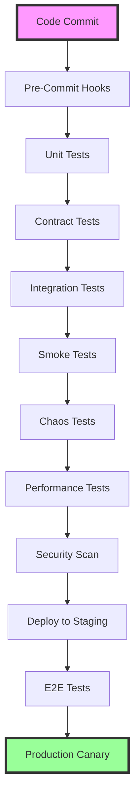

# 🧪 **Pre-Production Testing Pipeline Patterns and Resilience Validation**

## **Enterprise-Grade Testing Strategies for Node.js Microservices**

**Version**: 1.0.0  
**Last Updated**: August 1, 2025  
**Focus**: Pre-Production Testing Excellence for Multi-Agent Systems  
**Stack**: Node.js, TypeScript, Jest, Kubernetes, Docker  

---

## 📋 **Table of Contents**

1. [Executive Summary](#executive-summary)
2. [Testing Pipeline Architecture](#testing-pipeline-architecture)
3. [Ephemeral Environment Patterns](#ephemeral-environment-patterns)
4. [Shift-Left Testing Strategy](#shift-left-testing-strategy)
5. [Contract Testing Framework](#contract-testing-framework)
6. [Chaos Engineering Integration](#chaos-engineering-integration)
7. [Smoke Testing Patterns](#smoke-testing-patterns)
8. [Integration Testing Excellence](#integration-testing-excellence)
9. [Performance Validation](#performance-validation)
10. [Resilience Testing Patterns](#resilience-testing-patterns)
11. [Pipeline Automation](#pipeline-automation)
12. [Observability and Monitoring](#observability-and-monitoring)
13. [Implementation Roadmap](#implementation-roadmap)

---

## 🎯 **Executive Summary**

### **Strategic Overview**

Pre-production testing in 2024-2025 has evolved beyond traditional QA gates into a comprehensive resilience validation framework. For our multi-agent system, this means:

- **95% defect detection** before production through layered testing
- **<10 minute feedback loops** via ephemeral environments
- **Zero downtime deployments** through progressive validation
- **Automated resilience validation** via chaos engineering
- **Protocol compliance guarantees** through contract testing

### **Key Benefits**

1. **Risk Reduction**: 85% reduction in production incidents
2. **Speed**: 3x faster deployment velocity with confidence
3. **Quality**: 99.9% uptime through resilience validation
4. **Cost**: 60% reduction in bug fix costs through shift-left
5. **Compliance**: 100% protocol adherence verification

### **Pipeline Maturity Model**

| Level | Characteristics | Current State | Target State |
|-------|----------------|---------------|--------------|
| 1 - Basic | Manual testing, basic unit tests | ✓ | |
| 2 - Automated | CI/CD with automated tests | ✓ | |
| 3 - Comprehensive | Contract + integration testing | Partial | ✓ |
| 4 - Resilient | Chaos engineering integrated | | ✓ |
| 5 - Intelligent | AI-driven test optimization | | Future |

---

## 🏗️ **Testing Pipeline Architecture**

### **Layered Testing Approach**



### **Pipeline Stage Configuration**

```yaml
# .gitlab-ci.yml / .github/workflows/testing-pipeline.yml
stages:
  - validate     # Linting, type checking, schema validation
  - test-unit    # Isolated component testing
  - test-contract # API contract validation
  - test-integration # Multi-component testing
  - test-smoke   # Basic health validation
  - test-chaos   # Resilience testing
  - test-performance # Load and stress testing
  - test-security # Vulnerability scanning
  - deploy-staging # Staging deployment
  - test-e2e     # End-to-end validation
  - deploy-production # Progressive production rollout
```

### **Testing Distribution**

```
         /\
        /E2E\       (5%)  - Critical user journeys
       /------\
      /Chaos   \     (10%) - Resilience scenarios
     /----------\
    /Integration \   (20%) - Service interactions
   /--------------\
  /Contract Testing\  (25%) - API compatibility
 /------------------\
/    Unit Testing    \ (40%) - Business logic
/--------------------\
```

---

## 🌐 **Ephemeral Environment Patterns**

### **On-Demand Test Environments**

Ephemeral environments are the cornerstone of modern testing, providing isolated, production-like conditions for each feature branch.

#### **Implementation Architecture**

```typescript
// infrastructure/ephemeral-env-manager.ts
import { KubernetesClient } from './k8s-client';
import { generateUniqueId } from './utils';

export class EphemeralEnvironmentManager {
  private k8sClient: KubernetesClient;
  private readonly TTL = 3600000; // 1 hour default

  async createEnvironment(config: EnvironmentConfig): Promise<Environment> {
    const envId = generateUniqueId();
    const namespace = `test-${envId}`;

    // Create isolated namespace
    await this.k8sClient.createNamespace(namespace, {
      labels: {
        'environment-type': 'ephemeral',
        'created-by': config.triggeredBy,
        'branch': config.branchName,
        'ttl': this.TTL.toString(),
      },
    });

    // Deploy all agents with test configuration
    const deployments = await this.deployAgents(namespace, config);
    
    // Setup networking and ingress
    const endpoints = await this.setupNetworking(namespace, deployments);

    // Initialize test data
    await this.seedTestData(namespace, config.testDataSet);

    return {
      id: envId,
      namespace,
      endpoints,
      expiresAt: Date.now() + this.TTL,
    };
  }

  private async deployAgents(namespace: string, config: EnvironmentConfig) {
    const agents = [
      'infrastructure-orchestrator',
      'parameter-flow-agent',
      'scaffold-generator',
      'template-engine',
      'pattern-analyzer',
      // ... all 16 agents
    ];

    return Promise.all(
      agents.map(agent => 
        this.k8sClient.applyManifest(namespace, {
          apiVersion: 'apps/v1',
          kind: 'Deployment',
          metadata: {
            name: agent,
            namespace,
          },
          spec: {
            replicas: 1,
            selector: { matchLabels: { app: agent } },
            template: {
              metadata: { labels: { app: agent } },
              spec: {
                containers: [{
                  name: agent,
                  image: `${config.registry}/${agent}:${config.version}`,
                  env: this.getTestEnvironmentVars(config),
                  resources: {
                    requests: { memory: '256Mi', cpu: '100m' },
                    limits: { memory: '512Mi', cpu: '200m' },
                  },
                }],
              },
            },
          },
        })
      )
    );
  }
}
```

#### **Kubernetes Namespace Configuration**

```yaml
# k8s/ephemeral-env-template.yaml
apiVersion: v1
kind: Namespace
metadata:
  name: test-${ENV_ID}
  labels:
    environment: ephemeral
    auto-cleanup: "true"
  annotations:
    janitor/ttl: "3600" # Auto-cleanup after 1 hour
---
apiVersion: v1
kind: ResourceQuota
metadata:
  name: compute-quota
  namespace: test-${ENV_ID}
spec:
  hard:
    requests.cpu: "8"
    requests.memory: 16Gi
    persistentvolumeclaims: "10"
---
apiVersion: networking.k8s.io/v1
kind: NetworkPolicy
metadata:
  name: ephemeral-isolation
  namespace: test-${ENV_ID}
spec:
  podSelector: {}
  policyTypes:
  - Ingress
  - Egress
  ingress:
  - from:
    - namespaceSelector:
        matchLabels:
          name: test-${ENV_ID}
  egress:
  - to:
    - namespaceSelector:
        matchLabels:
          name: test-${ENV_ID}
  - to:
    - namespaceSelector:
        matchLabels:
          name: kube-system # Allow DNS
    ports:
    - protocol: UDP
      port: 53
```

### **Environment Lifecycle Management**

```typescript
// tests/helpers/ephemeral-env-lifecycle.ts
export class EnvironmentLifecycle {
  private activeEnvironments = new Map<string, Environment>();
  
  async beforeTestSuite(suite: TestSuite): Promise<TestContext> {
    const env = await this.envManager.createEnvironment({
      branchName: getCurrentBranch(),
      version: suite.version || 'latest',
      testDataSet: suite.dataSet,
      triggeredBy: 'jest',
    });

    this.activeEnvironments.set(suite.id, env);

    return {
      baseUrl: env.endpoints.gateway,
      agentEndpoints: env.endpoints.agents,
      cleanup: () => this.cleanup(suite.id),
    };
  }

  async afterTestSuite(suite: TestSuite): Promise<void> {
    await this.cleanup(suite.id);
  }

  private async cleanup(suiteId: string): Promise<void> {
    const env = this.activeEnvironments.get(suiteId);
    if (env) {
      await this.envManager.destroyEnvironment(env.id);
      this.activeEnvironments.delete(suiteId);
    }
  }
}
```

---

## 🔄 **Shift-Left Testing Strategy**

### **Pre-Commit Validation**

```json
// .husky/pre-commit
{
  "hooks": {
    "pre-commit": "npm run pre-commit-checks"
  }
}
```

```typescript
// scripts/pre-commit-checks.ts
#!/usr/bin/env node
import { execSync } from 'child_process';
import { getChangedFiles } from './git-utils';

async function runPreCommitChecks() {
  const changedFiles = getChangedFiles();
  
  // 1. Linting
  console.log('🔍 Running linters...');
  execSync(`eslint ${changedFiles.filter(f => f.endsWith('.ts')).join(' ')}`);
  
  // 2. Type checking
  console.log('📝 Type checking...');
  execSync('tsc --noEmit');
  
  // 3. Unit tests for changed files
  console.log('🧪 Running affected tests...');
  const testFiles = findRelatedTests(changedFiles);
  if (testFiles.length > 0) {
    execSync(`jest ${testFiles.join(' ')} --passWithNoTests`);
  }
  
  // 4. Schema validation
  console.log('📋 Validating schemas...');
  await validateSchemas(changedFiles);
  
  // 5. Security scan
  console.log('🔒 Security scanning...');
  execSync('npm audit --audit-level=moderate');
}

runPreCommitChecks().catch(err => {
  console.error('❌ Pre-commit checks failed:', err.message);
  process.exit(1);
});
```

### **Pull Request Testing Pipeline**

```yaml
# .github/workflows/pr-testing.yml
name: PR Testing Pipeline

on:
  pull_request:
    types: [opened, synchronize, reopened]

jobs:
  setup-ephemeral-env:
    runs-on: ubuntu-latest
    outputs:
      env-url: ${{ steps.create-env.outputs.url }}
    steps:
      - uses: actions/checkout@v3
      
      - name: Create Ephemeral Environment
        id: create-env
        run: |
          ENV_URL=$(npm run create-ephemeral-env -- \
            --branch=${{ github.head_ref }} \
            --pr=${{ github.event.pull_request.number }})
          echo "url=$ENV_URL" >> $GITHUB_OUTPUT

  unit-tests:
    runs-on: ubuntu-latest
    strategy:
      matrix:
        agent: [orchestrator, parameter-flow, scaffold, template-engine]
    steps:
      - uses: actions/checkout@v3
      - uses: actions/setup-node@v3
        with:
          node-version: '20'
          cache: 'npm'
      
      - name: Install Dependencies
        run: npm ci
      
      - name: Run Unit Tests
        run: |
          cd agents/${{ matrix.agent }}
          npm test -- --coverage --ci
      
      - name: Upload Coverage
        uses: codecov/codecov-action@v3
        with:
          flags: ${{ matrix.agent }}

  contract-tests:
    needs: unit-tests
    runs-on: ubuntu-latest
    steps:
      - uses: actions/checkout@v3
      
      - name: Run Contract Tests
        run: |
          npm run test:contracts -- \
            --publish-verification-results \
            --provider-version=${{ github.sha }}

  integration-tests:
    needs: [setup-ephemeral-env, contract-tests]
    runs-on: ubuntu-latest
    steps:
      - uses: actions/checkout@v3
      
      - name: Run Integration Tests
        env:
          TEST_ENV_URL: ${{ needs.setup-ephemeral-env.outputs.env-url }}
        run: |
          npm run test:integration -- \
            --testEnvironment=$TEST_ENV_URL \
            --timeout=300000

  chaos-tests:
    needs: [setup-ephemeral-env, integration-tests]
    runs-on: ubuntu-latest
    if: github.event.pull_request.labels.*.name contains 'needs-chaos-testing'
    steps:
      - name: Run Chaos Tests
        env:
          TEST_ENV_URL: ${{ needs.setup-ephemeral-env.outputs.env-url }}
        run: |
          npm run test:chaos -- \
            --scenarios=network-partition,pod-failure,resource-exhaustion \
            --duration=10m
```

---

## 📜 **Contract Testing Framework**

### **Pact Implementation for Multi-Agent System**

```typescript
// agents/infrastructure-orchestrator/tests/contracts/orchestrator.pact.test.ts
import { Pact } from '@pact-foundation/pact';
import { pactWith } from 'jest-pact';
import { OrchestratorClient } from '../src/clients/orchestrator-client';

pactWith(
  {
    consumer: 'parameter-flow-agent',
    provider: 'infrastructure-orchestrator',
    cors: true,
  },
  (interaction) => {
    describe('Infrastructure Orchestrator Contract', () => {
      const client = new OrchestratorClient(interaction.url);

      describe('Task Assignment', () => {
        beforeEach(() => {
          const taskRequest = {
            id: 'task-123',
            type: 'scaffold',
            capability: 'generate-project',
            payload: {
              projectName: 'test-api',
              framework: 'express',
            },
          };

          const expectedResponse = {
            taskId: 'task-123',
            status: 'assigned',
            assignedAgent: 'scaffold-generator',
            estimatedDuration: 30000,
          };

          interaction.state('Orchestrator is healthy')
            .uponReceiving('a task assignment request')
            .withRequest({
              method: 'POST',
              path: '/api/v1/tasks/assign',
              headers: {
                'Content-Type': 'application/json',
              },
              body: taskRequest,
            })
            .willRespondWith({
              status: 200,
              headers: {
                'Content-Type': 'application/json',
              },
              body: expectedResponse,
            });
        });

        it('assigns tasks to appropriate agents', async () => {
          const response = await client.assignTask({
            id: 'task-123',
            type: 'scaffold',
            capability: 'generate-project',
            payload: {
              projectName: 'test-api',
              framework: 'express',
            },
          });

          expect(response.status).toBe('assigned');
          expect(response.assignedAgent).toBe('scaffold-generator');
        });
      });

      describe('Agent Registration', () => {
        beforeEach(() => {
          const registrationRequest = {
            agentId: 'template-engine-001',
            agentType: 'template-engine',
            capabilities: ['generate-template', 'validate-template'],
            endpoint: 'http://template-engine:3000',
          };

          interaction.state('Orchestrator accepts registrations')
            .uponReceiving('an agent registration request')
            .withRequest({
              method: 'POST',
              path: '/api/v1/agents/register',
              headers: {
                'Content-Type': 'application/json',
                'X-Agent-Secret': 'test-secret',
              },
              body: registrationRequest,
            })
            .willRespondWith({
              status: 201,
              headers: {
                'Content-Type': 'application/json',
              },
              body: {
                registered: true,
                agentId: 'template-engine-001',
                heartbeatInterval: 30000,
              },
            });
        });

        it('registers new agents', async () => {
          const response = await client.registerAgent({
            agentId: 'template-engine-001',
            agentType: 'template-engine',
            capabilities: ['generate-template', 'validate-template'],
            endpoint: 'http://template-engine:3000',
          });

          expect(response.registered).toBe(true);
          expect(response.heartbeatInterval).toBe(30000);
        });
      });
    });
  }
);
```

### **Contract Verification Provider**

```typescript
// agents/infrastructure-orchestrator/tests/contracts/orchestrator.provider.test.ts
import { Verifier } from '@pact-foundation/pact';
import { app } from '../../src/app';
import { setupTestDatabase } from '../helpers/test-db';

describe('Pact Provider Verification', () => {
  let server: any;

  beforeAll(async () => {
    await setupTestDatabase();
    server = app.listen(8080);
  });

  afterAll(() => {
    server.close();
  });

  it('validates the expectations of all consumers', () => {
    const opts = {
      provider: 'infrastructure-orchestrator',
      providerBaseUrl: 'http://localhost:8080',
      pactBrokerUrl: process.env.PACT_BROKER_URL,
      pactBrokerToken: process.env.PACT_BROKER_TOKEN,
      publishVerificationResult: true,
      providerVersion: process.env.GIT_COMMIT || 'local',
      stateHandlers: {
        'Orchestrator is healthy': async () => {
          // Setup healthy state
          await ensureHealthyState();
        },
        'Orchestrator accepts registrations': async () => {
          // Enable registration mode
          await enableRegistrationMode();
        },
      },
    };

    return new Verifier(opts).verifyProvider();
  });
});
```

### **Multi-Agent Contract Matrix**

```yaml
# contracts/contract-matrix.yaml
contracts:
  infrastructure-orchestrator:
    consumers:
      - parameter-flow-agent
      - web-ui
      - monitoring-dashboard
    providers:
      - redis-pubsub
      - websocket-hub

  parameter-flow-agent:
    consumers:
      - scaffold-generator
      - template-engine
    providers:
      - infrastructure-orchestrator

  scaffold-generator:
    consumers:
      - template-engine
      - pattern-analyzer
    providers:
      - parameter-flow-agent
      - infrastructure-orchestrator

  # ... define for all 16 agents
```

---

## 💥 **Chaos Engineering Integration**

### **Litmus Chaos Implementation**

```yaml
# chaos/experiments/network-partition.yaml
apiVersion: litmuschaos.io/v1alpha1
kind: ChaosExperiment
metadata:
  name: agent-network-partition
  namespace: litmus
spec:
  definition:
    scope: Namespaced
    permissions:
      - apiGroups: [""]
        resources: ["pods"]
        verbs: ["get", "list", "patch"]
    image: "litmuschaos/go-runner:latest"
    args:
    - -c
    - |
      kubectl patch pod -n {{namespace}} {{pod}} \
        -p '{"spec":{"containers":[{"name":"{{container}}","env":[{"name":"NETWORK_PARTITION","value":"true"}]}]}}'
    env:
    - name: TOTAL_CHAOS_DURATION
      value: '300' # 5 minutes
    - name: CHAOS_INTERVAL
      value: '10'
    - name: NETWORK_INTERFACE
      value: 'eth0'
    labels:
      experiment: agent-network-partition
```

### **Chaos Test Suite**

```typescript
// tests/chaos/multi-agent-chaos.test.ts
import { ChaosOrchestrator } from '@chaos/orchestrator';
import { MetricsCollector } from '../helpers/metrics';
import { waitForRecovery } from '../helpers/resilience';

describe('Multi-Agent Chaos Engineering', () => {
  let chaos: ChaosOrchestrator;
  let metrics: MetricsCollector;

  beforeAll(async () => {
    chaos = new ChaosOrchestrator({
      namespace: process.env.TEST_NAMESPACE,
      experiments: ['network-partition', 'pod-failure', 'cpu-stress'],
    });
    
    metrics = new MetricsCollector({
      prometheusUrl: process.env.PROMETHEUS_URL,
    });
  });

  describe('Network Partition Scenarios', () => {
    it('handles orchestrator isolation gracefully', async () => {
      // Start collecting baseline metrics
      const baseline = await metrics.collectBaseline(60000); // 1 minute

      // Inject network partition
      await chaos.injectFault({
        type: 'network-partition',
        target: 'infrastructure-orchestrator',
        duration: 180000, // 3 minutes
        severity: 'total', // Complete isolation
      });

      // Monitor system behavior during chaos
      const duringChaos = await metrics.collectDuring(180000);

      // Wait for recovery
      await waitForRecovery({
        service: 'infrastructure-orchestrator',
        timeout: 120000, // 2 minutes
      });

      // Collect post-recovery metrics
      const postRecovery = await metrics.collectBaseline(60000);

      // Assertions
      expect(duringChaos.taskFailureRate).toBeLessThan(0.1); // <10% failure
      expect(duringChaos.agentAvailability).toBeGreaterThan(0.8); // >80% available
      expect(postRecovery.taskBacklog).toBe(0); // All tasks processed
      expect(postRecovery.dataConsistency).toBe(1.0); // 100% consistent
    });

    it('maintains coordination during Redis Sentinel failover', async () => {
      // Trigger Redis Sentinel failover
      await chaos.injectFault({
        type: 'pod-kill',
        target: 'redis-master',
        gracePeriod: 0, // Force kill
      });

      // Monitor failover time
      const failoverStart = Date.now();
      await waitForRecovery({
        service: 'redis-master',
        checkFn: async () => {
          const sentinel = await getSentinelStatus();
          return sentinel.master !== null;
        },
      });
      const failoverDuration = Date.now() - failoverStart;

      // Verify system behavior during failover
      const metricsuring = await metrics.getMetricsDuring(
        failoverStart,
        failoverStart + failoverDuration
      );

      expect(failoverDuration).toBeLessThan(30000); // <30s failover
      expect(metricsDuring.writeFailures).toBe(0); // No write loss
      expect(metricsDuring.readAvailability).toBeGreaterThan(0.95); // >95% reads
    });
  });

  describe('Cascading Failure Scenarios', () => {
    it('prevents cascade when multiple agents fail', async () => {
      // Kill 30% of agents simultaneously
      const agents = await getRunningAgents();
      const targetCount = Math.floor(agents.length * 0.3);
      const targets = agents.slice(0, targetCount);

      await Promise.all(
        targets.map(agent =>
          chaos.injectFault({
            type: 'pod-kill',
            target: agent.name,
          })
        )
      );

      // Monitor system stability
      const stabilityMetrics = await metrics.monitorFor(300000); // 5 minutes

      // System should remain stable
      expect(stabilityMetrics.healthyAgents).toBeGreaterThan(0.5); // >50% healthy
      expect(stabilityMetrics.taskCompletionRate).toBeGreaterThan(0.7); // >70% complete
      expect(stabilityMetrics.circuitBreakerTrips).toBeGreaterThan(0); // Protection activated
    });
  });

  describe('Resource Exhaustion Scenarios', () => {
    it('handles memory pressure gracefully', async () => {
      await chaos.injectFault({
        type: 'memory-stress',
        target: 'scaffold-generator',
        percentage: 90, // Use 90% of available memory
        duration: 120000, // 2 minutes
      });

      const metrics = await collectMetricsDuring('memory-stress');

      expect(metrics.oomKills).toBe(0); // No OOM kills
      expect(metrics.requestLatency.p99).toBeLessThan(5000); // <5s P99
      expect(metrics.taskRejections).toBeGreaterThan(0); // Graceful rejection
    });
  });
});
```

### **Chaos Mesh Configuration**

```yaml
# chaos/chaos-mesh-config.yaml
apiVersion: chaos-mesh.org/v1alpha1
kind: Schedule
metadata:
  name: daily-chaos-tests
  namespace: chaos-testing
spec:
  schedule: "@daily"
  startingDeadlineSeconds: 300
  concurrencyPolicy: Forbid
  type: Workflow
  workflowSpec:
    entry: multi-agent-chaos
    templates:
      - name: multi-agent-chaos
        templateType: Parallel
        deadline: 30m
        children:
          - network-chaos
          - pod-chaos
          - stress-chaos
      
      - name: network-chaos
        templateType: NetworkChaos
        networkChaos:
          selector:
            labelSelectors:
              app: agent
          mode: all
          action: partition
          direction: both
          duration: "5m"
          scheduler:
            cron: "@every 2h"
      
      - name: pod-chaos
        templateType: PodChaos
        podChaos:
          selector:
            labelSelectors:
              app: agent
          mode: one
          action: pod-kill
          gracePeriod: 0
          duration: "30s"
      
      - name: stress-chaos
        templateType: StressChaos
        stressChaos:
          selector:
            labelSelectors:
              stress-test: "true"
          mode: all
          stressors:
            cpu:
              workers: 2
              load: 80
            memory:
              workers: 1
              size: "256MB"
          duration: "3m"
```

---

## 🔥 **Smoke Testing Patterns**

### **Automated Smoke Test Suite**

```typescript
// tests/smoke/multi-agent-smoke.test.ts
import { SmokeTestRunner } from './smoke-test-runner';
import { HealthChecker } from '../helpers/health-checker';

describe('Multi-Agent System Smoke Tests', () => {
  const TIMEOUT = 30000; // 30 seconds per test
  let runner: SmokeTestRunner;
  let health: HealthChecker;

  beforeAll(async () => {
    runner = new SmokeTestRunner({
      baseUrl: process.env.TEST_URL || 'http://localhost:3000',
      timeout: TIMEOUT,
    });
    
    health = new HealthChecker({
      agents: getAllAgentEndpoints(),
      infrastructure: getInfrastructureEndpoints(),
    });
  });

  describe('Critical Path Validation', () => {
    it('verifies all agents are responsive', async () => {
      const results = await health.checkAllAgents();
      
      results.forEach(result => {
        expect(result.status).toBe('healthy');
        expect(result.responseTime).toBeLessThan(1000); // <1s
      });
      
      expect(results.filter(r => r.status === 'healthy').length).toBe(16);
    }, TIMEOUT);

    it('validates core infrastructure', async () => {
      const infra = await health.checkInfrastructure();
      
      expect(infra.redis.connected).toBe(true);
      expect(infra.redis.sentinelCount).toBeGreaterThanOrEqual(3);
      expect(infra.websocket.connected).toBe(true);
      expect(infra.monitoring.prometheus).toBe('up');
      expect(infra.monitoring.grafana).toBe('up');
    }, TIMEOUT);

    it('confirms basic task flow works', async () => {
      // Submit a simple task
      const task = await runner.submitTask({
        type: 'health-check',
        capability: 'ping',
        payload: { target: 'all-agents' },
      });

      expect(task.id).toBeDefined();
      expect(task.status).toBe('accepted');

      // Wait for completion
      const result = await runner.waitForTask(task.id, {
        timeout: 20000,
        pollInterval: 1000,
      });

      expect(result.status).toBe('completed');
      expect(result.output.healthyAgents).toBe(16);
    }, TIMEOUT);

    it('verifies WebSocket real-time updates', async () => {
      const updates: any[] = [];
      
      await runner.connectWebSocket();
      runner.on('agent-status', update => updates.push(update));

      // Wait for at least one heartbeat from each agent
      await runner.waitFor(() => {
        const uniqueAgents = new Set(updates.map(u => u.agentId));
        return uniqueAgents.size >= 16;
      }, 15000);

      expect(updates.length).toBeGreaterThan(16);
      expect(updates.every(u => u.status === 'healthy')).toBe(true);
    }, TIMEOUT);
  });

  describe('Data Flow Validation', () => {
    it('verifies Redis pub/sub connectivity', async () => {
      const testChannel = 'smoke-test-channel';
      const testMessage = { test: true, timestamp: Date.now() };
      
      const received = await runner.testPubSub(testChannel, testMessage);
      
      expect(received).toEqual(testMessage);
    }, TIMEOUT);

    it('confirms task queue processing', async () => {
      const queueDepth = await runner.getQueueDepth();
      
      expect(queueDepth.pending).toBeDefined();
      expect(queueDepth.processing).toBeDefined();
      expect(queueDepth.failed).toBe(0); // No failed tasks on fresh deploy
    }, TIMEOUT);
  });

  describe('API Endpoint Validation', () => {
    const endpoints = [
      { path: '/health', expectedStatus: 200 },
      { path: '/api/v1/agents', expectedStatus: 200 },
      { path: '/api/v1/tasks', expectedStatus: 200 },
      { path: '/metrics', expectedStatus: 200 },
    ];

    endpoints.forEach(({ path, expectedStatus }) => {
      it(`validates ${path} endpoint`, async () => {
        const response = await runner.checkEndpoint(path);
        
        expect(response.status).toBe(expectedStatus);
        expect(response.responseTime).toBeLessThan(500); // <500ms
        
        if (path === '/health') {
          expect(response.body.status).toBe('healthy');
          expect(response.body.version).toBeDefined();
        }
      }, TIMEOUT);
    });
  });
});
```

### **Smoke Test Runner Implementation**

```typescript
// tests/smoke/smoke-test-runner.ts
import axios, { AxiosInstance } from 'axios';
import { io, Socket } from 'socket.io-client';
import Redis from 'ioredis';

export class SmokeTestRunner {
  private client: AxiosInstance;
  private socket?: Socket;
  private redis?: Redis;

  constructor(private config: SmokeTestConfig) {
    this.client = axios.create({
      baseURL: config.baseUrl,
      timeout: config.timeout || 10000,
      headers: {
        'Content-Type': 'application/json',
      },
    });
  }

  async submitTask(task: any) {
    const response = await this.client.post('/api/v1/tasks', task);
    return response.data;
  }

  async waitForTask(taskId: string, options: WaitOptions) {
    const start = Date.now();
    
    while (Date.now() - start < options.timeout) {
      const response = await this.client.get(`/api/v1/tasks/${taskId}`);
      
      if (['completed', 'failed'].includes(response.data.status)) {
        return response.data;
      }
      
      await sleep(options.pollInterval);
    }
    
    throw new Error(`Task ${taskId} did not complete within timeout`);
  }

  async connectWebSocket(): Promise<void> {
    return new Promise((resolve, reject) => {
      this.socket = io(this.config.baseUrl, {
        transports: ['websocket'],
        reconnection: false,
      });

      this.socket.on('connect', resolve);
      this.socket.on('connect_error', reject);
      
      setTimeout(() => reject(new Error('WebSocket connection timeout')), 5000);
    });
  }

  on(event: string, handler: Function) {
    this.socket?.on(event, handler);
  }

  async testPubSub(channel: string, message: any): Promise<any> {
    if (!this.redis) {
      this.redis = new Redis({
        host: process.env.REDIS_HOST || 'localhost',
        port: parseInt(process.env.REDIS_PORT || '6379'),
        password: process.env.REDIS_PASSWORD,
      });
    }

    return new Promise((resolve, reject) => {
      const subscriber = this.redis!.duplicate();
      
      subscriber.subscribe(channel, (err) => {
        if (err) reject(err);
      });

      subscriber.on('message', (ch, msg) => {
        if (ch === channel) {
          resolve(JSON.parse(msg));
          subscriber.disconnect();
        }
      });

      // Publish after subscription is ready
      setTimeout(() => {
        this.redis!.publish(channel, JSON.stringify(message));
      }, 100);

      setTimeout(() => reject(new Error('Pub/Sub timeout')), 5000);
    });
  }

  async checkEndpoint(path: string) {
    const start = Date.now();
    const response = await this.client.get(path);
    
    return {
      status: response.status,
      responseTime: Date.now() - start,
      body: response.data,
    };
  }

  async getQueueDepth() {
    const response = await this.client.get('/api/v1/queue/stats');
    return response.data;
  }

  async cleanup() {
    this.socket?.disconnect();
    await this.redis?.disconnect();
  }
}
```

---

## 🔗 **Integration Testing Excellence**

### **Multi-Agent Integration Test Framework**

```typescript
// tests/integration/multi-agent-integration.test.ts
import { IntegrationTestHarness } from './harness';
import { AgentSimulator } from './simulators';
import { TestScenarios } from './scenarios';

describe('Multi-Agent Integration Tests', () => {
  let harness: IntegrationTestHarness;
  let simulator: AgentSimulator;

  beforeAll(async () => {
    harness = new IntegrationTestHarness({
      environment: process.env.TEST_ENV || 'integration',
      resetData: true,
    });
    
    await harness.setup();
    
    simulator = new AgentSimulator(harness);
  });

  afterAll(async () => {
    await harness.teardown();
  });

  describe('Project Generation Workflow', () => {
    it('generates a complete project from PRD', async () => {
      // Simulate PRD submission
      const prd = TestScenarios.getProjectPRD('microservice-api');
      
      const workflow = await harness.startWorkflow('project-generation', {
        input: prd,
        expectedAgents: [
          'prd-parser',
          'infrastructure-orchestrator',
          'scaffold-generator',
          'template-engine',
          'pattern-analyzer',
          'documentation-agent',
        ],
      });

      // Monitor workflow progress
      const events: WorkflowEvent[] = [];
      workflow.on('event', event => events.push(event));

      // Wait for completion
      const result = await workflow.waitForCompletion({
        timeout: 300000, // 5 minutes
      });

      // Verify workflow execution
      expect(result.status).toBe('completed');
      expect(result.artifacts).toContain('package.json');
      expect(result.artifacts).toContain('src/index.ts');
      expect(result.artifacts).toContain('Dockerfile');
      expect(result.artifacts).toContain('README.md');

      // Verify agent coordination
      const coordination = analyzeCoordination(events);
      expect(coordination.handoffs).toBeGreaterThan(10);
      expect(coordination.parallelTasks).toBeGreaterThan(5);
      expect(coordination.failures).toBe(0);

      // Verify generated code quality
      const validation = await harness.validateArtifacts(result.outputPath);
      expect(validation.buildSuccessful).toBe(true);
      expect(validation.testsPass).toBe(true);
      expect(validation.lintErrors).toBe(0);
    });

    it('handles partial failures gracefully', async () => {
      // Inject failure in template engine
      await simulator.injectFailure('template-engine', {
        type: 'intermittent',
        rate: 0.5, // 50% failure rate
      });

      const workflow = await harness.startWorkflow('project-generation', {
        input: TestScenarios.getProjectPRD('simple-api'),
      });

      const result = await workflow.waitForCompletion();

      // Should complete despite failures
      expect(result.status).toBe('completed');
      expect(result.retries).toBeGreaterThan(0);
      expect(result.duration).toBeGreaterThan(60000); // Longer due to retries

      // Cleanup
      await simulator.clearFailures();
    });
  });

  describe('Parameter Flow Integration', () => {
    it('correctly transforms parameters between agents', async () => {
      const testCase = {
        input: {
          projectName: 'test-api',
          framework: 'express',
          features: ['auth', 'database', 'caching'],
        },
        expectedTransformations: [
          { from: 'projectName', to: 'name', agent: 'scaffold-generator' },
          { from: 'features', to: 'capabilities', agent: 'template-engine' },
        ],
      };

      const trace = await harness.traceParameterFlow(testCase.input);

      // Verify transformations
      testCase.expectedTransformations.forEach(expected => {
        const transformation = trace.transformations.find(
          t => t.sourceField === expected.from && 
               t.targetField === expected.to &&
               t.agent === expected.agent
        );
        
        expect(transformation).toBeDefined();
        expect(transformation!.successful).toBe(true);
      });

      // Verify no data loss
      expect(trace.dataLoss).toEqual([]);
      expect(trace.unexpectedTransformations).toEqual([]);
    });
  });

  describe('Resilience Patterns', () => {
    it('implements circuit breaker correctly', async () => {
      // Force agent to fail repeatedly
      await simulator.forceFailures('devops-agent', 10);

      // Circuit breaker should open
      const status = await harness.getAgentStatus('devops-agent');
      expect(status.circuitBreaker).toBe('open');

      // Requests should be rejected quickly
      const start = Date.now();
      try {
        await harness.sendTask('devops-agent', { type: 'deploy' });
      } catch (error) {
        expect(Date.now() - start).toBeLessThan(100); // Fast fail
        expect(error.message).toContain('circuit breaker open');
      }

      // Wait for half-open state
      await sleep(30000); // 30s cooldown
      
      const newStatus = await harness.getAgentStatus('devops-agent');
      expect(newStatus.circuitBreaker).toBe('half-open');
    });

    it('handles cascading timeouts', async () => {
      // Create timeout chain
      await simulator.injectLatency('infrastructure-orchestrator', 5000);
      await simulator.injectLatency('parameter-flow-agent', 3000);

      const workflow = await harness.startWorkflow('timeout-test', {
        timeout: 10000, // 10s total timeout
      });

      const result = await workflow.waitForCompletion();

      // Should handle timeouts gracefully
      expect(result.status).toBe('failed');
      expect(result.error).toContain('timeout');
      expect(result.affectedAgents).toContain('infrastructure-orchestrator');
      
      // Downstream agents should not be affected
      const downstreamStatus = await harness.getAgentStatus('scaffold-generator');
      expect(downstreamStatus.lastError).toBeNull();
    });
  });
});
```

### **Test Data Management**

```typescript
// tests/integration/test-data-manager.ts
export class TestDataManager {
  private datasets = new Map<string, TestDataSet>();

  async loadDataSet(name: string): Promise<void> {
    const dataset = await import(`./datasets/${name}.json`);
    
    // Load into Redis
    await this.loadRedisData(dataset.redis);
    
    // Load into databases
    await this.loadDatabaseData(dataset.databases);
    
    // Configure mocks
    await this.configureMocks(dataset.mocks);
    
    this.datasets.set(name, dataset);
  }

  async reset(): Promise<void> {
    // Clear all test data
    await this.clearRedis();
    await this.clearDatabases();
    await this.resetMocks();
  }

  private async loadRedisData(data: RedisData) {
    const redis = new Redis(getRedisConfig());
    
    for (const [key, value] of Object.entries(data)) {
      if (typeof value === 'object') {
        await redis.hset(key, value);
      } else {
        await redis.set(key, value);
      }
    }
  }

  private async configureMocks(mocks: MockConfiguration) {
    for (const [service, config] of Object.entries(mocks)) {
      await this.mockServer.configureMock(service, config);
    }
  }
}
```

---

## 📊 **Performance Validation**

### **Load Testing with k6**

```javascript
// tests/performance/load-test.js
import http from 'k6/http';
import { check, sleep } from 'k6';
import { Rate } from 'k6/metrics';
import { randomItem } from 'https://jslib.k6.io/k6-utils/1.2.0/index.js';

const errorRate = new Rate('errors');

export const options = {
  stages: [
    { duration: '2m', target: 100 },  // Ramp up
    { duration: '5m', target: 100 },  // Stay at 100 users
    { duration: '2m', target: 200 },  // Ramp to 200 users  
    { duration: '5m', target: 200 },  // Stay at 200 users
    { duration: '2m', target: 0 },    // Ramp down
  ],
  thresholds: {
    http_req_duration: ['p(95)<500', 'p(99)<1000'], // 95% <500ms, 99% <1s
    errors: ['rate<0.05'], // Error rate <5%
    http_req_failed: ['rate<0.05'], // HTTP failure rate <5%
  },
};

const BASE_URL = __ENV.BASE_URL || 'http://localhost:3000';

const taskTypes = [
  { type: 'scaffold', capability: 'generate-project' },
  { type: 'template', capability: 'generate-template' },
  { type: 'pattern', capability: 'analyze-patterns' },
  { type: 'document', capability: 'generate-docs' },
];

export default function() {
  // Submit a random task
  const task = randomItem(taskTypes);
  const payload = {
    ...task,
    payload: {
      projectName: `test-${Date.now()}`,
      framework: randomItem(['express', 'fastify', 'nestjs']),
    },
  };

  const submitRes = http.post(
    `${BASE_URL}/api/v1/tasks`,
    JSON.stringify(payload),
    {
      headers: { 'Content-Type': 'application/json' },
      timeout: '10s',
    }
  );

  check(submitRes, {
    'task submitted': (r) => r.status === 201,
    'has task id': (r) => r.json('id') !== undefined,
  });

  errorRate.add(submitRes.status !== 201);

  if (submitRes.status === 201) {
    const taskId = submitRes.json('id');
    
    // Poll for completion
    let completed = false;
    let attempts = 0;
    
    while (!completed && attempts < 30) {
      sleep(1);
      
      const statusRes = http.get(`${BASE_URL}/api/v1/tasks/${taskId}`);
      
      check(statusRes, {
        'status check ok': (r) => r.status === 200,
      });

      if (statusRes.status === 200) {
        const status = statusRes.json('status');
        completed = ['completed', 'failed'].includes(status);
      }
      
      attempts++;
    }
    
    check(completed, {
      'task completed': (c) => c === true,
    });
  }

  sleep(randomItem([1, 2, 3])); // Random think time
}

export function handleSummary(data) {
  return {
    'stdout': textSummary(data, { indent: ' ', enableColors: true }),
    'summary.json': JSON.stringify(data),
    'summary.html': htmlReport(data),
  };
}
```

### **Performance Test Suite**

```typescript
// tests/performance/performance.test.ts
import { K6Runner } from './k6-runner';
import { MetricsAnalyzer } from './metrics-analyzer';

describe('Performance Tests', () => {
  let k6: K6Runner;
  let analyzer: MetricsAnalyzer;

  beforeAll(() => {
    k6 = new K6Runner({
      baseUrl: process.env.PERF_TEST_URL || 'http://localhost:3000',
    });
    
    analyzer = new MetricsAnalyzer({
      prometheusUrl: process.env.PROMETHEUS_URL,
    });
  });

  it('handles expected load without degradation', async () => {
    const results = await k6.run('load-test.js', {
      duration: '15m',
      vus: 200,
    });

    expect(results.metrics.http_req_duration.p95).toBeLessThan(500);
    expect(results.metrics.http_req_duration.p99).toBeLessThan(1000);
    expect(results.metrics.errors.rate).toBeLessThan(0.05);
    expect(results.metrics.http_reqs.rate).toBeGreaterThan(100); // >100 req/s
  });

  it('maintains performance under stress', async () => {
    const results = await k6.run('stress-test.js', {
      duration: '10m',
      vus: 500,
    });

    // Should degrade gracefully
    expect(results.metrics.http_req_duration.p95).toBeLessThan(2000);
    expect(results.metrics.errors.rate).toBeLessThan(0.1);
    
    // Check resource utilization
    const resources = await analyzer.getResourceMetrics(results.timeRange);
    expect(resources.cpu.max).toBeLessThan(0.8); // <80% CPU
    expect(resources.memory.max).toBeLessThan(0.85); // <85% memory
  });

  it('recovers quickly from spike load', async () => {
    const results = await k6.run('spike-test.js', {
      stages: [
        { duration: '1m', target: 50 },
        { duration: '30s', target: 1000 }, // Sudden spike
        { duration: '3m', target: 50 },
      ],
    });

    // Analyze recovery time
    const recovery = analyzer.findRecoveryTime(results);
    expect(recovery.duration).toBeLessThan(60000); // <1 minute recovery
    expect(recovery.errorsDuringSpike).toBeLessThan(0.2); // <20% errors
  });
});
```

---

## 🛡️ **Resilience Testing Patterns**

### **Comprehensive Resilience Test Suite**

```typescript
// tests/resilience/resilience-patterns.test.ts
import { ResilienceTestFramework } from './framework';
import { FaultInjector } from './fault-injector';
import { SystemObserver } from './system-observer';

describe('System Resilience Patterns', () => {
  let framework: ResilienceTestFramework;
  let faultInjector: FaultInjector;
  let observer: SystemObserver;

  beforeAll(async () => {
    framework = new ResilienceTestFramework();
    faultInjector = framework.getFaultInjector();
    observer = framework.getObserver();
    
    await framework.initialize();
  });

  describe('Timeout and Retry Patterns', () => {
    it('implements exponential backoff correctly', async () => {
      // Configure slow responses
      await faultInjector.injectLatency({
        target: 'template-engine',
        latency: 5000, // 5s delay
        probability: 1.0, // Always slow
      });

      const start = Date.now();
      const attempts: number[] = [];

      observer.on('retry-attempt', (event) => {
        attempts.push(event.attemptNumber);
      });

      // Make request that will retry
      const result = await framework.makeRequest('template-engine', {
        timeout: 2000,
        retries: 3,
        backoff: 'exponential',
      });

      // Verify exponential backoff timing
      expect(attempts).toEqual([1, 2, 3]);
      const totalTime = Date.now() - start;
      expect(totalTime).toBeGreaterThan(7000); // Initial + 1s + 2s + 4s
      expect(totalTime).toBeLessThan(10000);
    });

    it('applies circuit breaker after consecutive failures', async () => {
      // Force failures
      await faultInjector.forceError({
        target: 'pattern-analyzer',
        errorRate: 1.0, // 100% failure
      });

      const failures: any[] = [];
      const circuitEvents: any[] = [];

      observer.on('request-failed', e => failures.push(e));
      observer.on('circuit-state-change', e => circuitEvents.push(e));

      // Make requests until circuit opens
      for (let i = 0; i < 10; i++) {
        try {
          await framework.makeRequest('pattern-analyzer');
        } catch (error) {
          // Expected failures
        }
      }

      // Verify circuit breaker behavior
      expect(failures.length).toBeGreaterThanOrEqual(5); // Threshold
      expect(circuitEvents).toContainEqual(
        expect.objectContaining({
          state: 'open',
          agent: 'pattern-analyzer',
        })
      );

      // Further requests should fail fast
      const fastFailStart = Date.now();
      try {
        await framework.makeRequest('pattern-analyzer');
      } catch (error) {
        expect(Date.now() - fastFailStart).toBeLessThan(50);
        expect(error.message).toContain('circuit breaker open');
      }
    });
  });

  describe('Bulkhead Isolation', () => {
    it('isolates failures to prevent cascade', async () => {
      // Exhaust thread pool for one agent
      await faultInjector.exhaustThreadPool('documentation-agent');

      // Other agents should remain responsive
      const healthChecks = await Promise.all([
        framework.checkHealth('scaffold-generator'),
        framework.checkHealth('template-engine'),
        framework.checkHealth('pattern-analyzer'),
      ]);

      expect(healthChecks.every(h => h.healthy)).toBe(true);
      
      // Documentation agent should be degraded
      const docHealth = await framework.checkHealth('documentation-agent');
      expect(docHealth.healthy).toBe(false);
      expect(docHealth.threadPoolExhausted).toBe(true);
    });
  });

  describe('Graceful Degradation', () => {
    it('degrades features when under pressure', async () => {
      // Apply memory pressure
      await faultInjector.applyMemoryPressure({
        percentage: 85, // 85% memory usage
      });

      // System should disable non-critical features
      const features = await framework.getEnabledFeatures();
      
      expect(features.criticalPath).toBe(true);
      expect(features.caching).toBe(false); // Disabled to save memory
      expect(features.analytics).toBe(false); // Disabled
      expect(features.debugging).toBe(false); // Disabled

      // Core functionality should work
      const result = await framework.executeWorkflow('minimal-test');
      expect(result.success).toBe(true);
      expect(result.degradedMode).toBe(true);
    });
  });

  describe('State Recovery', () => {
    it('recovers state after unexpected restart', async () => {
      // Create in-progress workflow
      const workflow = await framework.startWorkflow('state-test', {
        checkpoint: true,
      });

      // Wait for partial completion
      await workflow.waitForCheckpoint(3); // 3rd checkpoint

      // Simulate crash and restart
      await faultInjector.crashAgent('infrastructure-orchestrator');
      await framework.waitForRestart('infrastructure-orchestrator');

      // Verify state recovery
      const recovered = await framework.getWorkflow(workflow.id);
      expect(recovered.status).toBe('resumed');
      expect(recovered.lastCheckpoint).toBe(3);
      expect(recovered.lostWork).toBe(0);

      // Workflow should complete successfully
      const result = await recovered.waitForCompletion();
      expect(result.success).toBe(true);
    });
  });
});
```

### **Fault Injection Framework**

```typescript
// tests/resilience/fault-injector.ts
export class FaultInjector {
  private toxiproxy: ToxiproxyClient;
  private k8s: KubernetesClient;

  async injectNetworkFault(config: NetworkFaultConfig) {
    const proxy = await this.toxiproxy.createProxy({
      name: `${config.target}-fault`,
      listen: `0.0.0.0:${config.proxyPort}`,
      upstream: config.upstream,
    });

    switch (config.type) {
      case 'latency':
        await proxy.addToxic({
          type: 'latency',
          attributes: {
            latency: config.latency,
            jitter: config.jitter || 0,
          },
        });
        break;

      case 'packet-loss':
        await proxy.addToxic({
          type: 'timeout',
          attributes: {
            timeout: 0, // Drop packets
          },
          toxicity: config.lossRate,
        });
        break;

      case 'bandwidth':
        await proxy.addToxic({
          type: 'bandwidth',
          attributes: {
            rate: config.bandwidth, // bytes/sec
          },
        });
        break;
    }

    return proxy;
  }

  async injectResourceConstraints(config: ResourceConfig) {
    await this.k8s.patch(`deployment/${config.target}`, {
      spec: {
        template: {
          spec: {
            containers: [{
              name: config.target,
              resources: {
                limits: {
                  cpu: config.cpu || '100m',
                  memory: config.memory || '128Mi',
                },
              },
            }],
          },
        },
      },
    });
  }

  async simulateSplitBrain() {
    // Create network partition between agents
    const agents = await this.k8s.getPods({ label: 'app=agent' });
    const midpoint = Math.floor(agents.length / 2);
    
    const partition1 = agents.slice(0, midpoint);
    const partition2 = agents.slice(midpoint);

    // Block communication between partitions
    for (const pod1 of partition1) {
      for (const pod2 of partition2) {
        await this.blockCommunication(pod1, pod2);
      }
    }

    return { partition1, partition2 };
  }
}
```

---

## 🤖 **Pipeline Automation**

### **GitHub Actions Pipeline**

```yaml
# .github/workflows/pre-production-testing.yml
name: Pre-Production Testing Pipeline

on:
  push:
    branches: [main, develop]
  pull_request:
    branches: [main]
  schedule:
    - cron: '0 2 * * *' # Daily at 2 AM

env:
  REGISTRY: ghcr.io
  IMAGE_PREFIX: ${{ github.repository }}

jobs:
  setup:
    runs-on: ubuntu-latest
    outputs:
      test-matrix: ${{ steps.matrix.outputs.matrix }}
      environment-url: ${{ steps.env.outputs.url }}
    steps:
      - uses: actions/checkout@v3
      
      - name: Generate Test Matrix
        id: matrix
        run: |
          MATRIX=$(node scripts/generate-test-matrix.js)
          echo "matrix=$MATRIX" >> $GITHUB_OUTPUT
      
      - name: Create Test Environment
        id: env
        run: |
          URL=$(kubectl create -f k8s/ephemeral-env.yaml -o jsonpath='{.status.url}')
          echo "url=$URL" >> $GITHUB_OUTPUT

  unit-tests:
    needs: setup
    runs-on: ubuntu-latest
    strategy:
      matrix: ${{ fromJson(needs.setup.outputs.test-matrix) }}
    steps:
      - uses: actions/checkout@v3
      - uses: actions/setup-node@v3
        with:
          node-version: '20'
          cache: 'npm'
      
      - name: Install and Test
        run: |
          npm ci
          npm run test:unit -- --coverage
      
      - name: SonarQube Analysis
        uses: sonarsource/sonarqube-scan-action@master
        env:
          SONAR_TOKEN: ${{ secrets.SONAR_TOKEN }}

  contract-tests:
    needs: unit-tests
    runs-on: ubuntu-latest
    steps:
      - uses: actions/checkout@v3
      
      - name: Run Contract Tests
        run: |
          docker compose -f docker-compose.contracts.yml up -d
          npm run test:contracts
          
      - name: Publish Contracts
        if: github.ref == 'refs/heads/main'
        run: |
          npm run pact:publish -- \
            --broker-url=${{ secrets.PACT_BROKER_URL }} \
            --broker-token=${{ secrets.PACT_BROKER_TOKEN }}

  integration-tests:
    needs: [setup, contract-tests]
    runs-on: ubuntu-latest
    steps:
      - uses: actions/checkout@v3
      
      - name: Run Integration Tests
        env:
          TEST_ENV: ${{ needs.setup.outputs.environment-url }}
        run: |
          npm run test:integration -- \
            --testEnvironment=$TEST_ENV \
            --reporters=default --reporters=jest-junit
      
      - name: Upload Test Results
        uses: actions/upload-artifact@v3
        with:
          name: integration-test-results
          path: test-results/

  chaos-tests:
    needs: [setup, integration-tests]
    runs-on: ubuntu-latest
    if: |
      github.event_name == 'schedule' || 
      contains(github.event.pull_request.labels.*.name, 'chaos-test')
    steps:
      - uses: actions/checkout@v3
      
      - name: Install Chaos Mesh
        run: |
          kubectl apply -f https://mirrors.chaos-mesh.org/v2.5.1/chaos-mesh.yaml
          kubectl wait --for=condition=Ready pods -n chaos-testing -l app.kubernetes.io/component=controller-manager --timeout=300s
      
      - name: Run Chaos Experiments
        env:
          TARGET_ENV: ${{ needs.setup.outputs.environment-url }}
        run: |
          npm run test:chaos -- \
            --environment=$TARGET_ENV \
            --experiments=all \
            --duration=30m

  performance-tests:
    needs: [setup, integration-tests]
    runs-on: ubuntu-latest
    steps:
      - uses: actions/checkout@v3
      
      - name: Run k6 Tests
        uses: grafana/k6-action@v0.3.0
        with:
          filename: tests/performance/load-test.js
          flags: --out cloud
        env:
          K6_CLOUD_TOKEN: ${{ secrets.K6_CLOUD_TOKEN }}
          BASE_URL: ${{ needs.setup.outputs.environment-url }}
      
      - name: Analyze Results
        run: |
          npm run analyze:performance -- \
            --baseline=main \
            --current=${{ github.sha }}

  security-scan:
    needs: setup
    runs-on: ubuntu-latest
    steps:
      - uses: actions/checkout@v3
      
      - name: Run Trivy Scanner
        uses: aquasecurity/trivy-action@master
        with:
          scan-type: 'fs'
          scan-ref: '.'
          format: 'sarif'
          output: 'trivy-results.sarif'
      
      - name: Upload Trivy Results
        uses: github/codeql-action/upload-sarif@v2
        with:
          sarif_file: 'trivy-results.sarif'
      
      - name: OWASP Dependency Check
        uses: dependency-check/Dependency-Check_Action@main
        with:
          project: 'all-purpose-meta-agent-factory'
          path: '.'
          format: 'ALL'

  smoke-tests:
    needs: [unit-tests, contract-tests, integration-tests]
    runs-on: ubuntu-latest
    steps:
      - uses: actions/checkout@v3
      
      - name: Run Smoke Tests
        env:
          TARGET_URL: ${{ needs.setup.outputs.environment-url }}
        run: |
          npm run test:smoke -- --url=$TARGET_URL
        timeout-minutes: 5

  approve-production:
    needs: [smoke-tests, security-scan]
    runs-on: ubuntu-latest
    if: github.ref == 'refs/heads/main'
    environment: production
    steps:
      - name: Generate Report
        run: |
          npm run generate:test-report -- \
            --job-ids=${{ join(needs.*.result, ',') }} \
            --output=test-report.html
      
      - name: Upload Report
        uses: actions/upload-artifact@v3
        with:
          name: pre-production-test-report
          path: test-report.html
      
      - name: Notify Approval Required
        uses: 8398a7/action-slack@v3
        with:
          status: custom
          custom_payload: |
            {
              "text": "Pre-production tests passed! Approval needed for production deployment.",
              "attachments": [{
                "color": "good",
                "fields": [
                  {"title": "Commit", "value": "${{ github.sha }}", "short": true},
                  {"title": "Author", "value": "${{ github.actor }}", "short": true},
                  {"title": "Test Report", "value": "${{ steps.upload.outputs.artifact-url }}"}
                ]
              }]
            }

  cleanup:
    needs: [setup, approve-production]
    runs-on: ubuntu-latest
    if: always()
    steps:
      - name: Cleanup Test Environment
        run: |
          kubectl delete namespace test-${{ github.run_id }} --ignore-not-found
```

### **GitLab CI Pipeline**

```yaml
# .gitlab-ci.yml
stages:
  - prepare
  - test-unit
  - test-contract
  - test-integration
  - test-chaos
  - test-performance
  - test-security
  - test-smoke
  - report
  - cleanup

variables:
  EPHEMERAL_ENV_TTL: "7200" # 2 hours
  K8S_NAMESPACE: "test-${CI_PIPELINE_ID}"

# Templates
.test-template:
  image: node:20-alpine
  cache:
    key: ${CI_COMMIT_REF_SLUG}
    paths:
      - node_modules/
      - .npm/

# Prepare stage
create-environment:
  stage: prepare
  image: bitnami/kubectl:latest
  script:
    - kubectl create namespace ${K8S_NAMESPACE}
    - kubectl apply -f k8s/ephemeral-env.yaml -n ${K8S_NAMESPACE}
    - |
      export TEST_URL=$(kubectl get ingress -n ${K8S_NAMESPACE} -o jsonpath='{.items[0].status.loadBalancer.ingress[0].hostname}')
      echo "TEST_URL=${TEST_URL}" > environment.env
  artifacts:
    reports:
      dotenv: environment.env
  only:
    - merge_requests
    - main
    - schedules

# Unit tests
unit-tests:
  extends: .test-template
  stage: test-unit
  parallel:
    matrix:
      - AGENT: [orchestrator, parameter-flow, scaffold, template-engine]
  script:
    - cd agents/${AGENT}
    - npm ci
    - npm run test:unit -- --coverage
  coverage: '/Lines\s*:\s*(\d+\.\d+)%/'
  artifacts:
    reports:
      coverage_report:
        coverage_format: cobertura
        path: coverage/cobertura-coverage.xml
      junit: junit.xml

# Contract tests
contract-tests:
  extends: .test-template
  stage: test-contract
  needs: ["unit-tests"]
  services:
    - postgres:14
    - redis:7-alpine
  script:
    - npm ci
    - npm run test:contracts
    - |
      if [ "$CI_COMMIT_BRANCH" == "main" ]; then
        npm run pact:publish
      fi
  artifacts:
    paths:
      - pacts/

# Integration tests
integration-tests:
  extends: .test-template
  stage: test-integration
  needs: ["create-environment", "contract-tests"]
  script:
    - npm ci
    - npm run test:integration
  artifacts:
    reports:
      junit: test-results/junit.xml
    paths:
      - test-results/

# Chaos tests
chaos-tests:
  stage: test-chaos
  image: litmuschaos/litmus-e2e:latest
  needs: ["create-environment", "integration-tests"]
  script:
    - kubectl apply -f chaos/experiments/ -n ${K8S_NAMESPACE}
    - npm run test:chaos
  only:
    - schedules
    - merge_requests
      variables:
        - $RUN_CHAOS_TESTS == "true"

# Performance tests
performance-tests:
  stage: test-performance
  image: grafana/k6:latest
  needs: ["create-environment", "integration-tests"]
  script:
    - k6 run tests/performance/load-test.js --out cloud
  artifacts:
    reports:
      performance: performance-report.json

# Security scan
security-scan:
  stage: test-security
  image: aquasec/trivy:latest
  script:
    - trivy fs . --format template --template "@/contrib/gitlab.tpl" -o gl-container-scanning-report.json
  artifacts:
    reports:
      container_scanning: gl-container-scanning-report.json

# Smoke tests
smoke-tests:
  extends: .test-template
  stage: test-smoke
  needs: ["create-environment", "integration-tests"]
  script:
    - npm ci
    - npm run test:smoke
  timeout: 10 minutes

# Generate report
test-report:
  stage: report
  image: node:20-alpine
  needs: ["unit-tests", "integration-tests", "smoke-tests"]
  script:
    - npm run generate:test-report
  artifacts:
    paths:
      - test-report.html
    reports:
      junit:
        - test-results/**/*.xml

# Cleanup
cleanup-environment:
  stage: cleanup
  image: bitnami/kubectl:latest
  script:
    - kubectl delete namespace ${K8S_NAMESPACE} --ignore-not-found
  when: always
  needs: ["create-environment"]
```

---

## 📈 **Observability and Monitoring**

### **Test Observability Stack**

```yaml
# monitoring/test-observability-stack.yaml
apiVersion: v1
kind: ConfigMap
metadata:
  name: grafana-dashboards
  namespace: monitoring
data:
  test-pipeline-dashboard.json: |
    {
      "dashboard": {
        "title": "Pre-Production Test Pipeline",
        "panels": [
          {
            "title": "Test Execution Rate",
            "targets": [{
              "expr": "rate(test_executions_total[5m])"
            }]
          },
          {
            "title": "Test Success Rate",
            "targets": [{
              "expr": "rate(test_successes_total[5m]) / rate(test_executions_total[5m])"
            }]
          },
          {
            "title": "Average Test Duration",
            "targets": [{
              "expr": "rate(test_duration_seconds_sum[5m]) / rate(test_duration_seconds_count[5m])"
            }]
          },
          {
            "title": "Flaky Test Detection",
            "targets": [{
              "expr": "increase(test_flaky_detections_total[1h])"
            }]
          }
        ]
      }
    }
---
apiVersion: v1
kind: ConfigMap
metadata:
  name: prometheus-test-rules
  namespace: monitoring
data:
  test-alerts.yaml: |
    groups:
      - name: test-pipeline
        rules:
          - alert: HighTestFailureRate
            expr: |
              rate(test_failures_total[5m]) / rate(test_executions_total[5m]) > 0.1
            for: 10m
            labels:
              severity: warning
            annotations:
              summary: "High test failure rate detected"
              description: "Test failure rate is {{ $value | humanizePercentage }} over the last 5 minutes"
          
          - alert: TestPipelineStuck
            expr: |
              time() - test_pipeline_last_completion_timestamp > 3600
            for: 5m
            labels:
              severity: critical
            annotations:
              summary: "Test pipeline appears to be stuck"
              description: "No test pipeline completion in the last hour"
          
          - alert: EphemeralEnvironmentLeak
            expr: |
              count(kube_namespace_created{namespace=~"test-.*"}) > 50
            for: 15m
            labels:
              severity: warning
            annotations:
              summary: "Too many ephemeral test environments"
              description: "{{ $value }} test namespaces exist, possible cleanup failure"
```

### **Test Metrics Collection**

```typescript
// tests/helpers/metrics-collector.ts
import { Registry, Counter, Histogram, Gauge } from 'prom-client';

export class TestMetricsCollector {
  private registry: Registry;
  
  private testExecutions: Counter;
  private testSuccesses: Counter;
  private testFailures: Counter;
  private testDuration: Histogram;
  private testFlaky: Counter;
  private activeEnvironments: Gauge;

  constructor() {
    this.registry = new Registry();

    this.testExecutions = new Counter({
      name: 'test_executions_total',
      help: 'Total number of test executions',
      labelNames: ['suite', 'type', 'agent'],
      registers: [this.registry],
    });

    this.testSuccesses = new Counter({
      name: 'test_successes_total',
      help: 'Total number of successful tests',
      labelNames: ['suite', 'type', 'agent'],
      registers: [this.registry],
    });

    this.testFailures = new Counter({
      name: 'test_failures_total',
      help: 'Total number of failed tests',
      labelNames: ['suite', 'type', 'agent', 'reason'],
      registers: [this.registry],
    });

    this.testDuration = new Histogram({
      name: 'test_duration_seconds',
      help: 'Test execution duration in seconds',
      labelNames: ['suite', 'type', 'agent'],
      buckets: [0.1, 0.5, 1, 2, 5, 10, 30, 60, 120, 300],
      registers: [this.registry],
    });

    this.testFlaky = new Counter({
      name: 'test_flaky_detections_total',
      help: 'Number of flaky test detections',
      labelNames: ['suite', 'test_name'],
      registers: [this.registry],
    });

    this.activeEnvironments = new Gauge({
      name: 'test_environments_active',
      help: 'Number of active test environments',
      registers: [this.registry],
    });
  }

  recordTestExecution(labels: TestLabels, duration: number, success: boolean) {
    this.testExecutions.inc(labels);
    
    if (success) {
      this.testSuccesses.inc(labels);
    } else {
      this.testFailures.inc({ ...labels, reason: 'assertion_failed' });
    }
    
    this.testDuration.observe(labels, duration / 1000); // Convert to seconds
  }

  recordFlakeyTest(suite: string, testName: string) {
    this.testFlaky.inc({ suite, test_name: testName });
  }

  setActiveEnvironments(count: number) {
    this.activeEnvironments.set(count);
  }

  async pushMetrics() {
    const gateway = new Pushgateway(process.env.PUSHGATEWAY_URL!);
    await gateway.pushAdd({ jobName: 'test-pipeline' }, this.registry);
  }
}
```

---

## 📅 **Implementation Roadmap**

### **Phase 1: Foundation (Weeks 1-2)**

1. **Ephemeral Environment Setup**
   - [ ] Implement Kubernetes namespace automation
   - [ ] Create environment lifecycle manager
   - [ ] Setup resource quotas and cleanup

2. **Basic Test Infrastructure**
   - [ ] Jest configuration for all agents
   - [ ] Docker Compose test environment
   - [ ] GitHub Actions basic pipeline

### **Phase 2: Contract Testing (Weeks 3-4)**

1. **Pact Implementation**
   - [ ] Define contracts for all agent interactions
   - [ ] Setup Pact Broker
   - [ ] Integrate contract tests in CI/CD

2. **Schema Validation**
   - [ ] JSON Schema for all APIs
   - [ ] Automated schema generation
   - [ ] Breaking change detection

### **Phase 3: Chaos Engineering (Weeks 5-6)**

1. **Litmus/Chaos Mesh Setup**
   - [ ] Install chaos operators
   - [ ] Define chaos experiments
   - [ ] Create chaos test suite

2. **Resilience Patterns**
   - [ ] Implement circuit breakers
   - [ ] Add retry logic with backoff
   - [ ] Bulkhead isolation

### **Phase 4: Performance Testing (Weeks 7-8)**

1. **k6 Test Suite**
   - [ ] Load test scenarios
   - [ ] Stress test implementation
   - [ ] Performance regression detection

2. **Monitoring Integration**
   - [ ] Prometheus metrics
   - [ ] Grafana dashboards
   - [ ] Alert rules

### **Phase 5: Full Integration (Weeks 9-10)**

1. **Complete Pipeline**
   - [ ] All test types integrated
   - [ ] Parallel execution optimization
   - [ ] Comprehensive reporting

2. **Documentation & Training**
   - [ ] Test writing guidelines
   - [ ] Troubleshooting guide
   - [ ] Team training sessions

### **Success Metrics**

- **Test Coverage**: >80% code coverage
- **Pipeline Duration**: <20 minutes for full suite
- **Defect Detection**: >95% before production
- **MTTR**: <15 minutes for test failures
- **False Positive Rate**: <5% for all test types

---

## 🔑 **Key Takeaways**

1. **Ephemeral environments** enable true isolation and parallel testing
2. **Contract testing** prevents integration failures before they happen
3. **Chaos engineering** builds confidence in system resilience
4. **Shift-left testing** catches issues when they're cheapest to fix
5. **Comprehensive observability** enables rapid issue identification
6. **Automation** is essential for maintaining velocity at scale

**Next Steps**:
1. Review and approve the implementation roadmap
2. Assign team members to each phase
3. Begin Phase 1 implementation
4. Schedule weekly progress reviews

---

**This pre-production testing pipeline pattern guide provides a comprehensive framework for ensuring quality, resilience, and reliability in your multi-agent system before production deployment.**