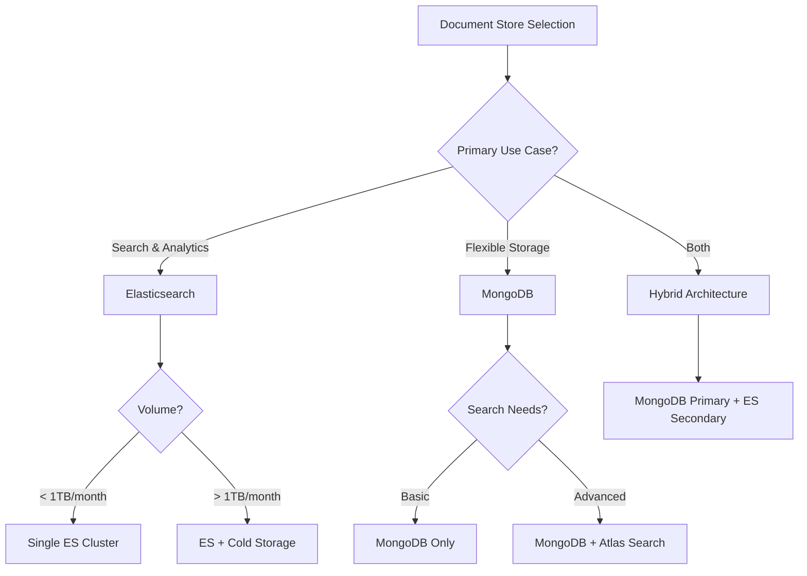

# Document Store Patterns for Test Results and Logs - Enterprise Architecture Guide

## Executive Summary

This document provides comprehensive patterns and best practices for storing detailed test results, logs, and structured events in document stores. We compare **MongoDB** and **Elasticsearch** implementations, focusing on data modeling, indexing strategies, aggregation queries, and real-world patterns for test analytics, flakiness detection, and historical analysis in enterprise Node.js environments.

## Table of Contents

1. [Document Store Selection Matrix](#document-store-selection-matrix)
2. [MongoDB Data Modeling Patterns](#mongodb-data-modeling-patterns)
3. [Elasticsearch Data Modeling Patterns](#elasticsearch-data-modeling-patterns)
4. [Hybrid Architecture Patterns](#hybrid-architecture-patterns)
5. [Test Event Schema Design](#test-event-schema-design)
6. [Indexing Strategies](#indexing-strategies)
7. [Aggregation Queries for Analytics](#aggregation-queries-for-analytics)
8. [Flakiness Detection Patterns](#flakiness-detection-patterns)
9. [Log Storage and Search Patterns](#log-storage-and-search-patterns)
10. [Performance Optimization](#performance-optimization)
11. [Migration and Implementation Strategy](#migration-and-implementation-strategy)

## 1. Document Store Selection Matrix

### Feature Comparison

| Capability | MongoDB | Elasticsearch | Recommendation |
|------------|---------|---------------|----------------|
| **Schema Flexibility** | Excellent (schema-less) | Good (dynamic mapping) | MongoDB for evolving schemas |
| **Full-Text Search** | Basic (Atlas Search) | Excellent (Lucene-based) | Elasticsearch for search |
| **Aggregation Power** | Excellent (pipeline) | Excellent (DSL) | Both strong |
| **Time-Series Support** | Native collections | Time-based indices | MongoDB simpler |
| **Real-Time Analytics** | Good | Excellent | Elasticsearch for dashboards |
| **Write Performance** | Excellent | Good | MongoDB for high volume |
| **Consistency Model** | Tunable | Eventually consistent | MongoDB for strong consistency |
| **Node.js Integration** | Mature (mongoose) | Mature (@elastic/elasticsearch) | Both excellent |
| **Cost at Scale** | Lower | Higher | MongoDB more economical |

### Decision Framework



## 2. MongoDB Data Modeling Patterns

### Core Test Result Document Schema

```javascript
// MongoDB Schema Definition with Mongoose
const mongoose = require('mongoose');

// Main test result schema
const TestResultSchema = new mongoose.Schema({
  // Test identification
  testId: {
    type: String,
    required: true,
    index: true
  },
  testName: {
    type: String,
    required: true,
    index: true
  },
  suite: {
    type: String,
    required: true,
    index: true
  },
  
  // Execution context
  executionId: {
    type: mongoose.Schema.Types.ObjectId,
    required: true,
    index: true
  },
  environment: {
    type: String,
    enum: ['dev', 'staging', 'prod', 'ci'],
    required: true,
    index: true
  },
  
  // Timing information
  startedAt: {
    type: Date,
    required: true,
    index: true
  },
  completedAt: Date,
  duration: {
    type: Number, // milliseconds
    index: true
  },
  
  // Result data
  status: {
    type: String,
    enum: ['pass', 'fail', 'skip', 'timeout', 'error'],
    required: true,
    index: true
  },
  assertions: {
    total: Number,
    passed: Number,
    failed: Number
  },
  
  // Error information
  error: {
    type: {
      type: String,
      index: true
    },
    message: String,
    stackTrace: String,
    screenshot: String, // Base64 or S3 URL
    video: String // S3 URL for video recordings
  },
  
  // Metadata and context
  metadata: {
    browser: String,
    browserVersion: String,
    os: String,
    osVersion: String,
    deviceType: String,
    viewport: {
      width: Number,
      height: Number
    },
    
    // CI/CD context
    buildId: String,
    commitHash: String,
    branch: String,
    pullRequest: String,
    
    // Agent information
    agentId: String,
    agentType: String,
    agentVersion: String,
    
    // Feature flags
    featureFlags: Map,
    
    // Custom metadata
    custom: Map
  },
  
  // Performance metrics
  performance: {
    memory: {
      heapUsed: Number,
      heapTotal: Number,
      external: Number
    },
    cpu: {
      user: Number,
      system: Number
    },
    network: [{
      url: String,
      method: String,
      status: Number,
      duration: Number,
      size: Number
    }]
  },
  
  // Coverage data (if applicable)
  coverage: {
    lines: {
      total: Number,
      covered: Number,
      percentage: Number
    },
    statements: {
      total: Number,
      covered: Number,
      percentage: Number
    },
    functions: {
      total: Number,
      covered: Number,
      percentage: Number
    },
    branches: {
      total: Number,
      covered: Number,
      percentage: Number
    }
  },
  
  // Related logs
  logs: [{
    timestamp: Date,
    level: String,
    message: String,
    data: mongoose.Schema.Types.Mixed
  }],
  
  // Tags for categorization
  tags: [{
    type: String,
    index: true
  }],
  
  // Retry information
  retries: {
    count: Number,
    maxRetries: Number,
    retryReasons: [String]
  }
}, {
  timestamps: true,
  collection: 'test_results'
});

// Compound indexes for common queries
TestResultSchema.index({ suite: 1, testName: 1, startedAt: -1 });
TestResultSchema.index({ environment: 1, status: 1, startedAt: -1 });
TestResultSchema.index({ 'metadata.buildId': 1, startedAt: -1 });
TestResultSchema.index({ 'metadata.branch': 1, status: 1 });
TestResultSchema.index({ 'error.type': 1, startedAt: -1 });

// Text index for search
TestResultSchema.index({ 
  testName: 'text', 
  'error.message': 'text',
  'logs.message': 'text'
});

// TTL index for automatic cleanup
TestResultSchema.index({ 
  createdAt: 1 
}, { 
  expireAfterSeconds: 90 * 24 * 60 * 60 // 90 days
});
```

### Time-Series Collection for Metrics

```javascript
// MongoDB Time-Series Collection Setup
async function createTimeSeriesCollection(db) {
  await db.createCollection('test_metrics_timeseries', {
    timeseries: {
      timeField: 'timestamp',
      metaField: 'metadata',
      granularity: 'seconds'
    },
    expireAfterSeconds: 30 * 24 * 60 * 60 // 30 days
  });
}

// Time-series document structure
const timeSeriesDoc = {
  timestamp: new Date(),
  metadata: {
    suite: 'integration',
    environment: 'staging',
    testId: 'test-123',
    agentType: 'backend'
  },
  metrics: {
    duration: 1234,
    memoryUsage: 128.5,
    cpuUsage: 45.2,
    assertionsPassed: 10,
    assertionsFailed: 0
  }
};
```

### Aggregation Pipeline Patterns

```javascript
// MongoDB Aggregation Patterns
class MongoTestAnalytics {
  constructor(db) {
    this.db = db;
    this.collection = db.collection('test_results');
  }
  
  // Flakiness detection aggregation
  async detectFlakyTests(days = 7, threshold = 0.1) {
    const pipeline = [
      // Filter recent tests
      {
        $match: {
          startedAt: {
            $gte: new Date(Date.now() - days * 24 * 60 * 60 * 1000)
          }
        }
      },
      
      // Group by test
      {
        $group: {
          _id: {
            suite: '$suite',
            testName: '$testName'
          },
          totalRuns: { $sum: 1 },
          passes: {
            $sum: { $cond: [{ $eq: ['$status', 'pass'] }, 1, 0] }
          },
          failures: {
            $sum: { $cond: [{ $eq: ['$status', 'fail'] }, 1, 0] }
          },
          statusHistory: {
            $push: {
              status: '$status',
              date: '$startedAt',
              duration: '$duration'
            }
          }
        }
      },
      
      // Calculate failure rate
      {
        $addFields: {
          failureRate: {
            $divide: ['$failures', '$totalRuns']
          }
        }
      },
      
      // Filter flaky tests
      {
        $match: {
          passes: { $gt: 0 },
          failures: { $gt: 0 },
          failureRate: { $gte: threshold, $lte: 1 - threshold },
          totalRuns: { $gte: 10 }
        }
      },
      
      // Sort by flakiness
      {
        $sort: { failureRate: -1 }
      },
      
      // Add flakiness score
      {
        $addFields: {
          flakinessScore: {
            $abs: { $subtract: ['$failureRate', 0.5] }
          }
        }
      }
    ];
    
    return this.collection.aggregate(pipeline).toArray();
  }
  
  // Test duration trends
  async getTestDurationTrends(suite, days = 30) {
    const pipeline = [
      {
        $match: {
          suite,
          startedAt: {
            $gte: new Date(Date.now() - days * 24 * 60 * 60 * 1000)
          },
          status: 'pass'
        }
      },
      
      // Group by day and test
      {
        $group: {
          _id: {
            date: {
              $dateToString: {
                format: '%Y-%m-%d',
                date: '$startedAt'
              }
            },
            testName: '$testName'
          },
          avgDuration: { $avg: '$duration' },
          minDuration: { $min: '$duration' },
          maxDuration: { $max: '$duration' },
          p95Duration: {
            $percentile: {
              input: '$duration',
              p: 0.95,
              method: 'approximate'
            }
          },
          runCount: { $sum: 1 }
        }
      },
      
      // Calculate daily aggregates
      {
        $group: {
          _id: '$_id.date',
          tests: {
            $push: {
              name: '$_id.testName',
              avgDuration: '$avgDuration',
              p95Duration: '$p95Duration'
            }
          },
          overallAvg: { $avg: '$avgDuration' },
          overallP95: { $avg: '$p95Duration' }
        }
      },
      
      { $sort: { _id: 1 } }
    ];
    
    return this.collection.aggregate(pipeline, {
      allowDiskUse: true
    }).toArray();
  }
  
  // Error pattern analysis
  async analyzeErrorPatterns(days = 7) {
    const pipeline = [
      {
        $match: {
          status: 'fail',
          startedAt: {
            $gte: new Date(Date.now() - days * 24 * 60 * 60 * 1000)
          }
        }
      },
      
      // Extract error patterns
      {
        $addFields: {
          errorPattern: {
            $cond: {
              if: { $regexMatch: { input: '$error.message', regex: /timeout/i } },
              then: 'timeout',
              else: {
                $cond: {
                  if: { $regexMatch: { input: '$error.message', regex: /assertion/i } },
                  then: 'assertion',
                  else: {
                    $cond: {
                      if: { $regexMatch: { input: '$error.message', regex: /network|connection/i } },
                      then: 'network',
                      else: 'other'
                    }
                  }
                }
              }
            }
          }
        }
      },
      
      // Group by pattern
      {
        $group: {
          _id: {
            pattern: '$errorPattern',
            suite: '$suite',
            environment: '$environment'
          },
          count: { $sum: 1 },
          examples: {
            $push: {
              $slice: [
                {
                  testName: '$testName',
                  error: '$error.message',
                  timestamp: '$startedAt'
                },
                5
              ]
            }
          },
          affectedTests: { $addToSet: '$testName' }
        }
      },
      
      // Calculate percentages
      {
        $group: {
          _id: null,
          patterns: { $push: '$$ROOT' },
          total: { $sum: '$count' }
        }
      },
      
      {
        $unwind: '$patterns'
      },
      
      {
        $project: {
          pattern: '$patterns._id.pattern',
          suite: '$patterns._id.suite',
          environment: '$patterns._id.environment',
          count: '$patterns.count',
          percentage: {
            $multiply: [
              { $divide: ['$patterns.count', '$total'] },
              100
            ]
          },
          examples: '$patterns.examples',
          affectedTestCount: { $size: '$patterns.affectedTests' }
        }
      },
      
      { $sort: { count: -1 } }
    ];
    
    return this.collection.aggregate(pipeline).toArray();
  }
  
  // Test execution heatmap
  async getExecutionHeatmap(suite, days = 7) {
    const pipeline = [
      {
        $match: {
          suite,
          startedAt: {
            $gte: new Date(Date.now() - days * 24 * 60 * 60 * 1000)
          }
        }
      },
      
      // Extract hour and day of week
      {
        $addFields: {
          hour: { $hour: '$startedAt' },
          dayOfWeek: { $dayOfWeek: '$startedAt' }
        }
      },
      
      // Group by hour and day
      {
        $group: {
          _id: {
            hour: '$hour',
            dayOfWeek: '$dayOfWeek'
          },
          executions: { $sum: 1 },
          avgDuration: { $avg: '$duration' },
          failureRate: {
            $avg: {
              $cond: [{ $eq: ['$status', 'fail'] }, 1, 0]
            }
          }
        }
      },
      
      // Format for heatmap
      {
        $project: {
          _id: 0,
          hour: '$_id.hour',
          dayOfWeek: '$_id.dayOfWeek',
          executions: 1,
          avgDuration: { $round: ['$avgDuration', 2] },
          failureRate: { $round: ['$failureRate', 4] }
        }
      },
      
      { $sort: { dayOfWeek: 1, hour: 1 } }
    ];
    
    return this.collection.aggregate(pipeline).toArray();
  }
}
```

## 3. Elasticsearch Data Modeling Patterns

### Index Template and Mapping

```javascript
// Elasticsearch Index Template
const testResultMapping = {
  index_patterns: ['test-results-*'],
  priority: 1,
  template: {
    settings: {
      number_of_shards: 3,
      number_of_replicas: 1,
      refresh_interval: '5s',
      
      // Analysis settings
      analysis: {
        analyzer: {
          error_analyzer: {
            type: 'custom',
            tokenizer: 'standard',
            filter: ['lowercase', 'stop', 'error_synonyms']
          },
          code_analyzer: {
            type: 'custom',
            tokenizer: 'whitespace',
            filter: ['lowercase', 'code_stop']
          }
        },
        filter: {
          error_synonyms: {
            type: 'synonym',
            synonyms: [
              'timeout,timed out,time out',
              'assertion,assert,expect',
              'network,connection,connectivity'
            ]
          },
          code_stop: {
            type: 'stop',
            stopwords: ['var', 'const', 'let', 'function']
          }
        }
      }
    },
    
    mappings: {
      properties: {
        // Test identification
        testId: { type: 'keyword' },
        testName: { 
          type: 'text',
          fields: {
            keyword: { type: 'keyword' }
          }
        },
        suite: { type: 'keyword' },
        
        // Execution context
        executionId: { type: 'keyword' },
        environment: { type: 'keyword' },
        
        // Timing
        startedAt: { type: 'date' },
        completedAt: { type: 'date' },
        duration: { type: 'long' }, // milliseconds
        
        // Result
        status: { type: 'keyword' },
        assertions: {
          properties: {
            total: { type: 'integer' },
            passed: { type: 'integer' },
            failed: { type: 'integer' }
          }
        },
        
        // Error information
        error: {
          properties: {
            type: { type: 'keyword' },
            message: { 
              type: 'text',
              analyzer: 'error_analyzer',
              fields: {
                raw: { type: 'keyword' }
              }
            },
            stackTrace: {
              type: 'text',
              analyzer: 'code_analyzer'
            },
            screenshot: { type: 'keyword' },
            video: { type: 'keyword' }
          }
        },
        
        // Metadata
        metadata: {
          properties: {
            browser: { type: 'keyword' },
            browserVersion: { type: 'keyword' },
            os: { type: 'keyword' },
            osVersion: { type: 'keyword' },
            deviceType: { type: 'keyword' },
            viewport: {
              properties: {
                width: { type: 'integer' },
                height: { type: 'integer' }
              }
            },
            buildId: { type: 'keyword' },
            commitHash: { type: 'keyword' },
            branch: { type: 'keyword' },
            pullRequest: { type: 'keyword' },
            agentId: { type: 'keyword' },
            agentType: { type: 'keyword' },
            agentVersion: { type: 'keyword' },
            featureFlags: { type: 'object', enabled: false },
            custom: { type: 'object', enabled: false }
          }
        },
        
        // Performance metrics
        performance: {
          properties: {
            memory: {
              properties: {
                heapUsed: { type: 'long' },
                heapTotal: { type: 'long' },
                external: { type: 'long' }
              }
            },
            cpu: {
              properties: {
                user: { type: 'float' },
                system: { type: 'float' }
              }
            },
            network: {
              type: 'nested',
              properties: {
                url: { type: 'keyword' },
                method: { type: 'keyword' },
                status: { type: 'integer' },
                duration: { type: 'long' },
                size: { type: 'long' }
              }
            }
          }
        },
        
        // Coverage
        coverage: {
          properties: {
            lines: {
              properties: {
                total: { type: 'integer' },
                covered: { type: 'integer' },
                percentage: { type: 'float' }
              }
            },
            statements: {
              properties: {
                total: { type: 'integer' },
                covered: { type: 'integer' },
                percentage: { type: 'float' }
              }
            },
            functions: {
              properties: {
                total: { type: 'integer' },
                covered: { type: 'integer' },
                percentage: { type: 'float' }
              }
            },
            branches: {
              properties: {
                total: { type: 'integer' },
                covered: { type: 'integer' },
                percentage: { type: 'float' }
              }
            }
          }
        },
        
        // Logs
        logs: {
          type: 'nested',
          properties: {
            timestamp: { type: 'date' },
            level: { type: 'keyword' },
            message: { type: 'text' },
            data: { type: 'object', enabled: false }
          }
        },
        
        // Tags
        tags: { type: 'keyword' },
        
        // Retry information
        retries: {
          properties: {
            count: { type: 'integer' },
            maxRetries: { type: 'integer' },
            retryReasons: { type: 'keyword' }
          }
        }
      }
    },
    
    // Index lifecycle management
    lifecycle: {
      name: 'test-results-lifecycle',
      rollover_alias: 'test-results'
    }
  }
};
```

### Elasticsearch Client Implementation

```javascript
// elasticsearch-client.js
const { Client } = require('@elastic/elasticsearch');
const pino = require('pino');

class ElasticsearchTestStorage {
  constructor(config) {
    this.client = new Client({
      node: config.node || 'http://localhost:9200',
      auth: config.auth,
      maxRetries: 3,
      requestTimeout: 30000,
      sniffOnStart: true,
      sniffInterval: 60000,
      sniffOnConnectionFault: true
    });
    
    this.indexPrefix = config.indexPrefix || 'test-results';
    this.logger = pino({ level: config.logLevel || 'info' });
    this.bulkSize = config.bulkSize || 1000;
    this.bulkFlushInterval = config.bulkFlushInterval || 5000;
    
    this.bulkQueue = [];
    this.startBulkTimer();
  }
  
  getIndexName(date = new Date()) {
    const dateStr = date.toISOString().slice(0, 10);
    return `${this.indexPrefix}-${dateStr}`;
  }
  
  async initializeTemplate() {
    try {
      await this.client.indices.putIndexTemplate({
        name: `${this.indexPrefix}-template`,
        body: testResultMapping
      });
      
      this.logger.info('Index template created successfully');
    } catch (error) {
      this.logger.error('Failed to create index template:', error);
      throw error;
    }
  }
  
  async indexTestResult(result) {
    this.bulkQueue.push({
      index: {
        _index: this.getIndexName(result.startedAt),
        _id: result.executionId || undefined
      }
    });
    
    this.bulkQueue.push(result);
    
    if (this.bulkQueue.length >= this.bulkSize * 2) {
      await this.flushBulk();
    }
  }
  
  startBulkTimer() {
    setInterval(async () => {
      if (this.bulkQueue.length > 0) {
        await this.flushBulk();
      }
    }, this.bulkFlushInterval);
  }
  
  async flushBulk() {
    if (this.bulkQueue.length === 0) return;
    
    const body = this.bulkQueue.splice(0, this.bulkQueue.length);
    
    try {
      const { body: bulkResponse } = await this.client.bulk({
        refresh: false,
        body
      });
      
      if (bulkResponse.errors) {
        const erroredDocuments = [];
        bulkResponse.items.forEach((action, i) => {
          const operation = Object.keys(action)[0];
          if (action[operation].error) {
            erroredDocuments.push({
              status: action[operation].status,
              error: action[operation].error,
              operation: body[i * 2],
              document: body[i * 2 + 1]
            });
          }
        });
        
        this.logger.error('Bulk indexing errors:', erroredDocuments);
      }
      
      this.logger.info(`Indexed ${bulkResponse.items.length} documents`);
    } catch (error) {
      this.logger.error('Bulk indexing failed:', error);
      // Re-queue failed documents
      this.bulkQueue.unshift(...body);
      throw error;
    }
  }
  
  // Advanced search queries
  async searchTests(params) {
    const {
      query,
      suite,
      environment,
      status,
      dateRange,
      size = 100,
      from = 0,
      sort = [{ startedAt: 'desc' }]
    } = params;
    
    const must = [];
    const filter = [];
    
    if (query) {
      must.push({
        multi_match: {
          query,
          fields: ['testName^2', 'error.message', 'logs.message'],
          type: 'best_fields',
          fuzziness: 'AUTO'
        }
      });
    }
    
    if (suite) filter.push({ term: { suite } });
    if (environment) filter.push({ term: { environment } });
    if (status) filter.push({ term: { status } });
    
    if (dateRange) {
      filter.push({
        range: {
          startedAt: {
            gte: dateRange.from,
            lte: dateRange.to
          }
        }
      });
    }
    
    const body = {
      query: {
        bool: {
          must,
          filter
        }
      },
      size,
      from,
      sort,
      highlight: {
        fields: {
          'error.message': {},
          'logs.message': {}
        }
      }
    };
    
    const { body: response } = await this.client.search({
      index: `${this.indexPrefix}-*`,
      body
    });
    
    return {
      total: response.hits.total.value,
      hits: response.hits.hits.map(hit => ({
        ...hit._source,
        _id: hit._id,
        _score: hit._score,
        highlights: hit.highlight
      }))
    };
  }
}
```

### Elasticsearch Aggregation Patterns

```javascript
// Elasticsearch Analytics Queries
class ElasticsearchTestAnalytics {
  constructor(client, indexPrefix) {
    this.client = client;
    this.indexPrefix = indexPrefix;
  }
  
  // Flakiness detection using terms aggregation
  async detectFlakyTests(days = 7, minRuns = 10, threshold = 0.1) {
    const body = {
      query: {
        range: {
          startedAt: {
            gte: `now-${days}d/d`
          }
        }
      },
      size: 0,
      aggs: {
        flaky_tests: {
          composite: {
            size: 1000,
            sources: [
              { suite: { terms: { field: 'suite' } } },
              { testName: { terms: { field: 'testName.keyword' } } }
            ]
          },
          aggs: {
            status_breakdown: {
              terms: {
                field: 'status',
                size: 10
              }
            },
            total_runs: {
              cardinality: {
                field: 'executionId'
              }
            },
            status_changes: {
              scripted_metric: {
                init_script: 'state.statuses = []',
                map_script: 'state.statuses.add(doc.status.value)',
                combine_script: 'return state.statuses',
                reduce_script: `
                  def allStatuses = [];
                  for (state in states) {
                    allStatuses.addAll(state);
                  }
                  
                  def passCount = 0;
                  def failCount = 0;
                  def changes = 0;
                  def lastStatus = null;
                  
                  for (status in allStatuses) {
                    if (status == 'pass') passCount++;
                    if (status == 'fail') failCount++;
                    if (lastStatus != null && lastStatus != status) changes++;
                    lastStatus = status;
                  }
                  
                  def total = allStatuses.size();
                  def failureRate = total > 0 ? (double)failCount / total : 0;
                  
                  return [
                    'totalRuns': total,
                    'passCount': passCount,
                    'failCount': failCount,
                    'failureRate': failureRate,
                    'statusChanges': changes,
                    'isFlaky': passCount > 0 && failCount > 0 && 
                               failureRate >= params.threshold && 
                               failureRate <= (1 - params.threshold) &&
                               total >= params.minRuns
                  ];
                `,
                params: {
                  threshold,
                  minRuns
                }
              }
            }
          }
        }
      }
    };
    
    const { body: response } = await this.client.search({
      index: `${this.indexPrefix}-*`,
      body
    });
    
    // Filter and format flaky tests
    const flakyTests = [];
    let afterKey = null;
    
    do {
      const buckets = response.aggregations.flaky_tests.buckets;
      
      for (const bucket of buckets) {
        const analysis = bucket.status_changes.value;
        if (analysis.isFlaky) {
          flakyTests.push({
            suite: bucket.key.suite,
            testName: bucket.key.testName,
            totalRuns: analysis.totalRuns,
            passCount: analysis.passCount,
            failCount: analysis.failCount,
            failureRate: analysis.failureRate,
            statusChanges: analysis.statusChanges,
            flakinessScore: Math.abs(analysis.failureRate - 0.5)
          });
        }
      }
      
      afterKey = response.aggregations.flaky_tests.after_key;
    } while (afterKey);
    
    return flakyTests.sort((a, b) => b.flakinessScore - a.flakinessScore);
  }
  
  // Test duration percentiles over time
  async getDurationPercentiles(suite, days = 30) {
    const body = {
      query: {
        bool: {
          filter: [
            { term: { suite } },
            { term: { status: 'pass' } },
            { range: { startedAt: { gte: `now-${days}d/d` } } }
          ]
        }
      },
      size: 0,
      aggs: {
        duration_over_time: {
          date_histogram: {
            field: 'startedAt',
            calendar_interval: 'day',
            min_doc_count: 1
          },
          aggs: {
            duration_percentiles: {
              percentiles: {
                field: 'duration',
                percents: [50, 75, 90, 95, 99]
              }
            },
            avg_duration: {
              avg: { field: 'duration' }
            },
            test_count: {
              value_count: { field: 'duration' }
            }
          }
        }
      }
    };
    
    const { body: response } = await this.client.search({
      index: `${this.indexPrefix}-*`,
      body
    });
    
    return response.aggregations.duration_over_time.buckets.map(bucket => ({
      date: bucket.key_as_string,
      testCount: bucket.test_count.value,
      avgDuration: bucket.avg_duration.value,
      percentiles: bucket.duration_percentiles.values
    }));
  }
  
  // Error pattern analysis with significant terms
  async analyzeErrorPatterns(days = 7) {
    const body = {
      query: {
        bool: {
          filter: [
            { term: { status: 'fail' } },
            { range: { startedAt: { gte: `now-${days}d/d` } } }
          ]
        }
      },
      size: 0,
      aggs: {
        error_patterns: {
          significant_text: {
            field: 'error.message',
            size: 20,
            filter_duplicate_text: true
          }
        },
        error_types: {
          terms: {
            field: 'error.type',
            size: 10
          },
          aggs: {
            top_errors: {
              top_hits: {
                size: 3,
                _source: ['testName', 'error.message', 'startedAt']
              }
            }
          }
        },
        error_timeline: {
          date_histogram: {
            field: 'startedAt',
            calendar_interval: 'hour',
            min_doc_count: 1
          },
          aggs: {
            error_breakdown: {
              terms: {
                field: 'error.type',
                size: 5
              }
            }
          }
        }
      }
    };
    
    const { body: response } = await this.client.search({
      index: `${this.indexPrefix}-*`,
      body
    });
    
    return {
      significantPatterns: response.aggregations.error_patterns.buckets,
      errorTypes: response.aggregations.error_types.buckets.map(bucket => ({
        type: bucket.key,
        count: bucket.doc_count,
        examples: bucket.top_errors.hits.hits.map(hit => hit._source)
      })),
      timeline: response.aggregations.error_timeline.buckets
    };
  }
  
  // Coverage trend analysis
  async getCoverageTrends(suite, days = 30) {
    const body = {
      query: {
        bool: {
          filter: [
            { term: { suite } },
            { exists: { field: 'coverage' } },
            { range: { startedAt: { gte: `now-${days}d/d` } } }
          ]
        }
      },
      size: 0,
      aggs: {
        coverage_timeline: {
          date_histogram: {
            field: 'startedAt',
            calendar_interval: 'day'
          },
          aggs: {
            lines: {
              avg: { field: 'coverage.lines.percentage' }
            },
            statements: {
              avg: { field: 'coverage.statements.percentage' }
            },
            functions: {
              avg: { field: 'coverage.functions.percentage' }
            },
            branches: {
              avg: { field: 'coverage.branches.percentage' }
            },
            min_coverage: {
              min: { field: 'coverage.lines.percentage' }
            },
            max_coverage: {
              max: { field: 'coverage.lines.percentage' }
            }
          }
        },
        coverage_by_test: {
          terms: {
            field: 'testName.keyword',
            size: 20,
            order: { avg_coverage: 'asc' }
          },
          aggs: {
            avg_coverage: {
              avg: { field: 'coverage.lines.percentage' }
            }
          }
        }
      }
    };
    
    const { body: response } = await this.client.search({
      index: `${this.indexPrefix}-*`,
      body
    });
    
    return {
      timeline: response.aggregations.coverage_timeline.buckets,
      lowestCoverageTests: response.aggregations.coverage_by_test.buckets
    };
  }
  
  // Performance regression detection
  async detectPerformanceRegressions(suite, baselineDays = 7, comparisonDays = 1) {
    const baselineQuery = {
      bool: {
        filter: [
          { term: { suite } },
          { term: { status: 'pass' } },
          {
            range: {
              startedAt: {
                gte: `now-${baselineDays + comparisonDays}d/d`,
                lt: `now-${comparisonDays}d/d`
              }
            }
          }
        ]
      }
    };
    
    const currentQuery = {
      bool: {
        filter: [
          { term: { suite } },
          { term: { status: 'pass' } },
          { range: { startedAt: { gte: `now-${comparisonDays}d/d` } } }
        ]
      }
    };
    
    const body = {
      size: 0,
      aggs: {
        baseline: {
          filter: baselineQuery,
          aggs: {
            by_test: {
              terms: {
                field: 'testName.keyword',
                size: 1000
              },
              aggs: {
                p95_duration: {
                  percentiles: {
                    field: 'duration',
                    percents: [95]
                  }
                },
                avg_duration: {
                  avg: { field: 'duration' }
                }
              }
            }
          }
        },
        current: {
          filter: currentQuery,
          aggs: {
            by_test: {
              terms: {
                field: 'testName.keyword',
                size: 1000
              },
              aggs: {
                p95_duration: {
                  percentiles: {
                    field: 'duration',
                    percents: [95]
                  }
                },
                avg_duration: {
                  avg: { field: 'duration' }
                }
              }
            }
          }
        }
      }
    };
    
    const { body: response } = await this.client.search({
      index: `${this.indexPrefix}-*`,
      body
    });
    
    // Compare baseline vs current
    const regressions = [];
    const baselineTests = new Map(
      response.aggregations.baseline.by_test.buckets.map(b => [
        b.key,
        {
          avgDuration: b.avg_duration.value,
          p95Duration: b.p95_duration.values['95.0']
        }
      ])
    );
    
    for (const bucket of response.aggregations.current.by_test.buckets) {
      const baseline = baselineTests.get(bucket.key);
      if (!baseline) continue;
      
      const current = {
        avgDuration: bucket.avg_duration.value,
        p95Duration: bucket.p95_duration.values['95.0']
      };
      
      const avgRegression = (current.avgDuration - baseline.avgDuration) / baseline.avgDuration;
      const p95Regression = (current.p95Duration - baseline.p95Duration) / baseline.p95Duration;
      
      if (avgRegression > 0.2 || p95Regression > 0.3) {
        regressions.push({
          testName: bucket.key,
          baseline,
          current,
          avgRegressionPercent: avgRegression * 100,
          p95RegressionPercent: p95Regression * 100
        });
      }
    }
    
    return regressions.sort((a, b) => b.p95RegressionPercent - a.p95RegressionPercent);
  }
}
```

## 4. Hybrid Architecture Patterns

### MongoDB Primary + Elasticsearch Secondary

```javascript
// Hybrid storage implementation
class HybridTestStorage {
  constructor(mongoDb, elasticsearchClient) {
    this.mongo = mongoDb;
    this.elastic = elasticsearchClient;
    this.syncQueue = [];
    this.syncBatchSize = 100;
    
    // Start sync process
    this.startSyncProcess();
  }
  
  async storeTestResult(result) {
    // Primary storage in MongoDB
    const mongoDoc = await this.mongo.collection('test_results').insertOne(result);
    result._id = mongoDoc.insertedId;
    
    // Queue for Elasticsearch sync
    this.syncQueue.push(result);
    
    // Immediate sync for critical results
    if (result.status === 'fail' && result.suite === 'smoke') {
      await this.elastic.indexTestResult(result);
    }
    
    return result;
  }
  
  startSyncProcess() {
    // Batch sync to Elasticsearch
    setInterval(async () => {
      if (this.syncQueue.length > 0) {
        const batch = this.syncQueue.splice(0, this.syncBatchSize);
        
        try {
          for (const doc of batch) {
            await this.elastic.indexTestResult(doc);
          }
        } catch (error) {
          console.error('Sync to Elasticsearch failed:', error);
          // Re-queue failed documents
          this.syncQueue.unshift(...batch);
        }
      }
    }, 5000);
    
    // Historical sync for missed documents
    this.syncHistoricalData();
  }
  
  async syncHistoricalData() {
    const lastSync = await this.getLastSyncTimestamp();
    const cursor = this.mongo.collection('test_results').find({
      createdAt: { $gt: lastSync },
      _elasticSynced: { $ne: true }
    }).limit(1000);
    
    let count = 0;
    for await (const doc of cursor) {
      try {
        await this.elastic.indexTestResult(doc);
        await this.mongo.collection('test_results').updateOne(
          { _id: doc._id },
          { $set: { _elasticSynced: true, _elasticSyncedAt: new Date() } }
        );
        count++;
      } catch (error) {
        console.error(`Failed to sync document ${doc._id}:`, error);
      }
    }
    
    console.log(`Synced ${count} historical documents`);
  }
  
  // Unified search interface
  async search(params) {
    const { useElastic = true, ...searchParams } = params;
    
    if (useElastic) {
      // Fast search with Elasticsearch
      return this.elastic.searchTests(searchParams);
    } else {
      // Complex queries with MongoDB
      return this.searchMongo(searchParams);
    }
  }
  
  async searchMongo(params) {
    const filter = {};
    
    if (params.query) {
      filter.$text = { $search: params.query };
    }
    
    if (params.suite) filter.suite = params.suite;
    if (params.environment) filter.environment = params.environment;
    if (params.status) filter.status = params.status;
    
    if (params.dateRange) {
      filter.startedAt = {
        $gte: new Date(params.dateRange.from),
        $lte: new Date(params.dateRange.to)
      };
    }
    
    const results = await this.mongo.collection('test_results')
      .find(filter)
      .sort({ startedAt: -1 })
      .limit(params.size || 100)
      .skip(params.from || 0)
      .toArray();
    
    const total = await this.mongo.collection('test_results').countDocuments(filter);
    
    return { total, hits: results };
  }
}
```

### Change Data Capture (CDC) Pattern

```javascript
// MongoDB Change Streams for real-time sync
class ChangeDataCapture {
  constructor(mongoDb, elasticsearchClient) {
    this.mongo = mongoDb;
    this.elastic = elasticsearchClient;
    this.resumeToken = null;
  }
  
  async start() {
    const collection = this.mongo.collection('test_results');
    
    // Load resume token if exists
    this.resumeToken = await this.loadResumeToken();
    
    const pipeline = [
      {
        $match: {
          operationType: { $in: ['insert', 'update', 'replace'] }
        }
      }
    ];
    
    const options = {
      fullDocument: 'updateLookup',
      resumeAfter: this.resumeToken
    };
    
    const changeStream = collection.watch(pipeline, options);
    
    changeStream.on('change', async (change) => {
      try {
        await this.processChange(change);
        await this.saveResumeToken(change._id);
      } catch (error) {
        console.error('Change processing failed:', error);
      }
    });
    
    changeStream.on('error', (error) => {
      console.error('Change stream error:', error);
      // Restart change stream
      setTimeout(() => this.start(), 5000);
    });
  }
  
  async processChange(change) {
    const document = change.fullDocument;
    
    if (!document) {
      console.warn('No full document in change event');
      return;
    }
    
    // Transform MongoDB document for Elasticsearch
    const esDocument = this.transformDocument(document);
    
    // Index in Elasticsearch
    await this.elastic.client.index({
      index: this.elastic.getIndexName(document.startedAt),
      id: document._id.toString(),
      body: esDocument,
      refresh: false
    });
  }
  
  transformDocument(mongoDoc) {
    // Remove MongoDB-specific fields
    const { _id, __v, ...esDoc } = mongoDoc;
    
    // Add document ID as a field
    esDoc.mongoId = _id.toString();
    
    // Transform dates to ISO strings
    if (esDoc.startedAt) esDoc.startedAt = esDoc.startedAt.toISOString();
    if (esDoc.completedAt) esDoc.completedAt = esDoc.completedAt.toISOString();
    
    return esDoc;
  }
  
  async saveResumeToken(token) {
    this.resumeToken = token;
    await this.mongo.collection('_sync_state').updateOne(
      { _id: 'change_stream_resume_token' },
      { $set: { token, updatedAt: new Date() } },
      { upsert: true }
    );
  }
  
  async loadResumeToken() {
    const doc = await this.mongo.collection('_sync_state').findOne({
      _id: 'change_stream_resume_token'
    });
    return doc?.token;
  }
}
```

## 5. Test Event Schema Design

### Structured Event Model

```javascript
// Event-driven test result schema
class TestEvent {
  constructor(type, data) {
    this.eventId = crypto.randomUUID();
    this.eventType = type;
    this.timestamp = new Date();
    this.data = data;
    this.version = '1.0';
  }
}

// Event types
const EventTypes = {
  TEST_STARTED: 'test.started',
  TEST_COMPLETED: 'test.completed',
  TEST_FAILED: 'test.failed',
  TEST_RETRIED: 'test.retried',
  TEST_SKIPPED: 'test.skipped',
  SUITE_STARTED: 'suite.started',
  SUITE_COMPLETED: 'suite.completed',
  ASSERTION_FAILED: 'assertion.failed',
  SCREENSHOT_CAPTURED: 'screenshot.captured',
  LOG_EMITTED: 'log.emitted',
  COVERAGE_REPORTED: 'coverage.reported'
};

// Event schemas
const eventSchemas = {
  [EventTypes.TEST_STARTED]: {
    testId: String,
    testName: String,
    suite: String,
    environment: String,
    metadata: Object
  },
  
  [EventTypes.TEST_COMPLETED]: {
    testId: String,
    duration: Number,
    status: String,
    assertions: {
      passed: Number,
      failed: Number,
      total: Number
    }
  },
  
  [EventTypes.TEST_FAILED]: {
    testId: String,
    error: {
      type: String,
      message: String,
      stackTrace: String,
      diff: Object
    },
    screenshot: String,
    video: String
  },
  
  [EventTypes.ASSERTION_FAILED]: {
    testId: String,
    assertion: {
      type: String,
      expected: Any,
      actual: Any,
      message: String,
      location: {
        file: String,
        line: Number,
        column: Number
      }
    }
  }
};

// Event store implementation
class TestEventStore {
  constructor(mongoDb, elasticsearchClient) {
    this.mongo = mongoDb;
    this.elastic = elasticsearchClient;
    this.eventHandlers = new Map();
    
    this.registerDefaultHandlers();
  }
  
  registerDefaultHandlers() {
    // Aggregate test results from events
    this.on(EventTypes.TEST_COMPLETED, async (event) => {
      const testResult = await this.aggregateTestResult(event.data.testId);
      await this.storeAggregatedResult(testResult);
    });
    
    // Index failures immediately for search
    this.on(EventTypes.TEST_FAILED, async (event) => {
      await this.elastic.indexTestResult({
        ...event.data,
        eventType: event.eventType,
        timestamp: event.timestamp
      });
    });
  }
  
  async emit(eventType, data) {
    const event = new TestEvent(eventType, data);
    
    // Store event in MongoDB
    await this.mongo.collection('test_events').insertOne(event);
    
    // Process handlers
    const handlers = this.eventHandlers.get(eventType) || [];
    for (const handler of handlers) {
      try {
        await handler(event);
      } catch (error) {
        console.error(`Handler failed for ${eventType}:`, error);
      }
    }
    
    return event;
  }
  
  on(eventType, handler) {
    if (!this.eventHandlers.has(eventType)) {
      this.eventHandlers.set(eventType, []);
    }
    this.eventHandlers.get(eventType).push(handler);
  }
  
  async aggregateTestResult(testId) {
    const events = await this.mongo.collection('test_events')
      .find({ 'data.testId': testId })
      .sort({ timestamp: 1 })
      .toArray();
    
    const result = {
      testId,
      events: events.map(e => ({
        type: e.eventType,
        timestamp: e.timestamp
      }))
    };
    
    // Build complete test result from events
    for (const event of events) {
      switch (event.eventType) {
        case EventTypes.TEST_STARTED:
          Object.assign(result, event.data);
          result.startedAt = event.timestamp;
          break;
          
        case EventTypes.TEST_COMPLETED:
          Object.assign(result, event.data);
          result.completedAt = event.timestamp;
          break;
          
        case EventTypes.TEST_FAILED:
          result.status = 'fail';
          result.error = event.data.error;
          result.screenshot = event.data.screenshot;
          break;
          
        case EventTypes.COVERAGE_REPORTED:
          result.coverage = event.data.coverage;
          break;
      }
    }
    
    return result;
  }
}
```

## 6. Indexing Strategies

### MongoDB Indexing Best Practices

```javascript
// MongoDB index creation and optimization
async function createOptimalIndexes(db) {
  const collection = db.collection('test_results');
  
  // Single field indexes
  await collection.createIndex({ testId: 1 });
  await collection.createIndex({ suite: 1 });
  await collection.createIndex({ environment: 1 });
  await collection.createIndex({ status: 1 });
  await collection.createIndex({ startedAt: -1 });
  await collection.createIndex({ 'error.type': 1 });
  
  // Compound indexes for common queries
  await collection.createIndex(
    { suite: 1, status: 1, startedAt: -1 },
    { name: 'suite_status_time' }
  );
  
  await collection.createIndex(
    { environment: 1, status: 1, startedAt: -1 },
    { name: 'env_status_time' }
  );
  
  await collection.createIndex(
    { testName: 1, startedAt: -1 },
    { name: 'test_time' }
  );
  
  await collection.createIndex(
    { 'metadata.buildId': 1, status: 1 },
    { name: 'build_status' }
  );
  
  // Text index for search
  await collection.createIndex(
    {
      testName: 'text',
      'error.message': 'text',
      'logs.message': 'text'
    },
    {
      name: 'text_search',
      weights: {
        testName: 10,
        'error.message': 5,
        'logs.message': 1
      }
    }
  );
  
  // Partial indexes for efficiency
  await collection.createIndex(
    { 'error.type': 1, startedAt: -1 },
    {
      name: 'errors_by_type',
      partialFilterExpression: { status: 'fail' }
    }
  );
  
  await collection.createIndex(
    { duration: -1 },
    {
      name: 'slow_tests',
      partialFilterExpression: { 
        duration: { $gt: 30000 } // Tests longer than 30s
      }
    }
  );
  
  // TTL index for automatic cleanup
  await collection.createIndex(
    { createdAt: 1 },
    { 
      expireAfterSeconds: 90 * 24 * 60 * 60, // 90 days
      name: 'ttl_cleanup'
    }
  );
  
  // Index for change streams
  await collection.createIndex(
    { _elasticSynced: 1, createdAt: 1 },
    {
      name: 'sync_status',
      partialFilterExpression: { _elasticSynced: { $ne: true } }
    }
  );
}

// Index usage analysis
async function analyzeIndexUsage(db) {
  const collection = db.collection('test_results');
  
  // Get index statistics
  const stats = await collection.aggregate([
    { $indexStats: {} }
  ]).toArray();
  
  // Analyze slow queries
  const slowQueries = await db.admin().command({
    currentOp: true,
    active: true,
    microsecs_running: { $gt: 1000000 } // Queries running > 1 second
  });
  
  // Get query execution stats
  const queryStats = await collection.aggregate([
    {
      $collStats: {
        queryExecStats: {}
      }
    }
  ]).toArray();
  
  return {
    indexStats: stats,
    slowQueries: slowQueries.inprog,
    queryStats
  };
}
```

### Elasticsearch Index Management

```javascript
// Elasticsearch index lifecycle management
class ElasticsearchIndexManager {
  constructor(client, indexPrefix) {
    this.client = client;
    this.indexPrefix = indexPrefix;
  }
  
  async setupILMPolicy() {
    const policyName = `${this.indexPrefix}-lifecycle`;
    
    await this.client.ilm.putLifecycle({
      policy: policyName,
      body: {
        policy: {
          phases: {
            hot: {
              min_age: '0ms',
              actions: {
                rollover: {
                  max_size: '50GB',
                  max_age: '7d',
                  max_docs: 50000000
                },
                set_priority: {
                  priority: 100
                }
              }
            },
            warm: {
              min_age: '7d',
              actions: {
                shrink: {
                  number_of_shards: 1
                },
                forcemerge: {
                  max_num_segments: 1
                },
                set_priority: {
                  priority: 50
                }
              }
            },
            cold: {
              min_age: '30d',
              actions: {
                set_priority: {
                  priority: 0
                },
                freeze: {},
                searchable_snapshot: {
                  snapshot_repository: 's3-repository'
                }
              }
            },
            delete: {
              min_age: '90d',
              actions: {
                delete: {}
              }
            }
          }
        }
      }
    });
    
    // Create initial index with alias
    const initialIndex = `${this.indexPrefix}-000001`;
    
    await this.client.indices.create({
      index: initialIndex,
      body: {
        aliases: {
          [this.indexPrefix]: {
            is_write_index: true
          }
        },
        settings: {
          'index.lifecycle.name': policyName,
          'index.lifecycle.rollover_alias': this.indexPrefix
        }
      }
    });
  }
  
  async optimizeSearchPerformance() {
    // Update index settings for better search performance
    await this.client.indices.putSettings({
      index: `${this.indexPrefix}-*`,
      body: {
        index: {
          refresh_interval: '30s', // Reduce refresh frequency
          number_of_replicas: 1,
          max_result_window: 50000, // Increase pagination limit
          
          // Search optimization
          search: {
            slowlog: {
              threshold: {
                query: {
                  warn: '10s',
                  info: '5s',
                  debug: '2s'
                }
              }
            }
          },
          
          // Memory optimization
          translog: {
            durability: 'async',
            sync_interval: '30s'
          }
        }
      }
    });
    
    // Force merge older indices
    const indices = await this.client.cat.indices({
      index: `${this.indexPrefix}-*`,
      format: 'json'
    });
    
    for (const index of indices.body) {
      const ageInDays = (Date.now() - new Date(index['creation.date']).getTime()) / (1000 * 60 * 60 * 24);
      
      if (ageInDays > 7 && index['docs.count'] > 0) {
        await this.client.indices.forcemerge({
          index: index.index,
          max_num_segments: 1,
          flush: true
        });
      }
    }
  }
  
  async createCustomAnalyzers() {
    await this.client.indices.close({
      index: `${this.indexPrefix}-*`
    });
    
    await this.client.indices.putSettings({
      index: `${this.indexPrefix}-*`,
      body: {
        analysis: {
          analyzer: {
            // Stack trace analyzer
            stack_trace_analyzer: {
              type: 'pattern',
              pattern: '\\s+at\\s+',
              lowercase: true
            },
            
            // Test name analyzer
            test_name_analyzer: {
              type: 'custom',
              tokenizer: 'test_name_tokenizer',
              filter: ['lowercase', 'test_name_filter']
            }
          },
          tokenizer: {
            test_name_tokenizer: {
              type: 'pattern',
              pattern: '[._\\-\\s/]+'
            }
          },
          filter: {
            test_name_filter: {
              type: 'word_delimiter_graph',
              preserve_original: true,
              catenate_words: true
            }
          }
        }
      }
    });
    
    await this.client.indices.open({
      index: `${this.indexPrefix}-*`
    });
  }
}
```

## 7. Aggregation Queries for Analytics

### Complex MongoDB Aggregations

```javascript
// Advanced MongoDB aggregation patterns
class MongoTestMetrics {
  constructor(db) {
    this.db = db;
  }
  
  // Multi-dimensional test analysis
  async getTestMetricsCube(options = {}) {
    const { startDate, endDate, dimensions = ['suite', 'environment'] } = options;
    
    const pipeline = [
      // Date filter
      {
        $match: {
          startedAt: {
            $gte: startDate || new Date(Date.now() - 30 * 24 * 60 * 60 * 1000),
            $lte: endDate || new Date()
          }
        }
      },
      
      // Calculate metrics
      {
        $group: {
          _id: dimensions.reduce((acc, dim) => {
            acc[dim] = `$${dim}`;
            return acc;
          }, {}),
          
          // Basic metrics
          totalTests: { $sum: 1 },
          passedTests: {
            $sum: { $cond: [{ $eq: ['$status', 'pass'] }, 1, 0] }
          },
          failedTests: {
            $sum: { $cond: [{ $eq: ['$status', 'fail'] }, 1, 0] }
          },
          
          // Duration metrics
          avgDuration: { $avg: '$duration' },
          minDuration: { $min: '$duration' },
          maxDuration: { $max: '$duration' },
          stdDevDuration: { $stdDevPop: '$duration' },
          
          // Percentiles (MongoDB 7.0+)
          durationPercentiles: {
            $percentile: {
              input: '$duration',
              p: [0.5, 0.75, 0.9, 0.95, 0.99],
              method: 'approximate'
            }
          },
          
          // Coverage metrics
          avgCoverage: { $avg: '$coverage.lines.percentage' },
          minCoverage: { $min: '$coverage.lines.percentage' },
          
          // Error analysis
          errorTypes: {
            $push: {
              $cond: [
                { $eq: ['$status', 'fail'] },
                '$error.type',
                null
              ]
            }
          },
          
          // Time-based distribution
          hourlyDistribution: {
            $push: {
              hour: { $hour: '$startedAt' },
              status: '$status'
            }
          }
        }
      },
      
      // Calculate derived metrics
      {
        $addFields: {
          passRate: {
            $multiply: [
              { $divide: ['$passedTests', '$totalTests'] },
              100
            ]
          },
          failRate: {
            $multiply: [
              { $divide: ['$failedTests', '$totalTests'] },
              100
            ]
          },
          reliabilityScore: {
            $subtract: [
              100,
              {
                $multiply: [
                  { $divide: ['$failedTests', '$totalTests'] },
                  100
                ]
              }
            ]
          },
          performanceScore: {
            $cond: {
              if: { $lte: ['$avgDuration', 5000] },
              then: 100,
              else: {
                $multiply: [
                  { $divide: [5000, '$avgDuration'] },
                  100
                ]
              }
            }
          }
        }
      },
      
      // Sort by reliability
      { $sort: { reliabilityScore: -1 } }
    ];
    
    return this.db.collection('test_results').aggregate(pipeline, {
      allowDiskUse: true
    }).toArray();
  }
  
  // Cohort analysis for test stability
  async getTestStabilityCohorts(days = 30) {
    const pipeline = [
      {
        $match: {
          startedAt: {
            $gte: new Date(Date.now() - days * 24 * 60 * 60 * 1000)
          }
        }
      },
      
      // Group by test and week
      {
        $group: {
          _id: {
            testName: '$testName',
            week: {
              $dateToString: {
                format: '%Y-W%V',
                date: '$startedAt'
              }
            }
          },
          totalRuns: { $sum: 1 },
          failures: {
            $sum: { $cond: [{ $eq: ['$status', 'fail'] }, 1, 0] }
          }
        }
      },
      
      // Calculate weekly failure rate
      {
        $addFields: {
          weeklyFailureRate: {
            $divide: ['$failures', '$totalRuns']
          }
        }
      },
      
      // Group by test to analyze trend
      {
        $group: {
          _id: '$_id.testName',
          weeks: {
            $push: {
              week: '$_id.week',
              failureRate: '$weeklyFailureRate',
              totalRuns: '$totalRuns'
            }
          }
        }
      },
      
      // Calculate stability metrics
      {
        $addFields: {
          weekCount: { $size: '$weeks' },
          avgFailureRate: { $avg: '$weeks.failureRate' },
          failureRateStdDev: { $stdDevPop: '$weeks.failureRate' },
          
          // Trend analysis
          failureRateTrend: {
            $let: {
              vars: {
                sortedWeeks: {
                  $sortArray: {
                    input: '$weeks',
                    sortBy: { week: 1 }
                  }
                }
              },
              in: {
                $subtract: [
                  { $arrayElemAt: ['$$sortedWeeks.failureRate', -1] },
                  { $arrayElemAt: ['$$sortedWeeks.failureRate', 0] }
                ]
              }
            }
          }
        }
      },
      
      // Categorize stability
      {
        $addFields: {
          stabilityCategory: {
            $switch: {
              branches: [
                {
                  case: { $eq: ['$avgFailureRate', 0] },
                  then: 'stable'
                },
                {
                  case: { $and: [
                    { $lt: ['$avgFailureRate', 0.05] },
                    { $lt: ['$failureRateStdDev', 0.02] }
                  ]},
                  then: 'mostly_stable'
                },
                {
                  case: { $and: [
                    { $gte: ['$avgFailureRate', 0.05] },
                    { $lte: ['$avgFailureRate', 0.3] }
                  ]},
                  then: 'flaky'
                },
                {
                  case: { $gt: ['$avgFailureRate', 0.3] },
                  then: 'unstable'
                }
              ],
              default: 'unknown'
            }
          }
        }
      }
    ];
    
    return this.db.collection('test_results').aggregate(pipeline).toArray();
  }
}
```

### Elasticsearch Advanced Aggregations

```javascript
// Complex Elasticsearch aggregations
class ElasticsearchAdvancedAnalytics {
  constructor(client, indexPrefix) {
    this.client = client;
    this.indexPrefix = indexPrefix;
  }
  
  // Machine learning-based anomaly detection
  async detectAnomalousTests(days = 7) {
    // First, get baseline metrics
    const baselineBody = {
      query: {
        range: {
          startedAt: {
            gte: `now-${days + 7}d/d`,
            lt: `now-${days}d/d`
          }
        }
      },
      size: 0,
      aggs: {
        by_test: {
          terms: {
            field: 'testName.keyword',
            size: 10000
          },
          aggs: {
            duration_stats: {
              extended_stats: {
                field: 'duration'
              }
            }
          }
        }
      }
    };
    
    const baseline = await this.client.search({
      index: `${this.indexPrefix}-*`,
      body: baselineBody
    });
    
    // Create baseline map
    const baselineMap = new Map();
    baseline.body.aggregations.by_test.buckets.forEach(bucket => {
      baselineMap.set(bucket.key, {
        mean: bucket.duration_stats.avg,
        stdDev: bucket.duration_stats.std_deviation
      });
    });
    
    // Now check recent tests for anomalies
    const anomalyBody = {
      query: {
        range: {
          startedAt: {
            gte: `now-${days}d/d`
          }
        }
      },
      size: 0,
      aggs: {
        by_test: {
          terms: {
            field: 'testName.keyword',
            size: 10000
          },
          aggs: {
            recent_durations: {
              terms: {
                field: 'duration',
                size: 100
              }
            },
            outliers: {
              bucket_script: {
                buckets_path: {
                  durations: 'recent_durations._count'
                },
                script: {
                  source: `
                    def baseline = params.baseline[params._key];
                    if (baseline == null) return [];
                    
                    def mean = baseline.mean;
                    def stdDev = baseline.stdDev;
                    def outliers = [];
                    
                    for (duration in params.durations) {
                      def zScore = Math.abs((duration - mean) / stdDev);
                      if (zScore > 3) {
                        outliers.add([
                          'duration': duration,
                          'zScore': zScore
                        ]);
                      }
                    }
                    
                    return outliers;
                  `,
                  params: {
                    baseline: baselineMap
                  }
                }
              }
            }
          }
        }
      }
    };
    
    const anomalies = await this.client.search({
      index: `${this.indexPrefix}-*`,
      body: anomalyBody
    });
    
    return anomalies.body.aggregations.by_test.buckets
      .filter(bucket => bucket.outliers && bucket.outliers.value.length > 0)
      .map(bucket => ({
        testName: bucket.key,
        outliers: bucket.outliers.value
      }));
  }
  
  // Cross-correlation analysis
  async analyzeTestCorrelations(suite, days = 30) {
    const body = {
      query: {
        bool: {
          filter: [
            { term: { suite } },
            { range: { startedAt: { gte: `now-${days}d/d` } } }
          ]
        }
      },
      size: 0,
      aggs: {
        test_pairs: {
          adjacency_matrix: {
            filters: {
              // Define test pairs to analyze
              // This is a simplified example
              pair_A_B: {
                bool: {
                  must: [
                    { terms: { 'testName.keyword': ['testA', 'testB'] } }
                  ]
                }
              }
            }
          },
          aggs: {
            correlation: {
              bucket_correlation: {
                buckets_path: {
                  testA: 'testA_status',
                  testB: 'testB_status'
                }
              }
            }
          }
        }
      }
    };
    
    return this.client.search({
      index: `${this.indexPrefix}-*`,
      body
    });
  }
  
  // Pipeline aggregation for complex metrics
  async calculateTestEfficiency(days = 30) {
    const body = {
      query: {
        range: {
          startedAt: { gte: `now-${days}d/d` }
        }
      },
      size: 0,
      aggs: {
        by_suite: {
          terms: {
            field: 'suite',
            size: 50
          },
          aggs: {
            total_duration: {
              sum: { field: 'duration' }
            },
            test_count: {
              value_count: { field: 'testId' }
            },
            unique_failures: {
              cardinality: {
                field: 'error.message.raw',
                precision_threshold: 1000
              }
            },
            coverage_avg: {
              avg: { field: 'coverage.lines.percentage' }
            },
            
            // Calculate efficiency score
            efficiency_score: {
              bucket_script: {
                buckets_path: {
                  duration: 'total_duration',
                  count: 'test_count',
                  failures: 'unique_failures',
                  coverage: 'coverage_avg'
                },
                script: {
                  source: `
                    def avgDuration = params.duration / params.count;
                    def failureImpact = params.failures * 0.1;
                    def coverageBonus = params.coverage * 0.01;
                    
                    return (100 - (avgDuration / 1000) - failureImpact + coverageBonus);
                  `
                }
              }
            }
          }
        }
      }
    };
    
    const result = await this.client.search({
      index: `${this.indexPrefix}-*`,
      body
    });
    
    return result.body.aggregations.by_suite.buckets
      .sort((a, b) => b.efficiency_score.value - a.efficiency_score.value);
  }
}
```

## 8. Flakiness Detection Patterns

### Advanced Flakiness Detection

```javascript
// Comprehensive flakiness detection system
class FlakinessDetector {
  constructor(mongoDb, elasticsearchClient) {
    this.mongo = mongoDb;
    this.elastic = elasticsearchClient;
  }
  
  // Multi-signal flakiness detection
  async detectFlakyTests(options = {}) {
    const {
      days = 14,
      minRuns = 10,
      maxFailureRate = 0.9,
      minFailureRate = 0.1,
      consecutiveThreshold = 3
    } = options;
    
    // Get test execution history
    const history = await this.getTestExecutionHistory(days);
    
    // Analyze each test
    const flakyTests = [];
    
    for (const [testKey, executions] of history) {
      const analysis = this.analyzeTestFlakiness(executions, {
        minRuns,
        maxFailureRate,
        minFailureRate,
        consecutiveThreshold
      });
      
      if (analysis.isFlaky) {
        flakyTests.push({
          ...analysis,
          testName: testKey.split('::')[1],
          suite: testKey.split('::')[0]
        });
      }
    }
    
    // Sort by flakiness score
    return flakyTests.sort((a, b) => b.flakinessScore - a.flakinessScore);
  }
  
  async getTestExecutionHistory(days) {
    const pipeline = [
      {
        $match: {
          startedAt: {
            $gte: new Date(Date.now() - days * 24 * 60 * 60 * 1000)
          }
        }
      },
      {
        $sort: { startedAt: 1 }
      },
      {
        $group: {
          _id: {
            suite: '$suite',
            testName: '$testName'
          },
          executions: {
            $push: {
              status: '$status',
              duration: '$duration',
              timestamp: '$startedAt',
              error: '$error.type',
              environment: '$environment'
            }
          }
        }
      }
    ];
    
    const results = await this.mongo.collection('test_results')
      .aggregate(pipeline)
      .toArray();
    
    // Convert to Map
    const history = new Map();
    results.forEach(result => {
      const key = `${result._id.suite}::${result._id.testName}`;
      history.set(key, result.executions);
    });
    
    return history;
  }
  
  analyzeTestFlakiness(executions, thresholds) {
    const totalRuns = executions.length;
    
    // Basic validation
    if (totalRuns < thresholds.minRuns) {
      return { isFlaky: false, reason: 'insufficient_runs' };
    }
    
    // Calculate basic metrics
    let passCount = 0;
    let failCount = 0;
    let consecutiveChanges = 0;
    let lastStatus = null;
    let maxConsecutiveSame = 0;
    let currentConsecutive = 0;
    
    const statusSequence = [];
    const durationVariance = [];
    const errorTypes = new Set();
    const environmentFailures = new Map();
    
    executions.forEach((execution, index) => {
      // Count pass/fail
      if (execution.status === 'pass') passCount++;
      if (execution.status === 'fail') failCount++;
      
      // Track status sequence
      statusSequence.push(execution.status === 'pass' ? 1 : 0);
      
      // Track consecutive changes
      if (lastStatus && lastStatus !== execution.status) {
        consecutiveChanges++;
        currentConsecutive = 1;
      } else {
        currentConsecutive++;
        maxConsecutiveSame = Math.max(maxConsecutiveSame, currentConsecutive);
      }
      lastStatus = execution.status;
      
      // Track error types
      if (execution.error) {
        errorTypes.add(execution.error);
      }
      
      // Track environment-specific failures
      if (execution.status === 'fail') {
        const env = execution.environment;
        environmentFailures.set(env, (environmentFailures.get(env) || 0) + 1);
      }
      
      // Track duration variance
      if (execution.duration) {
        durationVariance.push(execution.duration);
      }
    });
    
    const failureRate = failCount / totalRuns;
    
    // Check if it's consistently failing or passing
    if (failureRate >= thresholds.maxFailureRate || failureRate <= (1 - thresholds.maxFailureRate)) {
      return { isFlaky: false, reason: 'consistent_result' };
    }
    
    // Calculate flakiness signals
    const signals = {
      // Signal 1: Failure rate in flaky range
      failureRateSignal: failureRate >= thresholds.minFailureRate && 
                        failureRate <= thresholds.maxFailureRate,
      
      // Signal 2: High number of status changes
      statusChangeSignal: consecutiveChanges >= thresholds.consecutiveThreshold,
      
      // Signal 3: Multiple error types
      multipleErrorSignal: errorTypes.size > 1,
      
      // Signal 4: Environment-specific failures
      environmentSignal: environmentFailures.size > 1 && 
                        Array.from(environmentFailures.values()).some(v => v > 1),
      
      // Signal 5: High duration variance
      durationVarianceSignal: this.calculateCoefficientOfVariation(durationVariance) > 0.5,
      
      // Signal 6: Pattern detection (alternating failures)
      patternSignal: this.detectPattern(statusSequence)
    };
    
    // Calculate flakiness score
    const signalWeights = {
      failureRateSignal: 0.3,
      statusChangeSignal: 0.25,
      multipleErrorSignal: 0.15,
      environmentSignal: 0.1,
      durationVarianceSignal: 0.1,
      patternSignal: 0.1
    };
    
    const flakinessScore = Object.entries(signals).reduce((score, [signal, value]) => {
      return score + (value ? signalWeights[signal] : 0);
    }, 0);
    
    const isFlaky = flakinessScore >= 0.4; // 40% threshold
    
    return {
      isFlaky,
      flakinessScore,
      signals,
      metrics: {
        totalRuns,
        passCount,
        failCount,
        failureRate,
        consecutiveChanges,
        errorTypes: Array.from(errorTypes),
        environmentFailures: Object.fromEntries(environmentFailures),
        maxConsecutiveSame
      }
    };
  }
  
  calculateCoefficientOfVariation(values) {
    if (values.length < 2) return 0;
    
    const mean = values.reduce((sum, val) => sum + val, 0) / values.length;
    const variance = values.reduce((sum, val) => sum + Math.pow(val - mean, 2), 0) / values.length;
    const stdDev = Math.sqrt(variance);
    
    return mean > 0 ? stdDev / mean : 0;
  }
  
  detectPattern(sequence) {
    // Detect alternating pattern
    let alternating = 0;
    for (let i = 1; i < sequence.length; i++) {
      if (sequence[i] !== sequence[i - 1]) {
        alternating++;
      }
    }
    
    // High alternation rate indicates pattern
    return alternating / (sequence.length - 1) > 0.6;
  }
  
  // Generate flakiness report
  async generateFlakinessReport(flakyTests) {
    const report = {
      summary: {
        totalFlakyTests: flakyTests.length,
        byCategory: this.categorizeFlakyTests(flakyTests),
        topErrorTypes: this.getTopErrorTypes(flakyTests),
        affectedSuites: this.getAffectedSuites(flakyTests)
      },
      recommendations: this.generateRecommendations(flakyTests),
      tests: flakyTests.map(test => ({
        testName: test.testName,
        suite: test.suite,
        flakinessScore: test.flakinessScore,
        failureRate: test.metrics.failureRate,
        totalRuns: test.metrics.totalRuns,
        signals: test.signals,
        recommendation: this.getTestRecommendation(test)
      }))
    };
    
    // Store report
    await this.mongo.collection('flakiness_reports').insertOne({
      ...report,
      generatedAt: new Date()
    });
    
    return report;
  }
  
  categorizeFlakyTests(flakyTests) {
    const categories = {
      highlyFlaky: 0,
      moderatelyFlaky: 0,
      slightlyFlaky: 0
    };
    
    flakyTests.forEach(test => {
      if (test.flakinessScore >= 0.7) categories.highlyFlaky++;
      else if (test.flakinessScore >= 0.5) categories.moderatelyFlaky++;
      else categories.slightlyFlaky++;
    });
    
    return categories;
  }
  
  getTestRecommendation(test) {
    const recommendations = [];
    
    if (test.signals.multipleErrorSignal) {
      recommendations.push('Investigate multiple failure modes');
    }
    
    if (test.signals.environmentSignal) {
      recommendations.push('Check environment-specific issues');
    }
    
    if (test.signals.durationVarianceSignal) {
      recommendations.push('Address performance inconsistencies');
    }
    
    if (test.signals.patternSignal) {
      recommendations.push('Look for race conditions or timing issues');
    }
    
    return recommendations;
  }
}
```

## 9. Log Storage and Search Patterns

### Structured Log Storage

```javascript
// Log storage and indexing system
class TestLogStorage {
  constructor(mongoDb, elasticsearchClient) {
    this.mongo = mongoDb;
    this.elastic = elasticsearchClient;
  }
  
  // Store logs with automatic categorization
  async storeTestLogs(testId, logs) {
    const categorizedLogs = logs.map(log => ({
      ...log,
      testId,
      timestamp: log.timestamp || new Date(),
      level: log.level || 'info',
      category: this.categorizeLog(log),
      searchableText: this.extractSearchableText(log),
      metadata: this.extractMetadata(log)
    }));
    
    // Batch insert to MongoDB
    if (categorizedLogs.length > 0) {
      await this.mongo.collection('test_logs').insertMany(categorizedLogs);
    }
    
    // Index critical logs in Elasticsearch
    const criticalLogs = categorizedLogs.filter(log => 
      log.level === 'error' || log.level === 'warning'
    );
    
    for (const log of criticalLogs) {
      await this.elastic.indexTestResult({
        ...log,
        _type: 'test_log'
      });
    }
    
    return categorizedLogs;
  }
  
  categorizeLog(log) {
    const message = log.message.toLowerCase();
    
    if (message.includes('error') || message.includes('exception')) {
      return 'error';
    } else if (message.includes('warning') || message.includes('warn')) {
      return 'warning';
    } else if (message.includes('http') || message.includes('request')) {
      return 'network';
    } else if (message.includes('database') || message.includes('query')) {
      return 'database';
    } else if (message.includes('performance') || message.includes('duration')) {
      return 'performance';
    } else {
      return 'general';
    }
  }
  
  extractSearchableText(log) {
    const parts = [log.message];
    
    if (log.data) {
      parts.push(JSON.stringify(log.data));
    }
    
    if (log.stackTrace) {
      parts.push(log.stackTrace);
    }
    
    return parts.join(' ');
  }
  
  extractMetadata(log) {
    const metadata = {};
    
    // Extract URLs
    const urlRegex = /https?:\/\/[^\s]+/g;
    const urls = log.message.match(urlRegex);
    if (urls) {
      metadata.urls = urls;
    }
    
    // Extract error codes
    const errorCodeRegex = /(?:error|code):\s*(\w+)/gi;
    const errorCodes = log.message.match(errorCodeRegex);
    if (errorCodes) {
      metadata.errorCodes = errorCodes;
    }
    
    // Extract durations
    const durationRegex = /(\d+(?:\.\d+)?)\s*(?:ms|seconds?)/gi;
    const durations = log.message.match(durationRegex);
    if (durations) {
      metadata.durations = durations;
    }
    
    return metadata;
  }
  
  // Advanced log search
  async searchLogs(params) {
    const {
      query,
      testId,
      level,
      category,
      dateRange,
      includeContext = true
    } = params;
    
    // Build Elasticsearch query
    const body = {
      query: {
        bool: {
          must: [],
          filter: []
        }
      },
      highlight: {
        fields: {
          message: {},
          searchableText: {}
        }
      },
      sort: [
        { timestamp: 'desc' }
      ]
    };
    
    if (query) {
      body.query.bool.must.push({
        multi_match: {
          query,
          fields: ['message^2', 'searchableText', 'data'],
          type: 'phrase_prefix'
        }
      });
    }
    
    if (testId) {
      body.query.bool.filter.push({ term: { testId } });
    }
    
    if (level) {
      body.query.bool.filter.push({ term: { level } });
    }
    
    if (category) {
      body.query.bool.filter.push({ term: { category } });
    }
    
    if (dateRange) {
      body.query.bool.filter.push({
        range: {
          timestamp: {
            gte: dateRange.from,
            lte: dateRange.to
          }
        }
      });
    }
    
    // Add context aggregation
    if (includeContext) {
      body.aggs = {
        log_context: {
          significant_terms: {
            field: 'message.keyword',
            size: 10
          }
        },
        error_patterns: {
          terms: {
            field: 'metadata.errorCodes.keyword',
            size: 10
          }
        }
      };
    }
    
    const result = await this.elastic.client.search({
      index: `${this.elastic.indexPrefix}-logs-*`,
      body
    });
    
    return {
      logs: result.body.hits.hits.map(hit => ({
        ...hit._source,
        highlights: hit.highlight
      })),
      context: result.body.aggregations
    };
  }
  
  // Log correlation analysis
  async correlateLogPatterns(testId, timeWindow = 5000) {
    const logs = await this.mongo.collection('test_logs')
      .find({ testId })
      .sort({ timestamp: 1 })
      .toArray();
    
    const patterns = [];
    const window = [];
    
    for (const log of logs) {
      // Add to window
      window.push(log);
      
      // Remove old logs outside window
      while (window.length > 0 && 
             log.timestamp - window[0].timestamp > timeWindow) {
        window.shift();
      }
      
      // Analyze patterns in window
      if (window.length >= 2) {
        const pattern = this.detectLogPattern(window);
        if (pattern) {
          patterns.push(pattern);
        }
      }
    }
    
    return patterns;
  }
  
  detectLogPattern(logs) {
    // Look for repeated sequences
    const sequence = logs.map(l => l.category).join('-');
    
    // Common problematic patterns
    const problemPatterns = {
      'network-error': 'Network failure pattern',
      'database-error': 'Database failure pattern',
      'warning-warning-error': 'Escalating issue pattern',
      'error-error-error': 'Cascading failure pattern'
    };
    
    for (const [pattern, description] of Object.entries(problemPatterns)) {
      if (sequence.includes(pattern)) {
        return {
          pattern,
          description,
          logs: logs.map(l => ({
            timestamp: l.timestamp,
            message: l.message,
            level: l.level
          }))
        };
      }
    }
    
    return null;
  }
}
```

## 10. Performance Optimization

### Query Optimization Strategies

```javascript
// Performance optimization utilities
class DocumentStoreOptimizer {
  constructor(mongoDb, elasticsearchClient) {
    this.mongo = mongoDb;
    this.elastic = elasticsearchClient;
  }
  
  // MongoDB optimization
  async optimizeMongoDB() {
    const db = this.mongo;
    
    // 1. Analyze query performance
    const slowQueries = await db.admin().command({
      currentOp: true,
      active: true,
      microsecs_running: { $gt: 1000000 }
    });
    
    console.log('Slow queries:', slowQueries.inprog);
    
    // 2. Update read preferences for analytics
    const analyticsCollection = db.collection('test_results', {
      readPreference: 'secondaryPreferred'
    });
    
    // 3. Enable query profiling
    await db.command({ profile: 1, slowms: 100 });
    
    // 4. Optimize aggregation pipeline
    await this.createMaterializedViews();
    
    // 5. Compact collections
    await this.compactCollections();
    
    return {
      slowQueries: slowQueries.inprog.length,
      optimizationsApplied: [
        'read_preference_updated',
        'profiling_enabled',
        'materialized_views_created',
        'collections_compacted'
      ]
    };
  }
  
  async createMaterializedViews() {
    // Daily test summary
    await this.mongo.createCollection('daily_test_summary', {
      viewOn: 'test_results',
      pipeline: [
        {
          $group: {
            _id: {
              date: { $dateToString: { format: '%Y-%m-%d', date: '$startedAt' } },
              suite: '$suite',
              environment: '$environment'
            },
            totalTests: { $sum: 1 },
            passedTests: { $sum: { $cond: [{ $eq: ['$status', 'pass'] }, 1, 0] } },
            avgDuration: { $avg: '$duration' },
            p95Duration: { $percentile: { input: '$duration', p: 0.95, method: 'approximate' } }
          }
        }
      ]
    });
    
    // Flaky test summary
    await this.mongo.createCollection('flaky_test_summary', {
      viewOn: 'test_results',
      pipeline: [
        {
          $match: {
            startedAt: { $gte: new Date(Date.now() - 7 * 24 * 60 * 60 * 1000) }
          }
        },
        {
          $group: {
            _id: { suite: '$suite', testName: '$testName' },
            totalRuns: { $sum: 1 },
            failures: { $sum: { $cond: [{ $eq: ['$status', 'fail'] }, 1, 0] } }
          }
        },
        {
          $match: {
            failures: { $gt: 0, $lt: '$totalRuns' },
            totalRuns: { $gte: 5 }
          }
        }
      ]
    });
  }
  
  async compactCollections() {
    const collections = ['test_results', 'test_logs', 'test_events'];
    
    for (const collection of collections) {
      try {
        await this.mongo.admin().command({
          compact: collection,
          force: true
        });
      } catch (error) {
        console.error(`Failed to compact ${collection}:`, error);
      }
    }
  }
  
  // Elasticsearch optimization
  async optimizeElasticsearch() {
    // 1. Update index settings
    await this.updateIndexSettings();
    
    // 2. Optimize mappings
    await this.optimizeMappings();
    
    // 3. Create index aliases
    await this.createIndexAliases();
    
    // 4. Setup caching
    await this.configureCaching();
    
    // 5. Monitor performance
    const stats = await this.getPerformanceStats();
    
    return stats;
  }
  
  async updateIndexSettings() {
    await this.elastic.client.indices.putSettings({
      index: `${this.elastic.indexPrefix}-*`,
      body: {
        index: {
          refresh_interval: '30s',
          number_of_replicas: 1,
          max_result_window: 50000,
          
          // Optimize for search
          search: {
            idle: {
              after: '30s'
            }
          },
          
          // Merge policy
          merge: {
            policy: {
              max_merge_at_once: 10,
              max_merged_segment: '5gb'
            }
          }
        }
      }
    });
  }
  
  async configureCaching() {
    await this.elastic.client.indices.putSettings({
      index: `${this.elastic.indexPrefix}-*`,
      body: {
        index: {
          queries: {
            cache: {
              enabled: true
            }
          },
          requests: {
            cache: {
              enable: true
            }
          }
        }
      }
    });
  }
  
  async createIndexAliases() {
    // Create aliases for common queries
    const aliases = [
      {
        name: `${this.elastic.indexPrefix}-recent`,
        filter: {
          range: {
            startedAt: {
              gte: 'now-7d/d'
            }
          }
        }
      },
      {
        name: `${this.elastic.indexPrefix}-failures`,
        filter: {
          term: {
            status: 'fail'
          }
        }
      }
    ];
    
    for (const alias of aliases) {
      await this.elastic.client.indices.putAlias({
        index: `${this.elastic.indexPrefix}-*`,
        name: alias.name,
        body: {
          filter: alias.filter
        }
      });
    }
  }
  
  async getPerformanceStats() {
    const stats = await this.elastic.client.indices.stats({
      index: `${this.elastic.indexPrefix}-*`,
      metric: ['indexing', 'search', 'query_cache', 'request_cache']
    });
    
    const nodeStats = await this.elastic.client.nodes.stats({
      metric: ['jvm', 'thread_pool', 'indices']
    });
    
    return {
      indexing: stats.body._all.primaries.indexing,
      search: stats.body._all.primaries.search,
      caching: {
        queryCache: stats.body._all.primaries.query_cache,
        requestCache: stats.body._all.primaries.request_cache
      },
      nodes: nodeStats.body.nodes
    };
  }
}
```

### Batch Processing Implementation

```javascript
// Efficient batch processing
class BatchProcessor {
  constructor(storage, options = {}) {
    this.storage = storage;
    this.batchSize = options.batchSize || 1000;
    this.flushInterval = options.flushInterval || 5000;
    this.maxRetries = options.maxRetries || 3;
    
    this.queues = {
      mongo: [],
      elastic: []
    };
    
    this.stats = {
      processed: 0,
      failed: 0,
      retries: 0
    };
    
    this.startProcessing();
  }
  
  async addDocument(doc, targets = ['mongo', 'elastic']) {
    if (targets.includes('mongo')) {
      this.queues.mongo.push(doc);
    }
    
    if (targets.includes('elastic')) {
      this.queues.elastic.push(doc);
    }
    
    // Check if we should flush
    if (this.queues.mongo.length >= this.batchSize || 
        this.queues.elastic.length >= this.batchSize) {
      await this.flush();
    }
  }
  
  startProcessing() {
    setInterval(async () => {
      await this.flush();
    }, this.flushInterval);
  }
  
  async flush() {
    const promises = [];
    
    if (this.queues.mongo.length > 0) {
      promises.push(this.flushMongo());
    }
    
    if (this.queues.elastic.length > 0) {
      promises.push(this.flushElastic());
    }
    
    await Promise.all(promises);
  }
  
  async flushMongo() {
    const batch = this.queues.mongo.splice(0, this.batchSize);
    if (batch.length === 0) return;
    
    let retries = 0;
    while (retries < this.maxRetries) {
      try {
        await this.storage.mongo.collection('test_results').insertMany(batch, {
          ordered: false,
          writeConcern: { w: 1, j: false }
        });
        
        this.stats.processed += batch.length;
        return;
      } catch (error) {
        retries++;
        this.stats.retries++;
        
        if (retries >= this.maxRetries) {
          console.error('MongoDB batch insert failed:', error);
          this.stats.failed += batch.length;
          
          // Save failed documents for retry
          await this.saveFailed(batch, 'mongo');
        } else {
          // Exponential backoff
          await new Promise(resolve => setTimeout(resolve, Math.pow(2, retries) * 1000));
        }
      }
    }
  }
  
  async flushElastic() {
    const batch = this.queues.elastic.splice(0, this.batchSize);
    if (batch.length === 0) return;
    
    const body = batch.flatMap(doc => [
      {
        index: {
          _index: this.storage.elastic.getIndexName(doc.startedAt)
        }
      },
      doc
    ]);
    
    let retries = 0;
    while (retries < this.maxRetries) {
      try {
        const response = await this.storage.elastic.client.bulk({
          body,
          refresh: false
        });
        
        if (response.body.errors) {
          const failed = response.body.items
            .filter(item => item.index.error)
            .map((item, i) => batch[i]);
          
          this.stats.failed += failed.length;
          await this.saveFailed(failed, 'elastic');
        }
        
        this.stats.processed += batch.length - (response.body.errors ? failed.length : 0);
        return;
      } catch (error) {
        retries++;
        this.stats.retries++;
        
        if (retries >= this.maxRetries) {
          console.error('Elasticsearch batch insert failed:', error);
          this.stats.failed += batch.length;
          await this.saveFailed(batch, 'elastic');
        } else {
          await new Promise(resolve => setTimeout(resolve, Math.pow(2, retries) * 1000));
        }
      }
    }
  }
  
  async saveFailed(documents, target) {
    // Save failed documents for manual retry
    await this.storage.mongo.collection('failed_documents').insertMany(
      documents.map(doc => ({
        ...doc,
        _failedTarget: target,
        _failedAt: new Date(),
        _retryCount: 0
      }))
    );
  }
  
  getStats() {
    return {
      ...this.stats,
      queueSizes: {
        mongo: this.queues.mongo.length,
        elastic: this.queues.elastic.length
      }
    };
  }
}
```

## 11. Migration and Implementation Strategy

### Phased Migration Plan

```javascript
// Migration orchestrator
class DocumentStoreMigration {
  constructor(config) {
    this.config = config;
    this.phases = [
      'assessment',
      'pilotSetup',
      'dataMigration',
      'validation',
      'cutover',
      'cleanup'
    ];
    this.currentPhase = 0;
  }
  
  async executeMigration() {
    const results = {};
    
    for (const phase of this.phases) {
      console.log(`Starting phase: ${phase}`);
      
      try {
        results[phase] = await this[phase]();
        console.log(`Completed phase: ${phase}`);
      } catch (error) {
        console.error(`Failed phase: ${phase}`, error);
        throw error;
      }
      
      this.currentPhase++;
    }
    
    return results;
  }
  
  async assessment() {
    // Assess current data volume and patterns
    const assessment = {
      dataVolume: await this.assessDataVolume(),
      queryPatterns: await this.analyzeQueryPatterns(),
      storageRequirements: await this.calculateStorageRequirements(),
      performanceBaseline: await this.measureCurrentPerformance()
    };
    
    return assessment;
  }
  
  async pilotSetup() {
    // Setup pilot environment
    const setup = {
      mongodb: await this.setupMongoDB(),
      elasticsearch: await this.setupElasticsearch(),
      hybridConnector: await this.setupHybridConnector()
    };
    
    // Create indexes and mappings
    await this.createIndexesAndMappings();
    
    return setup;
  }
  
  async dataMigration() {
    // Migrate historical data
    const migration = {
      startTime: new Date(),
      documentsProcessed: 0,
      errors: []
    };
    
    // Stream data from source
    const cursor = await this.getSourceCursor();
    const batchProcessor = new BatchProcessor(this.storage);
    
    for await (const doc of cursor) {
      try {
        const transformed = await this.transformDocument(doc);
        await batchProcessor.addDocument(transformed);
        migration.documentsProcessed++;
        
        if (migration.documentsProcessed % 10000 === 0) {
          console.log(`Processed ${migration.documentsProcessed} documents`);
        }
      } catch (error) {
        migration.errors.push({
          document: doc._id,
          error: error.message
        });
      }
    }
    
    await batchProcessor.flush();
    migration.endTime = new Date();
    migration.duration = migration.endTime - migration.startTime;
    
    return migration;
  }
  
  async validation() {
    // Validate migrated data
    const validation = {
      documentCounts: await this.validateDocumentCounts(),
      dataIntegrity: await this.validateDataIntegrity(),
      queryResults: await this.validateQueryResults(),
      performanceTests: await this.runPerformanceTests()
    };
    
    return validation;
  }
  
  async cutover() {
    // Switch to new system
    const cutover = {
      startTime: new Date(),
      steps: []
    };
    
    // 1. Enable dual writes
    cutover.steps.push({
      step: 'enable_dual_writes',
      result: await this.enableDualWrites()
    });
    
    // 2. Update read endpoints
    cutover.steps.push({
      step: 'update_read_endpoints',
      result: await this.updateReadEndpoints()
    });
    
    // 3. Monitor for issues
    cutover.steps.push({
      step: 'monitor_health',
      result: await this.monitorHealth(60000) // 1 minute
    });
    
    // 4. Disable old writes
    cutover.steps.push({
      step: 'disable_old_writes',
      result: await this.disableOldWrites()
    });
    
    cutover.endTime = new Date();
    return cutover;
  }
  
  async cleanup() {
    // Cleanup old system
    const cleanup = {
      archivedData: await this.archiveOldData(),
      removedIndexes: await this.removeOldIndexes(),
      freedSpace: await this.calculateFreedSpace()
    };
    
    return cleanup;
  }
}

// Migration execution
async function runMigration() {
  const migrator = new DocumentStoreMigration({
    source: {
      type: 'postgresql',
      connection: process.env.OLD_DB_URL
    },
    target: {
      mongodb: {
        url: process.env.MONGO_URL,
        database: 'test_results'
      },
      elasticsearch: {
        node: process.env.ELASTIC_URL,
        index: 'test-results'
      }
    }
  });
  
  try {
    const results = await migrator.executeMigration();
    console.log('Migration completed successfully:', results);
  } catch (error) {
    console.error('Migration failed:', error);
    process.exit(1);
  }
}
```

## Conclusion

This comprehensive guide provides enterprise-grade patterns for storing test results and logs in document stores. Key recommendations:

1. **Use MongoDB for**:
   - Flexible schema requirements
   - Complex aggregations
   - Strong consistency needs
   - Cost-effective scaling

2. **Use Elasticsearch for**:
   - Full-text search capabilities
   - Real-time analytics dashboards
   - Log analysis and correlation
   - Anomaly detection

3. **Implement Hybrid Architecture for**:
   - Best of both worlds
   - MongoDB as primary store
   - Elasticsearch for search/analytics
   - Change Data Capture for sync

4. **Optimization Priorities**:
   - Design schemas for query patterns
   - Implement proper indexing strategies
   - Use batch processing for writes
   - Monitor and tune performance regularly

The provided implementations can be adapted to specific requirements while maintaining scalability and performance.