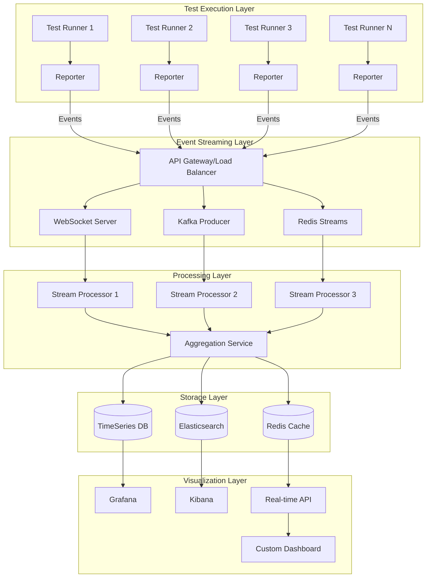

# Real-Time Metrics Aggregation and Streaming Analytics Patterns - Enterprise Guide

## Executive Summary

This document provides comprehensive patterns and implementations for real-time test metrics aggregation and streaming analytics in enterprise Node.js environments. We cover event streaming technologies (Kafka, Redis Streams, WebSockets), processing pipelines, visualization with Grafana/Kibana, and scalability patterns for high-volume test execution environments processing millions of events per hour.

## Table of Contents

1. [Architecture Overview](#architecture-overview)
2. [Event Streaming Technologies](#event-streaming-technologies)
3. [Real-Time Processing Pipelines](#real-time-processing-pipelines)
4. [WebSocket Implementation Patterns](#websocket-implementation-patterns)
5. [Kafka Integration Patterns](#kafka-integration-patterns)
6. [Redis Streams Implementation](#redis-streams-implementation)
7. [Stream Processing and Aggregation](#stream-processing-and-aggregation)
8. [Grafana Integration](#grafana-integration)
9. [Kibana Integration](#kibana-integration)
10. [Scalability Patterns](#scalability-patterns)
11. [Performance Optimization](#performance-optimization)
12. [Implementation Roadmap](#implementation-roadmap)

## 1. Architecture Overview

### High-Level Streaming Architecture



### Data Flow Architecture

```javascript
// Core event schema for all test metrics
const TestMetricEvent = {
  // Event metadata
  eventId: 'uuid-v4',
  eventType: 'test.started|test.completed|test.failed|suite.completed',
  timestamp: 'ISO-8601',
  version: '1.0',
  
  // Test identification
  testId: 'unique-test-id',
  testName: 'describe > it statement',
  suite: 'unit|integration|e2e',
  file: 'path/to/test/file.spec.js',
  
  // Execution context
  runner: 'jest|mocha|cypress|playwright',
  environment: 'dev|ci|staging',
  executionId: 'build-123',
  
  // Metrics
  metrics: {
    duration: 1234, // milliseconds
    memory: {
      heapUsed: 123456789,
      heapTotal: 234567890,
      external: 34567890
    },
    cpu: {
      user: 0.85,
      system: 0.15
    }
  },
  
  // Result data
  result: {
    status: 'pass|fail|skip',
    assertions: {
      passed: 10,
      failed: 0,
      total: 10
    },
    error: {
      type: 'AssertionError',
      message: 'Expected true to be false',
      stack: 'full stack trace'
    }
  },
  
  // Metadata
  metadata: {
    browser: 'chrome',
    os: 'linux',
    node: '20.11.0',
    tags: ['smoke', 'regression'],
    custom: {}
  }
};
```

## 2. Event Streaming Technologies

### Technology Comparison Matrix

| Feature | WebSockets | Kafka | Redis Streams |
|---------|------------|-------|---------------|
| **Latency** | < 10ms | 10-50ms | < 5ms |
| **Throughput** | 10K msg/s/connection | 1M+ msg/s | 100K msg/s |
| **Persistence** | No | Yes (configurable) | Yes (configurable) |
| **Ordering** | Per connection | Per partition | Per stream |
| **Scalability** | Vertical | Horizontal | Horizontal |
| **Complexity** | Low | High | Medium |
| **Best For** | Live dashboards | High-volume processing | Real-time + persistence |

### Selection Criteria

```javascript
// Decision framework for streaming technology
class StreamingTechnologySelector {
  static select(requirements) {
    const {
      volumePerSecond,
      latencyRequirement,
      durabilityNeeded,
      orderingRequired,
      complexityTolerance
    } = requirements;
    
    // WebSockets for low-latency, direct updates
    if (latencyRequirement < 50 && volumePerSecond < 10000 && !durabilityNeeded) {
      return 'websockets';
    }
    
    // Kafka for high-volume, durable streaming
    if (volumePerSecond > 100000 || (durabilityNeeded && orderingRequired)) {
      return 'kafka';
    }
    
    // Redis Streams for balanced requirements
    if (latencyRequirement < 100 && durabilityNeeded && complexityTolerance === 'medium') {
      return 'redis-streams';
    }
    
    // Hybrid approach for comprehensive coverage
    return 'hybrid';
  }
}
```

## 3. Real-Time Processing Pipelines

### Stream Processing Architecture

```javascript
// Base stream processor class
class StreamProcessor {
  constructor(config) {
    this.config = config;
    this.processors = [];
    this.metrics = {
      processed: 0,
      errors: 0,
      latency: []
    };
  }
  
  // Add processing stages
  use(processor) {
    this.processors.push(processor);
    return this;
  }
  
  // Process event through pipeline
  async process(event) {
    const startTime = Date.now();
    let processedEvent = event;
    
    try {
      // Validate event
      this.validateEvent(event);
      
      // Run through processors
      for (const processor of this.processors) {
        processedEvent = await processor(processedEvent);
        if (!processedEvent) break; // Filtered out
      }
      
      this.metrics.processed++;
      this.metrics.latency.push(Date.now() - startTime);
      
      return processedEvent;
    } catch (error) {
      this.metrics.errors++;
      this.handleError(error, event);
      throw error;
    }
  }
  
  validateEvent(event) {
    if (!event.eventId || !event.eventType || !event.timestamp) {
      throw new Error('Invalid event structure');
    }
  }
  
  handleError(error, event) {
    console.error('Processing error:', error, 'Event:', event);
    // Send to dead letter queue
  }
  
  getMetrics() {
    const avgLatency = this.metrics.latency.length > 0
      ? this.metrics.latency.reduce((a, b) => a + b, 0) / this.metrics.latency.length
      : 0;
    
    return {
      ...this.metrics,
      avgLatency,
      throughput: this.metrics.processed / (Date.now() - this.startTime) * 1000
    };
  }
}

// Enrichment processor
const enrichmentProcessor = async (event) => {
  // Add computed fields
  event.enriched = {
    testPath: `${event.suite}/${event.file}/${event.testName}`,
    isFlaky: await checkFlakiness(event.testId),
    environment: {
      ...event.metadata,
      region: process.env.AWS_REGION,
      cluster: process.env.K8S_CLUSTER
    }
  };
  
  return event;
};

// Aggregation processor
const aggregationProcessor = async (event) => {
  // Update running aggregates
  if (event.eventType === 'test.completed') {
    await updateAggregates({
      suite: event.suite,
      status: event.result.status,
      duration: event.metrics.duration
    });
  }
  
  return event;
};

// Filter processor
const filterProcessor = async (event) => {
  // Filter out non-critical events in production
  if (process.env.NODE_ENV === 'production' && 
      event.result?.status === 'skip') {
    return null; // Filter out
  }
  
  return event;
};
```

### Multi-Stage Pipeline Implementation

```javascript
// Complete pipeline implementation
class TestMetricsPipeline {
  constructor() {
    this.stages = {
      ingestion: new IngestionStage(),
      validation: new ValidationStage(),
      enrichment: new EnrichmentStage(),
      aggregation: new AggregationStage(),
      distribution: new DistributionStage()
    };
    
    this.setupPipeline();
  }
  
  setupPipeline() {
    // Connect stages
    this.stages.ingestion
      .pipe(this.stages.validation)
      .pipe(this.stages.enrichment)
      .pipe(this.stages.aggregation)
      .pipe(this.stages.distribution);
  }
  
  async processEvent(event) {
    return this.stages.ingestion.process(event);
  }
}

// Ingestion stage with backpressure handling
class IngestionStage {
  constructor() {
    this.queue = [];
    this.maxQueueSize = 10000;
    this.processing = false;
  }
  
  async process(event) {
    if (this.queue.length >= this.maxQueueSize) {
      throw new Error('Ingestion queue full - applying backpressure');
    }
    
    this.queue.push(event);
    
    if (!this.processing) {
      this.startProcessing();
    }
    
    return event;
  }
  
  async startProcessing() {
    this.processing = true;
    
    while (this.queue.length > 0) {
      const batch = this.queue.splice(0, 100);
      await this.processBatch(batch);
    }
    
    this.processing = false;
  }
  
  async processBatch(batch) {
    // Process batch and pass to next stage
    const promises = batch.map(event => this.next?.process(event));
    await Promise.all(promises);
  }
  
  pipe(nextStage) {
    this.next = nextStage;
    return nextStage;
  }
}
```

## 4. WebSocket Implementation Patterns

### Scalable WebSocket Server

```javascript
// WebSocket server with clustering and Redis pub/sub
const WebSocket = require('ws');
const Redis = require('ioredis');
const cluster = require('cluster');
const numCPUs = require('os').cpus().length;

class ScalableWebSocketServer {
  constructor(config) {
    this.config = config;
    this.connections = new Map();
    this.redis = new Redis(config.redis);
    this.pubClient = new Redis(config.redis);
    this.subClient = new Redis(config.redis);
  }
  
  start() {
    if (cluster.isMaster) {
      // Master process - spawn workers
      console.log(`Master ${process.pid} starting ${numCPUs} workers`);
      
      for (let i = 0; i < numCPUs; i++) {
        cluster.fork();
      }
      
      cluster.on('exit', (worker, code, signal) => {
        console.log(`Worker ${worker.process.pid} died`);
        cluster.fork(); // Restart worker
      });
    } else {
      // Worker process - handle WebSocket connections
      this.startWorker();
    }
  }
  
  startWorker() {
    const wss = new WebSocket.Server({
      port: this.config.port,
      perMessageDeflate: {
        zlibDeflateOptions: {
          chunkSize: 1024,
          memLevel: 7,
          level: 3
        },
        zlibInflateOptions: {
          chunkSize: 10 * 1024
        },
        clientNoContextTakeover: true,
        serverNoContextTakeover: true,
        serverMaxWindowBits: 10,
        concurrencyLimit: 10,
        threshold: 1024
      }
    });
    
    // Handle new connections
    wss.on('connection', (ws, req) => {
      const connectionId = this.generateConnectionId();
      this.handleConnection(ws, connectionId, req);
    });
    
    // Subscribe to Redis channels for cross-worker communication
    this.setupRedisSubscriptions();
    
    console.log(`Worker ${process.pid} WebSocket server started on port ${this.config.port}`);
  }
  
  handleConnection(ws, connectionId, req) {
    // Store connection
    this.connections.set(connectionId, {
      ws,
      subscriptions: new Set(),
      metadata: {
        ip: req.socket.remoteAddress,
        userAgent: req.headers['user-agent'],
        connectedAt: new Date()
      }
    });
    
    // Send welcome message
    ws.send(JSON.stringify({
      type: 'connection',
      connectionId,
      timestamp: new Date()
    }));
    
    // Handle messages
    ws.on('message', (data) => {
      this.handleMessage(connectionId, data);
    });
    
    // Handle close
    ws.on('close', () => {
      this.handleDisconnection(connectionId);
    });
    
    // Handle errors
    ws.on('error', (error) => {
      console.error(`WebSocket error for ${connectionId}:`, error);
    });
    
    // Setup heartbeat
    this.setupHeartbeat(connectionId);
  }
  
  async handleMessage(connectionId, data) {
    try {
      const message = JSON.parse(data);
      
      switch (message.type) {
        case 'subscribe':
          await this.handleSubscribe(connectionId, message);
          break;
          
        case 'unsubscribe':
          await this.handleUnsubscribe(connectionId, message);
          break;
          
        case 'event':
          await this.handleEvent(connectionId, message);
          break;
          
        case 'ping':
          this.handlePing(connectionId);
          break;
          
        default:
          console.warn(`Unknown message type: ${message.type}`);
      }
    } catch (error) {
      console.error('Message handling error:', error);
      this.sendError(connectionId, error.message);
    }
  }
  
  async handleSubscribe(connectionId, message) {
    const { channel } = message;
    const connection = this.connections.get(connectionId);
    
    if (!connection) return;
    
    connection.subscriptions.add(channel);
    
    // Subscribe to Redis channel
    await this.subClient.subscribe(channel);
    
    // Send confirmation
    connection.ws.send(JSON.stringify({
      type: 'subscribed',
      channel,
      timestamp: new Date()
    }));
  }
  
  async handleEvent(connectionId, message) {
    const { event } = message;
    
    // Validate event
    if (!this.validateEvent(event)) {
      this.sendError(connectionId, 'Invalid event format');
      return;
    }
    
    // Process event
    const processedEvent = await this.processEvent(event);
    
    // Broadcast to subscribers
    await this.broadcastEvent(processedEvent);
    
    // Send acknowledgment
    const connection = this.connections.get(connectionId);
    if (connection) {
      connection.ws.send(JSON.stringify({
        type: 'ack',
        eventId: event.eventId,
        timestamp: new Date()
      }));
    }
  }
  
  async broadcastEvent(event) {
    // Determine channels based on event
    const channels = this.getChannelsForEvent(event);
    
    // Publish to Redis for cross-worker broadcasting
    for (const channel of channels) {
      await this.pubClient.publish(channel, JSON.stringify({
        type: 'broadcast',
        event,
        timestamp: new Date()
      }));
    }
  }
  
  setupRedisSubscriptions() {
    this.subClient.on('message', (channel, message) => {
      try {
        const data = JSON.parse(message);
        
        if (data.type === 'broadcast') {
          // Send to all local connections subscribed to this channel
          this.connections.forEach((connection, connectionId) => {
            if (connection.subscriptions.has(channel) && 
                connection.ws.readyState === WebSocket.OPEN) {
              connection.ws.send(JSON.stringify({
                type: 'event',
                channel,
                event: data.event,
                timestamp: data.timestamp
              }));
            }
          });
        }
      } catch (error) {
        console.error('Redis message error:', error);
      }
    });
  }
  
  getChannelsForEvent(event) {
    const channels = ['all'];
    
    // Add specific channels based on event properties
    channels.push(`suite:${event.suite}`);
    channels.push(`runner:${event.runner}`);
    channels.push(`status:${event.result?.status}`);
    
    if (event.result?.status === 'fail') {
      channels.push('failures');
    }
    
    return channels;
  }
  
  setupHeartbeat(connectionId) {
    const connection = this.connections.get(connectionId);
    if (!connection) return;
    
    connection.heartbeat = setInterval(() => {
      if (connection.ws.readyState === WebSocket.OPEN) {
        connection.ws.ping();
        connection.lastPing = Date.now();
      } else {
        this.handleDisconnection(connectionId);
      }
    }, 30000); // 30 second heartbeat
  }
  
  handleDisconnection(connectionId) {
    const connection = this.connections.get(connectionId);
    
    if (connection) {
      // Clear heartbeat
      if (connection.heartbeat) {
        clearInterval(connection.heartbeat);
      }
      
      // Unsubscribe from channels
      connection.subscriptions.forEach(channel => {
        this.subClient.unsubscribe(channel);
      });
      
      // Remove connection
      this.connections.delete(connectionId);
    }
    
    console.log(`Connection ${connectionId} disconnected`);
  }
  
  generateConnectionId() {
    return `${process.pid}-${Date.now()}-${Math.random().toString(36).substr(2, 9)}`;
  }
  
  validateEvent(event) {
    return event && 
           event.eventId && 
           event.eventType && 
           event.timestamp;
  }
  
  sendError(connectionId, message) {
    const connection = this.connections.get(connectionId);
    
    if (connection && connection.ws.readyState === WebSocket.OPEN) {
      connection.ws.send(JSON.stringify({
        type: 'error',
        message,
        timestamp: new Date()
      }));
    }
  }
}

// Client-side WebSocket manager
class WebSocketClient {
  constructor(url, options = {}) {
    this.url = url;
    this.options = options;
    this.ws = null;
    this.reconnectAttempts = 0;
    this.maxReconnectAttempts = options.maxReconnectAttempts || 10;
    this.reconnectDelay = options.reconnectDelay || 1000;
    this.eventHandlers = new Map();
    this.subscriptions = new Set();
    this.messageQueue = [];
    this.connected = false;
  }
  
  connect() {
    return new Promise((resolve, reject) => {
      try {
        this.ws = new WebSocket(this.url);
        
        this.ws.onopen = () => {
          console.log('WebSocket connected');
          this.connected = true;
          this.reconnectAttempts = 0;
          
          // Resubscribe to channels
          this.subscriptions.forEach(channel => {
            this.subscribe(channel);
          });
          
          // Flush queued messages
          this.flushMessageQueue();
          
          resolve();
        };
        
        this.ws.onmessage = (event) => {
          this.handleMessage(event.data);
        };
        
        this.ws.onerror = (error) => {
          console.error('WebSocket error:', error);
          reject(error);
        };
        
        this.ws.onclose = () => {
          console.log('WebSocket disconnected');
          this.connected = false;
          this.handleReconnect();
        };
      } catch (error) {
        reject(error);
      }
    });
  }
  
  handleMessage(data) {
    try {
      const message = JSON.parse(data);
      
      switch (message.type) {
        case 'connection':
          this.connectionId = message.connectionId;
          this.emit('connected', message);
          break;
          
        case 'event':
          this.emit('event', message.event);
          this.emit(`event:${message.channel}`, message.event);
          break;
          
        case 'subscribed':
          this.emit('subscribed', message);
          break;
          
        case 'error':
          this.emit('error', new Error(message.message));
          break;
          
        case 'ack':
          this.emit(`ack:${message.eventId}`, message);
          break;
      }
    } catch (error) {
      console.error('Message parsing error:', error);
    }
  }
  
  subscribe(channel) {
    this.subscriptions.add(channel);
    
    if (this.connected) {
      this.send({
        type: 'subscribe',
        channel
      });
    }
  }
  
  unsubscribe(channel) {
    this.subscriptions.delete(channel);
    
    if (this.connected) {
      this.send({
        type: 'unsubscribe',
        channel
      });
    }
  }
  
  sendEvent(event) {
    return new Promise((resolve, reject) => {
      const eventId = event.eventId || this.generateEventId();
      event.eventId = eventId;
      
      // Setup acknowledgment handler
      const ackTimeout = setTimeout(() => {
        this.off(`ack:${eventId}`);
        reject(new Error('Event acknowledgment timeout'));
      }, 5000);
      
      this.once(`ack:${eventId}`, (ack) => {
        clearTimeout(ackTimeout);
        resolve(ack);
      });
      
      // Send event
      this.send({
        type: 'event',
        event
      });
    });
  }
  
  send(message) {
    if (this.connected && this.ws.readyState === WebSocket.OPEN) {
      this.ws.send(JSON.stringify(message));
    } else {
      // Queue message for later
      this.messageQueue.push(message);
    }
  }
  
  flushMessageQueue() {
    while (this.messageQueue.length > 0 && this.connected) {
      const message = this.messageQueue.shift();
      this.send(message);
    }
  }
  
  handleReconnect() {
    if (this.reconnectAttempts >= this.maxReconnectAttempts) {
      console.error('Max reconnection attempts reached');
      this.emit('reconnectFailed');
      return;
    }
    
    this.reconnectAttempts++;
    const delay = this.reconnectDelay * Math.pow(2, this.reconnectAttempts - 1);
    
    console.log(`Reconnecting in ${delay}ms (attempt ${this.reconnectAttempts})`);
    
    setTimeout(() => {
      this.connect().catch(error => {
        console.error('Reconnection failed:', error);
      });
    }, delay);
  }
  
  on(event, handler) {
    if (!this.eventHandlers.has(event)) {
      this.eventHandlers.set(event, []);
    }
    this.eventHandlers.get(event).push(handler);
  }
  
  once(event, handler) {
    const onceHandler = (...args) => {
      handler(...args);
      this.off(event, onceHandler);
    };
    this.on(event, onceHandler);
  }
  
  off(event, handler) {
    const handlers = this.eventHandlers.get(event);
    if (handlers) {
      const index = handlers.indexOf(handler);
      if (index > -1) {
        handlers.splice(index, 1);
      }
    }
  }
  
  emit(event, ...args) {
    const handlers = this.eventHandlers.get(event);
    if (handlers) {
      handlers.forEach(handler => {
        try {
          handler(...args);
        } catch (error) {
          console.error(`Handler error for event ${event}:`, error);
        }
      });
    }
  }
  
  generateEventId() {
    return `${Date.now()}-${Math.random().toString(36).substr(2, 9)}`;
  }
  
  close() {
    if (this.ws) {
      this.ws.close();
      this.ws = null;
    }
  }
}
```

## 5. Kafka Integration Patterns

### Kafka Producer Implementation

```javascript
// Kafka producer with batching and compression
const { Kafka, CompressionTypes, logLevel } = require('kafkajs');

class KafkaMetricsProducer {
  constructor(config) {
    this.kafka = new Kafka({
      clientId: config.clientId || 'test-metrics-producer',
      brokers: config.brokers,
      logLevel: logLevel.INFO,
      retry: {
        initialRetryTime: 100,
        retries: 8
      },
      ssl: config.ssl,
      sasl: config.sasl
    });
    
    this.producer = this.kafka.producer({
      allowAutoTopicCreation: true,
      transactionTimeout: 30000,
      compression: CompressionTypes.GZIP,
      maxInFlightRequests: 5,
      idempotent: true
    });
    
    this.config = config;
    this.connected = false;
    this.batch = [];
    this.batchSize = config.batchSize || 100;
    this.batchTimeout = config.batchTimeout || 1000;
    
    this.setupBatching();
  }
  
  async connect() {
    await this.producer.connect();
    this.connected = true;
    console.log('Kafka producer connected');
  }
  
  async disconnect() {
    await this.flushBatch();
    await this.producer.disconnect();
    this.connected = false;
  }
  
  setupBatching() {
    // Periodic batch flush
    this.batchTimer = setInterval(async () => {
      if (this.batch.length > 0) {
        await this.flushBatch();
      }
    }, this.batchTimeout);
  }
  
  async sendEvent(event) {
    if (!this.connected) {
      throw new Error('Producer not connected');
    }
    
    // Determine topic and partition key
    const topic = this.getTopicForEvent(event);
    const key = this.getPartitionKey(event);
    
    // Add to batch
    this.batch.push({
      topic,
      messages: [{
        key,
        value: JSON.stringify(event),
        headers: {
          eventType: event.eventType,
          timestamp: event.timestamp,
          version: event.version || '1.0'
        }
      }]
    });
    
    // Flush if batch is full
    if (this.batch.length >= this.batchSize) {
      await this.flushBatch();
    }
  }
  
  async flushBatch() {
    if (this.batch.length === 0) return;
    
    const currentBatch = this.batch.splice(0, this.batch.length);
    
    try {
      // Group by topic
      const topicBatches = currentBatch.reduce((acc, item) => {
        if (!acc[item.topic]) {
          acc[item.topic] = [];
        }
        acc[item.topic].push(...item.messages);
        return acc;
      }, {});
      
      // Send to Kafka
      const topicMessages = Object.entries(topicBatches).map(([topic, messages]) => ({
        topic,
        messages
      }));
      
      await this.producer.sendBatch({
        topicMessages,
        acks: -1, // Wait for all replicas
        timeout: 30000
      });
      
      console.log(`Flushed ${currentBatch.length} events to Kafka`);
    } catch (error) {
      console.error('Kafka batch send failed:', error);
      // Re-queue failed batch
      this.batch.unshift(...currentBatch);
      throw error;
    }
  }
  
  getTopicForEvent(event) {
    // Topic routing based on event type
    const topicMap = {
      'test.started': 'test-events',
      'test.completed': 'test-events',
      'test.failed': 'test-failures',
      'suite.completed': 'suite-events'
    };
    
    return topicMap[event.eventType] || 'test-events-misc';
  }
  
  getPartitionKey(event) {
    // Use test ID for consistent partitioning
    return event.testId || event.suite || 'default';
  }
}

// Kafka consumer with consumer group
class KafkaMetricsConsumer {
  constructor(config) {
    this.kafka = new Kafka({
      clientId: config.clientId || 'test-metrics-consumer',
      brokers: config.brokers,
      logLevel: logLevel.INFO
    });
    
    this.consumer = this.kafka.consumer({
      groupId: config.groupId || 'test-metrics-processors',
      sessionTimeout: 30000,
      heartbeatInterval: 3000,
      maxBytesPerPartition: 1048576, // 1MB
      maxWaitTimeInMs: 100,
      retry: {
        initialRetryTime: 100,
        retries: 8
      }
    });
    
    this.config = config;
    this.handlers = new Map();
    this.running = false;
  }
  
  async connect() {
    await this.consumer.connect();
    console.log('Kafka consumer connected');
  }
  
  async subscribe(topics) {
    await this.consumer.subscribe({
      topics,
      fromBeginning: false
    });
    console.log(`Subscribed to topics: ${topics.join(', ')}`);
  }
  
  registerHandler(eventType, handler) {
    this.handlers.set(eventType, handler);
  }
  
  async start() {
    this.running = true;
    
    await this.consumer.run({
      autoCommit: false,
      eachBatchAutoResolve: false,
      eachBatch: async ({ batch, resolveOffset, heartbeat, isRunning, isStale }) => {
        for (const message of batch.messages) {
          if (!isRunning() || isStale()) break;
          
          try {
            // Parse event
            const event = JSON.parse(message.value.toString());
            
            // Process event
            await this.processEvent(event);
            
            // Commit offset
            resolveOffset(message.offset);
            
            // Send heartbeat
            await heartbeat();
          } catch (error) {
            console.error('Event processing error:', error);
            // Decide whether to retry or skip
            if (this.shouldRetry(error)) {
              throw error; // Will retry
            } else {
              resolveOffset(message.offset); // Skip
            }
          }
        }
      }
    });
  }
  
  async processEvent(event) {
    const handler = this.handlers.get(event.eventType) || this.handlers.get('*');
    
    if (handler) {
      await handler(event);
    } else {
      console.warn(`No handler for event type: ${event.eventType}`);
    }
  }
  
  shouldRetry(error) {
    // Implement retry logic
    return error.retryable !== false;
  }
  
  async stop() {
    this.running = false;
    await this.consumer.stop();
    await this.consumer.disconnect();
  }
}

// Kafka Streams processor
class KafkaStreamsProcessor {
  constructor(config) {
    this.config = config;
    this.streams = new Map();
  }
  
  createStream(name, topology) {
    const stream = {
      name,
      topology,
      state: new Map(),
      windows: new Map()
    };
    
    this.streams.set(name, stream);
    return stream;
  }
  
  // Example: Test metrics aggregation stream
  createTestMetricsStream() {
    return this.createStream('test-metrics-aggregation', {
      source: 'test-events',
      
      processors: [
        // Filter completed tests
        {
          name: 'filter-completed',
          process: (event) => {
            return event.eventType === 'test.completed' ? event : null;
          }
        },
        
        // Group by suite
        {
          name: 'group-by-suite',
          process: (event, state) => {
            const suite = event.suite;
            if (!state.has(suite)) {
              state.set(suite, {
                total: 0,
                passed: 0,
                failed: 0,
                totalDuration: 0,
                durations: []
              });
            }
            
            const suiteStats = state.get(suite);
            suiteStats.total++;
            
            if (event.result.status === 'pass') {
              suiteStats.passed++;
            } else if (event.result.status === 'fail') {
              suiteStats.failed++;
            }
            
            suiteStats.totalDuration += event.metrics.duration;
            suiteStats.durations.push(event.metrics.duration);
            
            return event;
          }
        },
        
        // Window aggregation (5 minutes)
        {
          name: 'window-aggregate',
          process: (event, state, windows) => {
            const windowSize = 5 * 60 * 1000; // 5 minutes
            const windowKey = Math.floor(Date.now() / windowSize) * windowSize;
            
            if (!windows.has(windowKey)) {
              windows.set(windowKey, new Map());
            }
            
            const window = windows.get(windowKey);
            const suite = event.suite;
            
            if (!window.has(suite)) {
              window.set(suite, {
                count: 0,
                passRate: 0,
                avgDuration: 0,
                p95Duration: 0
              });
            }
            
            const stats = window.get(suite);
            stats.count++;
            
            // Update metrics
            const suiteState = state.get(suite);
            stats.passRate = suiteState.passed / suiteState.total;
            stats.avgDuration = suiteState.totalDuration / suiteState.total;
            stats.p95Duration = this.calculatePercentile(suiteState.durations, 0.95);
            
            return {
              ...event,
              window: windowKey,
              aggregates: stats
            };
          }
        }
      ],
      
      sink: 'test-metrics-aggregated'
    });
  }
  
  calculatePercentile(values, percentile) {
    if (values.length === 0) return 0;
    
    const sorted = values.slice().sort((a, b) => a - b);
    const index = Math.ceil(sorted.length * percentile) - 1;
    return sorted[index];
  }
}
```

## 6. Redis Streams Implementation

### Redis Streams Producer/Consumer

```javascript
// Redis Streams implementation
const Redis = require('ioredis');

class RedisStreamsMetrics {
  constructor(config) {
    this.redis = new Redis(config.redis);
    this.config = config;
    this.consumerGroups = new Map();
  }
  
  // Producer methods
  async addEvent(streamKey, event) {
    const fields = this.flattenObject(event);
    
    try {
      const id = await this.redis.xadd(
        streamKey,
        '*', // Auto-generate ID
        ...fields
      );
      
      return id;
    } catch (error) {
      console.error('Redis XADD error:', error);
      throw error;
    }
  }
  
  async addEventWithMaxLen(streamKey, event, maxLen = 10000) {
    const fields = this.flattenObject(event);
    
    try {
      const id = await this.redis.xadd(
        streamKey,
        'MAXLEN',
        '~', // Approximate maxlen for performance
        maxLen,
        '*',
        ...fields
      );
      
      return id;
    } catch (error) {
      console.error('Redis XADD with MAXLEN error:', error);
      throw error;
    }
  }
  
  flattenObject(obj, prefix = '') {
    const fields = [];
    
    for (const [key, value] of Object.entries(obj)) {
      const fieldKey = prefix ? `${prefix}.${key}` : key;
      
      if (typeof value === 'object' && value !== null && !Array.isArray(value)) {
        fields.push(...this.flattenObject(value, fieldKey));
      } else {
        fields.push(fieldKey, JSON.stringify(value));
      }
    }
    
    return fields;
  }
  
  // Consumer group methods
  async createConsumerGroup(streamKey, groupName, startId = '$') {
    try {
      await this.redis.xgroup(
        'CREATE',
        streamKey,
        groupName,
        startId,
        'MKSTREAM'
      );
      
      console.log(`Created consumer group ${groupName} for stream ${streamKey}`);
    } catch (error) {
      if (error.message.includes('BUSYGROUP')) {
        console.log(`Consumer group ${groupName} already exists`);
      } else {
        throw error;
      }
    }
  }
  
  async consumeEvents(streamKey, groupName, consumerName, handler, options = {}) {
    const {
      count = 10,
      blockMs = 1000,
      startId = '>',
      claimMinIdleTime = 60000,
      maxRetries = 3
    } = options;
    
    // Create consumer group if needed
    await this.createConsumerGroup(streamKey, groupName);
    
    const consumerInfo = {
      streamKey,
      groupName,
      consumerName,
      running: true,
      stats: {
        processed: 0,
        errors: 0,
        retries: 0
      }
    };
    
    this.consumerGroups.set(`${groupName}:${consumerName}`, consumerInfo);
    
    // Main consumer loop
    while (consumerInfo.running) {
      try {
        // Read new messages
        const messages = await this.redis.xreadgroup(
          'GROUP',
          groupName,
          consumerName,
          'COUNT',
          count,
          'BLOCK',
          blockMs,
          'STREAMS',
          streamKey,
          startId
        );
        
        if (messages && messages.length > 0) {
          const stream = messages[0];
          const events = stream[1];
          
          for (const [id, fields] of events) {
            try {
              // Parse event
              const event = this.parseEvent(fields);
              
              // Process event
              await handler(event, id);
              
              // Acknowledge message
              await this.redis.xack(streamKey, groupName, id);
              
              consumerInfo.stats.processed++;
            } catch (error) {
              console.error(`Error processing event ${id}:`, error);
              consumerInfo.stats.errors++;
              
              // Retry logic
              if (await this.shouldRetry(streamKey, groupName, id, error, maxRetries)) {
                consumerInfo.stats.retries++;
              }
            }
          }
        }
        
        // Claim stale messages periodically
        if (Math.random() < 0.1) { // 10% chance each iteration
          await this.claimStaleMessages(
            streamKey,
            groupName,
            consumerName,
            claimMinIdleTime,
            handler
          );
        }
      } catch (error) {
        console.error('Consumer loop error:', error);
        await new Promise(resolve => setTimeout(resolve, 5000));
      }
    }
  }
  
  parseEvent(fields) {
    const event = {};
    
    for (let i = 0; i < fields.length; i += 2) {
      const key = fields[i];
      const value = fields[i + 1];
      
      // Reconstruct nested object
      const keys = key.split('.');
      let current = event;
      
      for (let j = 0; j < keys.length - 1; j++) {
        if (!current[keys[j]]) {
          current[keys[j]] = {};
        }
        current = current[keys[j]];
      }
      
      try {
        current[keys[keys.length - 1]] = JSON.parse(value);
      } catch {
        current[keys[keys.length - 1]] = value;
      }
    }
    
    return event;
  }
  
  async claimStaleMessages(streamKey, groupName, consumerName, minIdleTime, handler) {
    try {
      // Get pending messages
      const pending = await this.redis.xpending(
        streamKey,
        groupName,
        'IDLE',
        minIdleTime,
        '-',
        '+',
        '10'
      );
      
      if (!pending || pending.length === 0) return;
      
      const messageIds = pending.map(p => p[0]);
      
      // Claim messages
      const claimed = await this.redis.xclaim(
        streamKey,
        groupName,
        consumerName,
        minIdleTime,
        ...messageIds
      );
      
      // Process claimed messages
      for (const [id, fields] of claimed) {
        try {
          const event = this.parseEvent(fields);
          await handler(event, id);
          await this.redis.xack(streamKey, groupName, id);
        } catch (error) {
          console.error(`Error processing claimed message ${id}:`, error);
        }
      }
      
      console.log(`Claimed and processed ${claimed.length} stale messages`);
    } catch (error) {
      console.error('Error claiming stale messages:', error);
    }
  }
  
  async shouldRetry(streamKey, groupName, messageId, error, maxRetries) {
    // Get message info
    const pending = await this.redis.xpending(
      streamKey,
      groupName,
      '-',
      '+',
      '1',
      messageId
    );
    
    if (!pending || pending.length === 0) return false;
    
    const deliveryCount = pending[0][3];
    
    if (deliveryCount >= maxRetries) {
      // Move to dead letter stream
      await this.moveToDeadLetter(streamKey, messageId, error);
      await this.redis.xack(streamKey, groupName, messageId);
      return false;
    }
    
    return true;
  }
  
  async moveToDeadLetter(streamKey, messageId, error) {
    const deadLetterStream = `${streamKey}:dead-letter`;
    
    // Get original message
    const messages = await this.redis.xrange(streamKey, messageId, messageId);
    
    if (messages && messages.length > 0) {
      const [id, fields] = messages[0];
      
      // Add to dead letter stream with error info
      await this.redis.xadd(
        deadLetterStream,
        '*',
        ...fields,
        'original_id',
        id,
        'error',
        error.message,
        'failed_at',
        new Date().toISOString()
      );
    }
  }
  
  // Stream processing patterns
  async createStreamProcessor(config) {
    const processor = {
      name: config.name,
      inputStream: config.inputStream,
      outputStream: config.outputStream,
      processor: config.processor,
      state: new Map()
    };
    
    // Start processing
    await this.consumeEvents(
      processor.inputStream,
      `${processor.name}-group`,
      `${processor.name}-${process.pid}`,
      async (event, id) => {
        // Process event
        const result = await processor.processor(event, processor.state);
        
        // Write to output stream if result exists
        if (result) {
          await this.addEvent(processor.outputStream, result);
        }
      }
    );
    
    return processor;
  }
  
  // Aggregation example
  async createAggregationProcessor() {
    return this.createStreamProcessor({
      name: 'test-aggregator',
      inputStream: 'test-events',
      outputStream: 'test-aggregates',
      
      processor: async (event, state) => {
        if (event.eventType !== 'test.completed') return null;
        
        const key = `${event.suite}:${event.runner}`;
        
        if (!state.has(key)) {
          state.set(key, {
            total: 0,
            passed: 0,
            failed: 0,
            totalDuration: 0,
            lastUpdate: Date.now()
          });
        }
        
        const stats = state.get(key);
        stats.total++;
        
        if (event.result.status === 'pass') {
          stats.passed++;
        } else if (event.result.status === 'fail') {
          stats.failed++;
        }
        
        stats.totalDuration += event.metrics.duration;
        stats.lastUpdate = Date.now();
        
        // Emit aggregate every 10 events or 30 seconds
        if (stats.total % 10 === 0 || 
            Date.now() - stats.lastUpdate > 30000) {
          return {
            type: 'aggregate',
            key,
            timestamp: new Date(),
            stats: {
              ...stats,
              passRate: stats.passed / stats.total,
              avgDuration: stats.totalDuration / stats.total
            }
          };
        }
        
        return null;
      }
    });
  }
  
  // Monitoring and stats
  async getStreamInfo(streamKey) {
    const info = await this.redis.xinfo('STREAM', streamKey);
    const groups = await this.redis.xinfo('GROUPS', streamKey);
    
    return {
      stream: {
        length: info[1],
        firstEntry: info[3],
        lastEntry: info[5]
      },
      groups: groups.map(group => ({
        name: group[1],
        consumers: group[3],
        pending: group[5]
      }))
    };
  }
  
  async getConsumerStats() {
    const stats = {};
    
    for (const [key, consumer] of this.consumerGroups) {
      stats[key] = consumer.stats;
    }
    
    return stats;
  }
  
  // Cleanup
  async cleanup() {
    // Stop all consumers
    for (const consumer of this.consumerGroups.values()) {
      consumer.running = false;
    }
    
    // Close Redis connection
    await this.redis.quit();
  }
}

// High-level Redis Streams manager
class RedisStreamsManager {
  constructor(config) {
    this.config = config;
    this.streams = new RedisStreamsMetrics(config);
    this.processors = new Map();
  }
  
  async initialize() {
    // Create streams
    const streamKeys = [
      'test-events',
      'test-aggregates',
      'test-alerts',
      'test-metrics'
    ];
    
    for (const key of streamKeys) {
      await this.streams.createConsumerGroup(key, 'default-group');
    }
    
    // Setup processors
    await this.setupProcessors();
  }
  
  async setupProcessors() {
    // Event router
    this.processors.set('router', {
      name: 'event-router',
      start: () => this.streams.consumeEvents(
        'test-events',
        'router-group',
        'router-1',
        async (event) => {
          // Route to specific streams based on event type
          if (event.result?.status === 'fail') {
            await this.streams.addEvent('test-failures', event);
          }
          
          if (event.metrics?.duration > 30000) {
            await this.streams.addEvent('slow-tests', event);
          }
          
          // Always send to metrics stream
          await this.streams.addEvent('test-metrics', event);
        }
      )
    });
    
    // Aggregator
    this.processors.set('aggregator', {
      name: 'metrics-aggregator',
      start: () => this.streams.createAggregationProcessor()
    });
    
    // Alert generator
    this.processors.set('alerter', {
      name: 'alert-generator',
      start: () => this.streams.consumeEvents(
        'test-aggregates',
        'alerter-group',
        'alerter-1',
        async (aggregate) => {
          // Check for alert conditions
          if (aggregate.stats.passRate < 0.8) {
            await this.streams.addEvent('test-alerts', {
              type: 'low-pass-rate',
              severity: 'warning',
              aggregate,
              message: `Pass rate dropped to ${(aggregate.stats.passRate * 100).toFixed(2)}%`
            });
          }
          
          if (aggregate.stats.avgDuration > 10000) {
            await this.streams.addEvent('test-alerts', {
              type: 'slow-tests',
              severity: 'info',
              aggregate,
              message: `Average test duration is ${aggregate.stats.avgDuration}ms`
            });
          }
        }
      )
    });
  }
  
  async start() {
    // Start all processors
    for (const processor of this.processors.values()) {
      processor.instance = await processor.start();
      console.log(`Started processor: ${processor.name}`);
    }
  }
  
  async stop() {
    await this.streams.cleanup();
  }
}
```

## 7. Stream Processing and Aggregation

### Complex Event Processing

```javascript
// Complex event processing engine
class ComplexEventProcessor {
  constructor() {
    this.rules = new Map();
    this.windows = new Map();
    this.patterns = new Map();
    this.state = new Map();
  }
  
  // Define processing rules
  defineRule(name, rule) {
    this.rules.set(name, {
      name,
      condition: rule.condition,
      action: rule.action,
      window: rule.window,
      enabled: true
    });
  }
  
  // Pattern detection
  definePattern(name, pattern) {
    this.patterns.set(name, {
      name,
      sequence: pattern.sequence,
      timeWindow: pattern.timeWindow,
      action: pattern.action,
      buffer: []
    });
  }
  
  // Process incoming event
  async processEvent(event) {
    // Update windows
    this.updateWindows(event);
    
    // Check rules
    for (const rule of this.rules.values()) {
      if (rule.enabled && await this.evaluateRule(rule, event)) {
        await rule.action(event, this.state);
      }
    }
    
    // Check patterns
    for (const pattern of this.patterns.values()) {
      await this.evaluatePattern(pattern, event);
    }
    
    // Emit derived events
    const derivedEvents = await this.generateDerivedEvents(event);
    return derivedEvents;
  }
  
  updateWindows(event) {
    // Sliding window
    const slidingWindow = this.windows.get('sliding') || [];
    slidingWindow.push(event);
    
    // Remove old events
    const windowSize = 5 * 60 * 1000; // 5 minutes
    const cutoff = Date.now() - windowSize;
    const filtered = slidingWindow.filter(e => 
      new Date(e.timestamp).getTime() > cutoff
    );
    
    this.windows.set('sliding', filtered);
    
    // Tumbling window
    const tumblingKey = Math.floor(Date.now() / windowSize) * windowSize;
    const tumblingWindow = this.windows.get(`tumbling-${tumblingKey}`) || [];
    tumblingWindow.push(event);
    this.windows.set(`tumbling-${tumblingKey}`, tumblingWindow);
  }
  
  async evaluateRule(rule, event) {
    // Get window data
    const windowData = rule.window 
      ? this.windows.get(rule.window.type) || []
      : [event];
    
    // Evaluate condition
    return rule.condition(event, windowData, this.state);
  }
  
  async evaluatePattern(pattern, event) {
    // Add to buffer
    pattern.buffer.push({
      event,
      timestamp: Date.now()
    });
    
    // Clean old events
    const cutoff = Date.now() - pattern.timeWindow;
    pattern.buffer = pattern.buffer.filter(item => item.timestamp > cutoff);
    
    // Check sequence
    if (this.matchesSequence(pattern.buffer, pattern.sequence)) {
      await pattern.action(pattern.buffer.map(item => item.event));
      pattern.buffer = []; // Reset after match
    }
  }
  
  matchesSequence(buffer, sequence) {
    if (buffer.length < sequence.length) return false;
    
    let sequenceIndex = 0;
    
    for (const item of buffer) {
      if (sequence[sequenceIndex](item.event)) {
        sequenceIndex++;
        if (sequenceIndex === sequence.length) {
          return true;
        }
      }
    }
    
    return false;
  }
  
  async generateDerivedEvents(event) {
    const derived = [];
    
    // Calculate rate metrics
    if (event.eventType === 'test.completed') {
      const window = this.windows.get('sliding') || [];
      const recentTests = window.filter(e => e.eventType === 'test.completed');
      
      if (recentTests.length >= 10) {
        const passRate = recentTests.filter(e => e.result.status === 'pass').length / recentTests.length;
        const avgDuration = recentTests.reduce((sum, e) => sum + e.metrics.duration, 0) / recentTests.length;
        
        derived.push({
          eventType: 'metrics.calculated',
          timestamp: new Date(),
          metrics: {
            passRate,
            avgDuration,
            sampleSize: recentTests.length
          }
        });
      }
    }
    
    return derived;
  }
  
  // Example rules
  setupDefaultRules() {
    // High failure rate detection
    this.defineRule('high-failure-rate', {
      condition: (event, window) => {
        const recentTests = window.filter(e => e.eventType === 'test.completed');
        if (recentTests.length < 20) return false;
        
        const failureRate = recentTests.filter(e => e.result.status === 'fail').length / recentTests.length;
        return failureRate > 0.3;
      },
      action: async (event, state) => {
        console.log('High failure rate detected!');
        // Send alert
      },
      window: { type: 'sliding' }
    });
    
    // Performance degradation detection
    this.defineRule('performance-degradation', {
      condition: (event, window, state) => {
        if (event.eventType !== 'test.completed') return false;
        
        const baseline = state.get('performance-baseline') || {};
        const testBaseline = baseline[event.testId];
        
        if (!testBaseline) {
          // Store baseline
          baseline[event.testId] = event.metrics.duration;
          state.set('performance-baseline', baseline);
          return false;
        }
        
        // Check if current duration is significantly higher
        return event.metrics.duration > testBaseline * 1.5;
      },
      action: async (event) => {
        console.log(`Performance degradation in test: ${event.testName}`);
      }
    });
    
    // Flaky test pattern detection
    this.definePattern('flaky-test', {
      sequence: [
        (e) => e.eventType === 'test.completed' && e.result.status === 'pass',
        (e) => e.eventType === 'test.completed' && e.result.status === 'fail',
        (e) => e.eventType === 'test.completed' && e.result.status === 'pass'
      ],
      timeWindow: 60 * 60 * 1000, // 1 hour
      action: async (events) => {
        const testId = events[0].testId;
        console.log(`Flaky test detected: ${testId}`);
      }
    });
  }
}

// Stream aggregation engine
class StreamAggregationEngine {
  constructor() {
    this.aggregators = new Map();
    this.state = new Map();
  }
  
  // Define aggregator
  defineAggregator(name, config) {
    this.aggregators.set(name, {
      name,
      groupBy: config.groupBy,
      window: config.window,
      metrics: config.metrics,
      output: config.output
    });
  }
  
  // Process event through aggregators
  async processEvent(event) {
    const results = [];
    
    for (const aggregator of this.aggregators.values()) {
      const result = await this.aggregate(aggregator, event);
      if (result) {
        results.push(result);
      }
    }
    
    return results;
  }
  
  async aggregate(aggregator, event) {
    // Get group key
    const groupKey = this.getGroupKey(event, aggregator.groupBy);
    
    // Get or create state
    const stateKey = `${aggregator.name}:${groupKey}`;
    let state = this.state.get(stateKey);
    
    if (!state) {
      state = {
        groupKey,
        window: this.getWindow(aggregator.window),
        values: {},
        count: 0,
        lastUpdate: Date.now()
      };
      this.state.set(stateKey, state);
    }
    
    // Update metrics
    state.count++;
    
    for (const [metricName, metric] of Object.entries(aggregator.metrics)) {
      const value = this.extractValue(event, metric.field);
      
      if (value !== undefined) {
        if (!state.values[metricName]) {
          state.values[metricName] = {
            type: metric.type,
            values: []
          };
        }
        
        const metricState = state.values[metricName];
        
        switch (metric.type) {
          case 'sum':
            metricState.sum = (metricState.sum || 0) + value;
            break;
            
          case 'avg':
            metricState.values.push(value);
            metricState.avg = metricState.values.reduce((a, b) => a + b, 0) / metricState.values.length;
            break;
            
          case 'min':
            metricState.min = metricState.min !== undefined 
              ? Math.min(metricState.min, value)
              : value;
            break;
            
          case 'max':
            metricState.max = metricState.max !== undefined
              ? Math.max(metricState.max, value)
              : value;
            break;
            
          case 'count':
            metricState.count = (metricState.count || 0) + 1;
            break;
            
          case 'percentile':
            metricState.values.push(value);
            break;
        }
      }
    }
    
    state.lastUpdate = Date.now();
    
    // Check if window is complete
    if (this.isWindowComplete(state, aggregator.window)) {
      // Calculate final values
      const output = {
        aggregator: aggregator.name,
        groupKey,
        window: state.window,
        timestamp: new Date(),
        metrics: {}
      };
      
      for (const [metricName, metricState] of Object.entries(state.values)) {
        if (metricState.type === 'percentile') {
          output.metrics[metricName] = this.calculatePercentiles(
            metricState.values,
            aggregator.metrics[metricName].percentiles || [0.5, 0.95, 0.99]
          );
        } else {
          output.metrics[metricName] = metricState[metricState.type];
        }
      }
      
      // Reset state for next window
      this.state.delete(stateKey);
      
      return output;
    }
    
    return null;
  }
  
  getGroupKey(event, groupBy) {
    if (typeof groupBy === 'function') {
      return groupBy(event);
    }
    
    const keys = Array.isArray(groupBy) ? groupBy : [groupBy];
    return keys.map(key => this.extractValue(event, key)).join(':');
  }
  
  extractValue(event, field) {
    const parts = field.split('.');
    let value = event;
    
    for (const part of parts) {
      value = value?.[part];
      if (value === undefined) break;
    }
    
    return value;
  }
  
  getWindow(windowConfig) {
    const now = Date.now();
    
    switch (windowConfig.type) {
      case 'tumbling':
        const size = windowConfig.size;
        return {
          type: 'tumbling',
          start: Math.floor(now / size) * size,
          end: Math.floor(now / size) * size + size
        };
        
      case 'sliding':
        return {
          type: 'sliding',
          start: now - windowConfig.size,
          end: now
        };
        
      case 'session':
        return {
          type: 'session',
          start: now,
          timeout: windowConfig.timeout
        };
        
      default:
        return { type: 'global' };
    }
  }
  
  isWindowComplete(state, windowConfig) {
    const now = Date.now();
    
    switch (windowConfig.type) {
      case 'tumbling':
        return now >= state.window.end;
        
      case 'sliding':
        return state.count >= windowConfig.triggerCount || 
               now - state.window.start >= windowConfig.size;
        
      case 'session':
        return now - state.lastUpdate >= state.window.timeout;
        
      default:
        return state.count >= (windowConfig.triggerCount || 100);
    }
  }
  
  calculatePercentiles(values, percentiles) {
    if (values.length === 0) return {};
    
    const sorted = values.slice().sort((a, b) => a - b);
    const result = {};
    
    for (const p of percentiles) {
      const index = Math.ceil(sorted.length * p) - 1;
      result[`p${p * 100}`] = sorted[Math.max(0, index)];
    }
    
    return result;
  }
  
  // Example aggregators
  setupDefaultAggregators() {
    // Test suite performance aggregator
    this.defineAggregator('suite-performance', {
      groupBy: ['suite', 'environment'],
      window: { type: 'tumbling', size: 5 * 60 * 1000 }, // 5 minutes
      metrics: {
        testCount: { type: 'count' },
        avgDuration: { type: 'avg', field: 'metrics.duration' },
        maxDuration: { type: 'max', field: 'metrics.duration' },
        durationPercentiles: { 
          type: 'percentile', 
          field: 'metrics.duration',
          percentiles: [0.5, 0.75, 0.95, 0.99]
        },
        passCount: {
          type: 'sum',
          field: 'result.status',
          filter: (value) => value === 'pass' ? 1 : 0
        }
      }
    });
    
    // Error rate aggregator
    this.defineAggregator('error-rates', {
      groupBy: (event) => event.error?.type || 'none',
      window: { type: 'sliding', size: 10 * 60 * 1000, triggerCount: 50 },
      metrics: {
        errorCount: { type: 'count' },
        affectedTests: { type: 'unique', field: 'testId' },
        environments: { type: 'unique', field: 'environment' }
      }
    });
  }
}
```

## 8. Grafana Integration

### Grafana Dashboard Configuration

```javascript
// Grafana dashboard generator
class GrafanaDashboardGenerator {
  constructor() {
    this.dashboard = {
      title: 'Test Metrics Real-Time Dashboard',
      tags: ['testing', 'metrics', 'real-time'],
      timezone: 'browser',
      panels: [],
      time: {
        from: 'now-1h',
        to: 'now'
      },
      refresh: '5s'
    };
  }
  
  generateDashboard() {
    this.addOverviewRow();
    this.addPerformanceRow();
    this.addFailureAnalysisRow();
    this.addRealtimeMetricsRow();
    
    return this.dashboard;
  }
  
  addOverviewRow() {
    const y = 0;
    
    // Total tests gauge
    this.addPanel({
      title: 'Total Tests (Last 5m)',
      type: 'stat',
      gridPos: { x: 0, y, w: 6, h: 8 },
      targets: [{
        expr: 'sum(rate(test_executions_total[5m]))',
        legendFormat: 'Tests/sec'
      }],
      options: {
        orientation: 'auto',
        textMode: 'auto',
        colorMode: 'value',
        graphMode: 'area',
        justifyMode: 'auto'
      }
    });
    
    // Pass rate gauge
    this.addPanel({
      title: 'Pass Rate',
      type: 'gauge',
      gridPos: { x: 6, y, w: 6, h: 8 },
      targets: [{
        expr: 'sum(rate(test_executions_total{status="pass"}[5m])) / sum(rate(test_executions_total[5m])) * 100',
        legendFormat: 'Pass Rate %'
      }],
      options: {
        showThresholdLabels: false,
        showThresholdMarkers: true
      },
      fieldConfig: {
        defaults: {
          min: 0,
          max: 100,
          unit: 'percent',
          thresholds: {
            mode: 'absolute',
            steps: [
              { value: 0, color: 'red' },
              { value: 80, color: 'yellow' },
              { value: 95, color: 'green' }
            ]
          }
        }
      }
    });
    
    // Average duration
    this.addPanel({
      title: 'Avg Test Duration',
      type: 'stat',
      gridPos: { x: 12, y, w: 6, h: 8 },
      targets: [{
        expr: 'histogram_quantile(0.5, sum(rate(test_duration_seconds_bucket[5m])) by (le))',
        legendFormat: 'Median Duration'
      }],
      options: {
        orientation: 'auto',
        textMode: 'auto',
        colorMode: 'value',
        graphMode: 'area'
      },
      fieldConfig: {
        defaults: {
          unit: 's',
          decimals: 2
        }
      }
    });
    
    // Failure count
    this.addPanel({
      title: 'Failures (Last 5m)',
      type: 'stat',
      gridPos: { x: 18, y, w: 6, h: 8 },
      targets: [{
        expr: 'sum(increase(test_executions_total{status="fail"}[5m]))',
        legendFormat: 'Failed Tests'
      }],
      options: {
        orientation: 'auto',
        textMode: 'auto',
        colorMode: 'value',
        graphMode: 'area'
      },
      fieldConfig: {
        defaults: {
          color: {
            mode: 'thresholds'
          },
          thresholds: {
            mode: 'absolute',
            steps: [
              { value: 0, color: 'green' },
              { value: 1, color: 'yellow' },
              { value: 10, color: 'red' }
            ]
          }
        }
      }
    });
  }
  
  addPerformanceRow() {
    const y = 9;
    
    // Duration histogram
    this.addPanel({
      title: 'Test Duration Distribution',
      type: 'heatmap',
      gridPos: { x: 0, y, w: 12, h: 8 },
      targets: [{
        expr: 'sum(increase(test_duration_seconds_bucket[1m])) by (le)',
        format: 'heatmap',
        legendFormat: '{{le}}'
      }],
      options: {
        calculate: true,
        yAxis: {
          axisPlacement: 'left',
          reverse: false
        },
        color: {
          mode: 'spectrum',
          scheme: 'Oranges'
        }
      }
    });
    
    // Duration percentiles over time
    this.addPanel({
      title: 'Test Duration Percentiles',
      type: 'graph',
      gridPos: { x: 12, y, w: 12, h: 8 },
      targets: [
        {
          expr: 'histogram_quantile(0.5, sum(rate(test_duration_seconds_bucket[5m])) by (le))',
          legendFormat: 'p50'
        },
        {
          expr: 'histogram_quantile(0.95, sum(rate(test_duration_seconds_bucket[5m])) by (le))',
          legendFormat: 'p95'
        },
        {
          expr: 'histogram_quantile(0.99, sum(rate(test_duration_seconds_bucket[5m])) by (le))',
          legendFormat: 'p99'
        }
      ],
      yaxes: [{
        format: 's',
        label: 'Duration'
      }]
    });
  }
  
  addFailureAnalysisRow() {
    const y = 18;
    
    // Failure rate by suite
    this.addPanel({
      title: 'Failure Rate by Suite',
      type: 'bargauge',
      gridPos: { x: 0, y, w: 12, h: 8 },
      targets: [{
        expr: 'sum by (suite) (rate(test_executions_total{status="fail"}[5m])) / sum by (suite) (rate(test_executions_total[5m])) * 100',
        legendFormat: '{{suite}}'
      }],
      options: {
        orientation: 'horizontal',
        displayMode: 'gradient',
        showUnfilled: true
      },
      fieldConfig: {
        defaults: {
          unit: 'percent',
          min: 0,
          max: 100,
          thresholds: {
            mode: 'absolute',
            steps: [
              { value: 0, color: 'green' },
              { value: 5, color: 'yellow' },
              { value: 20, color: 'red' }
            ]
          }
        }
      }
    });
    
    // Top failing tests
    this.addPanel({
      title: 'Top Failing Tests',
      type: 'table',
      gridPos: { x: 12, y, w: 12, h: 8 },
      targets: [{
        expr: 'topk(10, sum by (test_name) (increase(test_executions_total{status="fail"}[1h])))',
        format: 'table',
        instant: true
      }],
      options: {
        showHeader: true,
        sortBy: [{
          displayName: 'Value',
          desc: true
        }]
      }
    });
  }
  
  addRealtimeMetricsRow() {
    const y = 27;
    
    // Real-time event stream
    this.addPanel({
      title: 'Real-Time Test Events',
      type: 'logs',
      gridPos: { x: 0, y, w: 24, h: 10 },
      targets: [{
        expr: '{job="test-events"} |= "eventType"',
        refId: 'A'
      }],
      options: {
        showLabels: false,
        showTime: true,
        wrapLogMessage: false,
        prettifyLogMessage: true,
        enableLogDetails: true,
        dedupStrategy: 'none'
      }
    });
  }
  
  addPanel(panel) {
    this.dashboard.panels.push({
      id: this.dashboard.panels.length + 1,
      ...panel
    });
  }
  
  // Export dashboard JSON
  exportDashboard() {
    return JSON.stringify(this.dashboard, null, 2);
  }
}

// Grafana API client
class GrafanaAPIClient {
  constructor(config) {
    this.baseUrl = config.url;
    this.apiKey = config.apiKey;
    this.headers = {
      'Authorization': `Bearer ${this.apiKey}`,
      'Content-Type': 'application/json'
    };
  }
  
  async createDashboard(dashboard) {
    const response = await fetch(`${this.baseUrl}/api/dashboards/db`, {
      method: 'POST',
      headers: this.headers,
      body: JSON.stringify({
        dashboard,
        overwrite: true
      })
    });
    
    return response.json();
  }
  
  async createDataSource(dataSource) {
    const response = await fetch(`${this.baseUrl}/api/datasources`, {
      method: 'POST',
      headers: this.headers,
      body: JSON.stringify(dataSource)
    });
    
    return response.json();
  }
  
  // Create Prometheus data source
  async setupPrometheusDataSource() {
    return this.createDataSource({
      name: 'Test Metrics Prometheus',
      type: 'prometheus',
      url: 'http://prometheus:9090',
      access: 'proxy',
      isDefault: true,
      jsonData: {
        httpMethod: 'POST',
        keepCookies: [],
        timeInterval: '5s'
      }
    });
  }
  
  // Create WebSocket streaming data source
  async setupWebSocketDataSource() {
    return this.createDataSource({
      name: 'Test Events Stream',
      type: 'grafana-websocket-datasource',
      url: 'ws://localhost:8080',
      access: 'proxy',
      jsonData: {
        streamPath: '/stream'
      }
    });
  }
}
```

## 9. Kibana Integration

### Kibana Dashboard and Visualizations

```javascript
// Kibana dashboard configuration
class KibanaDashboardBuilder {
  constructor() {
    this.dashboard = {
      version: '8.11.0',
      objects: []
    };
  }
  
  buildDashboard() {
    // Create index pattern
    this.addIndexPattern();
    
    // Add visualizations
    this.addTestExecutionVisualization();
    this.addErrorAnalysisVisualization();
    this.addPerformanceVisualization();
    this.addLogStreamVisualization();
    
    // Create dashboard
    this.createDashboard();
    
    return this.dashboard;
  }
  
  addIndexPattern() {
    this.dashboard.objects.push({
      id: 'test-results-*',
      type: 'index-pattern',
      attributes: {
        title: 'test-results-*',
        timeFieldName: '@timestamp',
        fields: JSON.stringify([
          { name: 'testName', type: 'string', searchable: true, aggregatable: true },
          { name: 'suite', type: 'string', searchable: true, aggregatable: true },
          { name: 'status', type: 'string', searchable: true, aggregatable: true },
          { name: 'duration', type: 'number', searchable: true, aggregatable: true },
          { name: 'error.type', type: 'string', searchable: true, aggregatable: true },
          { name: 'error.message', type: 'string', searchable: true, aggregatable: false }
        ])
      }
    });
  }
  
  addTestExecutionVisualization() {
    // Time series of test executions
    this.dashboard.objects.push({
      id: 'test-execution-timeline',
      type: 'visualization',
      attributes: {
        title: 'Test Execution Timeline',
        visState: JSON.stringify({
          type: 'line',
          params: {
            grid: { categoryLines: false, style: { color: '#eee' } },
            categoryAxes: [{
              id: 'CategoryAxis-1',
              type: 'category',
              position: 'bottom',
              show: true,
              style: {},
              scale: { type: 'linear' },
              labels: { show: true, filter: true, truncate: 100 },
              title: {}
            }],
            valueAxes: [{
              id: 'ValueAxis-1',
              name: 'LeftAxis-1',
              type: 'value',
              position: 'left',
              show: true,
              style: {},
              scale: { type: 'linear', mode: 'normal' },
              labels: { show: true, rotate: 0, filter: false, truncate: 100 },
              title: { text: 'Test Count' }
            }],
            seriesParams: [{
              show: true,
              type: 'line',
              mode: 'normal',
              data: { label: 'Test Count', id: '1' },
              valueAxis: 'ValueAxis-1',
              drawLinesBetweenPoints: true,
              showCircles: true
            }],
            addTooltip: true,
            addLegend: true,
            legendPosition: 'right',
            times: [],
            addTimeMarker: false
          },
          aggs: [
            {
              id: '1',
              enabled: true,
              type: 'count',
              schema: 'metric',
              params: {}
            },
            {
              id: '2',
              enabled: true,
              type: 'date_histogram',
              schema: 'segment',
              params: {
                field: '@timestamp',
                interval: 'auto',
                customInterval: '2h',
                min_doc_count: 1,
                extended_bounds: {}
              }
            },
            {
              id: '3',
              enabled: true,
              type: 'terms',
              schema: 'group',
              params: {
                field: 'status',
                size: 5,
                order: 'desc',
                orderBy: '1'
              }
            }
          ]
        }),
        uiStateJSON: '{}',
        kibanaSavedObjectMeta: {
          searchSourceJSON: JSON.stringify({
            index: 'test-results-*',
            query: { match_all: {} },
            filter: []
          })
        }
      }
    });
  }
  
  addErrorAnalysisVisualization() {
    // Error type distribution
    this.dashboard.objects.push({
      id: 'error-type-distribution',
      type: 'visualization',
      attributes: {
        title: 'Error Type Distribution',
        visState: JSON.stringify({
          type: 'pie',
          params: {
            addTooltip: true,
            addLegend: true,
            legendPosition: 'right',
            isDonut: true,
            labels: {
              show: true,
              values: true,
              last_level: true,
              truncate: 100
            }
          },
          aggs: [
            {
              id: '1',
              enabled: true,
              type: 'count',
              schema: 'metric',
              params: {}
            },
            {
              id: '2',
              enabled: true,
              type: 'terms',
              schema: 'segment',
              params: {
                field: 'error.type',
                size: 10,
                order: 'desc',
                orderBy: '1'
              }
            }
          ]
        }),
        kibanaSavedObjectMeta: {
          searchSourceJSON: JSON.stringify({
            index: 'test-results-*',
            query: {
              bool: {
                must: [
                  { term: { status: 'fail' } }
                ]
              }
            }
          })
        }
      }
    });
  }
  
  addPerformanceVisualization() {
    // Test duration heatmap
    this.dashboard.objects.push({
      id: 'duration-heatmap',
      type: 'visualization',
      attributes: {
        title: 'Test Duration Heatmap',
        visState: JSON.stringify({
          type: 'heatmap',
          params: {
            type: 'heatmap',
            addTooltip: true,
            addLegend: true,
            enableHover: false,
            legendPosition: 'right',
            times: [],
            colorsNumber: 10,
            colorSchema: 'Greens',
            setColorRange: false,
            colorsRange: [],
            invertColors: false,
            percentageMode: false,
            valueAxes: [{
              show: true,
              id: 'ValueAxis-1',
              type: 'value',
              scale: { type: 'linear', defaultYExtents: false },
              labels: {
                show: true,
                rotate: 0,
                overwriteColor: false,
                color: '#555'
              }
            }]
          },
          aggs: [
            {
              id: '1',
              enabled: true,
              type: 'avg',
              schema: 'metric',
              params: {
                field: 'duration'
              }
            },
            {
              id: '2',
              enabled: true,
              type: 'date_histogram',
              schema: 'segment',
              params: {
                field: '@timestamp',
                interval: '10m',
                customInterval: '2h',
                min_doc_count: 1,
                extended_bounds: {}
              }
            },
            {
              id: '3',
              enabled: true,
              type: 'terms',
              schema: 'group',
              params: {
                field: 'suite',
                size: 20,
                order: 'desc',
                orderBy: '1'
              }
            }
          ]
        })
      }
    });
  }
  
  addLogStreamVisualization() {
    // Real-time log stream
    this.dashboard.objects.push({
      id: 'test-log-stream',
      type: 'search',
      attributes: {
        title: 'Test Event Stream',
        columns: ['@timestamp', 'eventType', 'testName', 'status', 'duration'],
        sort: ['@timestamp', 'desc'],
        kibanaSavedObjectMeta: {
          searchSourceJSON: JSON.stringify({
            index: 'test-results-*',
            highlightAll: true,
            query: { match_all: {} },
            filter: []
          })
        }
      }
    });
  }
  
  createDashboard() {
    this.dashboard.objects.push({
      id: 'test-metrics-dashboard',
      type: 'dashboard',
      attributes: {
        title: 'Test Metrics Dashboard',
        hits: 0,
        description: 'Real-time test metrics and analytics',
        panelsJSON: JSON.stringify([
          {
            id: 'test-execution-timeline',
            type: 'visualization',
            gridData: { x: 0, y: 0, w: 48, h: 15 }
          },
          {
            id: 'error-type-distribution',
            type: 'visualization',
            gridData: { x: 0, y: 15, w: 24, h: 15 }
          },
          {
            id: 'duration-heatmap',
            type: 'visualization',
            gridData: { x: 24, y: 15, w: 24, h: 15 }
          },
          {
            id: 'test-log-stream',
            type: 'search',
            gridData: { x: 0, y: 30, w: 48, h: 20 }
          }
        ]),
        optionsJSON: JSON.stringify({
          darkTheme: false,
          useMargins: true,
          hidePanelTitles: false
        }),
        timeRestore: true,
        timeTo: 'now',
        timeFrom: 'now-1h',
        refreshInterval: {
          display: '5 seconds',
          pause: false,
          value: 5000
        }
      }
    });
  }
}

// Kibana API client
class KibanaAPIClient {
  constructor(config) {
    this.baseUrl = config.url;
    this.username = config.username;
    this.password = config.password;
    this.headers = {
      'Content-Type': 'application/json',
      'kbn-xsrf': 'true',
      'Authorization': 'Basic ' + btoa(`${this.username}:${this.password}`)
    };
  }
  
  async importDashboard(dashboard) {
    const response = await fetch(`${this.baseUrl}/api/saved_objects/_import`, {
      method: 'POST',
      headers: this.headers,
      body: JSON.stringify(dashboard)
    });
    
    return response.json();
  }
  
  async createIndexPattern(pattern) {
    const response = await fetch(`${this.baseUrl}/api/saved_objects/index-pattern`, {
      method: 'POST',
      headers: this.headers,
      body: JSON.stringify({
        attributes: {
          title: pattern,
          timeFieldName: '@timestamp'
        }
      })
    });
    
    return response.json();
  }
  
  // Create watchers for alerting
  async createWatcher(watcher) {
    const response = await fetch(`${this.baseUrl}/api/watcher/watch/${watcher.id}`, {
      method: 'PUT',
      headers: this.headers,
      body: JSON.stringify(watcher)
    });
    
    return response.json();
  }
  
  // Example watcher for test failures
  createTestFailureWatcher() {
    return {
      id: 'test-failure-alert',
      trigger: {
        schedule: {
          interval: '1m'
        }
      },
      input: {
        search: {
          request: {
            search_type: 'query_then_fetch',
            indices: ['test-results-*'],
            body: {
              query: {
                bool: {
                  filter: [
                    { term: { status: 'fail' } },
                    { range: { '@timestamp': { gte: 'now-5m' } } }
                  ]
                }
              },
              aggs: {
                by_suite: {
                  terms: {
                    field: 'suite',
                    size: 10
                  },
                  aggs: {
                    failure_rate: {
                      avg: {
                        script: {
                          source: 'doc.status.value == "fail" ? 1 : 0'
                        }
                      }
                    }
                  }
                }
              }
            }
          }
        }
      },
      condition: {
        script: {
          source: 'return ctx.payload.aggregations.by_suite.buckets.any(b -> b.failure_rate.value > 0.2)'
        }
      },
      actions: {
        send_email: {
          email: {
            to: ['dev-team@example.com'],
            subject: 'High Test Failure Rate Alert',
            body: {
              text: 'Test failure rate exceeded 20% in the last 5 minutes'
            }
          }
        }
      }
    };
  }
}
```

## 10. Scalability Patterns

### Horizontal Scaling Architecture

```javascript
// Scalable stream processing architecture
class ScalableStreamProcessor {
  constructor(config) {
    this.config = config;
    this.workers = new Map();
    this.coordinator = null;
    this.loadBalancer = null;
  }
  
  async initialize() {
    // Setup coordinator
    this.coordinator = new ProcessCoordinator(this.config.coordinator);
    await this.coordinator.initialize();
    
    // Setup load balancer
    this.loadBalancer = new StreamLoadBalancer(this.config.loadBalancer);
    
    // Start workers
    await this.startWorkers();
    
    // Setup autoscaling
    this.setupAutoscaling();
  }
  
  async startWorkers() {
    const numWorkers = this.config.initialWorkers || os.cpus().length;
    
    for (let i = 0; i < numWorkers; i++) {
      await this.spawnWorker();
    }
  }
  
  async spawnWorker() {
    const workerId = `worker-${Date.now()}-${Math.random().toString(36).substr(2, 9)}`;
    
    const worker = {
      id: workerId,
      process: cluster.fork({
        WORKER_ID: workerId,
        WORKER_TYPE: 'stream-processor'
      }),
      metrics: {
        eventsProcessed: 0,
        errorRate: 0,
        avgLatency: 0,
        cpuUsage: 0,
        memoryUsage: 0
      },
      status: 'starting'
    };
    
    this.workers.set(workerId, worker);
    
    // Setup worker communication
    worker.process.on('message', (msg) => {
      this.handleWorkerMessage(workerId, msg);
    });
    
    worker.process.on('exit', (code, signal) => {
      console.log(`Worker ${workerId} died (${signal || code})`);
      this.workers.delete(workerId);
      
      // Restart worker if not shutting down
      if (!this.shuttingDown) {
        this.spawnWorker();
      }
    });
    
    return worker;
  }
  
  handleWorkerMessage(workerId, message) {
    const worker = this.workers.get(workerId);
    
    switch (message.type) {
      case 'metrics':
        Object.assign(worker.metrics, message.data);
        break;
        
      case 'status':
        worker.status = message.status;
        break;
        
      case 'error':
        console.error(`Worker ${workerId} error:`, message.error);
        break;
    }
  }
  
  setupAutoscaling() {
    // Monitor metrics and scale
    setInterval(() => {
      const metrics = this.getAggregateMetrics();
      
      // Scale up conditions
      if (metrics.avgCpuUsage > 80 || metrics.avgLatency > 1000) {
        this.scaleUp();
      }
      
      // Scale down conditions
      if (metrics.avgCpuUsage < 20 && this.workers.size > this.config.minWorkers) {
        this.scaleDown();
      }
    }, 30000); // Check every 30 seconds
  }
  
  getAggregateMetrics() {
    const metrics = {
      totalEvents: 0,
      avgCpuUsage: 0,
      avgMemoryUsage: 0,
      avgLatency: 0,
      errorRate: 0
    };
    
    let activeWorkers = 0;
    
    this.workers.forEach(worker => {
      if (worker.status === 'active') {
        activeWorkers++;
        metrics.totalEvents += worker.metrics.eventsProcessed;
        metrics.avgCpuUsage += worker.metrics.cpuUsage;
        metrics.avgMemoryUsage += worker.metrics.memoryUsage;
        metrics.avgLatency += worker.metrics.avgLatency;
        metrics.errorRate += worker.metrics.errorRate;
      }
    });
    
    if (activeWorkers > 0) {
      metrics.avgCpuUsage /= activeWorkers;
      metrics.avgMemoryUsage /= activeWorkers;
      metrics.avgLatency /= activeWorkers;
      metrics.errorRate /= activeWorkers;
    }
    
    return metrics;
  }
  
  async scaleUp() {
    const currentWorkers = this.workers.size;
    const maxWorkers = this.config.maxWorkers || 100;
    
    if (currentWorkers < maxWorkers) {
      const newWorkers = Math.min(
        Math.ceil(currentWorkers * 0.5), // Scale by 50%
        maxWorkers - currentWorkers
      );
      
      console.log(`Scaling up: adding ${newWorkers} workers`);
      
      for (let i = 0; i < newWorkers; i++) {
        await this.spawnWorker();
      }
    }
  }
  
  async scaleDown() {
    const currentWorkers = this.workers.size;
    const minWorkers = this.config.minWorkers || 2;
    
    if (currentWorkers > minWorkers) {
      const removeWorkers = Math.min(
        Math.floor(currentWorkers * 0.25), // Scale down by 25%
        currentWorkers - minWorkers
      );
      
      console.log(`Scaling down: removing ${removeWorkers} workers`);
      
      // Find least loaded workers
      const workerList = Array.from(this.workers.values())
        .sort((a, b) => a.metrics.eventsProcessed - b.metrics.eventsProcessed);
      
      for (let i = 0; i < removeWorkers; i++) {
        const worker = workerList[i];
        worker.process.send({ type: 'shutdown' });
        
        // Give worker time to finish
        setTimeout(() => {
          worker.process.kill('SIGTERM');
        }, 30000);
      }
    }
  }
}

// Process coordinator for distributed processing
class ProcessCoordinator {
  constructor(config) {
    this.config = config;
    this.redis = new Redis(config.redis);
    this.workers = new Map();
    this.partitions = new Map();
  }
  
  async initialize() {
    // Setup partition management
    await this.setupPartitions();
    
    // Start heartbeat
    this.startHeartbeat();
    
    // Monitor worker health
    this.monitorWorkers();
  }
  
  async setupPartitions() {
    const numPartitions = this.config.partitions || 32;
    
    for (let i = 0; i < numPartitions; i++) {
      this.partitions.set(i, {
        id: i,
        assignedWorker: null,
        lastAssignment: null
      });
    }
  }
  
  async registerWorker(workerId, capabilities) {
    const worker = {
      id: workerId,
      capabilities,
      lastHeartbeat: Date.now(),
      assignedPartitions: new Set(),
      status: 'active'
    };
    
    this.workers.set(workerId, worker);
    
    // Rebalance partitions
    await this.rebalancePartitions();
    
    return worker;
  }
  
  async rebalancePartitions() {
    const activeWorkers = Array.from(this.workers.values())
      .filter(w => w.status === 'active');
    
    if (activeWorkers.length === 0) return;
    
    const partitionsPerWorker = Math.ceil(this.partitions.size / activeWorkers.length);
    
    let workerIndex = 0;
    
    for (const partition of this.partitions.values()) {
      const worker = activeWorkers[workerIndex];
      
      // Assign partition
      partition.assignedWorker = worker.id;
      partition.lastAssignment = Date.now();
      worker.assignedPartitions.add(partition.id);
      
      // Notify worker
      await this.redis.publish(`worker:${worker.id}:assignments`, JSON.stringify({
        type: 'partition-assignment',
        partitions: Array.from(worker.assignedPartitions)
      }));
      
      workerIndex = (workerIndex + 1) % activeWorkers.length;
    }
    
    console.log('Partition rebalancing complete');
  }
  
  startHeartbeat() {
    setInterval(async () => {
      // Publish coordinator heartbeat
      await this.redis.setex(
        'coordinator:heartbeat',
        10,
        JSON.stringify({
          id: this.config.coordinatorId,
          timestamp: Date.now(),
          workers: this.workers.size,
          partitions: this.partitions.size
        })
      );
    }, 5000);
  }
  
  monitorWorkers() {
    setInterval(() => {
      const now = Date.now();
      const timeout = 30000; // 30 seconds
      
      for (const [workerId, worker] of this.workers) {
        if (now - worker.lastHeartbeat > timeout) {
          console.log(`Worker ${workerId} timed out`);
          worker.status = 'dead';
          
          // Reassign partitions
          this.rebalancePartitions();
        }
      }
    }, 10000);
  }
}

// Stream load balancer
class StreamLoadBalancer {
  constructor(config) {
    this.config = config;
    this.backends = [];
    this.currentIndex = 0;
    this.healthChecks = new Map();
  }
  
  addBackend(backend) {
    this.backends.push({
      ...backend,
      healthy: true,
      weight: backend.weight || 1,
      connections: 0,
      requestsHandled: 0
    });
    
    // Start health check
    this.startHealthCheck(backend);
  }
  
  getNextBackend() {
    const healthyBackends = this.backends.filter(b => b.healthy);
    
    if (healthyBackends.length === 0) {
      throw new Error('No healthy backends available');
    }
    
    // Weighted round-robin
    let selected = null;
    let totalWeight = healthyBackends.reduce((sum, b) => sum + b.weight, 0);
    let random = Math.random() * totalWeight;
    
    for (const backend of healthyBackends) {
      random -= backend.weight;
      if (random <= 0) {
        selected = backend;
        break;
      }
    }
    
    selected.connections++;
    selected.requestsHandled++;
    
    return selected;
  }
  
  releaseBackend(backend) {
    backend.connections--;
  }
  
  startHealthCheck(backend) {
    const check = setInterval(async () => {
      try {
        const healthy = await this.checkHealth(backend);
        backend.healthy = healthy;
        
        if (!healthy) {
          console.log(`Backend ${backend.url} is unhealthy`);
        }
      } catch (error) {
        backend.healthy = false;
        console.error(`Health check failed for ${backend.url}:`, error);
      }
    }, this.config.healthCheckInterval || 5000);
    
    this.healthChecks.set(backend.url, check);
  }
  
  async checkHealth(backend) {
    // Implement health check logic
    try {
      const response = await fetch(`${backend.url}/health`, {
        timeout: 5000
      });
      
      return response.ok;
    } catch (error) {
      return false;
    }
  }
}
```

## 11. Performance Optimization

### Optimization Strategies

```javascript
// Performance optimization utilities
class StreamingPerformanceOptimizer {
  constructor() {
    this.metrics = {
      eventCount: 0,
      bytesProcessed: 0,
      startTime: Date.now(),
      gcStats: []
    };
    
    this.setupMonitoring();
  }
  
  setupMonitoring() {
    // Monitor garbage collection
    if (global.gc) {
      const originalGc = global.gc;
      global.gc = () => {
        const start = process.hrtime.bigint();
        originalGc();
        const end = process.hrtime.bigint();
        
        this.metrics.gcStats.push({
          timestamp: Date.now(),
          duration: Number(end - start) / 1000000 // Convert to ms
        });
      };
    }
    
    // Monitor event loop lag
    this.monitorEventLoop();
  }
  
  monitorEventLoop() {
    let lastCheck = process.hrtime.bigint();
    
    setInterval(() => {
      const now = process.hrtime.bigint();
      const delay = Number(now - lastCheck) / 1000000 - 100; // Expected 100ms
      
      if (delay > 10) {
        console.warn(`Event loop lag detected: ${delay.toFixed(2)}ms`);
      }
      
      lastCheck = now;
    }, 100);
  }
  
  // Object pooling for event objects
  createObjectPool(factory, size = 1000) {
    const pool = {
      available: [],
      inUse: new Set(),
      factory,
      created: 0,
      
      acquire() {
        let obj;
        
        if (this.available.length > 0) {
          obj = this.available.pop();
        } else {
          obj = this.factory();
          this.created++;
        }
        
        this.inUse.add(obj);
        return obj;
      },
      
      release(obj) {
        if (this.inUse.has(obj)) {
          this.inUse.delete(obj);
          
          // Reset object
          if (obj.reset) {
            obj.reset();
          }
          
          if (this.available.length < size) {
            this.available.push(obj);
          }
        }
      },
      
      stats() {
        return {
          available: this.available.length,
          inUse: this.inUse.size,
          created: this.created
        };
      }
    };
    
    // Pre-populate pool
    for (let i = 0; i < Math.min(size / 2, 100); i++) {
      pool.available.push(factory());
      pool.created++;
    }
    
    return pool;
  }
  
  // Batch processing optimizer
  createBatchProcessor(options = {}) {
    const {
      batchSize = 1000,
      maxWaitTime = 100,
      processor
    } = options;
    
    const batch = {
      items: [],
      timeout: null,
      processing: false,
      
      async add(item) {
        this.items.push(item);
        
        if (this.items.length >= batchSize) {
          await this.flush();
        } else if (!this.timeout) {
          this.timeout = setTimeout(() => this.flush(), maxWaitTime);
        }
      },
      
      async flush() {
        if (this.processing || this.items.length === 0) return;
        
        this.processing = true;
        clearTimeout(this.timeout);
        this.timeout = null;
        
        const batch = this.items.splice(0, this.items.length);
        
        try {
          await processor(batch);
        } finally {
          this.processing = false;
        }
      }
    };
    
    return batch;
  }
  
  // Memory-efficient streaming
  createStreamingAggregator(windowSize = 60000) {
    return {
      windows: new Map(),
      
      add(event) {
        const windowKey = Math.floor(event.timestamp / windowSize) * windowSize;
        
        if (!this.windows.has(windowKey)) {
          this.windows.set(windowKey, {
            count: 0,
            sum: 0,
            min: Infinity,
            max: -Infinity,
            values: []
          });
          
          // Clean old windows
          this.cleanup(windowKey);
        }
        
        const window = this.windows.get(windowKey);
        const value = event.value;
        
        window.count++;
        window.sum += value;
        window.min = Math.min(window.min, value);
        window.max = Math.max(window.max, value);
        
        // Keep only samples for percentile calculation
        if (window.values.length < 1000) {
          window.values.push(value);
        } else if (Math.random() < 1000 / window.count) {
          // Reservoir sampling
          const index = Math.floor(Math.random() * 1000);
          window.values[index] = value;
        }
      },
      
      getWindow(timestamp) {
        const windowKey = Math.floor(timestamp / windowSize) * windowSize;
        const window = this.windows.get(windowKey);
        
        if (!window) return null;
        
        return {
          ...window,
          avg: window.sum / window.count,
          p95: this.calculatePercentile(window.values, 0.95)
        };
      },
      
      cleanup(currentWindow) {
        const maxAge = 5 * windowSize;
        
        for (const [key, _] of this.windows) {
          if (currentWindow - key > maxAge) {
            this.windows.delete(key);
          }
        }
      },
      
      calculatePercentile(values, p) {
        if (values.length === 0) return 0;
        const sorted = values.slice().sort((a, b) => a - b);
        const index = Math.ceil(sorted.length * p) - 1;
        return sorted[index];
      }
    };
  }
  
  // Network optimization
  createCompressionMiddleware() {
    const zlib = require('zlib');
    
    return {
      compress(data) {
        return new Promise((resolve, reject) => {
          zlib.gzip(data, (err, compressed) => {
            if (err) reject(err);
            else resolve(compressed);
          });
        });
      },
      
      decompress(data) {
        return new Promise((resolve, reject) => {
          zlib.gunzip(data, (err, decompressed) => {
            if (err) reject(err);
            else resolve(decompressed);
          });
        });
      },
      
      stream() {
        return zlib.createGzip({
          level: 6,
          memLevel: 8,
          strategy: zlib.Z_DEFAULT_STRATEGY
        });
      }
    };
  }
  
  getPerformanceReport() {
    const runtime = Date.now() - this.metrics.startTime;
    const eventsPerSecond = this.metrics.eventCount / (runtime / 1000);
    const mbProcessed = this.metrics.bytesProcessed / 1024 / 1024;
    const throughput = mbProcessed / (runtime / 1000);
    
    const gcTime = this.metrics.gcStats.reduce((sum, stat) => sum + stat.duration, 0);
    const gcPercent = (gcTime / runtime) * 100;
    
    return {
      runtime: `${(runtime / 1000).toFixed(2)}s`,
      eventsProcessed: this.metrics.eventCount,
      eventsPerSecond: eventsPerSecond.toFixed(2),
      throughputMBps: throughput.toFixed(2),
      gcTime: `${gcTime.toFixed(2)}ms`,
      gcPercent: `${gcPercent.toFixed(2)}%`,
      memoryUsage: process.memoryUsage()
    };
  }
}

// Optimized event emitter for high throughput
class OptimizedEventEmitter extends EventEmitter {
  constructor() {
    super();
    this.setMaxListeners(0);
    this._eventCounts = new Map();
    this._listenerCounts = new Map();
  }
  
  emit(event, ...args) {
    // Track event counts
    this._eventCounts.set(event, (this._eventCounts.get(event) || 0) + 1);
    
    // Fast path for no listeners
    const listeners = this._events[event];
    if (!listeners) return false;
    
    // Single listener fast path
    if (typeof listeners === 'function') {
      try {
        listeners.apply(this, args);
      } catch (error) {
        this.emit('error', error);
      }
      return true;
    }
    
    // Multiple listeners
    const len = listeners.length;
    const arrayClone = new Array(len);
    
    for (let i = 0; i < len; i++) {
      arrayClone[i] = listeners[i];
    }
    
    for (let i = 0; i < len; i++) {
      try {
        arrayClone[i].apply(this, args);
      } catch (error) {
        this.emit('error', error);
      }
    }
    
    return true;
  }
  
  getStats() {
    const stats = {
      events: {},
      listeners: {}
    };
    
    for (const [event, count] of this._eventCounts) {
      stats.events[event] = count;
    }
    
    for (const event of Object.keys(this._events)) {
      const listeners = this._events[event];
      stats.listeners[event] = Array.isArray(listeners) ? listeners.length : 1;
    }
    
    return stats;
  }
}
```

## 12. Implementation Roadmap

### Phased Implementation Plan

```javascript
// Implementation roadmap
const implementationRoadmap = {
  phases: [
    {
      phase: 1,
      name: 'Foundation',
      duration: '2 weeks',
      tasks: [
        {
          id: 'design-schema',
          name: 'Design unified event schema',
          effort: '3 days',
          dependencies: [],
          deliverables: [
            'Event schema documentation',
            'JSON Schema definitions',
            'Validation rules'
          ]
        },
        {
          id: 'setup-infrastructure',
          name: 'Setup base infrastructure',
          effort: '5 days',
          dependencies: ['design-schema'],
          deliverables: [
            'Docker compose configuration',
            'Kafka cluster setup',
            'Redis Streams setup',
            'Basic monitoring'
          ]
        },
        {
          id: 'implement-reporters',
          name: 'Implement test runner reporters',
          effort: '5 days',
          dependencies: ['design-schema'],
          deliverables: [
            'Jest custom reporter',
            'Mocha custom reporter',
            'Cypress custom reporter',
            'Playwright custom reporter'
          ]
        }
      ]
    },
    
    {
      phase: 2,
      name: 'Streaming Pipeline',
      duration: '3 weeks',
      tasks: [
        {
          id: 'websocket-server',
          name: 'Implement WebSocket server',
          effort: '5 days',
          dependencies: ['setup-infrastructure'],
          deliverables: [
            'Scalable WebSocket server',
            'Client libraries',
            'Connection management'
          ]
        },
        {
          id: 'kafka-integration',
          name: 'Implement Kafka integration',
          effort: '5 days',
          dependencies: ['setup-infrastructure'],
          deliverables: [
            'Producer implementation',
            'Consumer groups',
            'Stream processing'
          ]
        },
        {
          id: 'redis-streams',
          name: 'Implement Redis Streams',
          effort: '3 days',
          dependencies: ['setup-infrastructure'],
          deliverables: [
            'Stream producers',
            'Consumer groups',
            'Aggregation processors'
          ]
        },
        {
          id: 'processing-pipeline',
          name: 'Build processing pipeline',
          effort: '5 days',
          dependencies: ['kafka-integration', 'redis-streams'],
          deliverables: [
            'Event enrichment',
            'Aggregation engine',
            'Complex event processing'
          ]
        }
      ]
    },
    
    {
      phase: 3,
      name: 'Visualization & Analytics',
      duration: '2 weeks',
      tasks: [
        {
          id: 'storage-layer',
          name: 'Implement storage layer',
          effort: '3 days',
          dependencies: ['processing-pipeline'],
          deliverables: [
            'TimeSeries DB integration',
            'Elasticsearch integration',
            'Data retention policies'
          ]
        },
        {
          id: 'grafana-dashboards',
          name: 'Create Grafana dashboards',
          effort: '4 days',
          dependencies: ['storage-layer'],
          deliverables: [
            'Real-time dashboards',
            'Historical analysis',
            'Alert rules'
          ]
        },
        {
          id: 'kibana-integration',
          name: 'Setup Kibana integration',
          effort: '3 days',
          dependencies: ['storage-layer'],
          deliverables: [
            'Log analysis dashboards',
            'Search interface',
            'Watchers for alerting'
          ]
        },
        {
          id: 'api-layer',
          name: 'Build API layer',
          effort: '3 days',
          dependencies: ['storage-layer'],
          deliverables: [
            'REST API',
            'GraphQL endpoint',
            'WebSocket subscriptions'
          ]
        }
      ]
    },
    
    {
      phase: 4,
      name: 'Scalability & Production',
      duration: '2 weeks',
      tasks: [
        {
          id: 'horizontal-scaling',
          name: 'Implement horizontal scaling',
          effort: '5 days',
          dependencies: ['processing-pipeline'],
          deliverables: [
            'Auto-scaling policies',
            'Load balancing',
            'Partition management'
          ]
        },
        {
          id: 'performance-optimization',
          name: 'Optimize performance',
          effort: '3 days',
          dependencies: ['horizontal-scaling'],
          deliverables: [
            'Batch processing',
            'Compression',
            'Caching layer'
          ]
        },
        {
          id: 'monitoring-alerting',
          name: 'Setup monitoring & alerting',
          effort: '3 days',
          dependencies: ['grafana-dashboards'],
          deliverables: [
            'System metrics',
            'Alert rules',
            'Runbooks'
          ]
        },
        {
          id: 'documentation',
          name: 'Complete documentation',
          effort: '2 days',
          dependencies: ['monitoring-alerting'],
          deliverables: [
            'Architecture guide',
            'Operations manual',
            'API documentation'
          ]
        }
      ]
    }
  ],
  
  milestones: [
    {
      name: 'MVP - Basic Streaming',
      phase: 2,
      criteria: [
        'Events flowing from test runners to storage',
        'Basic real-time dashboard working',
        'Core metrics being captured'
      ]
    },
    {
      name: 'Production Ready',
      phase: 4,
      criteria: [
        'Handling 100K+ events/second',
        'Auto-scaling working',
        'Full monitoring coverage',
        'Documentation complete'
      ]
    }
  ],
  
  risks: [
    {
      risk: 'High event volume overwhelming system',
      mitigation: 'Implement backpressure and sampling',
      probability: 'Medium',
      impact: 'High'
    },
    {
      risk: 'Schema evolution breaking compatibility',
      mitigation: 'Version schemas and support multiple versions',
      probability: 'High',
      impact: 'Medium'
    },
    {
      risk: 'Network partitions causing data loss',
      mitigation: 'Implement proper acknowledgments and retries',
      probability: 'Low',
      impact: 'High'
    }
  ]
};

// Implementation tracker
class ImplementationTracker {
  constructor(roadmap) {
    this.roadmap = roadmap;
    this.progress = new Map();
    this.startDate = new Date();
  }
  
  startTask(taskId) {
    this.progress.set(taskId, {
      status: 'in-progress',
      startDate: new Date(),
      progress: 0
    });
  }
  
  updateProgress(taskId, progress) {
    const task = this.progress.get(taskId);
    if (task) {
      task.progress = progress;
      task.lastUpdate = new Date();
    }
  }
  
  completeTask(taskId) {
    const task = this.progress.get(taskId);
    if (task) {
      task.status = 'completed';
      task.completedDate = new Date();
      task.progress = 100;
    }
  }
  
  getPhaseProgress(phaseNumber) {
    const phase = this.roadmap.phases.find(p => p.phase === phaseNumber);
    if (!phase) return null;
    
    const tasks = phase.tasks;
    const completed = tasks.filter(t => 
      this.progress.get(t.id)?.status === 'completed'
    ).length;
    
    return {
      phase: phase.name,
      totalTasks: tasks.length,
      completedTasks: completed,
      progress: (completed / tasks.length) * 100
    };
  }
  
  generateReport() {
    const report = {
      startDate: this.startDate,
      currentDate: new Date(),
      phases: []
    };
    
    for (const phase of this.roadmap.phases) {
      const phaseProgress = this.getPhaseProgress(phase.phase);
      report.phases.push(phaseProgress);
    }
    
    return report;
  }
}
```

## Conclusion

This comprehensive guide provides enterprise-grade patterns for implementing real-time metrics aggregation and streaming analytics for test execution environments. Key recommendations:

1. **Start with WebSockets** for immediate real-time capabilities with low complexity
2. **Add Kafka** when you need durability and scale beyond 10K events/second
3. **Use Redis Streams** for balanced performance and persistence requirements
4. **Implement proper batching and compression** for network efficiency
5. **Design for horizontal scaling** from the beginning
6. **Use Grafana for metrics** and Kibana for log analysis
7. **Monitor the monitoring system** to ensure reliability

The implementation roadmap provides a structured approach to building a production-ready system capable of processing millions of test events per hour with sub-second latency for real-time dashboards and alerts.