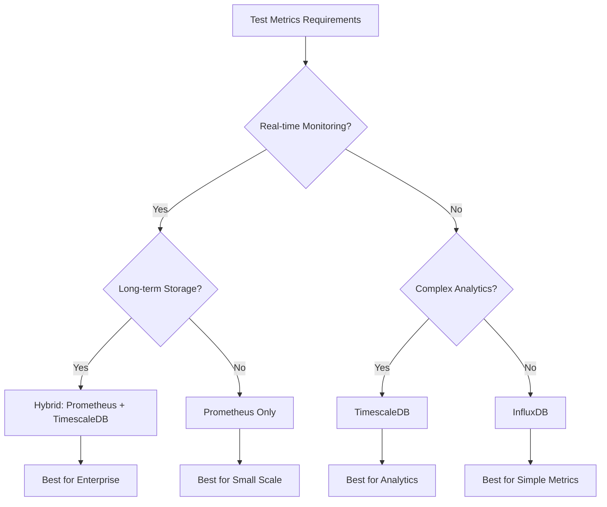
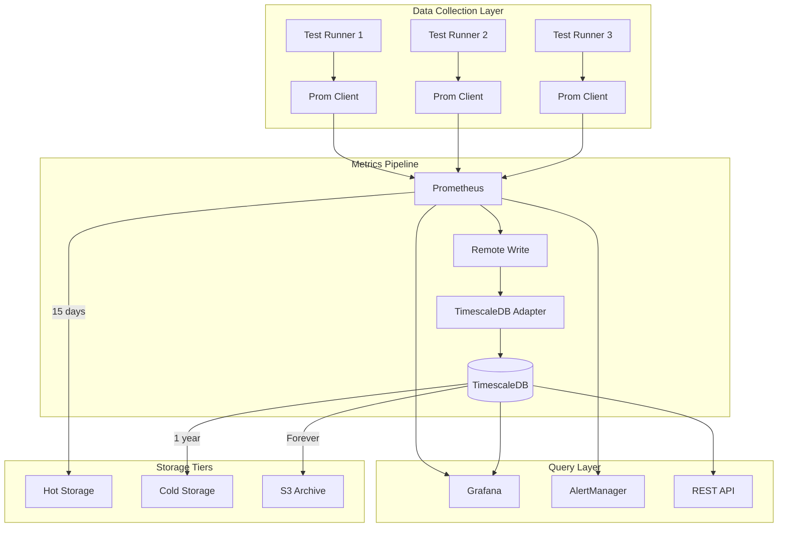

# Time-Series Metrics Storage for Node.js Test Data - Enterprise Architecture Guide

## Executive Summary

This document provides a comprehensive evaluation and design guide for implementing time-series storage solutions for test metrics in enterprise Node.js environments. We compare **InfluxDB**, **TimescaleDB**, and **Prometheus** across critical dimensions including schema design, retention policies, Node.js integration patterns, and operational considerations.

## Table of Contents

1. [Database Comparison Matrix](#database-comparison-matrix)
2. [Schema Design Patterns](#schema-design-patterns)
3. [Retention and Downsampling Strategies](#retention-and-downsampling-strategies)
4. [Node.js Integration Patterns](#nodejs-integration-patterns)
5. [Prometheus Scraping Configuration](#prometheus-scraping-configuration)
6. [Hybrid Architecture Patterns](#hybrid-architecture-patterns)
7. [Performance and Limitations](#performance-and-limitations)
8. [Alerting Rule Compatibility](#alerting-rule-compatibility)
9. [Implementation Examples](#implementation-examples)
10. [Migration and Adoption Strategy](#migration-and-adoption-strategy)

## 1. Database Comparison Matrix

### Feature-by-Feature Analysis

| Feature | InfluxDB | TimescaleDB | Prometheus |
|---------|----------|-------------|------------|
| **Data Model** | Tag-based (measurement, tags, fields) | Relational (PostgreSQL + time-series) | Multi-dimensional (metric + labels) |
| **Query Language** | InfluxQL, Flux | SQL (full PostgreSQL) | PromQL |
| **Best Use Case** | IoT, analytics, long-term storage | Complex analytics, joins, reports | Real-time monitoring, alerting |
| **Cardinality Handling** | Medium (careful tag design needed) | High (indexes support cardinality) | Low (label explosion issues) |
| **Retention Policies** | Native, automatic downsampling | PostgreSQL policies, continuous aggregates | Time-based, no native downsampling |
| **Aggregation** | Continuous queries, Flux scripts | Continuous aggregates, window functions | PromQL functions |
| **Node.js Support** | @influxdata/influxdb-client | pg, knex, sequelize | prom-client |
| **Compression** | TSM engine, ~90% compression | Native compression, ~95% | TSDB blocks, ~85% |
| **Clustering** | Enterprise only | Built-in (Citus extension) | Federation, remote write |
| **Cost Model** | Open source + cloud/enterprise | Open source (PostgreSQL) | Open source |

### Decision Matrix for Test Metrics



## 2. Schema Design Patterns

### InfluxDB Schema Design

```javascript
// Optimal InfluxDB schema for test metrics
const testMetricsSchema = {
  measurement: 'test_execution',
  tags: {
    // Low-cardinality dimensions (< 100K unique combinations)
    suite: 'unit|integration|e2e',
    environment: 'dev|staging|prod',
    agent_type: 'backend|frontend|devops|qa|docs',
    test_framework: 'jest|mocha|cypress|playwright',
    ci_provider: 'github|gitlab|jenkins',
    branch: 'main|develop|feature/*'
  },
  fields: {
    // Numeric values for aggregation
    duration_ms: 1234.56,
    memory_usage_mb: 128.5,
    cpu_percent: 45.2,
    assertions_count: 15,
    coverage_percent: 85.3,
    
    // String fields (not indexed, use sparingly)
    status: 'pass|fail|skip',
    error_type: 'timeout|assertion|network'
  },
  timestamp: Date.now() * 1000000 // nanoseconds
};

// Write patterns
const influxClient = new InfluxDB({
  url: 'http://localhost:8086',
  token: process.env.INFLUX_TOKEN,
  org: 'test-metrics',
  bucket: 'test-results'
});

const writeApi = influxClient.getWriteApi(org, bucket, 'ns');

// Batch writes for performance
writeApi.useDefaultTags({
  host: os.hostname(),
  region: process.env.AWS_REGION
});

const point = new Point('test_execution')
  .tag('suite', 'integration')
  .tag('environment', 'staging')
  .floatField('duration_ms', 1234.56)
  .intField('assertions_count', 15)
  .timestamp(new Date());

writeApi.writePoint(point);
await writeApi.flush();
```

### TimescaleDB Schema Design

```sql
-- Hypertable schema for test metrics
CREATE TABLE test_metrics (
  time            TIMESTAMPTZ NOT NULL,
  test_id         UUID DEFAULT gen_random_uuid(),
  suite           TEXT NOT NULL,
  test_name       TEXT NOT NULL,
  environment     TEXT NOT NULL,
  agent_id        INTEGER,
  agent_type      TEXT,
  framework       TEXT,
  
  -- Metrics
  duration_ms     DOUBLE PRECISION,
  memory_usage_mb DOUBLE PRECISION,
  cpu_percent     DOUBLE PRECISION,
  assertions      INTEGER,
  coverage        DOUBLE PRECISION,
  
  -- Status and metadata
  status          TEXT CHECK (status IN ('pass', 'fail', 'skip')),
  error_type      TEXT,
  error_message   TEXT,
  
  -- JSON for extensibility
  metadata        JSONB,
  
  PRIMARY KEY (time, test_id)
);

-- Convert to hypertable
SELECT create_hypertable('test_metrics', 'time', 
  chunk_time_interval => INTERVAL '1 day');

-- Indexes for common queries
CREATE INDEX idx_test_metrics_suite_time 
  ON test_metrics (suite, time DESC);
CREATE INDEX idx_test_metrics_status_time 
  ON test_metrics (status, time DESC);
CREATE INDEX idx_test_metrics_agent 
  ON test_metrics (agent_id, agent_type, time DESC);

-- Continuous aggregate for hourly rollups
CREATE MATERIALIZED VIEW test_metrics_hourly
WITH (timescaledb.continuous) AS
SELECT 
  time_bucket('1 hour', time) AS hour,
  suite,
  environment,
  agent_type,
  COUNT(*) as test_count,
  AVG(duration_ms) as avg_duration_ms,
  MAX(duration_ms) as max_duration_ms,
  MIN(duration_ms) as min_duration_ms,
  PERCENTILE_CONT(0.95) WITHIN GROUP (ORDER BY duration_ms) as p95_duration_ms,
  SUM(CASE WHEN status = 'pass' THEN 1 ELSE 0 END)::FLOAT / COUNT(*) as pass_rate,
  AVG(coverage) as avg_coverage
FROM test_metrics
GROUP BY hour, suite, environment, agent_type;

-- Refresh policy
SELECT add_continuous_aggregate_policy('test_metrics_hourly',
  start_offset => INTERVAL '3 hours',
  end_offset => INTERVAL '1 hour',
  schedule_interval => INTERVAL '1 hour');
```

### Prometheus Schema Design

```yaml
# Prometheus metric design for test results
# prometheus-metrics.yaml

# Counter for test executions
test_executions_total:
  type: counter
  help: "Total number of test executions"
  labels:
    - suite         # unit, integration, e2e
    - environment   # dev, staging, prod
    - status        # pass, fail, skip
    - agent_type    # backend, frontend, etc
    - framework     # jest, mocha, cypress

# Histogram for test duration
test_duration_seconds:
  type: histogram
  help: "Test execution duration in seconds"
  buckets: [0.1, 0.5, 1, 2, 5, 10, 30, 60, 120, 300]
  labels:
    - suite
    - environment
    - agent_type
    - framework

# Gauge for current test coverage
test_coverage_percent:
  type: gauge
  help: "Current test coverage percentage"
  labels:
    - suite
    - environment
    - agent_type

# Summary for memory usage
test_memory_usage_bytes:
  type: summary
  help: "Memory usage during test execution"
  quantiles: [0.5, 0.9, 0.95, 0.99]
  labels:
    - suite
    - environment
    - agent_type
```

```javascript
// Node.js implementation with prom-client
const prometheus = require('prom-client');
const register = new prometheus.Registry();

// Define metrics
const testExecutions = new prometheus.Counter({
  name: 'test_executions_total',
  help: 'Total number of test executions',
  labelNames: ['suite', 'environment', 'status', 'agent_type', 'framework'],
  registers: [register]
});

const testDuration = new prometheus.Histogram({
  name: 'test_duration_seconds',
  help: 'Test execution duration in seconds',
  buckets: [0.1, 0.5, 1, 2, 5, 10, 30, 60, 120, 300],
  labelNames: ['suite', 'environment', 'agent_type', 'framework'],
  registers: [register]
});

const testCoverage = new prometheus.Gauge({
  name: 'test_coverage_percent',
  help: 'Current test coverage percentage',
  labelNames: ['suite', 'environment', 'agent_type'],
  registers: [register]
});

// Export metrics endpoint
app.get('/metrics', async (req, res) => {
  res.set('Content-Type', register.contentType);
  res.end(await register.metrics());
});
```

## 3. Retention and Downsampling Strategies

### InfluxDB Retention Policies

```javascript
// Create retention policies with downsampling
const influxAdmin = influxClient.getInfluxDB();

// Raw data: 7 days
await influxAdmin.createRetentionPolicy({
  name: 'raw_7d',
  database: 'test_metrics',
  duration: '7d',
  replication: 1,
  isDefault: true
});

// Hourly rollups: 30 days
await influxAdmin.createRetentionPolicy({
  name: 'hourly_30d',
  database: 'test_metrics',
  duration: '30d',
  replication: 1
});

// Daily rollups: 1 year
await influxAdmin.createRetentionPolicy({
  name: 'daily_1y',
  database: 'test_metrics',
  duration: '365d',
  replication: 1
});

// Continuous queries for downsampling
const downsampleQueries = [
  // Hourly aggregation
  `CREATE CONTINUOUS QUERY hourly_rollup ON test_metrics
   BEGIN
     SELECT 
       mean(duration_ms) as avg_duration,
       max(duration_ms) as max_duration,
       min(duration_ms) as min_duration,
       percentile(duration_ms, 95) as p95_duration,
       count(duration_ms) as test_count,
       sum(assertions_count) as total_assertions
     INTO hourly_30d.test_metrics_hourly
     FROM raw_7d.test_execution
     GROUP BY time(1h), suite, environment, agent_type
   END`,
   
  // Daily aggregation
  `CREATE CONTINUOUS QUERY daily_rollup ON test_metrics
   BEGIN
     SELECT 
       mean(avg_duration) as avg_duration,
       max(max_duration) as max_duration,
       min(min_duration) as min_duration,
       mean(p95_duration) as p95_duration,
       sum(test_count) as test_count
     INTO daily_1y.test_metrics_daily
     FROM hourly_30d.test_metrics_hourly
     GROUP BY time(1d), suite, environment, agent_type
   END`
];
```

### TimescaleDB Retention Policies

```sql
-- Compression policy for older data
ALTER TABLE test_metrics SET (
  timescaledb.compress,
  timescaledb.compress_segmentby = 'suite, environment, agent_type'
);

-- Compress chunks older than 7 days
SELECT add_compression_policy('test_metrics', INTERVAL '7 days');

-- Retention policy: drop raw data older than 30 days
SELECT add_retention_policy('test_metrics', INTERVAL '30 days');

-- But keep aggregates for 1 year
SELECT add_retention_policy('test_metrics_hourly', INTERVAL '365 days');

-- Advanced: Tiered storage with tablespaces
CREATE TABLESPACE fast_ssd LOCATION '/mnt/fast-ssd';
CREATE TABLESPACE slow_hdd LOCATION '/mnt/slow-hdd';

-- Move older chunks to slower storage
SELECT add_tiering_policy('test_metrics', 
  INTERVAL '7 days',
  destination_tablespace => 'slow_hdd'
);
```

### Prometheus Retention Configuration

```yaml
# prometheus.yml
global:
  scrape_interval: 15s
  evaluation_interval: 15s
  
  # External labels for federated setups
  external_labels:
    cluster: 'test-metrics'
    region: 'us-east-1'

# Storage configuration
storage:
  tsdb:
    path: /prometheus/data
    retention.time: 15d  # Keep 15 days of data
    retention.size: 100GB  # Max storage size
    
# Remote write for long-term storage
remote_write:
  - url: "http://timescaledb-adapter:9201/write"
    queue_config:
      capacity: 10000
      max_shards: 30
      min_shards: 1
      max_samples_per_send: 5000
      batch_send_deadline: 5s
      min_backoff: 30ms
      max_backoff: 100ms
    
  - url: "http://influxdb:8086/api/v1/prom/write?db=prometheus"
    basic_auth:
      username: prometheus
      password: ${INFLUX_PASSWORD}
```

## 4. Node.js Integration Patterns

### InfluxDB Integration

```javascript
// influxdb-client.js
const { InfluxDB, Point } = require('@influxdata/influxdb-client');
const { SetupAPI } = require('@influxdata/influxdb-client-apis');
const { hostname } = require('os');

class InfluxMetricsClient {
  constructor(config) {
    this.client = new InfluxDB({
      url: config.url || 'http://localhost:8086',
      token: config.token,
      timeout: 30000,
    });
    
    this.writeApi = this.client.getWriteApi(
      config.org,
      config.bucket,
      'ns', // nanosecond precision
      {
        batchSize: 5000,
        flushInterval: 10000, // 10 seconds
        maxRetries: 3,
        maxRetryDelay: 15000,
        retryJitter: 1000,
      }
    );
    
    // Default tags
    this.writeApi.useDefaultTags({
      host: hostname(),
      pid: process.pid.toString(),
      node_version: process.version,
    });
  }
  
  async writeTestResult(testResult) {
    const point = new Point('test_execution')
      .tag('suite', testResult.suite)
      .tag('environment', testResult.environment)
      .tag('agent_type', testResult.agentType)
      .tag('framework', testResult.framework)
      .tag('status', testResult.status)
      .floatField('duration_ms', testResult.duration)
      .intField('assertions', testResult.assertions)
      .floatField('memory_mb', testResult.memoryUsage / 1024 / 1024)
      .floatField('coverage_percent', testResult.coverage)
      .timestamp(testResult.timestamp);
    
    this.writeApi.writePoint(point);
  }
  
  async flush() {
    await this.writeApi.flush();
  }
  
  async query(fluxQuery) {
    const queryApi = this.client.getQueryApi(this.config.org);
    const results = [];
    
    return new Promise((resolve, reject) => {
      queryApi.queryRows(fluxQuery, {
        next(row, tableMeta) {
          const record = tableMeta.toObject(row);
          results.push(record);
        },
        error(error) {
          reject(error);
        },
        complete() {
          resolve(results);
        },
      });
    });
  }
  
  // Example aggregation queries
  async getTestTrends(suite, timeRange = '-24h') {
    const query = `
      from(bucket: "${this.config.bucket}")
        |> range(start: ${timeRange})
        |> filter(fn: (r) => r._measurement == "test_execution")
        |> filter(fn: (r) => r.suite == "${suite}")
        |> filter(fn: (r) => r._field == "duration_ms")
        |> aggregateWindow(every: 1h, fn: mean)
        |> yield(name: "hourly_avg_duration")
    `;
    
    return this.query(query);
  }
}
```

### TimescaleDB Integration

```javascript
// timescaledb-client.js
const { Pool } = require('pg');
const format = require('pg-format');

class TimescaleMetricsClient {
  constructor(config) {
    this.pool = new Pool({
      host: config.host || 'localhost',
      port: config.port || 5432,
      database: config.database || 'test_metrics',
      user: config.user,
      password: config.password,
      max: 20,
      idleTimeoutMillis: 30000,
      connectionTimeoutMillis: 2000,
    });
    
    this.batchQueue = [];
    this.batchSize = config.batchSize || 1000;
    this.flushInterval = config.flushInterval || 5000;
    
    // Start batch flush timer
    this.startBatchTimer();
  }
  
  startBatchTimer() {
    setInterval(() => {
      if (this.batchQueue.length > 0) {
        this.flushBatch();
      }
    }, this.flushInterval);
  }
  
  async writeTestResult(testResult) {
    this.batchQueue.push([
      new Date(testResult.timestamp),
      testResult.suite,
      testResult.testName,
      testResult.environment,
      testResult.agentId,
      testResult.agentType,
      testResult.framework,
      testResult.duration,
      testResult.memoryUsage / 1024 / 1024,
      testResult.cpuPercent,
      testResult.assertions,
      testResult.coverage,
      testResult.status,
      testResult.errorType,
      testResult.errorMessage,
      JSON.stringify(testResult.metadata || {})
    ]);
    
    if (this.batchQueue.length >= this.batchSize) {
      await this.flushBatch();
    }
  }
  
  async flushBatch() {
    if (this.batchQueue.length === 0) return;
    
    const batch = this.batchQueue.splice(0, this.batchSize);
    const query = format(
      `INSERT INTO test_metrics (
        time, suite, test_name, environment, agent_id, agent_type, 
        framework, duration_ms, memory_usage_mb, cpu_percent, 
        assertions, coverage, status, error_type, error_message, metadata
      ) VALUES %L
      ON CONFLICT (time, test_id) DO UPDATE SET
        duration_ms = EXCLUDED.duration_ms,
        status = EXCLUDED.status`,
      batch
    );
    
    try {
      await this.pool.query(query);
    } catch (error) {
      console.error('Failed to insert batch:', error);
      // Re-queue failed batch
      this.batchQueue.unshift(...batch);
      throw error;
    }
  }
  
  // Analytical queries leveraging TimescaleDB features
  async getTestAnalytics(options = {}) {
    const { suite, environment, timeRange = '24 hours', bucket = '1 hour' } = options;
    
    const query = `
      SELECT 
        time_bucket($1::interval, time) AS bucket,
        suite,
        environment,
        agent_type,
        COUNT(*) as test_count,
        AVG(duration_ms)::numeric(10,2) as avg_duration,
        MAX(duration_ms) as max_duration,
        MIN(duration_ms) as min_duration,
        percentile_cont(0.5) WITHIN GROUP (ORDER BY duration_ms) as median_duration,
        percentile_cont(0.95) WITHIN GROUP (ORDER BY duration_ms) as p95_duration,
        percentile_cont(0.99) WITHIN GROUP (ORDER BY duration_ms) as p99_duration,
        SUM(CASE WHEN status = 'pass' THEN 1 ELSE 0 END)::float / COUNT(*) as pass_rate,
        AVG(coverage)::numeric(5,2) as avg_coverage,
        SUM(assertions) as total_assertions
      FROM test_metrics
      WHERE time > NOW() - $2::interval
        ${suite ? 'AND suite = $3' : ''}
        ${environment ? 'AND environment = $4' : ''}
      GROUP BY bucket, suite, environment, agent_type
      ORDER BY bucket DESC`;
    
    const params = [bucket, timeRange];
    if (suite) params.push(suite);
    if (environment) params.push(environment);
    
    const result = await this.pool.query(query, params);
    return result.rows;
  }
  
  // Flaky test detection
  async detectFlakyTests(options = {}) {
    const { threshold = 0.1, minRuns = 10, timeRange = '7 days' } = options;
    
    const query = `
      WITH test_results AS (
        SELECT 
          suite,
          test_name,
          COUNT(*) as total_runs,
          SUM(CASE WHEN status = 'pass' THEN 1 ELSE 0 END) as pass_count,
          SUM(CASE WHEN status = 'fail' THEN 1 ELSE 0 END) as fail_count,
          ARRAY_AGG(status ORDER BY time DESC) as recent_statuses
        FROM test_metrics
        WHERE time > NOW() - $1::interval
        GROUP BY suite, test_name
        HAVING COUNT(*) >= $2
      )
      SELECT 
        suite,
        test_name,
        total_runs,
        pass_count,
        fail_count,
        (fail_count::float / total_runs) as failure_rate,
        recent_statuses[1:10] as last_10_results
      FROM test_results
      WHERE fail_count > 0 
        AND pass_count > 0
        AND (fail_count::float / total_runs) BETWEEN $3 AND (1 - $3)
      ORDER BY failure_rate DESC`;
    
    const result = await this.pool.query(query, [timeRange, minRuns, threshold]);
    return result.rows;
  }
}
```

### Prometheus Integration

```javascript
// prometheus-client.js
const client = require('prom-client');
const express = require('express');

class PrometheusMetricsClient {
  constructor(config = {}) {
    this.register = new client.Registry();
    
    // Add default labels
    this.register.setDefaultLabels({
      app: config.appName || 'test-runner',
      version: config.version || '1.0.0',
      instance: config.instance || process.env.HOSTNAME || 'unknown'
    });
    
    // Collect default metrics
    if (config.collectDefaultMetrics !== false) {
      client.collectDefaultMetrics({ 
        register: this.register,
        prefix: 'nodejs_'
      });
    }
    
    this.initializeMetrics();
  }
  
  initializeMetrics() {
    // Test execution counter
    this.testExecutions = new client.Counter({
      name: 'test_executions_total',
      help: 'Total number of test executions',
      labelNames: ['suite', 'environment', 'status', 'agent_type', 'framework'],
      registers: [this.register]
    });
    
    // Test duration histogram
    this.testDuration = new client.Histogram({
      name: 'test_duration_seconds',
      help: 'Test execution duration in seconds',
      buckets: [0.1, 0.5, 1, 2, 5, 10, 30, 60, 120, 300],
      labelNames: ['suite', 'environment', 'agent_type', 'framework'],
      registers: [this.register]
    });
    
    // Test coverage gauge
    this.testCoverage = new client.Gauge({
      name: 'test_coverage_percent',
      help: 'Current test coverage percentage',
      labelNames: ['suite', 'environment', 'agent_type'],
      registers: [this.register]
    });
    
    // Memory usage summary
    this.memoryUsage = new client.Summary({
      name: 'test_memory_usage_bytes',
      help: 'Memory usage during test execution',
      percentiles: [0.5, 0.9, 0.95, 0.99],
      maxAgeSeconds: 600,
      ageBuckets: 5,
      labelNames: ['suite', 'environment', 'agent_type'],
      registers: [this.register]
    });
    
    // Concurrent tests gauge
    this.concurrentTests = new client.Gauge({
      name: 'concurrent_tests_running',
      help: 'Number of tests currently running',
      labelNames: ['suite', 'agent_type'],
      registers: [this.register]
    });
    
    // Custom metrics for flaky test tracking
    this.flakyTestRuns = new client.Counter({
      name: 'flaky_test_runs_total',
      help: 'Tests that have both passed and failed in recent history',
      labelNames: ['suite', 'test_name', 'final_status'],
      registers: [this.register]
    });
  }
  
  recordTestExecution(testResult) {
    const labels = {
      suite: testResult.suite,
      environment: testResult.environment,
      status: testResult.status,
      agent_type: testResult.agentType,
      framework: testResult.framework
    };
    
    // Increment counter
    this.testExecutions.inc(labels);
    
    // Record duration
    this.testDuration.observe(
      { ...labels, status: undefined }, // Remove status from duration labels
      testResult.duration / 1000 // Convert to seconds
    );
    
    // Update coverage
    if (testResult.coverage !== undefined) {
      this.testCoverage.set(
        {
          suite: testResult.suite,
          environment: testResult.environment,
          agent_type: testResult.agentType
        },
        testResult.coverage
      );
    }
    
    // Record memory usage
    if (testResult.memoryUsage) {
      this.memoryUsage.observe(
        {
          suite: testResult.suite,
          environment: testResult.environment,
          agent_type: testResult.agentType
        },
        testResult.memoryUsage
      );
    }
  }
  
  testStarted(suite, agentType) {
    this.concurrentTests.inc({ suite, agent_type: agentType });
  }
  
  testFinished(suite, agentType) {
    this.concurrentTests.dec({ suite, agent_type: agentType });
  }
  
  // Express middleware for metrics endpoint
  metricsMiddleware() {
    const router = express.Router();
    
    router.get('/metrics', async (req, res) => {
      try {
        res.set('Content-Type', this.register.contentType);
        const metrics = await this.register.metrics();
        res.end(metrics);
      } catch (err) {
        res.status(500).end(err);
      }
    });
    
    return router;
  }
  
  // Push gateway support for short-lived jobs
  async pushMetrics(gateway, job) {
    const pushgateway = new client.Pushgateway(gateway, {}, this.register);
    
    try {
      await pushgateway.push({ jobName: job });
    } catch (err) {
      console.error(`Failed to push metrics to gateway: ${err}`);
      throw err;
    }
  }
}

// Example usage with metric recording wrapper
class TestMetricsRecorder {
  constructor(metricsClient) {
    this.metrics = metricsClient;
  }
  
  async recordTest(testFn, metadata) {
    const startTime = Date.now();
    const startMemory = process.memoryUsage().heapUsed;
    
    this.metrics.testStarted(metadata.suite, metadata.agentType);
    
    try {
      const result = await testFn();
      
      const testResult = {
        ...metadata,
        status: 'pass',
        duration: Date.now() - startTime,
        memoryUsage: process.memoryUsage().heapUsed - startMemory,
        coverage: result.coverage,
        assertions: result.assertions
      };
      
      this.metrics.recordTestExecution(testResult);
      return result;
      
    } catch (error) {
      const testResult = {
        ...metadata,
        status: 'fail',
        duration: Date.now() - startTime,
        memoryUsage: process.memoryUsage().heapUsed - startMemory,
        errorType: error.constructor.name,
        errorMessage: error.message
      };
      
      this.metrics.recordTestExecution(testResult);
      throw error;
      
    } finally {
      this.metrics.testFinished(metadata.suite, metadata.agentType);
    }
  }
}
```

## 5. Prometheus Scraping Configuration

### Basic Scrape Configuration

```yaml
# prometheus.yml
global:
  scrape_interval: 15s
  evaluation_interval: 15s
  scrape_timeout: 10s

scrape_configs:
  # Node.js test runners
  - job_name: 'test-runners'
    static_configs:
      - targets:
        - 'test-runner-1:9090'
        - 'test-runner-2:9090'
        - 'test-runner-3:9090'
    relabel_configs:
      - source_labels: [__address__]
        target_label: instance
        regex: '([^:]+):.*'
        replacement: '$1'
  
  # CI/CD pipeline metrics
  - job_name: 'ci-pipeline'
    static_configs:
      - targets: ['jenkins:8080', 'gitlab-runner:9252']
    metrics_path: '/prometheus'
    
  # Service discovery for dynamic test environments
  - job_name: 'test-environments'
    kubernetes_sd_configs:
      - role: pod
        namespaces:
          names: ['test-runners']
    relabel_configs:
      - source_labels: [__meta_kubernetes_pod_annotation_prometheus_io_scrape]
        action: keep
        regex: true
      - source_labels: [__meta_kubernetes_pod_annotation_prometheus_io_path]
        action: replace
        target_label: __metrics_path__
        regex: (.+)
      - source_labels: [__address__, __meta_kubernetes_pod_annotation_prometheus_io_port]
        action: replace
        regex: ([^:]+)(?::\d+)?;(\d+)
        replacement: $1:$2
        target_label: __address__
      - action: labelmap
        regex: __meta_kubernetes_pod_label_(.+)
```

### Advanced Scraping with Service Discovery

```yaml
# prometheus-advanced.yml
scrape_configs:
  # Consul service discovery for test services
  - job_name: 'consul-test-services'
    consul_sd_configs:
      - server: 'consul:8500'
        services: ['test-runner', 'test-aggregator']
    relabel_configs:
      - source_labels: [__meta_consul_service]
        target_label: service
      - source_labels: [__meta_consul_node]
        target_label: node
      - source_labels: [__meta_consul_tags]
        regex: '.*,environment=([^,]+),.*'
        target_label: environment
        replacement: '$1'
  
  # EC2 service discovery for AWS deployments
  - job_name: 'ec2-test-instances'
    ec2_sd_configs:
      - region: us-east-1
        access_key: ${AWS_ACCESS_KEY}
        secret_key: ${AWS_SECRET_KEY}
        filters:
          - name: tag:role
            values: ['test-runner']
    relabel_configs:
      - source_labels: [__meta_ec2_tag_Name]
        target_label: instance_name
      - source_labels: [__meta_ec2_instance_type]
        target_label: instance_type
      - source_labels: [__meta_ec2_availability_zone]
        target_label: az
```

### Metric Relabeling and Processing

```yaml
# Advanced metric processing
metric_relabel_configs:
  # Drop high-cardinality metrics
  - source_labels: [__name__]
    regex: 'test_execution_details_.*'
    action: drop
    
  # Aggregate similar metrics
  - source_labels: [__name__]
    regex: 'test_duration_seconds.*'
    target_label: __tmp_metric_name
    
  # Add derived labels
  - source_labels: [suite]
    regex: '(unit|integration|e2e)'
    target_label: test_type
    replacement: '$1'
  
  # Calculate SLI metrics
  - source_labels: [__name__, status]
    regex: 'test_executions_total;pass'
    target_label: __name__
    replacement: 'sli_test_success_total'
```

## 6. Hybrid Architecture Patterns

### Prometheus + TimescaleDB Architecture



### Implementation Example

```javascript
// hybrid-metrics-system.js
const { PrometheusMetricsClient } = require('./prometheus-client');
const { TimescaleMetricsClient } = require('./timescaledb-client');
const { InfluxMetricsClient } = require('./influxdb-client');

class HybridMetricsSystem {
  constructor(config) {
    // Real-time monitoring with Prometheus
    this.prometheus = new PrometheusMetricsClient({
      appName: 'test-metrics',
      collectDefaultMetrics: true
    });
    
    // Long-term storage with TimescaleDB
    this.timescale = new TimescaleMetricsClient({
      host: config.timescale.host,
      database: 'test_metrics',
      user: config.timescale.user,
      password: config.timescale.password
    });
    
    // Optional: InfluxDB for specific use cases
    this.influx = config.influx ? new InfluxMetricsClient(config.influx) : null;
    
    this.setupRemoteWrite();
  }
  
  setupRemoteWrite() {
    // Prometheus remote write adapter for TimescaleDB
    const express = require('express');
    const app = express();
    const { createAdapter } = require('prometheus-remote-write-adapter');
    
    const adapter = createAdapter({
      // Write handler for TimescaleDB
      write: async (timeseries) => {
        const batch = timeseries.map(ts => {
          const labels = ts.labels.reduce((acc, label) => {
            acc[label.name] = label.value;
            return acc;
          }, {});
          
          return ts.samples.map(sample => ({
            time: new Date(sample.timestamp),
            metric_name: labels.__name__,
            ...labels,
            value: sample.value
          }));
        }).flat();
        
        await this.timescale.writeBatch(batch);
      }
    });
    
    app.use('/write', adapter);
    app.listen(9201);
  }
  
  async recordTestResult(testResult) {
    // Real-time metrics to Prometheus
    this.prometheus.recordTestExecution(testResult);
    
    // Detailed results to TimescaleDB
    await this.timescale.writeTestResult(testResult);
    
    // Optional: Stream to InfluxDB for specific analysis
    if (this.influx && testResult.suite === 'performance') {
      await this.influx.writeTestResult(testResult);
    }
  }
  
  // Unified query interface
  async query(options) {
    const { source = 'prometheus', ...queryOptions } = options;
    
    switch (source) {
      case 'prometheus':
        return this.queryPrometheus(queryOptions);
      case 'timescale':
        return this.timescale.getTestAnalytics(queryOptions);
      case 'influx':
        return this.influx?.getTestTrends(queryOptions.suite);
      default:
        throw new Error(`Unknown source: ${source}`);
    }
  }
  
  async queryPrometheus(options) {
    const { metric, labels = {}, range = '1h' } = options;
    const promQL = this.buildPromQL(metric, labels, range);
    
    // Use Prometheus HTTP API
    const response = await fetch(`http://prometheus:9090/api/v1/query_range`, {
      method: 'POST',
      body: new URLSearchParams({
        query: promQL,
        start: Date.now() - parseRange(range),
        end: Date.now(),
        step: '60s'
      })
    });
    
    return response.json();
  }
  
  buildPromQL(metric, labels, range) {
    const labelStr = Object.entries(labels)
      .map(([k, v]) => `${k}="${v}"`)
      .join(',');
    
    return `${metric}{${labelStr}}[${range}]`;
  }
}
```

## 7. Performance and Limitations

### Cardinality Limits and Best Practices

```javascript
// Cardinality monitoring and management
class CardinalityManager {
  constructor(metricsClient) {
    this.client = metricsClient;
    this.labelCardinality = new Map();
    this.cardinalityLimit = 100000; // Max unique label combinations
  }
  
  checkCardinality(labels) {
    const key = JSON.stringify(labels);
    this.labelCardinality.set(key, (this.labelCardinality.get(key) || 0) + 1);
    
    if (this.labelCardinality.size > this.cardinalityLimit) {
      console.warn(`High cardinality detected: ${this.labelCardinality.size} unique combinations`);
      this.pruneLabels();
    }
  }
  
  pruneLabels() {
    // Remove low-frequency label combinations
    const entries = Array.from(this.labelCardinality.entries());
    entries.sort((a, b) => a[1] - b[1]);
    
    // Remove bottom 10%
    const pruneCount = Math.floor(entries.length * 0.1);
    for (let i = 0; i < pruneCount; i++) {
      this.labelCardinality.delete(entries[i][0]);
    }
  }
  
  // Best practices for label design
  static sanitizeLabels(labels) {
    const sanitized = {};
    const maxLabelLength = 128;
    const allowedLabelPattern = /^[a-zA-Z_][a-zA-Z0-9_]*$/;
    
    for (const [key, value] of Object.entries(labels)) {
      // Validate label name
      if (!allowedLabelPattern.test(key)) {
        console.warn(`Invalid label name: ${key}`);
        continue;
      }
      
      // Truncate long values
      let sanitizedValue = String(value);
      if (sanitizedValue.length > maxLabelLength) {
        sanitizedValue = sanitizedValue.substring(0, maxLabelLength) + '...';
      }
      
      // Normalize values to reduce cardinality
      sanitized[key] = this.normalizeValue(key, sanitizedValue);
    }
    
    return sanitized;
  }
  
  static normalizeValue(key, value) {
    // Example normalizations to reduce cardinality
    switch (key) {
      case 'duration_bucket':
        // Bucket durations to reduce unique values
        const duration = parseFloat(value);
        if (duration < 1) return '<1s';
        if (duration < 5) return '1-5s';
        if (duration < 30) return '5-30s';
        if (duration < 60) return '30-60s';
        return '>60s';
        
      case 'error_message':
        // Normalize error messages
        if (value.includes('timeout')) return 'timeout_error';
        if (value.includes('connection')) return 'connection_error';
        if (value.includes('assertion')) return 'assertion_error';
        return 'other_error';
        
      default:
        return value;
    }
  }
}
```

### Query Performance Optimization

```sql
-- TimescaleDB query optimization
-- Create appropriate indexes
CREATE INDEX idx_test_metrics_composite ON test_metrics 
  (suite, environment, time DESC) 
  WHERE status = 'fail';

-- Use time-based partitioning wisely
SELECT add_dimension('test_metrics', 'suite', 4);

-- Optimize continuous aggregates
CREATE MATERIALIZED VIEW test_summary_5min
WITH (timescaledb.continuous) AS
SELECT 
  time_bucket('5 minutes', time) AS bucket,
  suite,
  environment,
  COUNT(*) FILTER (WHERE status = 'pass') as pass_count,
  COUNT(*) FILTER (WHERE status = 'fail') as fail_count,
  AVG(duration_ms) as avg_duration,
  PERCENTILE_CONT(0.95) WITHIN GROUP (ORDER BY duration_ms) as p95_duration
FROM test_metrics
GROUP BY bucket, suite, environment
WITH NO DATA;

-- Create index on continuous aggregate
CREATE INDEX idx_summary_suite_bucket 
  ON test_summary_5min (suite, bucket DESC);
```

### Memory and Storage Optimization

```javascript
// Efficient batch processing for high-volume metrics
class BatchMetricsProcessor {
  constructor(options = {}) {
    this.batchSize = options.batchSize || 5000;
    this.flushInterval = options.flushInterval || 10000;
    this.maxMemoryMB = options.maxMemoryMB || 100;
    
    this.batches = new Map(); // Separate batches by metric type
    this.memoryUsage = 0;
    
    this.startFlushTimer();
  }
  
  addMetric(type, metric) {
    if (!this.batches.has(type)) {
      this.batches.set(type, []);
    }
    
    const batch = this.batches.get(type);
    batch.push(metric);
    
    // Rough memory estimation
    this.memoryUsage += JSON.stringify(metric).length;
    
    // Flush if limits exceeded
    if (batch.length >= this.batchSize || 
        this.memoryUsage > this.maxMemoryMB * 1024 * 1024) {
      this.flushBatch(type);
    }
  }
  
  async flushBatch(type) {
    const batch = this.batches.get(type);
    if (!batch || batch.length === 0) return;
    
    // Compress batch before sending
    const compressed = await this.compressBatch(batch);
    
    try {
      await this.sendBatch(type, compressed);
      this.batches.set(type, []);
      this.memoryUsage = 0;
    } catch (error) {
      console.error(`Failed to flush ${type} batch:`, error);
      // Implement retry logic
    }
  }
  
  async compressBatch(batch) {
    const zlib = require('zlib');
    const data = JSON.stringify(batch);
    
    return new Promise((resolve, reject) => {
      zlib.gzip(data, (err, compressed) => {
        if (err) reject(err);
        else resolve(compressed);
      });
    });
  }
}
```

## 8. Alerting Rule Compatibility

### Prometheus Alerting Rules

```yaml
# alerts.yml
groups:
  - name: test_metrics_alerts
    interval: 30s
    rules:
      # Test failure rate alert
      - alert: HighTestFailureRate
        expr: |
          (
            sum(rate(test_executions_total{status="fail"}[5m])) by (suite, environment)
            /
            sum(rate(test_executions_total[5m])) by (suite, environment)
          ) > 0.1
        for: 10m
        labels:
          severity: warning
          team: qa
        annotations:
          summary: "High test failure rate in {{ $labels.suite }}"
          description: "Test suite {{ $labels.suite }} in {{ $labels.environment }} has {{ $value | humanizePercentage }} failure rate"
      
      # Test duration regression
      - alert: TestDurationRegression
        expr: |
          (
            histogram_quantile(0.95, rate(test_duration_seconds_bucket[10m]))
            /
            histogram_quantile(0.95, rate(test_duration_seconds_bucket[1h] offset 1d))
          ) > 1.5
        for: 20m
        labels:
          severity: warning
        annotations:
          summary: "Test duration regression detected"
          description: "95th percentile test duration has increased by {{ $value | humanizePercentage }}"
      
      # Coverage drop alert
      - alert: TestCoverageDrop
        expr: |
          (
            test_coverage_percent
            <
            avg_over_time(test_coverage_percent[1w]) - 5
          )
        for: 30m
        labels:
          severity: critical
          team: engineering
        annotations:
          summary: "Test coverage dropped significantly"
          description: "Coverage for {{ $labels.suite }} dropped to {{ $value }}%"
      
      # Flaky test detection
      - alert: FlakyTestDetected
        expr: |
          sum(increase(flaky_test_runs_total[1h])) by (suite, test_name) > 5
        labels:
          severity: info
          team: qa
        annotations:
          summary: "Flaky test detected: {{ $labels.test_name }}"
          description: "Test {{ $labels.test_name }} in suite {{ $labels.suite }} has failed intermittently {{ $value }} times"
```

### TimescaleDB Alert Queries

```sql
-- Create alert views in TimescaleDB
CREATE OR REPLACE VIEW test_failure_rates AS
SELECT 
  time_bucket('5 minutes', time) as bucket,
  suite,
  environment,
  COUNT(*) FILTER (WHERE status = 'fail') * 100.0 / COUNT(*) as failure_rate
FROM test_metrics
WHERE time > NOW() - INTERVAL '1 hour'
GROUP BY bucket, suite, environment;

-- Alert on duration regression
CREATE OR REPLACE FUNCTION check_duration_regression()
RETURNS TABLE(suite TEXT, current_p95 FLOAT, baseline_p95 FLOAT, regression_factor FLOAT)
AS $$
BEGIN
  RETURN QUERY
  WITH current_stats AS (
    SELECT 
      suite,
      percentile_cont(0.95) WITHIN GROUP (ORDER BY duration_ms) as p95
    FROM test_metrics
    WHERE time > NOW() - INTERVAL '1 hour'
    GROUP BY suite
  ),
  baseline_stats AS (
    SELECT 
      suite,
      percentile_cont(0.95) WITHIN GROUP (ORDER BY duration_ms) as p95
    FROM test_metrics
    WHERE time > NOW() - INTERVAL '1 day' - INTERVAL '1 hour'
      AND time < NOW() - INTERVAL '1 day'
    GROUP BY suite
  )
  SELECT 
    c.suite,
    c.p95 as current_p95,
    b.p95 as baseline_p95,
    c.p95 / NULLIF(b.p95, 0) as regression_factor
  FROM current_stats c
  JOIN baseline_stats b ON c.suite = b.suite
  WHERE c.p95 / NULLIF(b.p95, 0) > 1.5;
END;
$$ LANGUAGE plpgsql;
```

### Integration with AlertManager

```javascript
// alerting-integration.js
const axios = require('axios');

class AlertingIntegration {
  constructor(config) {
    this.alertmanagerUrl = config.alertmanagerUrl;
    this.environment = config.environment;
  }
  
  async sendAlert(alert) {
    const payload = [{
      labels: {
        alertname: alert.name,
        severity: alert.severity,
        environment: this.environment,
        ...alert.labels
      },
      annotations: {
        summary: alert.summary,
        description: alert.description,
        runbook_url: alert.runbookUrl
      },
      generatorURL: alert.source,
      startsAt: new Date().toISOString()
    }];
    
    try {
      await axios.post(`${this.alertmanagerUrl}/api/v1/alerts`, payload);
    } catch (error) {
      console.error('Failed to send alert:', error);
      throw error;
    }
  }
  
  // Check TimescaleDB for alert conditions
  async checkAlertConditions(db) {
    // Check failure rates
    const failureRates = await db.query(`
      SELECT suite, environment, failure_rate
      FROM test_failure_rates
      WHERE failure_rate > 10
      ORDER BY bucket DESC
      LIMIT 10
    `);
    
    for (const row of failureRates.rows) {
      await this.sendAlert({
        name: 'HighTestFailureRate',
        severity: 'warning',
        labels: {
          suite: row.suite,
          environment: row.environment
        },
        summary: `High test failure rate in ${row.suite}`,
        description: `Test suite ${row.suite} has ${row.failure_rate.toFixed(2)}% failure rate`
      });
    }
    
    // Check duration regression
    const regressions = await db.query('SELECT * FROM check_duration_regression()');
    
    for (const row of regressions.rows) {
      await this.sendAlert({
        name: 'TestDurationRegression',
        severity: 'warning',
        labels: {
          suite: row.suite
        },
        summary: `Test duration regression in ${row.suite}`,
        description: `P95 duration increased from ${row.baseline_p95}ms to ${row.current_p95}ms (${row.regression_factor.toFixed(2)}x)`
      });
    }
  }
}
```

## 9. Implementation Examples

### Complete Test Metrics Pipeline

```javascript
// test-metrics-pipeline.js
const { HybridMetricsSystem } = require('./hybrid-metrics-system');
const { AlertingIntegration } = require('./alerting-integration');
const { CardinalityManager } = require('./cardinality-manager');

class TestMetricsPipeline {
  constructor(config) {
    this.metrics = new HybridMetricsSystem(config);
    this.alerting = new AlertingIntegration(config.alerting);
    this.cardinalityManager = new CardinalityManager(this.metrics.prometheus);
    
    // Start background tasks
    this.startAggregationJob();
    this.startAlertingJob();
    this.startCleanupJob();
  }
  
  // Main entry point for test results
  async processTestResult(testResult) {
    // Validate and sanitize
    const sanitized = this.sanitizeTestResult(testResult);
    
    // Check cardinality
    this.cardinalityManager.checkCardinality(sanitized.labels);
    
    // Record in all systems
    await this.metrics.recordTestResult(sanitized);
    
    // Check for immediate alerts
    await this.checkImmediateAlerts(sanitized);
  }
  
  sanitizeTestResult(result) {
    return {
      ...result,
      labels: CardinalityManager.sanitizeLabels({
        suite: result.suite,
        environment: result.environment,
        agent_type: result.agentType,
        framework: result.framework
      }),
      // Ensure numeric fields
      duration: Number(result.duration) || 0,
      coverage: Number(result.coverage) || 0,
      assertions: Number(result.assertions) || 0,
      memoryUsage: Number(result.memoryUsage) || 0
    };
  }
  
  async checkImmediateAlerts(result) {
    // Critical failure detection
    if (result.status === 'fail' && result.suite === 'smoke') {
      await this.alerting.sendAlert({
        name: 'CriticalTestFailure',
        severity: 'critical',
        labels: result.labels,
        summary: `Critical smoke test failure: ${result.testName}`,
        description: `${result.errorMessage || 'Unknown error'}`
      });
    }
  }
  
  startAggregationJob() {
    // Run aggregations every 5 minutes
    setInterval(async () => {
      try {
        await this.runAggregations();
      } catch (error) {
        console.error('Aggregation job failed:', error);
      }
    }, 5 * 60 * 1000);
  }
  
  async runAggregations() {
    // Update summary metrics
    const recentStats = await this.metrics.timescale.getTestAnalytics({
      timeRange: '1 hour',
      bucket: '5 minutes'
    });
    
    // Update Prometheus gauges with aggregated data
    for (const stat of recentStats) {
      this.metrics.prometheus.testCoverage.set(
        {
          suite: stat.suite,
          environment: stat.environment,
          agent_type: stat.agent_type
        },
        stat.avg_coverage
      );
    }
  }
  
  startAlertingJob() {
    // Check alert conditions every minute
    setInterval(async () => {
      try {
        await this.alerting.checkAlertConditions(this.metrics.timescale.pool);
      } catch (error) {
        console.error('Alerting job failed:', error);
      }
    }, 60 * 1000);
  }
  
  startCleanupJob() {
    // Run cleanup daily
    setInterval(async () => {
      try {
        await this.runCleanup();
      } catch (error) {
        console.error('Cleanup job failed:', error);
      }
    }, 24 * 60 * 60 * 1000);
  }
  
  async runCleanup() {
    // Clean up old data according to retention policies
    console.log('Running cleanup job...');
    
    // TimescaleDB handles this automatically via policies
    // Just verify they're running
    const policies = await this.metrics.timescale.pool.query(`
      SELECT * FROM timescaledb_information.policies
      WHERE proc_name IN ('policy_retention', 'policy_compression')
    `);
    
    console.log(`Active policies: ${policies.rows.length}`);
  }
}

// Export a factory function
module.exports = {
  createTestMetricsPipeline: (config) => {
    return new TestMetricsPipeline(config);
  }
};
```

### Integration with Test Runners

```javascript
// jest-metrics-reporter.js
class JestMetricsReporter {
  constructor(globalConfig, options) {
    this.config = options;
    this.pipeline = require('./test-metrics-pipeline').createTestMetricsPipeline(options);
  }
  
  onTestResult(test, testResult) {
    const { testResults, perfStats, coverage } = testResult;
    
    for (const result of testResults) {
      const testMetric = {
        suite: this.extractSuite(result.ancestorTitles),
        testName: result.title,
        environment: process.env.NODE_ENV || 'development',
        agentType: this.config.agentType || 'unknown',
        framework: 'jest',
        duration: result.duration || 0,
        status: result.status,
        assertions: result.numPassingAsserts,
        coverage: coverage?.summary?.lines?.pct || 0,
        memoryUsage: perfStats?.runtime || 0,
        errorType: result.failureMessages?.[0]?.split('\n')[0],
        errorMessage: result.failureMessages?.[0],
        timestamp: Date.now()
      };
      
      // Fire and forget to avoid blocking tests
      this.pipeline.processTestResult(testMetric).catch(err => {
        console.error('Failed to record metric:', err);
      });
    }
  }
  
  extractSuite(ancestorTitles) {
    // Determine suite type from test path
    const path = ancestorTitles.join('/');
    if (path.includes('unit')) return 'unit';
    if (path.includes('integration')) return 'integration';
    if (path.includes('e2e')) return 'e2e';
    return 'other';
  }
}

module.exports = JestMetricsReporter;
```

## 10. Migration and Adoption Strategy

### Phase 1: Pilot Implementation (Weeks 1-2)

```javascript
// pilot-setup.js
const pilotConfig = {
  // Start with Prometheus only for immediate monitoring
  prometheus: {
    enabled: true,
    scrapeInterval: '15s',
    retention: '7d'
  },
  
  // Limited cardinality for pilot
  labels: {
    whitelist: ['suite', 'environment', 'status', 'agent_type'],
    maxCardinality: 10000
  },
  
  // Basic alerting
  alerts: {
    failureRateThreshold: 0.2, // 20% failure rate
    durationRegressionFactor: 2.0 // 2x slower
  }
};

// Gradual rollout
class PilotMetrics {
  constructor() {
    this.samplingRate = 0.1; // Start with 10% of tests
  }
  
  shouldRecord() {
    return Math.random() < this.samplingRate;
  }
  
  increaseSamplingRate(factor = 2) {
    this.samplingRate = Math.min(1.0, this.samplingRate * factor);
  }
}
```

### Phase 2: Full Implementation (Weeks 3-4)

```bash
# Infrastructure setup script
#!/bin/bash

# 1. Deploy Prometheus
kubectl apply -f prometheus-deployment.yaml

# 2. Deploy TimescaleDB
helm install timescaledb timescale/timescaledb-single \
  --set persistence.size=100Gi \
  --set resources.requests.memory=4Gi

# 3. Setup remote write adapter
kubectl apply -f prometheus-timescale-adapter.yaml

# 4. Configure Grafana dashboards
kubectl apply -f grafana-dashboards.yaml

# 5. Setup AlertManager
kubectl apply -f alertmanager-config.yaml
```

### Phase 3: Advanced Features (Weeks 5-6)

```yaml
# Advanced configuration
advanced_features:
  # ML-based anomaly detection
  anomaly_detection:
    enabled: true
    algorithms:
      - isolation_forest
      - prophet
    
  # Predictive analytics
  predictive_analytics:
    forecast_horizon: 7d
    metrics:
      - test_duration_p95
      - failure_rate
      - coverage_trend
  
  # Cost optimization
  storage_tiering:
    hot_tier: 7d      # SSD
    warm_tier: 30d    # HDD
    cold_tier: 365d   # S3
```

### Monitoring the Migration

```javascript
// migration-monitor.js
class MigrationMonitor {
  constructor(oldSystem, newSystem) {
    this.old = oldSystem;
    this.new = newSystem;
    this.discrepancies = [];
  }
  
  async compareMetrics(timeRange = '1h') {
    const oldMetrics = await this.old.query({ range: timeRange });
    const newMetrics = await this.new.query({ range: timeRange });
    
    // Compare key metrics
    const comparison = {
      totalTests: {
        old: oldMetrics.totalTests,
        new: newMetrics.totalTests,
        diff: Math.abs(oldMetrics.totalTests - newMetrics.totalTests)
      },
      avgDuration: {
        old: oldMetrics.avgDuration,
        new: newMetrics.avgDuration,
        diff: Math.abs(oldMetrics.avgDuration - newMetrics.avgDuration)
      },
      failureRate: {
        old: oldMetrics.failureRate,
        new: newMetrics.failureRate,
        diff: Math.abs(oldMetrics.failureRate - newMetrics.failureRate)
      }
    };
    
    // Alert on significant discrepancies
    if (comparison.totalTests.diff / comparison.totalTests.old > 0.05) {
      this.discrepancies.push({
        metric: 'totalTests',
        severity: 'high',
        message: `Test count mismatch: ${comparison.totalTests.diff}`
      });
    }
    
    return comparison;
  }
  
  async generateMigrationReport() {
    const report = {
      timestamp: new Date(),
      metrics: await this.compareMetrics('24h'),
      discrepancies: this.discrepancies,
      recommendations: this.getRecommendations()
    };
    
    return report;
  }
  
  getRecommendations() {
    const recommendations = [];
    
    if (this.discrepancies.length > 0) {
      recommendations.push('Review data collection pipeline for gaps');
    }
    
    return recommendations;
  }
}
```

## Conclusion

This comprehensive guide provides a complete blueprint for implementing time-series metrics storage for Node.js test data. The recommended approach is a hybrid architecture using:

1. **Prometheus** for real-time monitoring and alerting (retention: 7-15 days)
2. **TimescaleDB** for long-term storage and complex analytics (retention: 1+ years)
3. **Remote write adapter** to bridge Prometheus and TimescaleDB
4. **Grafana** for unified visualization across both data sources
5. **AlertManager** for intelligent alert routing and management

Key implementation priorities:
- Start with Prometheus for immediate value
- Design schemas with cardinality limits in mind
- Implement proper retention and downsampling strategies
- Use batch processing for high-volume metrics
- Monitor the system with the system (meta-metrics)

The provided code examples and configurations can be adapted to specific requirements while maintaining the core architectural principles for scalable, maintainable test metrics infrastructure.