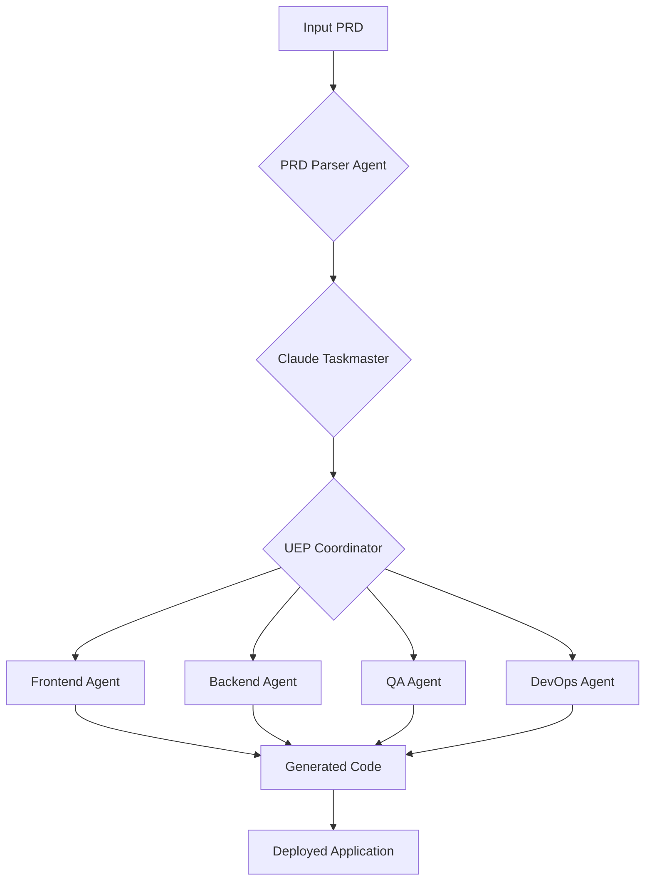

# PRD: UEP Meta-Agent Factory

## 1. Overview

This document specifies the requirements for the Universal Execution Protocol (UEP) Meta-Agent Factory, a system designed to automate the creation of software projects from a Product Requirements Document (PRD).

## 2. Inputs

The factory will accept a PRD in Markdown format. The PRD must contain the following sections:

- **Project Overview**: A high-level summary of the project.
- **Core Requirements**: A list of the key features and functionality.
- **Technical Requirements**: The technologies to be used (e.g., Next.js, TypeScript, Redis).

## 3. Outputs

The factory will produce a complete, production-ready software project, including:

- **Source Code**: A complete, working codebase.
- **Documentation**: Comprehensive documentation, including a README, API documentation, and setup guides.
- **Tests**: A full suite of unit, integration, and end-to-end tests.
- **Deployment Configuration**: All necessary files for deploying to Vercel.

## 4. The UEP-Driven Workflow

The factory will use the Universal Execution Protocol (UEP) to orchestrate a team of specialized AI agents. The workflow will be as follows:

1.  **PRD Ingestion**: The `prd-parser-agent` will ingest the PRD and create a structured representation of the project requirements.
2.  **Task Generation**: The `taskmaster-agent` will use the structured requirements to generate a detailed project plan, including a list of tasks and their dependencies.
3.  **Agent Orchestration**: The `infra-orchestrator-agent` will assign tasks to the appropriate specialized agents (e.g., `frontend-agent`, `backend-agent`).
4.  **Code Generation**: The specialized agents will generate the source code, documentation, and tests for their assigned tasks.
5.  **Integration and Deployment**: The `devops-agent` will integrate the work of the other agents and create the deployment configuration.

## 6. UEP Workflow Diagram

