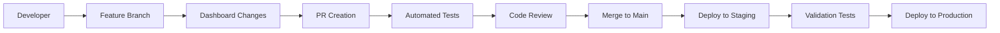

# Grafana Dashboard Architecture Design for Meta-Agent Factory

> **Document Version**: 1.0.0  
> **Created**: January 30, 2025  
> **Task Reference**: Task 231.2 - Design Dashboard Architecture and Structure  
> **Dependencies**: Task 231.1 - Dashboard Requirements  
> **Status**: ARCHITECTURE DESIGN COMPLETE  

---

## 📋 Executive Summary

This document defines the comprehensive architecture for Grafana dashboards monitoring the All-Purpose Meta-Agent Factory system. Based on research into 2024 best practices for multi-tenant distributed systems and dashboard provisioning patterns, this architecture provides scalable, maintainable, and secure dashboard organization.

## 🏗️ Dashboard Folder Architecture

### Folder Hierarchy Strategy

Given Grafana's limitation of single-level folders, we implement a **naming convention-based hierarchy** with **role-based access control** at the folder level.

#### Primary Folder Structure

```
📁 01-System-Overview/
├── Meta-Agent Factory System Overview
├── Infrastructure Health Dashboard
└── Executive Summary Dashboard

📁 02-Service-Health/
├── Service Registry Health
├── Workflow Engine Health
├── UEP Protocol Health
└── API Gateway Health

📁 03-Agent-Coordination/
├── Agent Coordination Overview
├── UEP Protocol Validation
├── Workflow Execution Monitoring
└── Agent Performance Metrics

📁 04-Service-Mesh/
├── Service Mesh Overview
├── Network Traffic Analysis
├── Circuit Breaker Monitoring
└── Load Balancing Metrics

📁 05-Troubleshooting/
├── Incident Response Dashboard
├── Log Correlation Dashboard
├── Trace Analysis Dashboard
└── Performance Regression Analysis

📁 06-Meta-Monitoring/
├── Observability Stack Health
├── Prometheus Monitoring
├── Loki Log Analysis
└── Grafana Performance

📁 07-Environments/
├── Production Environment
├── Staging Environment
└── Development Environment

📁 08-Security-Audit/
├── Security Events Dashboard
├── Audit Trail Monitoring
├── Access Control Review
└── Compliance Reporting
```

### Folder Naming Conventions

#### Prefix-Based Organization
- **01-XX**: System-wide overviews and executive dashboards
- **02-XX**: Service-specific health monitoring
- **03-XX**: Agent coordination and workflow monitoring
- **04-XX**: Infrastructure and network monitoring
- **05-XX**: Troubleshooting and incident response
- **06-XX**: Meta-monitoring of observability stack
- **07-XX**: Environment-specific views
- **08-XX**: Security and compliance monitoring

#### Folder Access Control Matrix

| Folder | Executives | Operations | DevOps | Developers | Security |
|--------|------------|------------|--------|------------|----------|
| 01-System-Overview | Editor | Editor | Editor | Viewer | Viewer |
| 02-Service-Health | Viewer | Editor | Editor | Editor | Viewer |
| 03-Agent-Coordination | Viewer | Editor | Editor | Editor | Viewer |
| 04-Service-Mesh | Viewer | Editor | Editor | Editor | Viewer |
| 05-Troubleshooting | Viewer | Editor | Editor | Editor | Viewer |
| 06-Meta-Monitoring | Viewer | Viewer | Editor | Viewer | Viewer |
| 07-Environments | Viewer | Editor | Editor | Editor | Viewer |
| 08-Security-Audit | Viewer | Viewer | Viewer | Viewer | Editor |

---

## 🔧 Dashboard Provisioning Architecture

### Infrastructure as Code Approach

#### Repository Structure
```
grafana-dashboards/
├── dashboards/
│   ├── system-overview/
│   │   ├── meta-agent-factory-overview.json
│   │   ├── infrastructure-health.json
│   │   └── executive-summary.json
│   ├── service-health/
│   │   ├── service-registry-health.json
│   │   ├── workflow-engine-health.json
│   │   └── uep-protocol-health.json
│   └── [other categories...]
├── folders/
│   ├── 01-system-overview.yaml
│   ├── 02-service-health.yaml
│   └── [other folders...]
├── datasources/
│   ├── prometheus.yaml
│   ├── loki.yaml
│   └── tempo.yaml
└── provisioning/
    ├── grizzly/
    │   ├── config.yaml
    │   └── resources/
    ├── terraform/
    │   ├── main.tf
    │   └── variables.tf
    └── kubernetes/
        ├── grafana-operator/
        └── manifests/
```

### Provisioning Tools Strategy

#### Primary: Grafana Operator (Kubernetes)
```yaml
# Example GrafanaFolder CRD
apiVersion: grafana.integreatly.org/v1beta1
kind: GrafanaFolder
metadata:
  name: system-overview
  namespace: monitoring
spec:
  instanceSelector:
    matchLabels:
      dashboards: "meta-agent-factory"
  name: "01-System-Overview"
  permissions:
    - role: "Admin"
      permission: "Admin"
      team: "platform-team"
    - role: "Editor" 
      permission: "Edit"
      team: "operations-team"
```

#### Secondary: Grizzly (GitOps)
```yaml
# grizzly/resources/folder-system-overview.yaml
apiVersion: grizzly.grafana.com/v1alpha1
kind: DashboardFolder
metadata:
  name: system-overview
spec:
  title: "01-System-Overview"
  uid: "system-overview"
  permissions:
    - role: "Admin"
      permission: "Admin"
    - role: "Editor"
      permission: "Edit"
```

#### Fallback: Terraform (Multi-Cloud)
```hcl
# terraform/folders.tf
resource "grafana_folder" "system_overview" {
  title = "01-System-Overview"
  uid   = "system-overview"
}

resource "grafana_folder_permission" "system_overview_permissions" {
  folder_uid = grafana_folder.system_overview.uid
  
  permissions {
    role       = "Admin"
    permission = "Admin"
  }
  
  permissions {
    role       = "Editor"
    permission = "Edit"
  }
}
```

---

## 🎛️ Template Variable Hierarchy

### Multi-Level Variable Architecture

#### Hierarchical Variable Chain
```
Environment → Tenant → Service Type → Service Instance → Agent → Time Range
```

#### Variable Definitions

##### Level 1: Environment
```json
{
  "name": "environment",
  "type": "custom",
  "query": "production,staging,development",
  "current": {
    "value": "production",
    "text": "Production"
  },
  "options": [
    {"value": "production", "text": "Production"},
    {"value": "staging", "text": "Staging"},
    {"value": "development", "text": "Development"}
  ],
  "includeAll": false,
  "multi": false
}
```

##### Level 2: Tenant/Team
```json
{
  "name": "tenant",
  "type": "query",
  "query": "label_values(up{environment=\"$environment\"}, tenant)",
  "datasource": "Prometheus",
  "refresh": "on_dashboard_load",
  "current": {
    "value": "all",
    "text": "All Tenants"
  },
  "includeAll": true,
  "multi": true
}
```

##### Level 3: Service Type
```json
{
  "name": "service_type",
  "type": "custom",
  "query": "meta-agent,domain-agent,service-registry,workflow-engine,api-gateway",
  "current": {
    "value": "all",
    "text": "All Services"
  },
  "includeAll": true,
  "multi": true
}
```

##### Level 4: Service Instance
```json
{
  "name": "service_instance",
  "type": "query",
  "query": "label_values(up{environment=\"$environment\",tenant=~\"$tenant\",service_type=~\"$service_type\"}, instance)",
  "datasource": "Prometheus",
  "refresh": "on_time_range_change",
  "includeAll": true,
  "multi": true
}
```

##### Level 5: Agent ID
```json
{
  "name": "agent_id",
  "type": "query", 
  "query": "label_values(agent_health{environment=\"$environment\",tenant=~\"$tenant\",service_type=~\"$service_type\"}, agent_id)",
  "datasource": "Prometheus",
  "refresh": "on_time_range_change",
  "includeAll": true,
  "multi": true
}
```

##### Level 6: Time Range
```json
{
  "name": "time_range",
  "type": "interval",
  "query": "1m,5m,15m,30m,1h,6h,12h,24h,7d",
  "current": {
    "value": "5m",
    "text": "5 minutes"
  },
  "auto": true,
  "auto_count": 30,
  "auto_min": "10s"
}
```

### Variable Scoping Strategy

#### Cross-Dashboard Variable Propagation
- **URL Parameters**: Pass variables between related dashboards
- **Dashboard Links**: Maintain context when navigating
- **Drill-Down Paths**: Preserve filter context in detailed views

#### Variable Security
- **Regex Validation**: Prevent injection attacks in variable queries
- **Query Sanitization**: Validate all user inputs
- **Permission Scoping**: Restrict variable options based on user permissions

---

## 📊 Dashboard Design Templates

### Template Categories

#### 1. Overview Dashboard Template
**Purpose**: High-level system health and performance  
**Panels**: 4-8 key metrics with drill-down capabilities  
**Refresh**: 30 seconds  
**Variables**: Environment, Time Range  

**Panel Layout**:
```
┌─────────────┬─────────────┬─────────────┬─────────────┐
│ System      │ Agent       │ Error       │ Response    │
│ Health      │ Count       │ Rate        │ Time        │
│ (Stat)      │ (Stat)      │ (Stat)      │ (Stat)      │
├─────────────┼─────────────┼─────────────┼─────────────┤
│ Resource Utilization                    │ Service     │
│ (Time Series)                           │ Status      │
│                                         │ (Table)     │
├─────────────────────────────────────────┼─────────────┤
│ Alert Status                            │ Recent      │
│ (Alert List)                            │ Events      │
│                                         │ (Logs)      │
└─────────────────────────────────────────┴─────────────┘
```

#### 2. Service Health Dashboard Template
**Purpose**: Detailed service monitoring  
**Panels**: 8-12 service-specific metrics  
**Refresh**: 15 seconds  
**Variables**: Environment, Service Type, Service Instance, Time Range  

#### 3. Troubleshooting Dashboard Template
**Purpose**: Incident response and debugging  
**Panels**: Correlation panels with logs, traces, and metrics  
**Refresh**: 5 seconds  
**Variables**: Environment, Service, Agent, Time Range, Alert State  

#### 4. Meta-Monitoring Dashboard Template
**Purpose**: Observability stack health  
**Panels**: Monitoring system performance metrics  
**Refresh**: 1 minute  
**Variables**: Environment, Component, Time Range  

### Panel Standardization

#### Panel Naming Convention
- **Format**: `[Component] - [Metric] - [Unit]`
- **Examples**: 
  - `Agent Registry - Registration Rate - per minute`
  - `UEP Protocol - Validation Errors - count`
  - `Workflow Engine - Execution Time - P95 ms`

#### Color Scheme Standards
```json
{
  "standard": {
    "green": "#73BF69",     // Healthy/Success (>90%)
    "yellow": "#FADE2A",    // Warning (70-90%) 
    "red": "#F2495C",       // Critical (<70%)
    "blue": "#5794F2",      // Informational
    "gray": "#8B8B8B",      // Inactive/Disabled
    "purple": "#B877D9"     // Special/Custom metrics
  },
  "gradients": {
    "performance": ["#73BF69", "#FADE2A", "#F2495C"],
    "utilization": ["#5794F2", "#FADE2A", "#F2495C"],
    "errors": ["#8B8B8B", "#FADE2A", "#F2495C"]
  }
}
```

#### Panel Size Standards
- **Stat Panels**: 6x3 (for key metrics)
- **Time Series**: 12x8 (for trend analysis)  
- **Tables**: 12x6 (for lists and status)
- **Heatmaps**: 12x6 (for distribution analysis)
- **Alert Lists**: 6x6 (for alert status)

---

## 🔒 Security and Access Control Architecture

### Permission Model

#### Role-Based Access Control
```yaml
roles:
  executive:
    permissions:
      - folder: "01-System-Overview"
        level: "Editor"
      - folder: "02-Service-Health" 
        level: "Viewer"
      - folder: "07-Environments"
        level: "Viewer"
        
  operations:
    permissions:
      - folder: "01-System-Overview"
        level: "Editor"
      - folder: "02-Service-Health"
        level: "Editor"
      - folder: "03-Agent-Coordination"
        level: "Editor"
      - folder: "05-Troubleshooting"
        level: "Editor"
        
  developers:
    permissions:
      - folder: "02-Service-Health"
        level: "Editor"
      - folder: "03-Agent-Coordination"
        level: "Editor"
      - folder: "04-Service-Mesh"
        level: "Editor"
      - folder: "05-Troubleshooting"
        level: "Editor"
        
  security:
    permissions:
      - folder: "08-Security-Audit"
        level: "Editor"
      - folder: "*"
        level: "Viewer"
```

#### Environment Isolation
- **Production**: Restricted to operations and senior developers
- **Staging**: Available to all development teams
- **Development**: Open access for all authenticated users

### Data Source Security

#### Data Source Scoping
```yaml
datasources:
  prometheus-prod:
    type: prometheus
    url: https://prometheus.prod.company.com
    access: proxy
    basicAuth: true
    withCredentials: true
    permissions:
      - role: "operations"
      - role: "senior-developer"
      
  prometheus-staging:
    type: prometheus
    url: https://prometheus.staging.company.com
    access: proxy
    permissions:
      - role: "developer"
      - role: "operations"
```

---

## 🚀 Deployment Pipeline Architecture

### GitOps Workflow

#### Development Process


#### CI/CD Pipeline Stages

##### Stage 1: Validation
```yaml
validation:
  - dashboard-lint: Validate JSON syntax and schema
  - panel-validation: Check panel configurations
  - query-validation: Validate Prometheus/Loki queries
  - security-check: Scan for potential security issues
```

##### Stage 2: Testing
```yaml
testing:
  - render-test: Verify dashboard renders without errors
  - data-source-test: Validate data source connectivity
  - permission-test: Verify access control rules
  - performance-test: Check dashboard load times
```

##### Stage 3: Deployment
```yaml
deployment:
  staging:
    - deploy-folders: Create/update folder structure
    - deploy-dashboards: Deploy dashboard definitions
    - deploy-permissions: Apply access control rules
    - smoke-test: Basic functionality validation
    
  production:
    - canary-deployment: Deploy to subset of instances
    - health-check: Monitor for issues
    - full-deployment: Deploy to all instances
    - rollback-ready: Maintain rollback capability
```

### Version Control Strategy

#### Dashboard Versioning
- **Semantic Versioning**: MAJOR.MINOR.PATCH for dashboard releases
- **Change Tracking**: Git history for all dashboard modifications
- **Release Notes**: Document changes for each version
- **Rollback Support**: Quick reversion to previous versions

#### Environment Promotion
- **Development**: Latest commits from feature branches
- **Staging**: Stable commits from main branch
- **Production**: Tagged releases with full testing

---

## 📈 Monitoring and Maintenance Architecture

### Dashboard Health Monitoring

#### Dashboard Performance Metrics
```yaml
metrics:
  - dashboard_load_time: Time to render dashboard
  - query_execution_time: Time to execute panel queries
  - data_source_response_time: Data source query latency
  - user_interaction_time: Time between user actions
  - error_rate: Dashboard rendering errors per hour
```

#### Automated Health Checks
```yaml
healthchecks:
  - dashboard_accessibility: Verify all dashboards load
  - data_availability: Confirm data sources return data
  - alert_functionality: Test alert notifications
  - permission_enforcement: Validate access controls
```

### Maintenance Procedures

#### Regular Maintenance Tasks
- **Weekly**: Review dashboard performance metrics
- **Monthly**: Update dashboard templates and standards
- **Quarterly**: Comprehensive dashboard audit and cleanup
- **Annually**: Major architecture review and updates

#### Dashboard Lifecycle Management
1. **Creation**: Follow template and naming standards
2. **Active Use**: Monitor performance and user feedback
3. **Optimization**: Improve based on usage patterns
4. **Deprecation**: Archive unused dashboards
5. **Removal**: Clean up obsolete dashboards

---

## 🔧 Implementation Roadmap

### Phase 1: Foundation (Week 1)
- [ ] Set up folder structure with proper naming conventions
- [ ] Implement basic provisioning with Grafana Operator
- [ ] Create template variable hierarchy
- [ ] Deploy System Overview dashboards

### Phase 2: Service Monitoring (Week 2)
- [ ] Deploy Service Health dashboards
- [ ] Implement Agent Coordination dashboards
- [ ] Configure Service Mesh monitoring
- [ ] Set up basic alerting integration

### Phase 3: Advanced Features (Week 3)
- [ ] Deploy Troubleshooting dashboards
- [ ] Implement Meta-Monitoring dashboards
- [ ] Configure advanced template variables
- [ ] Set up cross-dashboard navigation

### Phase 4: Security and Automation (Week 4)
- [ ] Implement comprehensive access controls
- [ ] Set up automated deployment pipeline
- [ ] Configure dashboard health monitoring
- [ ] Complete documentation and training

---

This architecture provides a scalable, secure, and maintainable foundation for monitoring the Meta-Agent Factory system with comprehensive observability across all operational aspects.