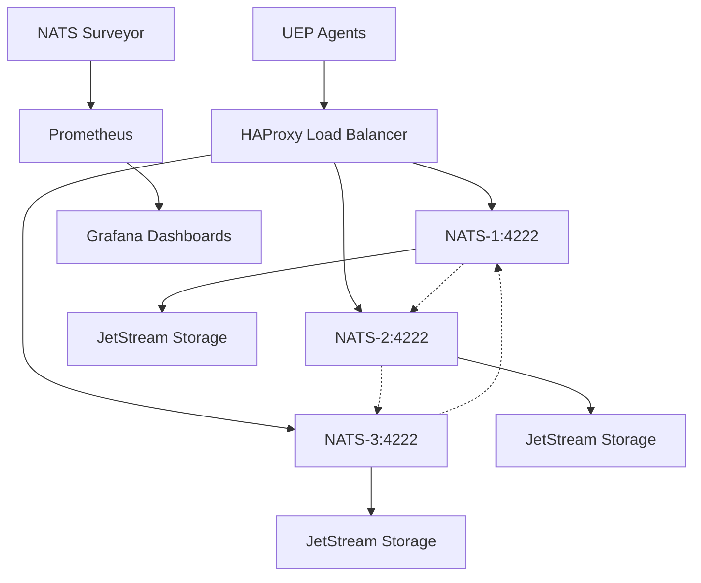

# UEP Event Bus - Scalable Message Broker

> **High-Performance Event-Driven Messaging Infrastructure for Containerized UEP Agents**
> 
> A complete NATS JetStream-based message broker system providing scalable, reliable, and protocol-compliant communication between Universal Execution Protocol (UEP) agents.

## 🌟 Overview

The UEP Event Bus is a production-ready messaging infrastructure that enables asynchronous, event-driven communication between containerized UEP agents. Built on NATS JetStream, it provides high availability, message persistence, and comprehensive observability.

### Key Features

- **🏗️ Scalable Architecture** - 3-node NATS JetStream cluster with high availability
- **⚡ High Performance** - Millions of messages per second with low latency
- **🔒 Protocol Compliance** - Full UEP protocol validation and message envelope support
- **🔄 Circuit Breaker** - Automatic failure handling and recovery patterns
- **📊 Observability** - Prometheus metrics, Grafana dashboards, and distributed tracing
- **💾 Message Persistence** - Configurable retention policies and dead letter queues
- **🔧 Load Balancing** - HAProxy-based load balancing across cluster nodes
- **🛡️ Reliability** - Message delivery guarantees and fault tolerance

## Architecture



## Quick Start

### Prerequisites

- Docker and Docker Compose
- NATS CLI (`nats` command)
- Node.js 18+ (for UEP Message Broker client)

### 1. Deploy the Cluster

```bash
# Clone and navigate to the project
cd shared/uep-event-bus

# Start the complete stack
docker-compose up -d

# Verify cluster health
./scripts/cluster-management.sh health
```

### 2. Access Monitoring

- **Grafana Dashboard**: http://localhost:3000 (admin/admin)
- **Prometheus Metrics**: http://localhost:9090
- **HAProxy Stats**: http://localhost:8220/stats
- **NATS Monitoring**: http://localhost:8222 (node 1)

### 3. Basic Usage

```typescript
import { UEPMessageBroker, createDefaultBrokerConfig } from './UEPMessageBroker';

// Initialize broker
const config = createDefaultBrokerConfig('my-app');
const broker = new UEPMessageBroker(config);

await broker.initialize();

// Publish a message
await broker.publish({
  version: '1.0.0',
  protocol: { id: 'my-protocol', version: '1.0.0', capability: 'processing' },
  routing: { subject: 'my-app.command.process', messageType: 'command' },
  agent: { id: 'agent-1', type: 'meta', capability: 'processing', instance: 'i-1' },
  tracing: { traceId: 'trace-1', spanId: 'span-1' },
  payload: { task: 'process-data', data: {...} }
});

// Subscribe to messages
await broker.subscribe({
  subject: 'my-app.event.>'
}, async (message, jsMsg) => {
  console.log('Received:', message.payload);
  // Process message
});
```

## Configuration

### Docker Compose Services

The system includes these services:

- **nats-1, nats-2, nats-3**: NATS JetStream cluster nodes
- **nats-lb**: HAProxy load balancer
- **nats-surveyor**: Advanced monitoring and metrics collection
- **prometheus**: Metrics storage and alerting
- **grafana**: Visualization and dashboards
- **nats-cli**: Management and testing tools

### Environment Variables

```bash
# NATS Configuration
NATS_CLUSTER_NAME=uep-cluster
NATS_MAX_PAYLOAD=8MB
NATS_MAX_CONNECTIONS=1000

# UEP Configuration  
UEP_NAMESPACE=my-app
UEP_ENABLE_VALIDATION=true
UEP_ENABLE_TRACING=true
UEP_MAX_RETRIES=3

# Monitoring
PROMETHEUS_RETENTION=30d
GRAFANA_ADMIN_PASSWORD=admin
```

## UEP Message Format

All messages follow the UEP envelope format:

```typescript
interface UEPMessage<T> {
  // Message metadata
  id: string;
  timestamp: Date;
  version: string;
  
  // UEP Protocol information
  protocol: {
    id: string;
    version: string;
    capability: string;
  };
  
  // Routing information
  routing: {
    subject: string;
    replyTo?: string;
    correlationId?: string;
    messageType: 'command' | 'event' | 'query' | 'response';
  };
  
  // Agent information
  agent: {
    id: string;
    type: 'meta' | 'domain';
    capability: string;
    instance: string;
  };
  
  // Tracing information
  tracing: {
    traceId: string;
    spanId: string;
    parentSpanId?: string;
    baggage?: Record<string, string>;
  };
  
  // Message payload
  payload: T;
  
  // Headers for additional metadata
  headers?: Record<string, string>;
}
```

### Subject Hierarchy

UEP subjects follow a hierarchical naming convention:

```
{namespace}.{type}.{target}.{operation}

Examples:
- my-app.command.agent-1.process
- my-app.event.all.task-completed
- my-app.query.registry.list-agents
- my-app.response.client-1.query-result
```

## Stream Configuration

### Default Streams

The system automatically creates these streams:

1. **COMMANDS** (`{namespace}.command.>`):
   - Retention: Work Queue
   - Max Age: 24 hours
   - Use: Command messages between agents

2. **EVENTS** (`{namespace}.event.>`):
   - Retention: Limits
   - Max Age: 7 days  
   - Use: Event notifications and state changes

3. **QUERIES** (`{namespace}.query.>`):
   - Retention: Work Queue
   - Max Age: 1 hour
   - Use: Request-response patterns

4. **DLQ** (`{namespace}.dlq.>`):
   - Retention: Limits
   - Max Age: 30 days
   - Use: Failed message handling

### Custom Stream Creation

```bash
# Using management script
./scripts/cluster-management.sh streams create "MY_STREAM" "my-app.custom.>" "limits"

# Using NATS CLI directly
nats stream add MY_STREAM --subjects="my-app.custom.>" --retention=limits
```

## Management Operations

### Health Monitoring

```bash
# Check cluster health
./scripts/cluster-management.sh health

# Monitor performance
./scripts/cluster-management.sh monitor 300 10

# View cluster statistics
./scripts/cluster-management.sh stats
```

### Stream Management

```bash
# List all streams
./scripts/cluster-management.sh streams list

# Get stream information
./scripts/cluster-management.sh streams info "MY_STREAM"

# Delete a stream
./scripts/cluster-management.sh streams delete "MY_STREAM"
```

### Backup and Restore

```bash
# Backup all streams
./scripts/cluster-management.sh backup /path/to/backup

# Restore from backup
./scripts/cluster-management.sh restore /path/to/backup
```

### Testing

```bash
# Publish test message
./scripts/cluster-management.sh test pub "my-app.test.subject" "Hello World"

# Subscribe to messages
./scripts/cluster-management.sh test sub "my-app.test.>"

# Performance test
./scripts/cluster-management.sh test perf "my-app.perf.test" 10000 1024
```

## Advanced Features

### Circuit Breaker Pattern

The broker implements circuit breaker patterns for resilience:

```typescript
const config = createDefaultBrokerConfig('my-app');
config.reliability.enableCircuitBreaker = true;
config.reliability.circuitBreakerThreshold = 5;
config.reliability.circuitBreakerTimeout = 60000;

const broker = new UEPMessageBroker(config);
```

### Request-Response Pattern

```typescript
// Send request and wait for response
const response = await broker.request({
  version: '1.0.0',
  protocol: { id: 'query-protocol', version: '1.0.0', capability: 'query' },
  routing: { subject: 'my-app.query.users', messageType: 'query' },
  agent: { id: 'client-1', type: 'domain', capability: 'client', instance: 'i-1' },
  tracing: { traceId: 'trace-1', spanId: 'span-1' },
  payload: { userId: '12345' }
}, { timeout: 30000 });

console.log('Response:', response.payload);
```

### Dead Letter Queue Handling

```typescript
// Subscribe to dead letter queue
await broker.subscribe({
  subject: 'my-app.dlq.>'
}, async (dlqMessage, jsMsg) => {
  console.log('Failed message:', dlqMessage);
  // Handle failed message
});
```

## Monitoring and Observability

### Prometheus Metrics

Key metrics exposed:

- `nats_core_total_msgs` - Total message count
- `nats_core_total_bytes` - Total bytes processed
- `nats_jetstream_streams` - Number of streams
- `uep_messages_processed_total` - UEP-specific message counts
- `uep_circuit_breaker_open_total` - Circuit breaker states

### Grafana Dashboards

Pre-configured dashboards include:

- **NATS Cluster Overview** - Cluster health and performance
- **JetStream Streams** - Stream-specific metrics
- **UEP Message Flow** - UEP protocol-specific monitoring
- **Circuit Breaker Status** - Reliability pattern monitoring

### Custom Metrics

Add custom metrics to your applications:

```typescript
import { register, Counter, Histogram } from 'prom-client';

const messageCounter = new Counter({
  name: 'uep_custom_messages_total',
  help: 'Total custom messages processed',
  labelNames: ['agent_id', 'message_type']
});

const processingTime = new Histogram({
  name: 'uep_message_processing_duration_seconds',
  help: 'Message processing duration',
  labelNames: ['agent_id', 'operation']
});
```

## Production Deployment

### Resource Requirements

**Minimum Requirements (per NATS node):**
- CPU: 0.5 cores
- Memory: 512MB
- Storage: 10GB SSD

**Recommended Production:**
- CPU: 2 cores
- Memory: 2GB
- Storage: 100GB SSD with RAID
- Network: 1Gbps

### Security Configuration

```yaml
# docker-compose.prod.yml
services:
  nats-1:
    command: >
      --server_name=nats-1
      --jetstream
      --tls
      --tlscert=/etc/ssl/certs/nats.crt
      --tlskey=/etc/ssl/private/nats.key
      --auth-token=${NATS_AUTH_TOKEN}
    volumes:
      - ./ssl:/etc/ssl:ro
```

### High Availability Setup

For production, consider:

1. **Multi-AZ Deployment**: Deploy nodes across availability zones
2. **External Load Balancer**: Use cloud load balancers instead of HAProxy
3. **Persistent Storage**: Use network-attached storage for JetStream
4. **Backup Strategy**: Regular automated backups to object storage
5. **Monitoring**: Integrate with existing monitoring infrastructure

## Troubleshooting

### Common Issues

**Connection Failures:**
```bash
# Check network connectivity
./scripts/cluster-management.sh diagnose

# Check container logs
docker logs uep-nats-1
```

**Performance Issues:**
```bash
# Monitor resource usage
./scripts/cluster-management.sh stats

# Check for slow consumers
nats server info --server=nats-lb:4222
```

**Message Delivery Problems:**
```bash
# Check stream health
./scripts/cluster-management.sh streams list

# Monitor dead letter queue
nats sub "my-app.dlq.>" --server=nats-lb:4222
```

### Debug Mode

Enable debug logging:

```typescript
const config = createDefaultBrokerConfig('my-app');
config.debug = true;

const broker = new UEPMessageBroker(config);
broker.on('debug', (msg) => console.log('DEBUG:', msg));
```

## Development

### Building from Source

```bash
# Install dependencies
npm install

# Build TypeScript
npm run build

# Run tests
npm test

# Start development environment
docker-compose -f docker-compose.dev.yml up
```

### Contributing

1. Fork the repository
2. Create a feature branch
3. Make changes and add tests
4. Ensure all tests pass
5. Submit a pull request

## API Reference

### UEPMessageBroker Class

#### Methods

- `initialize()` - Connect to NATS cluster
- `publish<T>(message, options)` - Publish message
- `subscribe<T>(options, handler)` - Subscribe to messages
- `request<TReq, TRes>(message, options)` - Request-response pattern
- `getStreamStats(streamName?)` - Get stream statistics
- `getConsumerStats(streamName, consumerName?)` - Get consumer statistics
- `disconnect()` - Disconnect from cluster
- `isHealthy()` - Check broker health
- `getStats()` - Get broker statistics

#### Events

- `broker:connected` - Successful connection
- `broker:disconnected` - Connection lost
- `broker:error` - Connection error
- `message:published` - Message published
- `message:processed` - Message processed
- `circuit-breaker:opened` - Circuit breaker opened

## License

UEP Event Bus License - See LICENSE file for details.

## Support

- **Documentation**: [UEP Event Bus Docs](https://docs.uep.local/event-bus)
- **Issues**: [GitHub Issues](https://github.com/uep/event-bus/issues)
- **Email**: support@uep.local

---

**Status**: Production Ready  
**Version**: 1.0.0  
**Last Updated**: January 28, 2025